# EstateWise AI & Machine Learning Architecture

> Comprehensive reference for every AI, ML, and intelligent-system component in the EstateWise monorepo.

## Table of Contents

- [1. AI System Overview](#1-ai-system-overview)
- [2. Multi-Agent Orchestration Engine](#2-multi-agent-orchestration-engine)
  - [2.1 Supervisor Architecture](#21-supervisor-architecture)
  - [2.2 Execution Plan Builder](#22-execution-plan-builder)
  - [2.3 Agent Registry](#23-agent-registry)
  - [2.4 Agent Loop (Tool-Use Iteration)](#24-agent-loop-tool-use-iteration)
  - [2.5 Routing Strategy](#25-routing-strategy)
  - [2.6 Error Recovery Engine](#26-error-recovery-engine)
  - [2.7 Handoff Protocol](#27-handoff-protocol)
  - [2.8 Cost Budget Management](#28-cost-budget-management)
  - [2.9 Batch Processing](#29-batch-processing)
  - [2.10 Dead Letter Queue](#210-dead-letter-queue)
- [3. Prompt Engineering System](#3-prompt-engineering-system)
  - [3.1 XML-Structured System Prompts](#31-xml-structured-system-prompts)
  - [3.2 Grounding Rules](#32-grounding-rules)
  - [3.3 Prompt Caching Strategy](#33-prompt-caching-strategy)
  - [3.4 Structured Output Schemas](#34-structured-output-schemas)
  - [3.5 Prompt Versioning](#35-prompt-versioning)
- [4. Context Engineering](#4-context-engineering)
  - [4.1 Token Budget Allocator](#41-token-budget-allocator)
  - [4.2 Context Assembly Strategies](#42-context-assembly-strategies)
  - [4.3 Multi-Level Cache](#43-multi-level-cache)
  - [4.4 Conversation Store](#44-conversation-store)
  - [4.5 RAG Pipeline](#45-rag-pipeline)
  - [4.6 Knowledge Graph Engine](#46-knowledge-graph-engine)
- [5. Hybrid RAG Architecture](#5-hybrid-rag-architecture)
  - [5.1 Data Ingestion Pipeline](#51-data-ingestion-pipeline)
  - [5.2 Query Pipeline](#52-query-pipeline)
  - [5.3 K-Means Clustering](#53-k-means-clustering)
  - [5.4 Multi-Expert System](#54-multi-expert-system)
  - [5.5 Graph-Enhanced vs Vector-Only Comparison](#55-graph-enhanced-vs-vector-only-comparison)
- [6. LLM Integration Layer](#6-llm-integration-layer)
  - [6.1 Model Configuration](#61-model-configuration)
  - [6.2 LangGraph Integration](#62-langgraph-integration)
  - [6.3 CrewAI Integration](#63-crewai-integration)
  - [6.4 Backend Gemini Service](#64-backend-gemini-service)
- [7. MCP Tool Layer](#7-mcp-tool-layer)
  - [7.1 Tool Architecture](#71-tool-architecture)
  - [7.2 Domain Servers](#72-domain-servers)
  - [7.3 A2A Bridge](#73-a2a-bridge)
  - [7.4 Web Research Tools](#74-web-research-tools)
- [8. Observability & Monitoring](#8-observability--monitoring)
  - [8.1 Distributed Tracing](#81-distributed-tracing)
  - [8.2 Metrics Registry](#82-metrics-registry)
  - [8.3 Cost Tracking](#83-cost-tracking)
  - [8.4 Health Checks](#84-health-checks)
- [9. Agent Development Toolchain (Flywheel)](#9-agent-development-toolchain-flywheel)
  - [9.1 Bead Task System](#91-bead-task-system)
  - [9.2 Graph-Theory Triage (bv)](#92-graph-theory-triage-bv)
  - [9.3 Agent Mail](#93-agent-mail)
  - [9.4 Destructive Command Guard (DCG)](#94-destructive-command-guard-dcg)
  - [9.5 Session Memory (CASS-lite)](#95-session-memory-cass-lite)
  - [9.6 Flywheel Invariants](#96-flywheel-invariants)
  - [9.7 Bead Integration Architecture](#97-bead-integration-architecture)
  - [9.8 Convergence Protocol](#98-convergence-protocol)
  - [9.9 Crash Recovery & Swarm Coordination](#99-crash-recovery--swarm-coordination)
- [10. Security & Safety](#10-security--safety)
  - [10.1 Grounding Enforcement](#101-grounding-enforcement)
  - [10.2 Agent Isolation](#102-agent-isolation)
  - [10.3 Cost Guardrails](#103-cost-guardrails)
  - [10.4 Destructive Operation Prevention](#104-destructive-operation-prevention)
- [11. Performance & Optimization](#11-performance--optimization)
  - [11.1 Prompt Caching](#111-prompt-caching)
  - [11.2 Parallel Execution](#112-parallel-execution)
  - [11.3 Context Efficiency](#113-context-efficiency)
  - [11.4 Streaming](#114-streaming)
- [12. Testing Strategy](#12-testing-strategy)
- [13. Model Pricing & Cost Analysis](#13-model-pricing--cost-analysis)
- [Appendix A: Configuration Reference](#appendix-a-configuration-reference)
- [Appendix B: Agent Quick Reference](#appendix-b-agent-quick-reference)

---

## 1. AI System Overview

EstateWise is a multi-runtime, multi-agent real estate research platform. The AI infrastructure spans five packages in the monorepo, each responsible for a distinct layer of the intelligent pipeline.

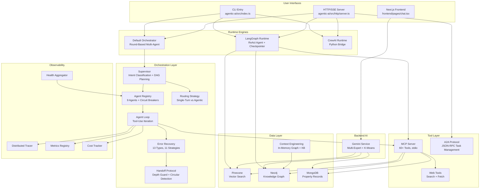

### Component Inventory

| Component         | Package               | Entry Point                              | Purpose                                                   |
| ----------------- | --------------------- | ---------------------------------------- | --------------------------------------------------------- |
| Supervisor        | `agentic-ai`          | `src/orchestration/supervisor.ts`        | Intent classification, DAG planning, execution, synthesis |
| Agent Registry    | `agentic-ai`          | `src/orchestration/agent-registry.ts`    | Agent catalog, circuit breakers, fallback resolution      |
| Agent Loop        | `agentic-ai`          | `src/orchestration/agent-loop.ts`        | Iterative LLM + tool-use execution                        |
| Routing Strategy  | `agentic-ai`          | `src/orchestration/routing-strategy.ts`  | Single-turn vs. agentic decision                          |
| Error Recovery    | `agentic-ai`          | `src/orchestration/error-recovery.ts`    | Error-to-strategy mapping with compound learning          |
| Handoff Manager   | `agentic-ai`          | `src/orchestration/handoff.ts`           | Agent-to-agent delegation with safety guards              |
| Cost Budget       | `agentic-ai`          | `src/orchestration/cost-budget.ts`       | Spend tracking at request/session/daily granularity       |
| Batch Processor   | `agentic-ai`          | `src/orchestration/batch-processor.ts`   | Parallel job execution with concurrency control           |
| Dead Letter Queue | `agentic-ai`          | `src/orchestration/dead-letter-queue.ts` | Failed task persistence and replay                        |
| LangGraph Runtime | `agentic-ai`          | `src/lang/graph.ts`                      | LangChain ReAct agent with checkpointer                   |
| CrewAI Runtime    | `agentic-ai`          | `src/crewai/CrewRunner.ts`               | Python subprocess bridge                                  |
| HTTP Server       | `agentic-ai`          | `src/http/server.ts`                     | REST + SSE + A2A endpoints                                |
| A2A Protocol      | `agentic-ai`          | `src/a2a/protocol.ts`                    | Agent-to-Agent JSON-RPC                                   |
| MCP Server        | `mcp`                 | `src/server.ts`                          | 60+ tools over stdio transport                            |
| Gemini Chat       | `backend`             | `src/services/geminiChat.service.ts`     | Multi-expert RAG with K-Means clustering                  |
| Knowledge Graph   | `context-engineering` | `src/graph/KnowledgeGraph.ts`            | In-memory graph with optional Neo4j sync                  |
| Context Factory   | `context-engineering` | `src/factory.ts`                         | Wires full context-engineering stack                      |

### Technology Stack

| Layer             | Technology                   | Version/Model                                    |
| ----------------- | ---------------------------- | ------------------------------------------------ |
| Orchestration LLM | Claude (Opus, Sonnet, Haiku) | claude-opus-4, claude-sonnet-4, claude-haiku-4.5 |
| Backend LLM       | Google Gemini                | gemini-2.5-flash (default)                       |
| Embeddings        | Google gemini-embedding-001  | 768 dimensions                                   |
| Vector Store      | Pinecone                     | Serverless                                       |
| Graph Database    | Neo4j Aura                   | Bolt protocol                                    |
| Document Store    | MongoDB                      | Atlas                                            |
| Framework         | LangGraph / LangChain        | @langchain/langgraph                             |
| Tracing           | LangSmith                    | Optional, configurable                           |
| MCP Transport     | stdio                        | @modelcontextprotocol/sdk                        |
| Clustering        | K-Means                      | Custom implementation (k=4)                      |

---

## 2. Multi-Agent Orchestration Engine

The orchestration engine lives in `agentic-ai/src/orchestration/` and provides a complete lifecycle for processing user requests through multiple specialized agents.

### 2.1 Supervisor Architecture

The Supervisor (`agentic-ai/src/orchestration/supervisor.ts`) is the top-level orchestrator. It receives every user request, classifies intent, builds an execution plan as a DAG, runs it in topological order, and synthesizes a final response.

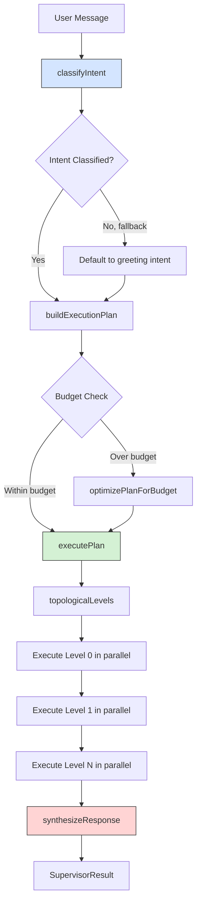

#### Intent Classification

The supervisor uses keyword-based pattern matching against 10 intent patterns. Each pattern has a set of keywords with length-weighted scoring. The confidence score is the ratio of matched keyword characters to the maximum possible score for that pattern, capped at 0.99.

**10 Intent Patterns** (defined in `supervisor.ts`, lines 65-126):

| Intent                | Keywords (sample)                                              | Agents                            | Multi-Step |
| --------------------- | -------------------------------------------------------------- | --------------------------------- | ---------- |
| `property-search`     | find, search, look for, show me, listing, homes for sale       | property-search                   | No         |
| `market-analysis`     | market, trend, forecast, analysis, median, average price       | market-analyst, data-enrichment   | Yes        |
| `property-comparison` | compare, versus, vs, difference, better, side by side          | property-search, market-analyst   | Yes        |
| `recommendation`      | recommend, suggest, best, top, ideal, should i                 | recommendation, property-search   | Yes        |
| `financial-analysis`  | mortgage, affordability, monthly payment, interest rate, loan  | market-analyst, data-enrichment   | Yes        |
| `neighborhood-info`   | neighborhood, school, commute, crime, walkability, amenities   | data-enrichment, property-search  | Yes        |
| `property-detail`     | detail, about this, tell me more, specifics, zpid              | property-search, data-enrichment  | No         |
| `greeting`            | hello, hi, hey, good morning, help, what can you               | conversation-mgr                  | No         |
| `clarification`       | what do you mean, clarify, can you explain, i don't understand | conversation-mgr                  | No         |
| `follow-up`           | also, and, what about, how about, another, more                | conversation-mgr, property-search | No         |

#### Entity Extraction

Four dedicated extraction functions run against every user message:

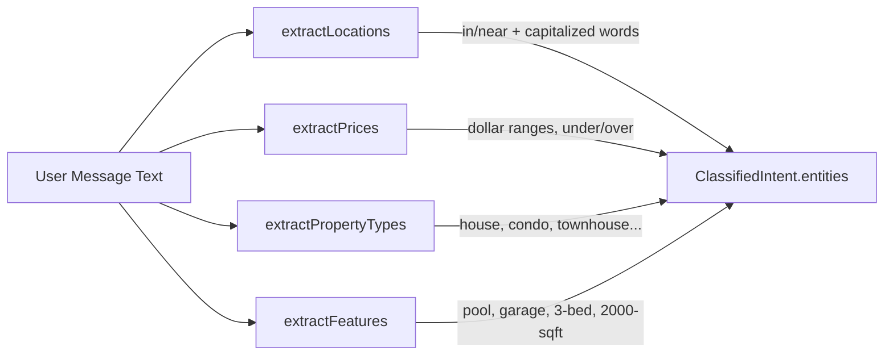

**Location patterns** (`supervisor.ts`, lines 132-150):

- `(?:in|near|around|close to)\s+([A-Z][a-zA-Z]+...)` captures "in Chapel Hill"
- `([A-Z][a-zA-Z]+), ([A-Z]{2})` captures "Durham, NC"
- Filters out common English words: I, The, A, An, My, And, Or, But

**Price patterns** (`supervisor.ts`, lines 152-177):

- Range: `$X - $Y` or `$X to $Y`
- Upper bound: `under $X`, `below $X`, `less than $X`, `max $X`
- Lower bound: `over $X`, `above $X`, `more than $X`, `at least $X`

**Property type mapping** (`supervisor.ts`, lines 179-205): 14 keywords map to 8 normalized types (house, condo, townhouse, apartment, multi-family, land, mobile-home, commercial).

**Feature extraction** (`supervisor.ts`, lines 207-230): 23 feature keywords plus regex patterns for bed/bath counts and square footage.

#### Intent-to-Agent Mapping

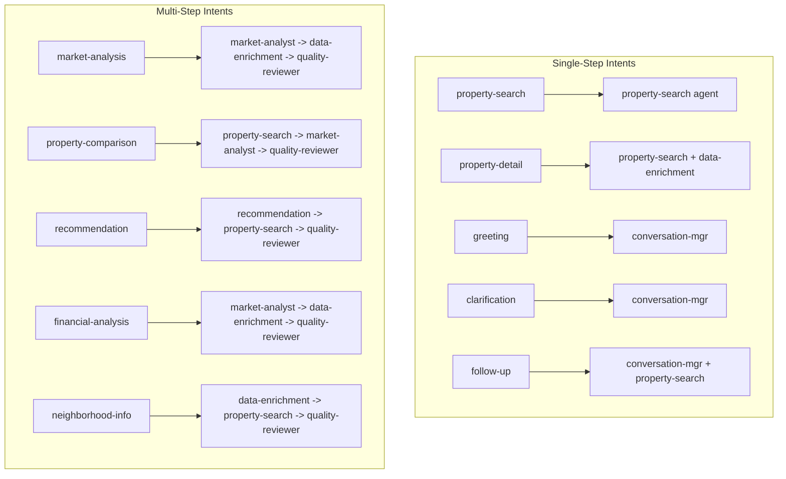

### 2.2 Execution Plan Builder

The plan builder (`supervisor.ts`, `buildExecutionPlan` at line 338) constructs a DAG from the classified intent. Each step is an `ExecutionStep` with dependencies on prior steps.

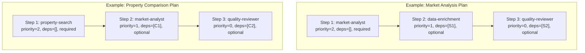

**Key plan construction rules:**

- Steps are ordered by the `suggestedAgents` array from intent classification.
- For multi-step intents, each step depends on the previous step (sequential DAG).
- Only the first agent is marked `required`; all subsequent agents are `optional`.
- A `quality-reviewer` step is always appended to multi-step plans.
- Cost is estimated per step: `(2000 * inputCostPer1M + 1000 * outputCostPer1M) / 1,000,000`.

**Topological execution** (`supervisor.ts`, `topologicalLevels` at line 623):

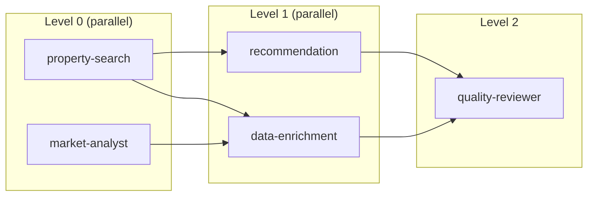

The algorithm iterates, collecting all steps whose dependencies are resolved into the current level. Steps within a level execute in parallel via `Promise.allSettled`. If a cycle is detected (no steps can be resolved), remaining steps are pushed as a final level to prevent infinite loops.

**Budget optimization** (`supervisor.ts`, `optimizePlanForBudget` at line 490): When total estimated cost exceeds `maxBudgetUsd`, the optimizer replaces each step's agent with the cheapest healthy fallback from the registry.

### 2.3 Agent Registry

The Agent Registry (`agentic-ai/src/orchestration/agent-registry.ts`) is the central catalog for agent definitions with per-agent circuit breakers, capability-based lookup, fallback chain resolution, and real-time health tracking.

**9 Default Agents** (registered in `createDefaultRegistry()`, lines 360-579):

| Agent ID               | Model  | Cost Tier | Fallback             | Timeout | Capabilities                                              |
| ---------------------- | ------ | --------- | -------------------- | ------- | --------------------------------------------------------- |
| `supervisor`           | sonnet | medium    | --                   | 60s     | classification, planning, orchestration, synthesis        |
| `property-search`      | sonnet | medium    | property-search-lite | 120s    | property-search, filtering, listing-retrieval             |
| `property-search-lite` | haiku  | low       | --                   | 120s    | property-search, filtering                                |
| `market-analyst`       | opus   | premium   | market-analyst-lite  | 180s    | market-analysis, trend-detection, forecasting, comparison |
| `market-analyst-lite`  | sonnet | medium    | --                   | 120s    | market-analysis, comparison                               |
| `conversation-mgr`     | haiku  | low       | --                   | 30s     | conversation, clarification, greeting, follow-up          |
| `data-enrichment`      | sonnet | medium    | --                   | 120s    | data-enrichment, web-lookup, graph-query                  |
| `recommendation`       | sonnet | medium    | --                   | 120s    | recommendation, personalization, ranking                  |
| `quality-reviewer`     | haiku  | low       | --                   | 30s     | quality-review, hallucination-detection, compliance-check |

#### Circuit Breaker State Machine

Each agent has its own circuit breaker implementing standard CLOSED / OPEN / HALF_OPEN semantics. Default configuration (`types.ts`, line 390): `failureThreshold=3`, `resetTimeoutMs=60000`, `halfOpenMaxAttempts=1`, `monitorWindowMs=120000`.

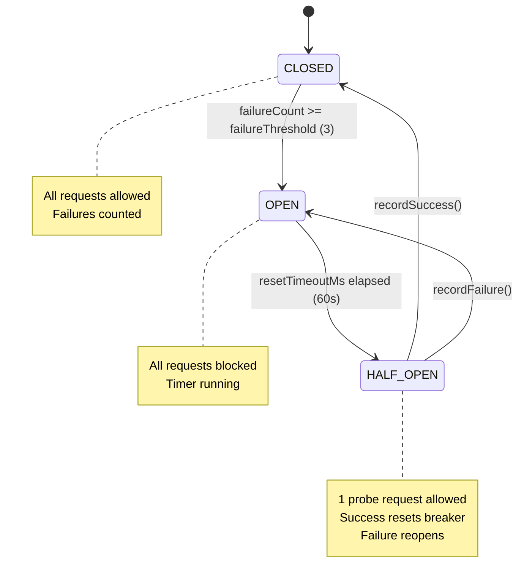

#### Fallback Chain Resolution

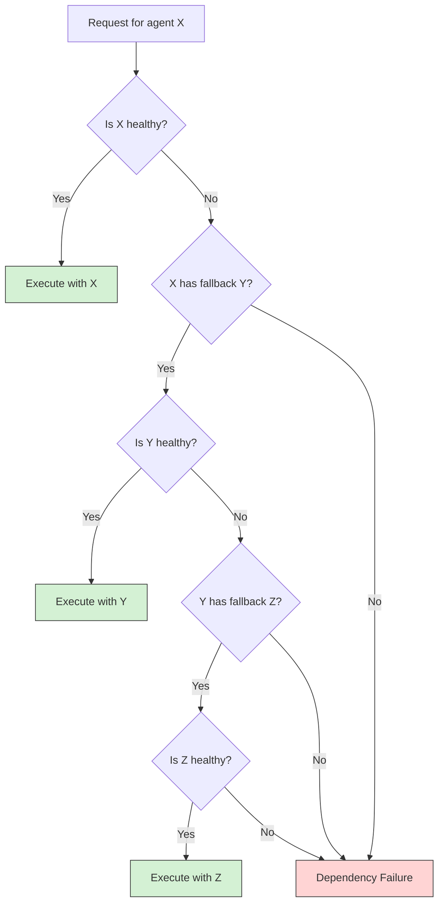

The `resolveFallbackChain` method (`agent-registry.ts`, line 263) traverses `fallbackAgentId` links up to `maxDepth=3`, tracking visited IDs to prevent loops. `findHealthyFallback` returns the first healthy agent in the chain that is not the original agent.

**Health scoring and metrics** are tracked per agent with a sliding window of 100 latency samples:

- `totalRequests`, `successCount`, `failureCount`
- `averageLatencyMs`, `p95LatencyMs` (95th percentile from sorted samples)
- `averageCostUsd` (running average)
- `errorRatePercent`, `uptimePercent`
- `circuitBreakerState`

### 2.4 Agent Loop (Tool-Use Iteration)

The agent loop (`agentic-ai/src/orchestration/agent-loop.ts`) drives an LLM through iterative tool calls until it produces a final text response or a safety limit is reached.

```mermaid
sequenceDiagram
    participant Caller
    participant Loop as Agent Loop
    participant LLM
    participant Tools as Tool Executor

    Caller->>Loop: runAgentLoop(config, llm, toolExec, messages)

    loop Each iteration (max: config.maxIterations)
        Loop->>Loop: Check timeout
        Loop->>Loop: Check context budget
        Loop->>Loop: Check cost budget

        alt Over context limit
            Loop->>Loop: compactMessages()
        end

        Loop->>LLM: chat(model, messages, tools)
        LLM-->>Loop: response (text + tool_use blocks)

        alt stop_reason == "end_turn"
            Loop-->>Caller: TaskResult(success, finalText)
        else stop_reason == "tool_use"
            par Execute tools in parallel
                Loop->>Tools: execute(tool1, input1)
                Loop->>Tools: execute(tool2, input2)
            end
            Tools-->>Loop: tool results
            Loop->>Loop: Append tool results to messages
        end
    end

    Loop-->>Caller: TaskResult(error: MAX_ITERATIONS_EXCEEDED)
```

**Safety guards in the loop** (`agent-loop.ts`, lines 173-233):

1. **Timeout**: If `Date.now() - startedAt > config.timeoutMs`, return `TIMEOUT` error.
2. **Context overflow**: If estimated tokens exceed `maxContextPercent` of model window, compact messages. If still over after compaction, return `CONTEXT_OVERFLOW`.
3. **Budget**: If `totalCostUsd > budgetLimitUsd`, return `BUDGET_EXCEEDED`.
4. **Max iterations**: If loop count hits `maxIterations` without a final text answer, return `MAX_ITERATIONS_EXCEEDED`.

**Context compaction** (`agent-loop.ts`, `compactMessages` at line 76): Keeps the first 2 messages and last 4 messages verbatim. Middle messages are summarized to 200-character snippets prefixed with their role.

**Error classification** (`agent-loop.ts`, `classifyError` at line 100): Pattern-matches error messages to `AgentErrorType` values:

- "rate" / "429" / "throttl" -> `RATE_LIMITED`
- "timeout" / "timed out" -> `TIMEOUT`
- "context" + "length"/"overflow" -> `CONTEXT_OVERFLOW`
- "refus" / "cannot" / "i'm sorry" -> `MODEL_REFUSAL`
- "tool" / "function" -> `TOOL_FAILURE`
- Default -> `EXTERNAL_API_FAILURE`

### 2.5 Routing Strategy

The routing strategy (`agentic-ai/src/orchestration/routing-strategy.ts`) decides whether a user request should be handled as a single-turn response or routed through the full agentic loop.

**5 Weighted Signals:**

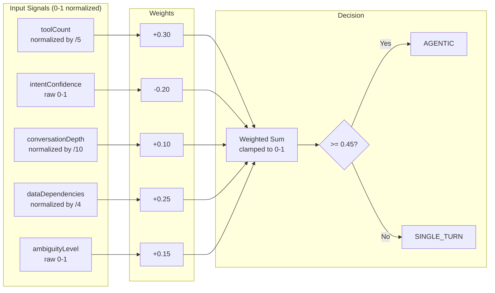

| Signal              | Weight | Normalization      | Effect                                   |
| ------------------- | ------ | ------------------ | ---------------------------------------- |
| `toolCount`         | +0.30  | `min(tools/5, 1)`  | More tools push toward agentic           |
| `intentConfidence`  | -0.20  | Raw 0-1            | High confidence pulls toward single-turn |
| `conversationDepth` | +0.10  | `min(depth/10, 1)` | Deep conversations push toward agentic   |
| `dataDependencies`  | +0.25  | `min(deps/4, 1)`   | External data needs push toward agentic  |
| `ambiguityLevel`    | +0.15  | Raw 0-1            | Ambiguous queries push toward agentic    |

The `AGENTIC_THRESHOLD` is `0.45` (configurable). A score at or above triggers full orchestration; below triggers a direct single-turn response.

### 2.6 Error Recovery Engine

The Error Recovery Engine (`agentic-ai/src/orchestration/error-recovery.ts`) maps every `AgentErrorType` to a concrete recovery strategy and maintains a recovery log for compound learning.

**13 Error Types -> 11 Recovery Strategies:**

| Error Type                 | Strategy               | Retryable          | Max Retries | Delay                           |
| -------------------------- | ---------------------- | ------------------ | ----------- | ------------------------------- |
| `RATE_LIMITED`             | ExponentialBackoff     | Yes                | 3           | `min(1000*2^attempt, 30000)` ms |
| `TIMEOUT`                  | RetryWithSimplerPrompt | Yes                | 2           | 0                               |
| `CONTEXT_OVERFLOW`         | ContextCompaction      | Yes                | 1           | 0                               |
| `TOOL_FAILURE`             | ToolBypass             | Yes                | 1           | 0                               |
| `HALLUCINATION_DETECTED`   | RePromptWithGrounding  | Yes                | 1           | 0                               |
| `INVALID_OUTPUT`           | SchemaReminder         | Yes                | 2           | 0                               |
| `SCHEMA_VALIDATION_FAILED` | SchemaReminder         | Yes                | 2           | 0                               |
| `MODEL_REFUSAL`            | RephraseAndRetry       | Yes                | 1           | 0                               |
| `DEPENDENCY_FAILURE`       | UseCachedData          | Yes                | 1           | 0                               |
| `BUDGET_EXCEEDED`          | DegradeToHaiku         | Yes                | 1           | 0                               |
| `CIRCULAR_HANDOFF`         | AbortWithContext       | No                 | 0           | 0                               |
| `MAX_ITERATIONS_EXCEEDED`  | AbortWithContext       | No                 | 0           | 0                               |
| `EXTERNAL_API_FAILURE`     | GracefulDegradation    | Yes (if attempt<2) | 2           | `min(2000*2^attempt, 15000)` ms |

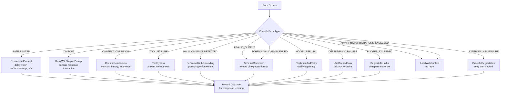

**Compound learning**: The `recordOutcome` method tracks every recovery attempt with its error type, strategy, agent ID, and success/failure. The `getSuccessRate` method returns historical success rates for error-strategy combinations (defaults to 0.5 with no data). The log is bounded to 1000 entries, pruning the oldest 500 when exceeded.

### 2.7 Handoff Protocol

The Handoff Protocol (`agentic-ai/src/orchestration/handoff.ts`) manages agent-to-agent delegation with depth limits, circular detection, health checks, and automatic fallback.

**5 Handoff Types** (defined in `types.ts`, line 266):

- `delegation` -- general task delegation to a specialist
- `escalation` -- escalate to a higher-capability agent
- `fallback` -- automatic fallback when primary agent is unhealthy
- `specialization` -- route to a domain specialist
- `review` -- send output for quality review

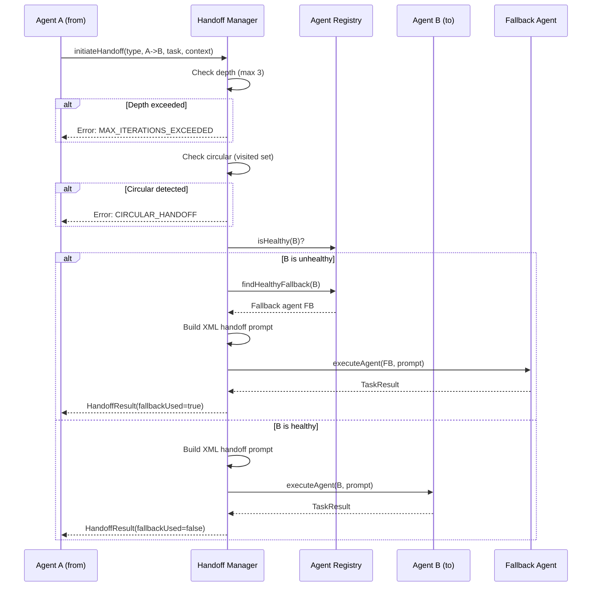

The handoff prompt is XML-structured (`handoff.ts`, `buildHandoffPrompt` at line 172) with tags for `<handoff type depth>`, `<from>`, `<to>`, `<task>`, `<context>`, `<constraints>`, and `<history>` (last 10 messages).

**Maximum handoff depth** is `MAX_HANDOFF_DEPTH = 3` (hardcoded constant, line 22). Active chains are tracked by `chainId` in a `Map<string, HandoffPayload[]>`.

### 2.8 Cost Budget Management

The Cost Budget Manager (`agentic-ai/src/orchestration/cost-budget.ts`) tracks spend and enforces limits at three granularities.

**Default budget configuration** (`cost-budget.ts`, lines 13-23):

| Granularity | Default Limit | Description                                         |
| ----------- | ------------- | --------------------------------------------------- |
| Per-request | $0.50         | Maximum cost for any single agent invocation        |
| Per-session | $2.00         | Maximum cumulative cost for a user session          |
| Daily       | $10.00        | Maximum cumulative cost across all sessions per day |

**Alert levels** are computed from daily spend:

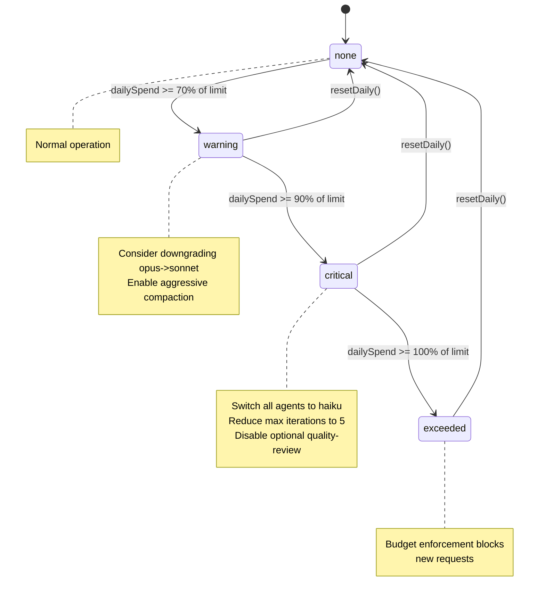

**Model downgrade path** (`cost-budget.ts`, `suggestDowngrade` at line 60): When the requested model would exceed budget, the method tries `haiku` first (cheapest), then `sonnet`, then `opus`. Returns `haiku` as last resort even if it also exceeds budget.

### 2.9 Batch Processing

The Batch Processor (`agentic-ai/src/orchestration/batch-processor.ts`) runs multiple agent tasks with controlled concurrency.

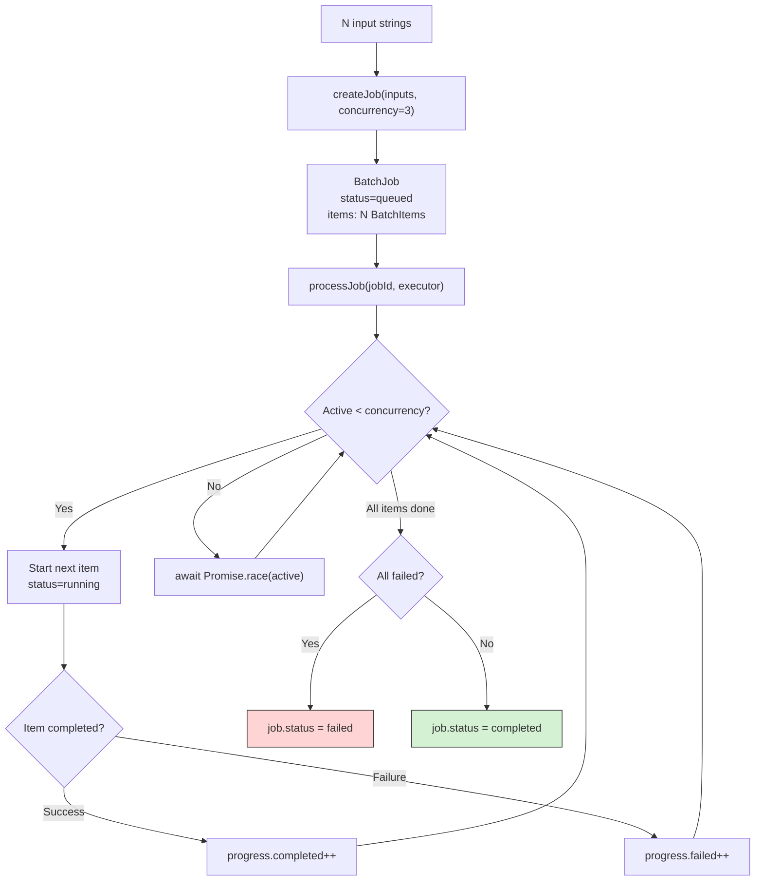

The concurrency control (`batch-processor.ts`, lines 73-85) uses a while loop with `Promise.race` on active promises, starting new items as slots open. Per-item status transitions: `pending` -> `running` -> `completed` or `failed`. Jobs can be cancelled at any point; cancelled items are skipped.

### 2.10 Dead Letter Queue

The Dead Letter Queue (`agentic-ai/src/orchestration/dead-letter-queue.ts`) stores tasks that exhausted all recovery strategies for later inspection and optional replay.

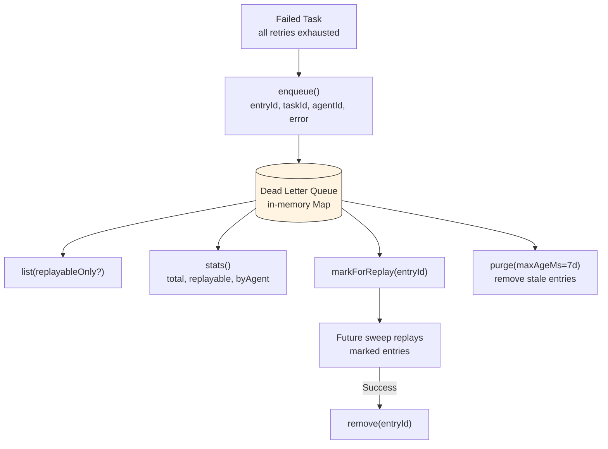

Each `DeadLetterEntry` tracks:

- `entryId`, `taskId`, `agentId` for identification
- `input` (the original request string)
- `error` (the `AgentError` that caused the failure)
- `attempts` (how many times recovery was tried)
- `firstFailedAt`, `lastFailedAt` timestamps
- `replayable` (derived from `error.recoverable`)
- `markedForReplay` boolean flag

The `purge` method removes entries older than 7 days by default.

---

## 3. Prompt Engineering System

### 3.1 XML-Structured System Prompts

The supervisor system prompt (`agentic-ai/src/prompts/system/supervisor.ts`) uses a structured XML format with 7 sections:

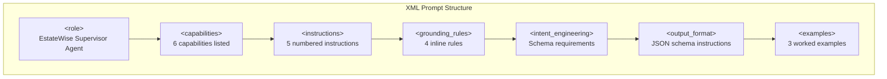

**Prompt Assembly Pipeline:**

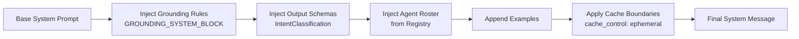

The prompt includes an `<agent_roster>` table mapping agents to their specializations, `<routing_rules>` for deterministic agent selection, and 3 `<example>` blocks showing complete intent classification JSON for different query types: single-intent property search, dual-intent market analysis + recommendation, and follow-up data enrichment.

### 3.2 Grounding Rules

All 10 grounding rules are defined in `agentic-ai/src/prompts/grounding.ts` (lines 9-20) and injected into every agent's system prompt as XML:

| Rule # | Rule Text                                                                                                                                 | Severity |
| ------ | ----------------------------------------------------------------------------------------------------------------------------------------- | -------- |
| 1      | Never fabricate property listings, prices, or addresses that were not returned by a tool call.                                            | High     |
| 2      | Always cite the data source and retrieval timestamp when presenting market statistics.                                                    | Medium   |
| 3      | If tool results are empty or unavailable, explicitly state that no data was found rather than generating plausible-sounding alternatives. | Medium   |
| 4      | Distinguish clearly between verified facts (from tool results) and inferred analysis (from the model).                                    | Medium   |
| 5      | Do not extrapolate price trends beyond the time range covered by the retrieved data.                                                      | Medium   |
| 6      | When presenting comparable properties, only include properties that appeared in actual search results.                                    | High     |
| 7      | Mark any neighborhood, school, or commute data as approximate if the source does not guarantee precision.                                 | Low      |
| 8      | Never claim a property is still available unless the listing status was confirmed by the most recent tool call.                           | High     |
| 9      | If multiple data sources conflict, present both values and note the discrepancy instead of silently choosing one.                         | Medium   |
| 10     | Do not round, truncate, or modify numeric values (prices, square footage, rates) from tool results without disclosure.                    | Low      |

**GroundingValidator** (`grounding.ts`, class at line 75) checks LLM responses against tool results:

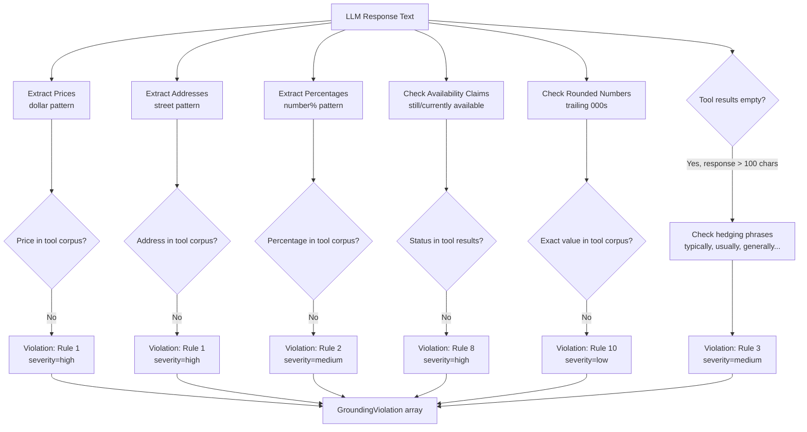

### 3.3 Prompt Caching Strategy

The 6-layer caching architecture (`agentic-ai/src/prompts/cache-strategy.ts`) places `cache_control: { type: "ephemeral" }` breakpoints at strategic positions to minimize redundant token processing.

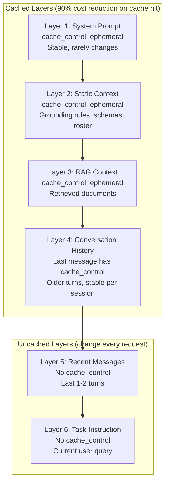

**Cost savings estimation** (`cache-strategy.ts`, `estimateCacheSavings` at line 109):

- `savingsRatio = cachedTokens / totalTokens`
- `estimatedCostReductionPercent = savingsRatio * 90`
- Anthropic charges 90% less for cache hits on input tokens
- Typical savings: 60-80% of input tokens are cached, yielding 54-72% cost reduction

### 3.4 Structured Output Schemas

Four Zod schemas enforce structured output from agents:

1. **IntentClassification**: Parsed from the supervisor prompt examples. Fields: `intents[]` (type, confidence, extractedEntities), `requiredAgents[]`, `executionOrder[]`, `dependencyGraph`, `isFollowUp`, `reasoning`.

2. **PropertySearchResponse**: Results from property-search agents with typed listings.

3. **MarketAnalysisOutput**: Market trends, comparables, and pricing analysis.

4. **RecommendationOutput**: Personalized property recommendations with scores.

Schema enforcement happens in the agent loop -- if the LLM's output fails validation, the `SCHEMA_VALIDATION_FAILED` error type triggers a `SchemaReminder` recovery strategy that re-prompts with explicit schema constraints.

### 3.5 Prompt Versioning

The `PromptRegistry` (`agentic-ai/src/prompts/versioning.ts`) provides version tracking, rollback, and per-version metrics:

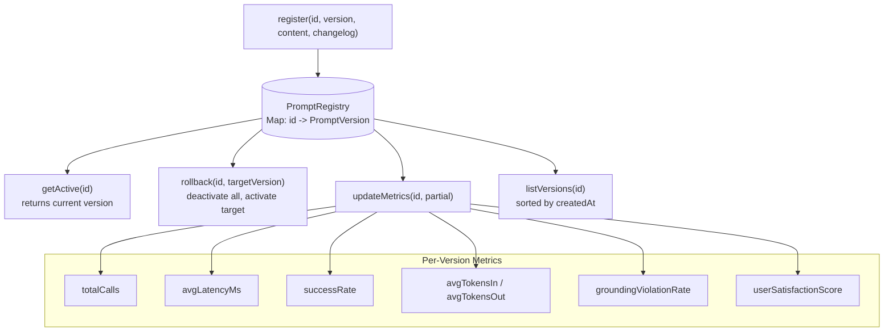

The first registered version automatically becomes active. Subsequent versions require explicit activation via `register(..., activate=true)` or `rollback()`. This enables A/B testing by comparing metrics between prompt versions.

---

## 4. Context Engineering

### 4.1 Token Budget Allocator

The Token Budget Manager (`agentic-ai/src/context/token-budget.ts`) dynamically allocates tokens across 6 categories.

**Default allocation** (lines 28-37, `maxTokens=128000`):

| Category       | Base Tokens     | Description                                  |
| -------------- | --------------- | -------------------------------------------- |
| System         | 2,000           | System prompt and role definition            |
| Static Context | 1,000           | Grounding rules, schemas, agent roster       |
| RAG            | 4,000           | Retrieved documents from vector/graph search |
| Conversation   | 3,000 + scaling | Chat history, grows with message count       |
| Tool Buffer    | 5,000           | Space for tool call inputs/outputs           |
| Generation     | 4,000           | Reserved for model output                    |

```mermaid
pie title Default Token Budget Allocation (19,000 base tokens)
    "System" : 2000
    "Static Context" : 1000
    "RAG" : 4000
    "Conversation" : 3000
    "Tool Buffer" : 5000
    "Generation" : 4000
```

**Dynamic scaling**: The conversation budget grows by 500 tokens for every 10 messages (`line 60: conversationBonus = Math.floor(conversationLength / 10) * 500`).

**Compaction trigger**: When utilization reaches 85% (`compactThreshold=0.85`), the `shouldCompact()` method returns true, signaling the agent loop to compact context.

### 4.2 Context Assembly Strategies

Six context strategies (`agentic-ai/src/context/strategies.ts`) define how to allocate and compose the context window for different agent roles:

```mermaid
flowchart TD
    AGENT[Agent ID] --> MAP{getStrategyForAgent}

    MAP -->|planner, compliance-analyst| HIER["Hierarchical<br/>Topics for old, summary for mid, full for recent"]
    MAP -->|coordinator, finance-analyst, reporter| SUM["Summarize Recent<br/>Summary of older + full recent 5 msgs"]
    MAP -->|context-engineer, property-analyst, analytics-analyst| RAG["RAG First<br/>60% budget to RAG results"]
    MAP -->|graph-analyst, ranker-analyst| ENT["Entity Anchored<br/>Prioritize entity-referencing messages"]
    MAP -->|map-analyst, zpid-finder, default| SLIDE["Sliding Window<br/>Most recent messages that fit budget"]

    subgraph "Budget Allocation by Strategy"
        HIER2["Hierarchical<br/>sys=15%, static=5%, rag=20%, conv=50%"]
        SUM2["Summarize<br/>sys=15%, static=5%, rag=20%, conv=50%"]
        RAG2["RAG First<br/>sys=10%, static=5%, rag=60%, conv=20%"]
        ENT2["Entity Anchored<br/>sys=15%, static=5%, rag=20%, conv=50%"]
        SLIDE2["Sliding Window<br/>sys=15%, static=5%, rag=20%, conv=50%, tool=10%"]
    end
```

**Agent-to-strategy mapping** (`strategies.ts`, lines 231-249):

| Agent                | Strategy         | Rationale                                          |
| -------------------- | ---------------- | -------------------------------------------------- |
| `planner`            | hierarchical     | Needs topic-level overview of full conversation    |
| `coordinator`        | summarize-recent | Balances summary context with recent detail        |
| `context-engineer`   | rag-first        | Maximizes retrieval content for context assembly   |
| `graph-analyst`      | entity-anchored  | Focuses on entity mentions for graph queries       |
| `property-analyst`   | rag-first        | Property data from RAG is primary input            |
| `map-analyst`        | sliding-window   | Recent location context is most relevant           |
| `finance-analyst`    | summarize-recent | Needs financial context summary + latest query     |
| `zpid-finder`        | sliding-window   | Only needs recent ZPID mentions                    |
| `analytics-analyst`  | rag-first        | Statistical data from RAG is primary input         |
| `ranker-analyst`     | entity-anchored  | Ranks entities mentioned in conversation           |
| `compliance-analyst` | hierarchical     | Full conversation overview for compliance checking |
| `reporter`           | summarize-recent | Summary + recent for final report generation       |

### 4.3 Multi-Level Cache

The `MultiLevelCache` (`agentic-ai/src/context/cache.ts`) provides an in-memory LRU cache with TTL-based expiration.

```mermaid
flowchart TD
    REQ[Cache Request] --> L1{L1 In-Memory LRU<br/>Map, max 500 entries}
    L1 -->|Hit, not expired| RET[Return cached value<br/>stats.l1Hits++]
    L1 -->|Miss or expired| L1M[stats.l1Misses++]
    L1M --> COMPUTE[Compute value]
    COMPUTE --> SET["set(key, value, ttlMs)"]
    SET --> EVICT{At capacity?}
    EVICT -->|Yes| OLD[Evict oldest entry<br/>Map insertion order]
    EVICT -->|No| STORE[Store in L1]
    OLD --> STORE

    subgraph "Static Key Builders"
        K1["propertyKey(zpid)"]
        K2["searchKey(query) -- hashed"]
        K3["marketKey(region) -- hashed"]
        K4["embeddingKey(text) -- hashed"]
        K5["userPrefKey(userId)"]
        K6["ragKey(query) -- hashed"]
    end

    subgraph "TTL Presets"
        T1["PROPERTY_DATA: 1 hour"]
        T2["MARKET_DATA: 6 hours"]
        T3["EMBEDDINGS: 1 hour"]
        T4["USER_PREFERENCES: 24 hours"]
        T5["RAG_RESULTS: 5 minutes"]
        T6["SEARCH_RESULTS: 5 minutes"]
    end
```

The cache uses Map insertion order for LRU eviction: on a get-hit, the entry is deleted and re-inserted at the end. The `invalidatePattern(regex)` method supports bulk invalidation by pattern.

### 4.4 Conversation Store

The `ConversationStore` (`agentic-ai/src/context/conversation-store.ts`) provides in-memory multi-turn conversation management:

- **Message appending** with automatic timestamps
- **Running summaries** that replace older context
- **Entity tracking** per conversation (Map of type -> Set of values)
- **Archival** (soft-delete) and permanent deletion
- **Cleanup** of conversations older than 30 days (configurable)

### 4.5 RAG Pipeline

The Hybrid RAG pipeline combines semantic vector search (Pinecone) with structural graph search (Neo4j):

```mermaid
flowchart TD
    Q[User Query] --> EMB["Embed query<br/>gemini-embedding-001<br/>768 dimensions"]
    EMB --> VS["Vector Search<br/>Pinecone, topK=50<br/>cosine similarity"]
    VS --> GE["Graph Enrichment<br/>Neo4j: getSimilarByZpid<br/>top result -> 5 neighbors"]
    VS --> KM["K-Means Clustering<br/>k=4 clusters<br/>5 features: price, beds, baths, area, yearBuilt"]

    GE --> CTX["Combined Context<br/>Vector results + Graph neighbors + Cluster assignments"]
    KM --> CTX

    CTX --> XML["Format as XML<br/>for prompt injection"]
    XML --> EXPERTS["Multi-Expert Dispatch<br/>5 specialists in parallel"]

    subgraph "RAG Context XML"
        direction LR
        RC1["&lt;rag_context&gt;"]
        RC2["Property listings with scores"]
        RC3["Graph similarity reasons"]
        RC4["Cluster assignments"]
        RC5["&lt;/rag_context&gt;"]
    end
```

**Score filtering**: Results below a relevance threshold are excluded. **Source attribution**: Each result carries its source (Pinecone score, Neo4j relationship type) for grounding compliance.

### 4.6 Knowledge Graph Engine

The `KnowledgeGraph` class (`context-engineering/src/graph/KnowledgeGraph.ts`) is an enterprise-grade in-memory graph engine:

**Architecture:**

- Nodes stored in `Map<id, GraphNode>`
- Edges stored in `Map<id, GraphEdge>`
- Adjacency via two Maps of Sets: `outgoing[sourceId]` and `incoming[targetId]`
- `EventEmitter3` for typed event emission (NodeAdded, EdgeAdded, GraphSynced, etc.)
- `seed()` pre-populates EstateWise domain knowledge on construction

```mermaid
graph LR
    subgraph "Knowledge Graph Schema"
        PROP["Property<br/>(zpid, price, beds, baths)"]
        ZIP["Zip<br/>(code)"]
        NEIGH["Neighborhood<br/>(name)"]
        SCHOOL["School<br/>(name, rating)"]
        AMENITY["Amenity<br/>(type, name)"]
        MARKET["Market Segment<br/>(name, priceRange)"]
    end

    PROP -->|IN_ZIP| ZIP
    PROP -->|IN_NEIGHBORHOOD| NEIGH
    PROP -->|NEAR_SCHOOL| SCHOOL
    PROP -->|NEAR_AMENITY| AMENITY
    PROP -->|IN_SEGMENT| MARKET
    NEIGH -->|HAS_SCHOOL| SCHOOL
    NEIGH -->|HAS_AMENITY| AMENITY
    ZIP -->|CONTAINS| NEIGH
```

**Seed data**: 42 seed nodes across 6 types, 55 edges across 6 relationship types, approximately 10KB of domain reference content.

**Neo4j optional sync**: The graph runs entirely in-memory when Neo4j is not configured. When `neo4j.enabled=true` in the config, a debounced sync process pushes graph mutations to the external Neo4j Aura instance.

**D3 visualization**: The standalone serve process (`context-engineering/src/serve.ts`) runs on port 4200 and provides a REST API plus D3.js visualization of the knowledge graph.

**Factory wiring** (`context-engineering/src/factory.ts`): `createContextSystem()` instantiates KnowledgeGraph, KnowledgeBase, ContextEngine, Ingester, ContextMetrics, MCP tools (10 tool definitions), MCP resources (4 resource definitions), and an Express Router -- all from a single configuration object.

---

## 5. Hybrid RAG Architecture

### 5.1 Data Ingestion Pipeline

Data flows from MongoDB through two stages to populate both the vector store and the knowledge graph.

**Stage 1: MongoDB to Pinecone (Embedding)**

```mermaid
flowchart LR
    MONGO["MongoDB<br/>Property Records"] -->|Fetch all records| EMBED["Embedding Service<br/>gemini-embedding-001"]
    EMBED -->|768-dim vectors| UPSERT["Upsert with Metadata"]
    UPSERT --> PINE["Pinecone Index<br/>Vector ID: zpid_XXXXX"]

    subgraph "Embedded Content"
        DESC["Property description (full text)"]
        META["Metadata: price, beds, baths,<br/>area, yearBuilt, homeType, location"]
    end
```

**Stage 2: Pinecone to Neo4j (Graph Ingestion)**

```mermaid
flowchart TD
    PINE["Pinecone Index"] -->|Paginated fetch<br/>100 at a time| PARSE["Extract Metadata"]
    PARSE --> ZIP_NODE["Create/Merge Zip Node<br/>ON CREATE SET code"]
    PARSE --> NEIGH_NODE["Create/Merge Neighborhood Node<br/>ON CREATE SET name"]
    PARSE --> PROP_NODE["Create/Update Property Node<br/>SET zpid, price, beds, baths, area"]
    ZIP_NODE --> LINK1["(Property)-[:IN_ZIP]->(Zip)"]
    NEIGH_NODE --> LINK2["(Property)-[:IN_NEIGHBORHOOD]->(Neighborhood)"]
    PROP_NODE --> LINK1
    PROP_NODE --> LINK2
    LINK1 --> NEO["Neo4j Graph<br/>Indexes: Property.zpid, Zip.code, Neighborhood.name"]
    LINK2 --> NEO
```

### 5.2 Query Pipeline

The complete query pipeline from user input to final response:

```mermaid
sequenceDiagram
    participant User
    participant Backend as Backend API
    participant Embed as Embedding Service
    participant Pine as Pinecone
    participant Neo as Neo4j
    participant KMeans as K-Means Clusterer
    participant Experts as 5 Expert Agents
    participant Master as Master Synthesizer

    User->>Backend: "Show me 3-bed homes under $500K"
    Backend->>Embed: Generate embedding
    Embed-->>Backend: 768-dim vector

    Backend->>Pine: similaritySearch(vector, topK=50)
    Pine-->>Backend: 50 ranked properties with scores

    Backend->>Neo: getSimilarByZpid(topResult.zpid, limit=5)
    Neo-->>Backend: 5 neighbors with similarity reasons

    Backend->>KMeans: cluster(50 properties, k=4)
    KMeans-->>Backend: Cluster assignments [0-3]

    par Parallel Expert Analysis
        Backend->>Experts: Data Analyst (stats, distributions)
        Backend->>Experts: Lifestyle Concierge (schools, amenities)
        Backend->>Experts: Financial Advisor (pricing, ROI)
        Backend->>Experts: Neighborhood Expert (safety, walkability)
        Backend->>Experts: Cluster Analyst (pattern interpretation)
    end
    Experts-->>Backend: 5 expert responses

    Backend->>Master: Synthesize(expertViews, weights)
    Master-->>Backend: Unified response + Chart.js specs
    Backend-->>User: Streaming response with charts
```

### 5.3 K-Means Clustering

The K-Means implementation (`backend/src/services/geminiChat.service.ts`, `kmeans` function at line 59) clusters properties into 4 groups using 5 normalized features:

```mermaid
flowchart TD
    INPUT["50 Properties from Vector Search"] --> EXTRACT["Extract Feature Vectors"]

    subgraph "5 Features"
        F1["price"]
        F2["bedrooms"]
        F3["bathrooms"]
        F4["livingArea"]
        F5["yearBuilt"]
    end

    EXTRACT --> NORM["Min-Max Normalization<br/>(val - min) / (max - min)"]
    NORM --> KMEANS["K-Means Algorithm<br/>k=4, maxIter=20"]
    KMEANS --> ASSIGN["Cluster Assignments"]

    subgraph "4 Clusters (interpreted)"
        C0["Cluster 0: Luxury<br/>high price, large area"]
        C1["Cluster 1: Mid-Range Family<br/>3-4 beds, suburban"]
        C2["Cluster 2: Budget-Friendly<br/>lower price, smaller area"]
        C3["Cluster 3: Historic<br/>older yearBuilt, varied prices"]
    end

    ASSIGN --> C0
    ASSIGN --> C1
    ASSIGN --> C2
    ASSIGN --> C3
```

The algorithm initializes centroids from the first k data points, runs assignment (nearest centroid by Euclidean distance) and update (recompute centroids as means) steps up to 20 iterations, and converges early if no assignments change.

### 5.4 Multi-Expert System

The multi-expert system (`backend/src/services/geminiChat.service.ts`) dispatches the combined context to 5 specialist agents in parallel:

```mermaid
flowchart TD
    CTX["Combined Context<br/>Vector + Graph + Clusters"] --> DISPATCH["Parallel Dispatch"]

    DISPATCH --> DA["Data Analyst<br/>weight=1.0"]
    DISPATCH --> LC["Lifestyle Concierge<br/>weight=1.0"]
    DISPATCH --> FA["Financial Advisor<br/>weight=1.0"]
    DISPATCH --> NE["Neighborhood Expert<br/>weight=1.0"]
    DISPATCH --> CA["Cluster Analyst<br/>weight=1.0"]

    DA -->|"Stats, distributions, Chart.js specs"| POOL["Expert Response Pool"]
    LC -->|"Schools, parks, community"| POOL
    FA -->|"Pricing, ROI, payments"| POOL
    NE -->|"Safety, walkability, demographics"| POOL
    CA -->|"Cluster patterns, scatter plots"| POOL

    POOL --> SYNTH["Master Synthesizer"]
    SYNTH --> WEIGHTS{Apply Expert Weights}
    WEIGHTS --> MERGE["Merge into Coherent Response"]
    MERGE --> CHARTS["Add Chart.js Visualizations"]
    CHARTS --> FINAL["Final Markdown Response"]
```

| Expert              | Focus               | Example Output                                                                  |
| ------------------- | ------------------- | ------------------------------------------------------------------------------- |
| Data Analyst        | Numbers and trends  | "Average price: $470K, range $420K-$520K, 12% YoY appreciation"                 |
| Lifestyle Concierge | Daily living        | "Top-rated schools (9/10), 2 parks within 0.5mi, farmers market Saturdays"      |
| Financial Advisor   | Money matters       | "At $465K with 20% down: $2,487/mo mortgage. 30-year at 6.5%"                   |
| Neighborhood Expert | Community           | "Walk score: 78, low crime, new shopping center opening Q2 2026"                |
| Cluster Analyst     | Pattern recognition | "This home is in Cluster 1 (mid-range family), priced 5% below cluster average" |

**Weight system**: Expert weights default to 1.0 but can be adjusted per-request via `expertWeights` parameter. User feedback adjusts weights for future requests: higher weight means the expert's analysis is prioritized in synthesis.

### 5.5 Graph-Enhanced vs Vector-Only Comparison

```mermaid
flowchart LR
    subgraph "Vector-Only RAG"
        VQ["Query embedding"] --> VS2["Cosine similarity<br/>over 10K+ vectors"]
        VS2 --> VR["Top 50 results<br/>ranked by score only"]
        VR --> VA["Single LLM call<br/>for analysis"]
    end

    subgraph "Hybrid RAG (Vector + Graph)"
        HQ["Query embedding"] --> HS["Cosine similarity<br/>over 10K+ vectors"]
        HS --> HR["Top 50 results<br/>ranked by score"]
        HR --> GE2["Graph enrichment<br/>Neo4j neighbors + reasons"]
        HR --> KM2["K-Means clustering<br/>4 market segments"]
        GE2 --> HC["Combined context<br/>with relationships"]
        KM2 --> HC
        HC --> HE["5 expert parallel analysis<br/>+ synthesis"]
    end

    VA --> COMP1["Limited: no relationship reasoning"]
    HE --> COMP2["Rich: explainability, neighborhood coherence,<br/>multi-hop reasoning, market segmentation"]
```

| Dimension              | Vector-Only              | Hybrid (Vector + Graph)                       |
| ---------------------- | ------------------------ | --------------------------------------------- |
| Explainability         | Score-based ranking only | "Same neighborhood", "same zip code", reasons |
| Neighborhood Coherence | May mix unrelated areas  | Graph ensures geographic grouping             |
| Multi-hop Reasoning    | None                     | Zip -> Neighborhood -> School chains          |
| Market Segmentation    | None                     | K-Means clusters identify segments            |
| Expert Coverage        | Single analysis          | 5 specialized perspectives                    |
| Latency                | ~1-2s                    | ~3-5s (parallel expert execution)             |

---

## 6. LLM Integration Layer

### 6.1 Model Configuration

Three model tiers are configured in `agentic-ai/src/orchestration/types.ts` (lines 90-121):

| Property                | Opus                     | Sonnet                     | Haiku                       |
| ----------------------- | ------------------------ | -------------------------- | --------------------------- |
| API Model ID            | `claude-opus-4-20250514` | `claude-sonnet-4-20250514` | `claude-haiku-4-5-20251001` |
| Context Window          | 200,000 tokens           | 200,000 tokens             | 200,000 tokens              |
| Max Output              | 32,000 tokens            | 16,000 tokens              | 8,192 tokens                |
| Input Cost / 1M tokens  | $15.00                   | $3.00                      | $0.80                       |
| Output Cost / 1M tokens | $75.00                   | $15.00                     | $4.00                       |
| Cache Cost / 1M tokens  | $1.875                   | $0.375                     | $0.10                       |
| Extended Thinking       | Yes                      | Yes                        | No                          |
| Caching                 | Yes                      | Yes                        | Yes                         |

```mermaid
flowchart LR
    subgraph "Model Tiers"
        OPUS["Opus<br/>$15/$75 per 1M<br/>Deep analysis"]
        SONNET["Sonnet<br/>$3/$15 per 1M<br/>General purpose"]
        HAIKU["Haiku<br/>$0.80/$4 per 1M<br/>Fast, cheap"]
    end

    subgraph "Usage Mapping"
        U1["market-analyst"] --> OPUS
        U2["supervisor, property-search,<br/>data-enrichment, recommendation,<br/>market-analyst-lite"] --> SONNET
        U3["conversation-mgr,<br/>property-search-lite,<br/>quality-reviewer"] --> HAIKU
    end
```

### 6.2 LangGraph Integration

The LangGraph runtime (`agentic-ai/src/lang/graph.ts`) wraps the MCP toolset in a LangChain ReAct agent with checkpointing and cost tracking:

```mermaid
stateDiagram-v2
    [*] --> user_input: User sends goal

    user_input --> react_agent: createReactAgent(llm, tools, checkpointer)
    react_agent --> llm_call: Invoke LLM with messages + tools
    llm_call --> tool_decision: LLM decides action

    tool_decision --> tool_call: Tool use requested
    tool_decision --> final_answer: Text response (no tools)

    tool_call --> tool_execution: Execute MCP tool
    tool_execution --> tool_result: Receive result
    tool_result --> llm_call: Feed result back to LLM

    final_answer --> normalize: normalizeMessages()
    normalize --> result: LangGraphRunResult

    state react_agent {
        direction LR
        LLM["LLM (Gemini/OpenAI)"]
        TOOLS["MCP Toolset (15+ tools)"]
        CHECK["MemorySaver Checkpointer"]
    }
```

**LLM Client selection** (`agentic-ai/src/lang/llm.ts`, `getChatModel` at line 77):

1. If `GOOGLE_AI_API_KEY` is set: use `ChatGoogleGenerativeAI` with `gemini-2.5-flash` (default)
2. If `OPENAI_API_KEY` is set: use `ChatOpenAI` with `gpt-4o-mini` (default)
3. Both support custom model selection via `GOOGLE_AI_MODEL` / `OPENAI_MODEL` env vars

**Embeddings** (`llm.ts`, `getEmbeddings` at line 115):

- Google: `gemini-embedding-001` with fixed 768 dimensions (custom subclass `FixedDimensionGoogleGenerativeAIEmbeddings`)
- OpenAI: `text-embedding-3-large` (fallback)

**LangSmith tracing** (`agentic-ai/src/lang/langsmith.ts`): Optional distributed tracing via LangSmith. Auto-detected from env vars (`LANGSMITH_API_KEY`, `LANGSMITH_TRACING_V2`, `LANGCHAIN_TRACING_V2`). Tags include `service:`, `project:`, `runtime:`, `surface:`, `env:`, and `component:` prefixes. Strict mode (`LANGSMITH_STRICT=true`) throws on misconfiguration instead of silently disabling.

**Conversation memory** (`agentic-ai/src/lang/memory.ts`): Uses `MemorySaver` from `@langchain/langgraph` for in-memory checkpointing. Thread IDs (`THREAD_ID` env var or passed per-request) enable multi-turn conversations.

### 6.3 CrewAI Integration

The CrewAI runtime bridges to a Python subprocess that runs a CrewAI task hierarchy:

```mermaid
flowchart TD
    NODE["Node.js CLI / HTTP"] -->|subprocess| PYTHON["Python CrewAI Runtime"]
    PYTHON --> CREW["Crew Definition<br/>Agents + Tasks"]
    CREW --> RESULT["Structured Output<br/>summary, timeline[]"]
    RESULT --> NODE

    subgraph "CrewAI Output"
        OUT1["summary: string"]
        OUT2["timeline: Array of<br/>{agent, task, output}"]
        OUT3["costs: CostReport"]
    end
```

### 6.4 Backend Gemini Service

The backend Gemini service (`backend/src/services/geminiChat.service.ts`) is the original AI pipeline used by the frontend chat page. It implements:

- **Model rotation**: `getRotatedModelCandidates()` and `runWithGeminiModelFallback()` for resilient model selection
- **Chain-of-thought**: Hidden CoT prefix wraps every system instruction
- **K-Means clustering**: Custom implementation with min-max normalization on 5 features
- **Graph integration**: Optional Neo4j enrichment via `getSimilarByZpid`
- **Multi-expert dispatch**: 5 parallel expert calls + master synthesizer
- **History trimming**: Caps conversation history at 20 messages
- **50-second timeout**: Guards against Vercel's 60s function limit

---

## 7. MCP Tool Layer

### 7.1 Tool Architecture

The MCP server (`mcp/src/server.ts`) exposes 60+ tools over stdio transport using the `@modelcontextprotocol/sdk`:

```mermaid
flowchart TD
    subgraph "MCP Server (stdio)"
        ENTRY["mcp/src/server.ts<br/>McpServer instance"]
        REG["registerAllTools(server)"]
        RES["registerAllResources(server)"]
        PRM["registerAllPrompts(server)"]
    end

    subgraph "17 Tool Modules"
        T1["propertiesTools"]
        T2["analyticsTools"]
        T3["graphTools"]
        T4["financeTools"]
        T5["mapTools"]
        T6["utilTools"]
        T7["conversationTools"]
        T8["authTools"]
        T9["commuteTools"]
        T10["systemTools"]
        T11["monitoringTools"]
        T12["batchTools"]
        T13["marketTools"]
        T14["mcpTokenTools"]
        T15["a2aTools"]
        T16["webTools"]
        T17["contextTools"]
    end

    ENTRY --> REG
    ENTRY --> RES
    ENTRY --> PRM
    REG --> T1 & T2 & T3 & T4 & T5 & T6 & T7 & T8 & T9 & T10 & T11 & T12 & T13 & T14 & T15 & T16 & T17

    subgraph "Client Integration"
        CLI["agentic-ai CLI"]
        HTTP2["agentic-ai HTTP"]
        LG2["LangGraph Runtime"]
    end

    CLI -->|ToolClient| ENTRY
    HTTP2 -->|ToolClient| ENTRY
    LG2 -->|mcpToolset| ENTRY
```

**Tool categories and counts** (from `mcp/src/tools/index.ts`):

| Module         | Domain                   | Example Tools                                                  |
| -------------- | ------------------------ | -------------------------------------------------------------- |
| `properties`   | Property search & lookup | `properties.search`, `properties.lookup`, `properties.filter`  |
| `analytics`    | Statistical analysis     | `analytics.summarizeSearch`, `analytics.groupByZip`            |
| `graph`        | Knowledge graph queries  | `graph.explain`, `graph.similarityBatch`, `graph.comparePairs` |
| `finance`      | Mortgage & affordability | `finance.mortgage`, `finance.affordability`                    |
| `map`          | Map link generation      | `map.linkForZpids`, `map.buildLinkByQuery`                     |
| `web`          | Internet search & fetch  | `web.search`, `web.fetch`                                      |
| `context`      | Context engineering      | Context search, assembly tools                                 |
| `auth`         | Token management         | HMAC token generation                                          |
| `commute`      | Commute analysis         | Commute time calculation                                       |
| `system`       | Server management        | Health, config tools                                           |
| `monitoring`   | Observability            | Metrics, logging tools                                         |
| `batch`        | Batch operations         | Multi-property batch queries                                   |
| `market`       | Market data              | Market pulse, trends                                           |
| `mcpToken`     | MCP token workflows      | Token lifecycle tools                                          |
| `a2a`          | Agent-to-Agent           | A2A protocol tools                                             |
| `util`         | Utilities                | `util.parseGoal`                                               |
| `conversation` | Conversation management  | History, summary tools                                         |

### 7.2 Domain Servers

Agent permissions are enforced via the auth module (`mcp/shared/auth.ts`):

```mermaid
flowchart TD
    AGENT["Agent Request"] --> AUTH["canAccess(agentId, serverId, mode)"]
    AUTH --> PERM{Permission exists?}
    PERM -->|No| DENY["Access Denied"]
    PERM -->|Yes| SERVER{Server allowed?}
    SERVER -->|No| DENY
    SERVER -->|Yes| MODE{Access mode check}
    MODE -->|accessMode=all| ALLOW["Access Granted"]
    MODE -->|mode=read| ALLOW
    MODE -->|mode=write, accessMode=write| ALLOW
    MODE -->|mode=write, accessMode=read| DENY
```

**Permission matrix** (from `mcp/shared/auth.ts`, lines 25-78):

| Agent                  | Allowed Servers                                                                   | Access Mode |
| ---------------------- | --------------------------------------------------------------------------------- | ----------- |
| `supervisor`           | property-db, vector-search, graph-query, geocoding, market-data, user-preferences | all         |
| `property-search`      | property-db, vector-search                                                        | read        |
| `property-search-lite` | property-db                                                                       | read        |
| `market-analyst`       | market-data, graph-query                                                          | read        |
| `market-analyst-lite`  | market-data                                                                       | read        |
| `data-enrichment`      | graph-query, geocoding, property-db                                               | write       |
| `recommendation`       | property-db, vector-search, user-preferences                                      | read        |
| `conversation-mgr`     | user-preferences                                                                  | read        |
| `quality-reviewer`     | (none)                                                                            | read        |

### 7.3 A2A Bridge

The Agent-to-Agent protocol (`agentic-ai/src/a2a/protocol.ts`) implements a JSON-RPC interface for external agent communication:

```mermaid
sequenceDiagram
    participant Client as External Agent
    participant A2A as A2A Protocol
    participant Store as Task Store
    participant Runtime as Execution Runtime

    Client->>A2A: POST /a2a (JSON-RPC)
    Note over A2A: Method: tasks.create

    A2A->>Store: create(goal, runtime, rounds)
    Store-->>A2A: Task {id, status: "submitted"}
    A2A-->>Client: {task: {id, status}}

    Store->>Runtime: Execute in background
    Runtime-->>Store: Update status: "working"

    Client->>A2A: POST /a2a
    Note over A2A: Method: tasks.wait
    A2A->>Store: wait(taskId, timeoutMs)

    Runtime-->>Store: Complete with result
    Store-->>A2A: Task {status: "succeeded", result}
    A2A-->>Client: {task: {status: "succeeded", result}}
```

**Agent Card** (discoverable at `/.well-known/agent-card.json`):

- Protocol: a2a v0.1
- ID: `estatewise-agentic-ai`
- Capabilities: taskManagement, streaming
- Runtimes: default, langgraph, crewai
- Endpoints: rpc (`/a2a`), card, taskEvents (SSE)

**Task lifecycle**: `submitted` -> `working` -> `succeeded` / `failed` / `canceled`

**SSE streaming**: `GET /a2a/tasks/{taskId}/events` provides real-time task progress via Server-Sent Events with 15-second keep-alive heartbeats.

**JSON-RPC methods**: `tasks.create`, `tasks.get`, `tasks.list`, `tasks.cancel`, `tasks.wait`, `agent.getCard`

### 7.4 Web Research Tools

The web tools (`mcp/src/tools/web.ts`) provide internet search and page fetching for freshness-sensitive queries:

```mermaid
flowchart TD
    QUERY["Agent needs current data<br/>e.g. mortgage rates, news"] --> SEARCH["web.search(q, limit)"]
    SEARCH --> RESULTS["Search results<br/>title, url, snippet"]
    RESULTS --> FETCH["web.fetch(url, maxChars)"]
    FETCH --> CONTENT["Page content<br/>cleaned text, max 20000 chars"]
    CONTENT --> AGENT["Agent incorporates<br/>fresh data into response"]
```

Available to: `market-analyst` and `data-enrichment` agents (via their tools configuration in the registry).

---

## 8. Observability & Monitoring

### 8.1 Distributed Tracing

The tracer (`agentic-ai/src/observability/tracer.ts`) provides lightweight distributed tracing with trace/span hierarchy:

```mermaid
flowchart TD
    subgraph "Trace Structure"
        TRACE["Trace (traceId)<br/>Created at request start"]
        SPAN1["Root Span<br/>name: supervisor.handleRequest<br/>status: ok"]
        SPAN2["Child Span<br/>name: classify-intent<br/>parent: SPAN1"]
        SPAN3["Child Span<br/>name: build-plan<br/>parent: SPAN1"]
        SPAN4["Child Span<br/>name: execute-agent:property-search<br/>parent: SPAN1"]
        SPAN5["Child Span<br/>name: tool:properties.search<br/>parent: SPAN4"]
        EVENT1["Event: tool-call-start<br/>timestamp, attributes"]
        EVENT2["Event: tool-call-end<br/>timestamp, durationMs"]
    end

    TRACE --> SPAN1
    SPAN1 --> SPAN2
    SPAN1 --> SPAN3
    SPAN1 --> SPAN4
    SPAN4 --> SPAN5
    SPAN5 --> EVENT1
    SPAN5 --> EVENT2
```

Each span records:

- `spanId`, `traceId`, `parentSpanId` for hierarchy
- `name` (operation name), `startTime`, `endTime`
- `status`: "ok" | "error" | "running"
- `attributes`: arbitrary key-value metadata
- `events[]`: timestamped events within the span

Traces are cleaned up after 1 hour by default (`cleanup(maxAgeMs)`).

### 8.2 Metrics Registry

The `MetricsRegistry` (`agentic-ai/src/observability/metrics.ts`) provides three metric types with pre-registered standard metrics:

```mermaid
flowchart TD
    subgraph "Metric Types"
        CNT["Counter<br/>Monotonically increasing<br/>inc(amount)"]
        HIST["Histogram<br/>Value distributions<br/>observe(value)<br/>p50, p95, p99, mean"]
        GAU["Gauge<br/>Current value<br/>set(value), inc(), dec()"]
    end

    subgraph "Standard Metrics"
        M1["agent_request_duration_seconds<br/>Histogram"]
        M2["tokens_consumed_total<br/>Counter"]
        M3["agent_errors_total<br/>Counter"]
        M4["tool_calls_total<br/>Counter"]
        M5["cost_usd_total<br/>Counter"]
        M6["cache_hit_ratio<br/>Gauge (0-1)"]
        M7["schema_validation_pass_rate<br/>Gauge (0-1)"]
        M8["grounding_violation_rate<br/>Gauge (0-1)"]
        M9["daily_budget_utilization<br/>Gauge (0-1)"]
    end

    CNT --> M2 & M3 & M4 & M5
    HIST --> M1
    GAU --> M6 & M7 & M8 & M9
```

All metrics are JSON-serializable via `getAll()` for export to monitoring systems.

### 8.3 Cost Tracking

The `CostTracker` (`agentic-ai/src/observability/cost-tracker.ts`) records per-invocation cost events and provides aggregation:

```mermaid
flowchart LR
    CALL["Agent/LLM Call"] --> RECORD["record(agentId, model,<br/>inputTokens, outputTokens, costUsd)"]
    RECORD --> STORE["CostEntry[]<br/>in-memory log"]

    STORE --> TOTAL["getTotalCost()"]
    STORE --> BY_AGENT["getCostByAgent()"]
    STORE --> BY_MODEL["getCostByModel()"]
    STORE --> DAILY["getDailyCost(date?)"]
    STORE --> OPT["getOptimizationSuggestions()"]

    subgraph "Optimization Rules"
        R1["Opus > 40% of total cost:<br/>Route simpler tasks to Sonnet/Haiku"]
        R2["Single agent > 50% of cost:<br/>Review prompt size and call frequency"]
        R3["Daily cost > $10:<br/>Consider caching or batching"]
    end

    OPT --> R1 & R2 & R3
```

### 8.4 Health Checks

The `HealthCheckAggregator` (`agentic-ai/src/observability/health-check.ts`) runs all registered checks in parallel and computes overall system health:

```mermaid
flowchart TD
    AGG["HealthCheckAggregator"] --> PAR{Run all checks in parallel}
    PAR --> C1["LLM Health<br/>API reachable?"]
    PAR --> C2["MCP Health<br/>Server connected?"]
    PAR --> C3["Pinecone Health<br/>Index accessible?"]
    PAR --> C4["Neo4j Health<br/>Driver connected?"]
    PAR --> C5["Agent Health<br/>Circuit breakers closed?"]

    C1 & C2 & C3 & C4 & C5 --> RESULTS["HealthCheckResult[]"]

    RESULTS --> STATUS{failedCount / totalCount}
    STATUS -->|0 failed| HEALTHY["status: healthy"]
    STATUS -->|some failed| DEGRADED["status: degraded"]
    STATUS -->|all failed| UNHEALTHY["status: unhealthy"]

    HEALTHY & DEGRADED & UNHEALTHY --> OUT["SystemHealth<br/>{status, timestamp, checks, failedCount, totalCount}"]
```

---

## 9. Agent Development Toolchain (Flywheel)

### 9.1 Bead Task System

The Flywheel methodology uses "beads" as the unit of work. Each bead is a self-contained task with full context, tracked in `.beads/.status.json`.

**Bead structure fields:**

- `title`, `domain` (ORCH, CCFG, PRMT, MCP, CTX, CROSS, TEST)
- `status`: open | claimed | implementing | verifying | done | blocked
- `priority`: p0 | p1 | p2
- `dependsOn`: array of bead IDs
- `assignedAgent`: which agent has claimed the bead
- `artifact`: file path to the deliverable
- `verification`: how to verify completion
- Description, rationale, verification, testObligations, acceptanceCriteria

```mermaid
stateDiagram-v2
    [*] --> open
    open --> claimed: Agent claims bead
    claimed --> implementing: Work begins
    implementing --> verifying: Implementation complete
    verifying --> done: Verification passes
    verifying --> implementing: Verification fails
    open --> blocked: Dependencies not met
    blocked --> open: Dependencies resolved
    claimed --> open: Agent releases bead
```

### 9.2 Graph-Theory Triage (bv)

The `bv.mjs` tool (`tools/bv.mjs`) applies graph-theory algorithms to the bead dependency graph to help agents choose optimal next work:

```mermaid
flowchart TD
    STATUS[".beads/.status.json"] --> PARSE["Parse bead graph"]
    PARSE --> METRICS["Compute Graph Metrics"]

    subgraph "Algorithms"
        PR["PageRank<br/>damping=0.85, iter=100"]
        BC["Betweenness Centrality<br/>All-pairs shortest paths"]
        HITS2["HITS<br/>Hub/Authority scores, iter=100"]
        CP["Critical Path<br/>Longest dependency chain"]
        CD["Cycle Detection<br/>DFS-based"]
        TOPO["Topological Sort"]
        EXEC["Execution Levels<br/>Parallel wave computation"]
    end

    METRICS --> PR & BC & HITS2 & CP & CD & TOPO & EXEC

    subgraph "Robot Flags (for agent consumption)"
        F1["--robot-triage: Full graph metrics JSON"]
        F2["--robot-next: Optimal next bead to work on"]
        F3["--robot-plan: Execution plan with waves"]
        F4["--robot-insights: Critical paths and bottlenecks"]
        F5["--robot-priority: Priority-weighted ordering"]
    end

    PR & BC & HITS2 & CP & CD & TOPO & EXEC --> F1 & F2 & F3 & F4 & F5
```

### 9.3 Agent Mail

Agent Mail (`tools/agent-mail.mjs`) provides a coordination layer for multi-agent swarms:

```mermaid
flowchart TD
    subgraph "Identity Management"
        REG2["register<br/>Create agent identity"]
        WHO["whoami<br/>Current agent identity"]
        LIST2["list-agents<br/>All registered agents"]
    end

    subgraph "Messaging"
        SEND["send<br/>Send message to agent"]
        READ2["inbox<br/>Read received messages"]
        THREAD["thread<br/>View bead-threaded messages"]
    end

    subgraph "File Reservations"
        RESERVE["reserve<br/>Claim file with TTL"]
        RELEASE["release<br/>Release file reservation"]
        STATUS2["reservations<br/>List active reservations"]
    end

    subgraph "Storage"
        DIR["/.beads/agent-mail/"]
        AG["agents.json"]
        RSV["reservations.json"]
        MSG["messages/"]
        THR["threads/"]
    end

    REG2 & WHO & LIST2 --> AG
    SEND & READ2 --> MSG
    THREAD --> THR
    RESERVE & RELEASE & STATUS2 --> RSV
```

**Key features:**

- Whimsical agent names (e.g., "Scarlet Falcon", "Azure Brook")
- File reservations with configurable TTL (default 3600s) -- advisory locks, not rigid
- Bead-threaded communication for task-specific discussions
- JSON output mode (`--json`) for machine consumption
- All state persists in `.beads/agent-mail/` for crash survival

### 9.4 Destructive Command Guard (DCG)

The DCG (`tools/dcg.mjs`) mechanically blocks dangerous operations:

**11 Blocked Patterns:**

| Pattern                    | Description                         | Safe Alternative              | Severity |
| -------------------------- | ----------------------------------- | ----------------------------- | -------- |
| `git reset --hard`         | Destroys uncommitted changes        | `git stash`                   | critical |
| `git clean -fd`            | Deletes untracked files permanently | `git clean -fdn` (preview)    | critical |
| `git checkout -- <file>`   | Discards uncommitted file changes   | `git stash push <file>`       | high     |
| `git push --force`         | Overwrites remote history           | `git push --force-with-lease` | critical |
| `rm -rf /` or parent paths | Destroys critical data              | `rm -ri <path>` (interactive) | critical |
| `git branch -D`            | Force-deletes unmerged branch       | `git branch -d` (safe delete) | medium   |
| And 5 more patterns        | Various destructive operations      | Safer alternatives provided   | varies   |

**Integration**: `dcg.mjs --install` adds a git pre-commit hook. `dcg.mjs --check-staged` scans staged files for dangerous patterns before allowing commits.

### 9.5 Session Memory (CASS-lite)

The session memory system (`tools/session-memory.mjs`) implements a 3-layer architecture that turns raw session history into operational knowledge:

```mermaid
flowchart TD
    subgraph "Layer 1: Episodic Memory"
        EP["Raw session event logs<br/>JSONL, append-only<br/>/.beads/session-memory/episodic/"]
        EVENTS["Event types:<br/>task-start, task-complete, task-fail,<br/>decision, discovery, workaround,<br/>error, review, handoff"]
    end

    subgraph "Layer 2: Working Memory"
        WM["Structured session summaries<br/>JSON per session<br/>/.beads/session-memory/working/"]
    end

    subgraph "Layer 3: Procedural Memory"
        PM["Distilled rules with confidence<br/>/.beads/session-memory/procedural/rules.json"]
        STAGES["Rule stages:<br/>candidate -> established -> proven"]
    end

    EP --> |"summarize"| WM
    WM --> |"distill"| PM

    subgraph "Confidence Scoring"
        INIT["Initial: 0.50"]
        HELP["+0.10 per helpful confirmation"]
        HARM["-0.40 per harmful feedback<br/>(4x multiplier)"]
        DECAY["90-day half-life decay"]
        BOUNDS["Clamped to [0.01, 0.99]"]
    end

    PM --> INIT & HELP & HARM & DECAY & BOUNDS
```

**Confidence scoring parameters** (`session-memory.mjs`, lines 46-52):

- `HALF_LIFE_DAYS = 90` -- rules lose half their confidence every 90 days
- `HARMFUL_MULTIPLIER = 4` -- harmful feedback has 4x the impact of helpful
- `INITIAL_CONFIDENCE = 0.5`
- `HELPFUL_DELTA = 0.1`, `HARMFUL_DELTA = 0.4`
- Range: `[MIN_CONFIDENCE=0.01, MAX_CONFIDENCE=0.99]`

**Rule stage progression:**

- `candidate`: Newly distilled, low evidence
- `established`: Multiple confirmations, moderate confidence
- `proven`: High confidence, consistently validated

### 9.6 Flywheel Invariants

The Flywheel methodology enforces 9 invariants that govern how agents decompose, execute, and converge on work. These are non-negotiable rules that every agent (human or AI) must follow:

| #   | Invariant                                                                          | Rationale                                                                         | Enforcement                                                                                  |
| --- | ---------------------------------------------------------------------------------- | --------------------------------------------------------------------------------- | -------------------------------------------------------------------------------------------- |
| 1   | **Plan-first** — Global reasoning belongs in plan space                            | Scattered reasoning across files leads to contradictory implementations           | `PLAN.md` must exist and be current before any bead is created                               |
| 2   | **Comprehensive plans** — Markdown plan must be comprehensive before coding        | Incomplete plans produce beads with ambiguous scope                               | Plan review gate before bead decomposition                                                   |
| 3   | **Self-contained beads** — Plan-to-beads is a distinct translation problem         | Beads that reference external context create implicit dependencies                | Each bead carries: title, description, rationale, verification, artifact, acceptanceCriteria |
| 4   | **Beads as substrate** — Every change maps to a bead                               | Untracked changes bypass quality gates and audit trails                           | `.beads/.status.json` is the single source of truth for all work                             |
| 5   | **Convergence over drafts** — Polish beads 4–6 times minimum                       | First drafts consistently miss edge cases, error handling, and integration issues | Verification step is mandatory; `verifying → implementing` rework loop is expected           |
| 6   | **Fungible agents** — No specialist bottlenecks                                    | Agent crashes must not block the project                                          | Any agent can claim any bead; no role-locked assignments                                     |
| 7   | **Crash-proof coordination** — AGENTS.md + Agent Mail + beads + bv survive crashes | In-memory state is lost on process death                                          | All coordination state persists to `.beads/` filesystem                                      |
| 8   | **Feedback loop** — Session history feeds back into infrastructure                 | Repeated mistakes indicate missing procedural rules                               | Session memory distills rules with confidence scoring                                        |
| 9   | **Review is core** — Testing, review, and hardening are part of the method         | Post-hoc review catches issues too late                                           | `testObligations` and `acceptanceCriteria` are required bead fields                          |

**Post-compaction recovery protocol**: After every context compaction (when an agent's context window is truncated), the agent must immediately: (1) re-read AGENTS.md, (2) check Agent Mail inbox, (3) run `bv --robot-triage` to find next work, (4) review `.beads/.status.json` for current state.

### 9.7 Bead Integration Architecture

The bead system is not isolated — it integrates with the orchestration engine, context management, and observability layers at specific touchpoints:

```mermaid
flowchart TB
    subgraph "Bead System (.beads/)"
        STATUS[".status.json<br/>Bead DAG + state machine"]
        MAIL["agent-mail/<br/>Identities, reservations, messages"]
        MEMORY["session-memory/<br/>Episodic → Working → Procedural"]
    end

    subgraph "Orchestration Engine"
        ERR["Error Recovery Engine"]
        DLQ["Dead Letter Queue"]
        SESS[".agent-sessions/<br/>Checkpoints"]
    end

    subgraph "Context Management"
        L3["L3 Disk Cache<br/>24h TTL, >40% hit target"]
        RAG["RAG Pipeline<br/>Session-aware retrieval"]
    end

    subgraph "Observability"
        TRACE["Distributed Tracing<br/>OpenTelemetry spans"]
        METRICS["Metrics Registry<br/>Bead throughput counters"]
        COST["Cost Tracking<br/>Per-bead token spend"]
    end

    STATUS -->|"Bead replay strategy"| ERR
    STATUS -->|"Failed bead → DLQ entry"| DLQ
    STATUS -->|"Active bead IDs"| SESS
    STATUS -->|"Session snapshots"| L3
    MEMORY -->|"Procedural rules inform context"| RAG
    STATUS -->|"State transition events"| TRACE
    STATUS -->|"Throughput: beads/hour"| METRICS
    STATUS -->|"Token spend per bead"| COST
```

**Integration details:**

| Integration Point                   | Direction                  | Mechanism                                                             | Data Flow                                                                          |
| ----------------------------------- | -------------------------- | --------------------------------------------------------------------- | ---------------------------------------------------------------------------------- |
| **Error Recovery → Bead Replay**    | Orchestration reads beads  | `Bead replay` strategy in ErrorRecoveryEngine                         | Replays reasoning chain from `.beads/` snapshots when audit/debugging is requested |
| **Dead Letter Queue → Bead Status** | Orchestration writes beads | Failed tasks that exhaust all recovery are linked to originating bead | DLQ entry references `beadId` for traceability                                     |
| **Agent Sessions → Bead Context**   | Bidirectional              | `.agent-sessions/` checkpoints store active bead IDs                  | Resume-after-crash knows which beads were in-progress                              |
| **L3 Cache → Bead Storage**         | Context reads beads        | `.beads/` directory serves as 24h persistent disk cache               | Session replay and audit trail retrieval                                           |
| **Session Memory → RAG**            | Context reads memory       | Procedural rules (proven confidence) inform context assembly          | High-confidence rules are injected into agent system prompts                       |
| **Tracing → Bead Events**           | Observability reads beads  | Bead state transitions emit OpenTelemetry spans                       | `bead.claim`, `bead.implement`, `bead.verify`, `bead.complete` span names          |
| **Cost Tracking → Bead Budget**     | Observability aggregates   | Token usage per LLM call is attributed to the active bead             | Enables per-bead cost analysis and budget enforcement                              |

### 9.8 Convergence Protocol

Convergence is the core quality mechanism. First drafts are expected to be incomplete. The methodology mandates 4–6 refinement passes on each bead:

```mermaid
flowchart LR
    Draft["Draft 1<br/>Core implementation"] --> Review1["Pass 2<br/>Self-review:<br/>edge cases, error handling"]
    Review1 --> Review2["Pass 3<br/>Cross-agent review:<br/>integration, contracts"]
    Review2 --> Explore["Pass 4<br/>Random exploration:<br/>unexpected paths"]
    Explore --> Harden["Pass 5<br/>Hardening:<br/>tests, docs, types"]
    Harden --> Final["Pass 6<br/>Convergence check:<br/>no new issues found"]
    Final -->|"Issues found"| Review1
    Final -->|"Converged"| Done["✅ Done"]
```

**Convergence criteria** — a bead is converged when:

1. All `testObligations` have passing tests
2. All `acceptanceCriteria` are demonstrably met
3. The `verification` command exits 0
4. No new issues are discovered on the latest review pass
5. Cross-bead contract alignment is verified (producer/consumer paths)

**Quality gates per pass:**

| Pass                   | Focus                                              | Exit Criteria                             |
| ---------------------- | -------------------------------------------------- | ----------------------------------------- |
| **Draft**              | Core logic, happy path                             | Compiles, basic functionality works       |
| **Self-review**        | Edge cases, error handling, input validation       | No unhandled error paths                  |
| **Cross-agent review** | Integration with dependent/consuming beads         | Contract types match, no breaking changes |
| **Random exploration** | Unexpected input combinations, concurrency, timing | No crashes on adversarial input           |
| **Hardening**          | Tests, documentation, type safety                  | Coverage targets met, docs updated        |
| **Convergence check**  | Full re-review with fresh eyes                     | Zero new findings                         |

### 9.9 Crash Recovery & Swarm Coordination

The Flywheel methodology assumes agents will crash. All coordination state is designed to survive process death and enable seamless recovery by any replacement agent.

#### Recovery Protocol

```mermaid
flowchart TD
    CRASH["🔴 Agent Crash"] --> DETECT["Another agent detects<br/>(stale reservation, inbox timeout)"]
    DETECT --> READ["Read .beads/.status.json<br/>Find claimed/implementing beads"]
    READ --> CHECK["Check .agent-sessions/<br/>for checkpoint"]
    CHECK -->|"Checkpoint exists"| RESUME["Resume from checkpoint<br/>Continue implementing"]
    CHECK -->|"No checkpoint"| RECLAIM["Release stale claim<br/>Reclaim bead via bv.mjs"]
    RESUME --> CONTINUE["Continue bead execution"]
    RECLAIM --> CONTINUE
```

**What survives a crash:**

| Artifact              | Location                                      | Survives? | Recovery Action                                   |
| --------------------- | --------------------------------------------- | --------- | ------------------------------------------------- |
| Bead state            | `.beads/.status.json`                         | ✅ Always | Read directly, resume or reclaim                  |
| Agent identity        | `.beads/agent-mail/agents.json`               | ✅ Always | New agent re-registers, reads existing state      |
| File reservations     | `.beads/agent-mail/reservations.json`         | ✅ Always | TTL-based expiry cleans stale locks automatically |
| Messages              | `.beads/agent-mail/messages/`                 | ✅ Always | New agent reads inbox for context                 |
| Session checkpoints   | `.agent-sessions/`                            | ✅ Always | Resume from last committed state                  |
| Episodic memory       | `.beads/session-memory/episodic/`             | ✅ Always | Append-only JSONL, never lost                     |
| Working memory        | `.beads/session-memory/working/`              | ✅ Always | Structured summaries persist                      |
| Procedural rules      | `.beads/session-memory/procedural/rules.json` | ✅ Always | Confidence-scored rules survive                   |
| In-flight LLM context | (Agent memory)                                | ❌ Lost   | Reconstruct from bead description + checkpoint    |

#### Swarm Coordination Model

All agents operate on the `main` branch. No worktrees. No per-agent feature branches.

```
┌─────────────────────────────────────────────────────────────────┐
│                      Shared Artifacts                           │
│  .beads/.status.json  │  AGENTS.md  │  .beads/agent-mail/      │
├─────────────────────────────────────────────────────────────────┤
│  Agent A              │  Agent B              │  Agent C        │
│  ├─ bv --robot-next   │  ├─ bv --robot-next   │  ├─ inbox      │
│  ├─ claim ORCH-005    │  ├─ claim PRMT-003    │  ├─ claim MCP-  │
│  ├─ reserve files     │  ├─ reserve files     │  │   004        │
│  ├─ implement         │  ├─ implement         │  ├─ implement   │
│  ├─ commit + push     │  ├─ commit + push     │  ├─ commit +    │
│  └─ complete ORCH-005 │  └─ complete PRMT-003 │  │   push       │
│                       │                       │  └─ complete    │
└─────────────────────────────────────────────────────────────────┘
```

**Conflict prevention rules:**

- **Conflict zones** (single-agent access): `package.json`, `package-lock.json`, `docker-compose.yml`, shared type definitions, config files (`tsconfig.json`, `.env.example`), `.beads/.status.json` (use `bv claim/complete` instead of direct edits)
- **Safe parallel zones** (concurrent access OK): individual MCP servers (`mcp/servers/<name>/`), individual agent modules, individual test files, documentation files
- **Git workflow**: pull → reserve files → edit → test → commit → push → release reservations. Small commits, pushed immediately after each bead completion.

---

## 10. Security & Safety

### 10.1 Grounding Enforcement

```mermaid
flowchart TD
    subgraph "Prevention Layer (before generation)"
        SYS["System Prompt<br/>10 grounding rules in XML"]
        INST["Per-agent instructions<br/>cite sources, no fabrication"]
    end

    subgraph "Detection Layer (after generation)"
        VALIDATOR["GroundingValidator<br/>Compare response vs tool results"]
        CHECK1["Price verification"]
        CHECK2["Address verification"]
        CHECK3["Percentage verification"]
        CHECK4["Availability claim check"]
        CHECK5["Rounded number check"]
        CHECK6["Empty-result hedging check"]
    end

    subgraph "Enforcement"
        DECIDE{Violations detected?}
        RE["Re-prompt with grounding<br/>RePromptWithGrounding strategy"]
        PASS["Deliver response"]
    end

    SYS --> GENERATION["LLM generates response"]
    GENERATION --> VALIDATOR
    VALIDATOR --> CHECK1 & CHECK2 & CHECK3 & CHECK4 & CHECK5 & CHECK6
    CHECK1 & CHECK2 & CHECK3 & CHECK4 & CHECK5 & CHECK6 --> DECIDE
    DECIDE -->|Yes, high severity| RE
    DECIDE -->|No or low severity| PASS
    RE --> GENERATION
```

### 10.2 Agent Isolation

```mermaid
flowchart TD
    subgraph "Agent Isolation Layers"
        AUTH2["Permission Registry<br/>mcp/shared/auth.ts"]
        SCOPE["Scoped Server Access<br/>Per-agent allowed servers"]
        MODE["Access Mode Enforcement<br/>read / write / all"]
        CB["Circuit Breakers<br/>Per-agent failure isolation"]
        RATE["Rate Limiting<br/>Per-agent, per-tool"]
    end

    AGENT2["Agent Request"] --> AUTH2
    AUTH2 --> SCOPE
    SCOPE --> MODE
    MODE --> CB
    CB --> RATE
    RATE --> TOOL["Tool Execution"]
```

The `quality-reviewer` agent has zero server access (`allowedServers: []`), ensuring it can only analyze outputs passed to it, never query data stores directly.

### 10.3 Cost Guardrails

```mermaid
flowchart TD
    REQ2["Agent Request"] --> PER_REQ{Cost <= $0.50?}
    PER_REQ -->|No| BLOCK1["Block: per-request limit"]
    PER_REQ -->|Yes| PER_SESS{Session total <= $2.00?}
    PER_SESS -->|No| BLOCK2["Block: session limit"]
    PER_SESS -->|Yes| PER_DAY{Daily total <= $10.00?}
    PER_DAY -->|No| BLOCK3["Block: daily limit"]
    PER_DAY -->|Yes| EXEC2["Execute request"]

    BLOCK1 & BLOCK2 & BLOCK3 --> DOWNGRADE["suggestDowngrade()<br/>Try: haiku -> sonnet -> opus"]
    DOWNGRADE --> RETRY["Retry with cheaper model"]
```

### 10.4 Destructive Operation Prevention

The DCG provides mechanical guards against destructive operations:

```mermaid
flowchart LR
    CMD["Developer command"] --> DCG2["DCG validates"]
    DCG2 --> MATCH{Matches blocked pattern?}
    MATCH -->|Yes| BLOCK4["Exit 1: Command blocked<br/>Show alternative"]
    MATCH -->|No| ALLOW2["Exit 0: Command safe"]

    GIT["git commit"] --> HOOK["Pre-commit hook<br/>dcg.mjs --check-staged"]
    HOOK --> SCAN["Scan staged files"]
    SCAN --> FOUND{Dangerous patterns?}
    FOUND -->|Yes| REJECT["Reject commit"]
    FOUND -->|No| ACCEPT["Allow commit"]
```

---

## 11. Performance & Optimization

### 11.1 Prompt Caching

The 6-layer prompt caching strategy targets 60-80% of input tokens for caching:

```mermaid
flowchart LR
    subgraph "Per-Request Token Flow"
        TOTAL["Total: ~19,000 tokens"]
        CACHED["Cached: ~13,000 tokens<br/>(system + static + RAG + history)"]
        FRESH["Fresh: ~6,000 tokens<br/>(recent + task)"]
    end

    subgraph "Cost Impact"
        FULL["Full price: $0.057/request (sonnet)"]
        WITH_CACHE["With caching: $0.024/request<br/>58% reduction"]
    end

    CACHED --> WITH_CACHE
    FRESH --> WITH_CACHE
```

### 11.2 Parallel Execution

```mermaid
flowchart TD
    subgraph "Topological Parallel Execution"
        L0["Level 0: Independent agents<br/>Execute in parallel"]
        L1["Level 1: Agents depending on L0<br/>Execute in parallel"]
        L2["Level 2: Quality reviewer<br/>Runs after all others"]
    end

    L0 -->|"Promise.allSettled"| L1
    L1 -->|"Promise.allSettled"| L2

    subgraph "Batch Processing"
        BATCH["BatchProcessor<br/>concurrency=3 (default)"]
        ITEMS["N items processed<br/>3 at a time via<br/>Promise.race slot management"]
    end
```

### 11.3 Context Efficiency

```mermaid
flowchart TD
    AGENT3["Agent ID"] --> STRAT["getStrategyForAgent()"]
    STRAT --> OPT["Optimized context window<br/>Only relevant data included"]

    subgraph "Waste Reduction"
        W1["RAG-first agents: 60% RAG budget<br/>Minimal conversation history"]
        W2["Sliding-window agents: Only recent messages<br/>No unnecessary history"]
        W3["Entity-anchored: Skip irrelevant messages<br/>Focus on entity mentions"]
    end

    OPT --> W1 & W2 & W3

    subgraph "Cache Layers"
        CL1["L1 In-Memory LRU (500 entries)<br/>Sub-millisecond lookups"]
        CL2["TTL-based expiration<br/>5min for search, 6hr for market"]
        CL3["Pattern invalidation<br/>Bulk cache clearing"]
    end
```

### 11.4 Streaming

```mermaid
sequenceDiagram
    participant Client
    participant Server as HTTP Server (port 4318)
    participant Runtime

    Client->>Server: GET /run/stream?goal=...&runtime=langgraph
    Server->>Client: Headers: text/event-stream

    Server->>Runtime: Execute goal

    loop Progress events
        Runtime-->>Server: Progress update
        Server->>Client: data: {"type":"message","message":{...}}
    end

    Server->>Client: data: {"type":"tools","tools":[...]}
    Server->>Client: data: {"type":"final","message":"..."}
    Server->>Client: data: {"type":"costs","costs":{...}}
    Server->>Client: data: {"type":"done"}

    Note over Server,Client: 15s keep-alive heartbeats
```

The HTTP server supports three streaming modes:

1. **Default orchestrator**: `runStream(goal, rounds, callback)` emits events per agent round
2. **LangGraph**: Collects all messages and tool executions, streams them sequentially
3. **CrewAI**: Streams structured timeline entries and summary

---

## 12. Testing Strategy

The test suite covers 6 areas across approximately 90 tests:

```mermaid
flowchart TD
    subgraph "Supervisor Tests"
        ST1["Intent classification (15 tests)<br/>All 10 patterns + edge cases"]
        ST2["Plan building (7 tests)<br/>DAG construction, dependencies"]
        ST3["Execution (4 tests)<br/>Topological sort, parallel levels"]
        ST4["Synthesis (3 tests)<br/>Response merging, error handling"]
        ST5["Full flow (1 test)<br/>End-to-end request lifecycle"]
    end

    subgraph "Orchestration Tests"
        OT1["Registry: CRUD, capabilities, lookup"]
        OT2["Circuit breaker: state transitions"]
        OT3["Error recovery: all 13 error types"]
        OT4["Cost budget: limits, alerts, downgrade"]
        OT5["DLQ: enqueue, replay, purge"]
        OT6["Routing: signal weighting, threshold"]
        OT7["Batch: concurrency, cancellation"]
    end

    subgraph "Context Tests"
        CT1["Token allocation: budget computation"]
        CT2["Cache: LRU eviction, TTL expiry"]
        CT3["Conversation store: CRUD, cleanup"]
    end

    subgraph "Prompt Tests"
        PT1["Schema validation: 4 output schemas"]
        PT2["Cache layers: boundary placement"]
        PT3["Grounding validator: all 6 checks"]
    end

    subgraph "Observability Tests"
        OBST1["Tracer: span hierarchy, events"]
        OBST2["Metrics: counter, histogram, gauge"]
        OBST3["Cost tracker: aggregation, suggestions"]
        OBST4["Health check: aggregation logic"]
    end

    subgraph "Runtime Tests"
        RT1["LangGraph: tool binding, checkpointer"]
        RT2["CrewAI: Python bridge, output parsing"]
        RT3["A2A: JSON-RPC, task lifecycle"]
        RT4["HTTP: endpoint routing, SSE streaming"]
    end
```

---

## 13. Model Pricing & Cost Analysis

### Full Pricing Table

| Model            | Input / 1M | Output / 1M | Cache Read / 1M | Cache Write / 1M | Context Window |
| ---------------- | ---------- | ----------- | --------------- | ---------------- | -------------- |
| Claude Opus 4    | $15.00     | $75.00      | $1.875          | $15.00           | 200K           |
| Claude Sonnet 4  | $3.00      | $15.00      | $0.375          | $3.00            | 200K           |
| Claude Haiku 4.5 | $0.80      | $4.00       | $0.10           | $0.80            | 200K           |
| Gemini 2.5 Flash | varies     | varies      | n/a             | n/a              | 1M             |
| GPT-4o-mini      | varies     | varies      | n/a             | n/a              | 128K           |

### Cost Estimation Formulas

**Per-agent-call cost** (from `supervisor.ts`, line 569):

```
costUsd = (inputTokens * inputCostPer1M + outputTokens * outputCostPer1M) / 1,000,000
```

**Default estimate** (assumes 2000 input + 1000 output tokens per call):

| Model  | Estimated Cost / Call |
| ------ | --------------------- |
| Opus   | $0.105                |
| Sonnet | $0.021                |
| Haiku  | $0.0056               |

### Budget Optimization Strategies

```mermaid
flowchart TD
    subgraph "Strategy 1: Model Downgrade"
        D1["Opus -> Sonnet<br/>80% cost reduction"]
        D2["Sonnet -> Haiku<br/>73% cost reduction"]
        D3["Opus -> Haiku<br/>95% cost reduction"]
    end

    subgraph "Strategy 2: Prompt Caching"
        PC1["Cache stable layers<br/>system + static + RAG + history"]
        PC2["90% reduction on cached input tokens"]
        PC3["Typical savings: 54-72% per request"]
    end

    subgraph "Strategy 3: Context Efficiency"
        CE1["Agent-specific strategies<br/>minimize wasted tokens"]
        CE2["Compaction at 85% utilization"]
        CE3["Aggressive trimming under budget pressure"]
    end

    subgraph "Strategy 4: Batch Processing"
        BP1["Group similar queries"]
        BP2["Share context across items"]
        BP3["Reduce per-item overhead"]
    end
```

### Prompt Caching Savings Calculation

For a typical sonnet request with 13,000 cached tokens and 6,000 fresh tokens:

| Component                  | Without Caching | With Caching              |
| -------------------------- | --------------- | ------------------------- |
| 13,000 cached input tokens | $0.039          | $0.004875 (at cache rate) |
| 6,000 fresh input tokens   | $0.018          | $0.018                    |
| 1,000 output tokens        | $0.015          | $0.015                    |
| **Total**                  | **$0.072**      | **$0.038**                |
| **Savings**                | --              | **47%**                   |

---

## Appendix A: Configuration Reference

### Environment Variables for AI Components

| Variable                          | Package                          | Default                  | Description                                                              |
| --------------------------------- | -------------------------------- | ------------------------ | ------------------------------------------------------------------------ |
| `GOOGLE_AI_API_KEY`               | agentic-ai, backend              | (required)               | Google AI API key for Gemini models                                      |
| `OPENAI_API_KEY`                  | agentic-ai                       | (optional)               | OpenAI API key (fallback if no Google key)                               |
| `GOOGLE_AI_MODEL`                 | agentic-ai                       | `gemini-2.5-flash`       | Chat model selection                                                     |
| `OPENAI_MODEL`                    | agentic-ai                       | `gpt-4o-mini`            | OpenAI chat model selection                                              |
| `GOOGLE_EMBED_MODEL`              | agentic-ai                       | `gemini-embedding-001`   | Embedding model selection                                                |
| `OPENAI_EMBED_MODEL`              | agentic-ai                       | `text-embedding-3-large` | OpenAI embedding model selection                                         |
| `PINECONE_API_KEY`                | agentic-ai, backend              | (required for RAG)       | Pinecone vector store API key                                            |
| `PINECONE_INDEX`                  | agentic-ai, backend              | (required for RAG)       | Pinecone index name                                                      |
| `NEO4J_URI`                       | agentic-ai, backend, context-eng | (required for graph)     | Neo4j connection URI                                                     |
| `NEO4J_USERNAME`                  | agentic-ai, backend, context-eng | (required for graph)     | Neo4j username                                                           |
| `NEO4J_PASSWORD`                  | agentic-ai, backend, context-eng | (required for graph)     | Neo4j password                                                           |
| `NEO4J_ENABLE`                    | backend                          | `false`                  | Enable Neo4j graph features                                              |
| `MONGO_URI`                       | backend                          | (required)               | MongoDB connection string                                                |
| `AGENT_RUNTIME`                   | agentic-ai                       | `default`                | Runtime selection: default, langgraph, crewai                            |
| `THREAD_ID`                       | agentic-ai                       | `default`                | Conversation thread ID for LangGraph                                     |
| `LANGGRAPH_DETERMINISTIC_DEFAULT` | agentic-ai                       | `false`                  | Enable deterministic defaults for LangGraph runs                         |
| `LANGGRAPH_REPLAY_ENABLED`        | agentic-ai                       | `true`                   | Enable replay-cache lookup for deterministic runs                        |
| `LANGGRAPH_REPLAY_STORE_PATH`     | agentic-ai                       | (unset)                  | Optional persisted replay store file path                                |
| `LANGGRAPH_REPLAY_MAX_ENTRIES`    | agentic-ai                       | `500`                    | Replay cache size cap                                                    |
| `AGENT_POLICY_CONFIG`             | agentic-ai                       | (unset)                  | Inline JSON ranking-policy configuration                                 |
| `AGENT_POLICY_CONFIG_PATH`        | agentic-ai                       | (unset)                  | File path for ranking-policy configuration                               |
| `AGENT_POLICY_ALLOW_INJECTION`    | agentic-ai                       | `false`                  | Allows sponsored candidate injection when policy permits                 |
| `PORT`                            | agentic-ai                       | `4318`                   | HTTP server port                                                         |
| `MCP_TOKEN_SECRET`                | mcp                              | (required for auth)      | HMAC secret for MCP token generation                                     |
| `MCP_TOKEN_REQUIRE_SECRET`        | mcp                              | `false`                  | Require configured token secret (disallow ephemeral fallback)            |
| `MCP_TOKEN_PERSIST_PATH`          | mcp                              | (unset)                  | Optional on-disk token/refresh-token persistence path                    |
| `LIVE_ZILLOW_SNAPSHOT_PATH`       | mcp, backend                     | repo-local default       | Path to local Zillow snapshot artifact used by live data tools/endpoints |
| `LIVE_ZILLOW_MAX_RESULTS`         | mcp                              | `25`                     | Upper bound on MCP live snapshot search result count                     |
| `LANGSMITH_API_KEY`               | agentic-ai                       | (optional)               | LangSmith API key for tracing                                            |
| `LANGSMITH_PROJECT`               | agentic-ai                       | `estatewise-agentic-ai`  | LangSmith project name                                                   |
| `LANGSMITH_TRACING_V2`            | agentic-ai                       | (auto-detected)          | Enable LangSmith tracing                                                 |
| `LANGSMITH_STRICT`                | agentic-ai                       | `false`                  | Throw on misconfiguration                                                |
| `LANGSMITH_ENDPOINT`              | agentic-ai                       | (default LangSmith)      | Custom LangSmith endpoint                                                |
| `A2A_MAX_TASKS`                   | agentic-ai                       | `500`                    | Maximum concurrent A2A tasks                                             |
| `A2A_TASK_RETENTION_MS`           | agentic-ai                       | `86400000` (24h)         | A2A task retention period                                                |
| `A2A_WAIT_TIMEOUT_MS`             | agentic-ai                       | `120000` (2min)          | Default A2A wait timeout                                                 |
| `MCP_REQUIRED_TOOLS_MODE`         | agentic-ai                       | (auto)                   | Tool requirement enforcement mode                                        |

### Tuning Guidance

| Parameter           | Location             | Default | Range        | Impact                                  |
| ------------------- | -------------------- | ------- | ------------ | --------------------------------------- |
| `maxBudgetUsd`      | SupervisorConfig     | --      | $0.10-$10.00 | Controls per-request cost ceiling       |
| `maxPlanSteps`      | SupervisorConfig     | --      | 1-10         | Maximum agents per execution plan       |
| `timeoutMs`         | SupervisorConfig     | --      | 10000-300000 | Request-level timeout                   |
| `maxIterations`     | AgentLoopConfig      | --      | 1-20         | Tool-use loop iteration limit           |
| `maxContextPercent` | AgentLoopConfig      | --      | 50-95        | Context window utilization cap          |
| `failureThreshold`  | CircuitBreakerConfig | 3       | 1-10         | Failures before circuit opens           |
| `resetTimeoutMs`    | CircuitBreakerConfig | 60000   | 10000-300000 | Time before half-open probe             |
| `compactThreshold`  | TokenBudgetConfig    | 0.85    | 0.50-0.95    | Utilization level triggering compaction |
| `maxTokens`         | TokenBudgetConfig    | 128000  | 8000-200000  | Total token budget                      |
| `AGENTIC_THRESHOLD` | RoutingStrategy      | 0.45    | 0.20-0.80    | Score threshold for agentic routing     |
| `concurrency`       | BatchProcessor       | 3       | 1-10         | Parallel batch execution slots          |
| `maxSize`           | MultiLevelCache      | 500     | 100-10000    | L1 cache entry limit                    |

---

## Appendix B: Agent Quick Reference

### Supervisor

| Field           | Value                                                                             |
| --------------- | --------------------------------------------------------------------------------- |
| ID              | `supervisor`                                                                      |
| Model           | sonnet ($3/$15 per 1M)                                                            |
| Cost Tier       | medium                                                                            |
| Timeout         | 60s                                                                               |
| Fallback        | --                                                                                |
| Capabilities    | classification, planning, orchestration, synthesis                                |
| Tools           | (none -- delegates to other agents)                                               |
| Intent          | Routes all intents                                                                |
| Priorities      | accuracy, latency, cost-efficiency                                                |
| Quality Gates   | intent-confidence >= 0.5                                                          |
| Escalation      | confidence < 0.4 -> conversation-mgr                                              |
| Allowed Servers | property-db, vector-search, graph-query, geocoding, market-data, user-preferences |

### Property Search

| Field           | Value                                                   |
| --------------- | ------------------------------------------------------- |
| ID              | `property-search`                                       |
| Model           | sonnet                                                  |
| Cost Tier       | medium                                                  |
| Timeout         | 120s                                                    |
| Fallback        | `property-search-lite` (haiku)                          |
| Capabilities    | property-search, filtering, listing-retrieval           |
| Tools           | properties.search, properties.lookup, properties.filter |
| Intent          | property-search, property-detail, follow-up             |
| Priorities      | recall, relevance, freshness                            |
| Quality Gates   | top-3 relevance >= 0.6                                  |
| Escalation      | resultCount == 0 -> supervisor                          |
| Allowed Servers | property-db, vector-search                              |

### Property Search Lite

| Field           | Value                                |
| --------------- | ------------------------------------ |
| ID              | `property-search-lite`               |
| Model           | haiku                                |
| Cost Tier       | low                                  |
| Timeout         | 120s                                 |
| Fallback        | --                                   |
| Capabilities    | property-search, filtering           |
| Tools           | properties.search, properties.lookup |
| Intent          | (fallback for property-search)       |
| Priorities      | cost-efficiency, speed               |
| Allowed Servers | property-db                          |

### Market Analyst

| Field           | Value                                                                  |
| --------------- | ---------------------------------------------------------------------- |
| ID              | `market-analyst`                                                       |
| Model           | opus ($15/$75 per 1M)                                                  |
| Cost Tier       | premium                                                                |
| Timeout         | 180s                                                                   |
| Fallback        | `market-analyst-lite` (sonnet)                                         |
| Capabilities    | market-analysis, trend-detection, forecasting, comparison              |
| Tools           | analytics.summarizeSearch, analytics.groupByZip, web.search, web.fetch |
| Intent          | market-analysis, property-comparison, financial-analysis               |
| Priorities      | analytical-depth, data-grounding, accuracy                             |
| Quality Gates   | all claims have data backing; no fabricated statistics                 |
| Escalation      | dataAgeHours > 72 -> data-enrichment                                   |
| Allowed Servers | market-data, graph-query                                               |

### Market Analyst Lite

| Field           | Value                                           |
| --------------- | ----------------------------------------------- |
| ID              | `market-analyst-lite`                           |
| Model           | sonnet                                          |
| Cost Tier       | medium                                          |
| Timeout         | 120s                                            |
| Fallback        | --                                              |
| Capabilities    | market-analysis, comparison                     |
| Tools           | analytics.summarizeSearch, analytics.groupByZip |
| Intent          | (fallback for market-analyst)                   |
| Priorities      | cost-efficiency, speed, accuracy                |
| Allowed Servers | market-data                                     |

### Conversation Manager

| Field           | Value                                             |
| --------------- | ------------------------------------------------- |
| ID              | `conversation-mgr`                                |
| Model           | haiku                                             |
| Cost Tier       | low                                               |
| Timeout         | 30s                                               |
| Fallback        | --                                                |
| Capabilities    | conversation, clarification, greeting, follow-up  |
| Tools           | (none)                                            |
| Intent          | greeting, clarification, follow-up                |
| Priorities      | responsiveness, naturalness, context-preservation |
| Allowed Servers | user-preferences                                  |

### Data Enrichment

| Field           | Value                                                               |
| --------------- | ------------------------------------------------------------------- |
| ID              | `data-enrichment`                                                   |
| Model           | sonnet                                                              |
| Cost Tier       | medium                                                              |
| Timeout         | 120s                                                                |
| Fallback        | --                                                                  |
| Capabilities    | data-enrichment, web-lookup, graph-query                            |
| Tools           | web.search, web.fetch, graph.explain, graph.similar, context.search |
| Intent          | neighborhood-info, market-analysis, financial-analysis              |
| Priorities      | data-completeness, freshness, accuracy                              |
| Quality Gates   | all enrichment has source attribution                               |
| Allowed Servers | graph-query, geocoding, property-db                                 |

### Recommendation Engine

| Field           | Value                                                       |
| --------------- | ----------------------------------------------------------- |
| ID              | `recommendation`                                            |
| Model           | sonnet                                                      |
| Cost Tier       | medium                                                      |
| Timeout         | 120s                                                        |
| Fallback        | --                                                          |
| Capabilities    | recommendation, personalization, ranking                    |
| Tools           | properties.search, graph.similar, analytics.summarizeSearch |
| Intent          | recommendation                                              |
| Priorities      | personalization, relevance, diversity                       |
| Quality Gates   | recommendations span >= 2 neighborhoods                     |
| Allowed Servers | property-db, vector-search, user-preferences                |

### Quality Reviewer

| Field           | Value                                                     |
| --------------- | --------------------------------------------------------- |
| ID              | `quality-reviewer`                                        |
| Model           | haiku                                                     |
| Cost Tier       | low                                                       |
| Timeout         | 30s                                                       |
| Fallback        | --                                                        |
| Capabilities    | quality-review, hallucination-detection, compliance-check |
| Tools           | (none)                                                    |
| Intent          | Appended to all multi-step plans                          |
| Priorities      | accuracy, safety, compliance                              |
| Quality Gates   | no unsupported claims; no discriminatory language         |
| Escalation      | hallucinationScore > 0.3 -> supervisor                    |
| Allowed Servers | (none)                                                    |
