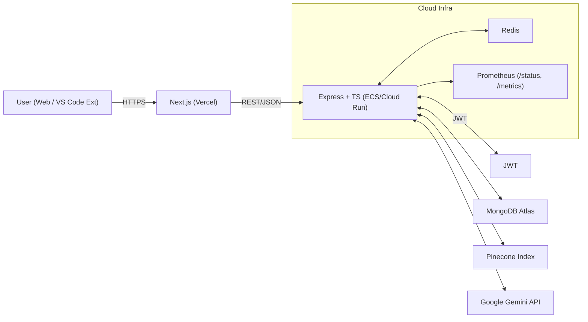
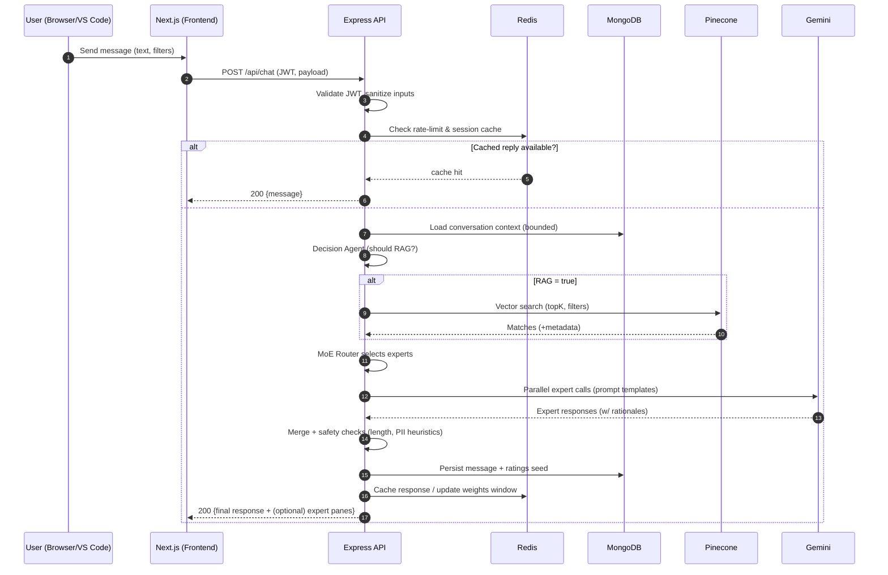

**EstateWise — System & AI Architecture**

> [!IMPORTANT]
> Status: Stable.
> 
> Target audience: contributors, SREs, and reviewers.
> 
> Last updated: 2025-08-19.

**Quick links:**

* [README](./README.md) — product overview & setup
* [TECH\_DOCS](./TECH_DOCS.md) — deep technical notes & how-tos
* [openapi.yaml](./openapi.yaml) — API surface (may lag; see live Swagger)

---

## 1) System Overview

EstateWise is a full-stack, stateless-by-default web app with a TypeScript/Express backend, Next.js frontend, MongoDB Atlas for system-of-record, Pinecone for vector search, and Redis for low-latency caching & rate-limit counters. The AI layer mixes RAG, clustering, and a Mixture-of-Experts (MoE) router.

### System Overview


**Design tenets**

* **Separation of concerns:** UI (Next.js) is presentation only; all AI, auth, and storage live behind the REST API.
* **Observability first:** Prometheus metrics + “/status” health endpoint.
* **Safety rails:** RAG gating + MoE router with feedback-weighted experts.

---

## 2) Request Lifecycle (Chat)



---

## 3) Data Model (Contracts)

> **Note:** Field sets below are canonical contracts for contributors. Check `backend/src/models` for exact TS interfaces.

### 3.1 MongoDB (Collections)

* **users**

  * `_id:ObjectId`, `email:string (unique)`, `passwordHash:string`, `createdAt:Date`, `role:'user'|'admin'`, `flags:{blocked?:boolean}`
* **conversations**

  * `_id:ObjectId`, `userId:ObjectId`, `title:string`, `createdAt:Date`, `updatedAt:Date`, `expertMode:boolean`
* **messages**

  * `_id:ObjectId`, `conversationId:ObjectId`, `role:'user'|'assistant'`, `content:string (markdown)`, `experts?:ExpertSlice[]`, `metrics?:{latencyMs:number, tokens?:number}`, `createdAt:Date`
* **ratings**

  * `_id:ObjectId`, `messageId:ObjectId`, `userId:ObjectId`, `value:1|-1`, `createdAt:Date`
* **expertWeights**

  * `_id:ObjectId`, `conversationId:ObjectId`, `weights:{data:number,lifestyle:number,finance:number,neighborhood:number,cluster:number}`, `updatedAt:Date`

```ts
type ExpertSlice = {
  name: 'data'|'lifestyle'|'finance'|'neighborhood'|'cluster',
  rationale?: string,
  content: string
}
```

### 3.2 Redis (Keys)

* `rl:<userId>` → rate-limit sliding window counters
* `sess:<conversationId>` → short-lived convo cache (last N messages)
* `ans:<messageHash>` → deterministic cache for idempotent prompts
* `w:<conversationId>` → expert weights hot copy

**TTL guidance:** 5–30 min for responses; 24 h for weights window; adjust under load.

### 3.3 Pinecone (Index Schema)

* **Index name:** `estatewise-index`
* **Vector:** embedding(listing\_features) ∈ ℝ^d (d depends on model)
* **Metadata (suggested):** `price:number`, `beds:number`, `baths:number`, `sqft:number`, `yearBuilt:number`, `lat:number`, `lng:number`, `zip:string`, `neighborhood:string`, `features:string[]`, `source:string`, `listingId:string`

**Filters:** geofence bbox, price range, beds/baths minimums, zip codes.

---

## 4) AI Pipeline

### 4.1 RAG Gating

Heuristic + lightweight classifier to decide if retrieval improves answer quality.

* **Inputs:** user intent, presence of numeric filters, location terms, conversation drift.
* **Output:** `shouldRetrieve:boolean`, `retrievalQuery:string`, `filters?:PineconeFilter`.

### 4.2 Retrieval

* **topK:** 8–20 (tune by latency);
* **similarity:** cosine kNN;
* **re-rank:** simple score fusion (cosine × field boosts); optionally filter by freshness.

### 4.3 Clustering

* **k-Means** over normalized features (0–1).
* Used to suggest neighborhoods / “similar homes” and to stabilize recommendations across turns.

### 4.4 Mixture-of-Experts (MoE)

* **Router features:** user query embedding, RAG stats (top score, entropy), convo topic, prior ratings.
* **Experts:** `data`, `lifestyle`, `finance`, `neighborhood`, `cluster`.
* **Merge strategy:** weighted voting + constraint checker (price bounds, recap section).

```ts
function routeAndMerge(ctx: Ctx): AssistantReply {
  const weights = getWeights(ctx.conversationId) // Redis→Mongo fallback
  const slices = parallelCallExperts(ctx)        // calls Gemini with expert prompts
  const scored = scoreSlices(slices, weights)    // BLEU-ish overlap + factual checks
  const merged = compose(scored)                 // stitched answer + optional expert panes
  return enforcePolicies(merged)                 // length, tone, privacy, safe content
}
```

### 4.5 Feedback & RL

* Thumbs up/down updates **conversation-local** expert weights (Redis hot, Mongo durable).
* Periodic decay prevents over-fitting; cold-start defaults are balanced (e.g., 0.2 each).

---

## 5) API Surface (Selected)

* `POST /api/auth/signup`, `POST /api/auth/login`, `GET /api/auth/verify-email`, `POST /api/auth/reset-password`
* `POST /api/conversations`, `GET /api/conversations`, `PUT /api/conversations/:id`, `DELETE /api/conversations/:id`, `GET /api/conversations/search/:q`
* `POST /api/chat`, `POST /api/chat/rate`
* `GET /status` (readiness details), `GET /metrics` (Prometheus)

> Full parameters & schemas: see `openapi.yaml` and live Swagger (`/api-docs`).

---

## 6) Configuration & Environment

| Variable            | Purpose           | Example                         |      |         |        |
| ------------------- | ----------------- | ------------------------------- | ---- | ------- | ------ |
| `PORT`              | Backend port      | `3001`                          |      |         |        |
| `MONGO_URI`         | MongoDB Atlas URI | `mongodb+srv://...`             |      |         |        |
| `JWT_SECRET`        | JWT signing key   | *strong secret*                 |      |         |        |
| `GOOGLE_AI_API_KEY` | Gemini access     | `AIza...`                       |      |         |        |
| `PINECONE_API_KEY`  | Pinecone access   | `pcn-...`                       |      |         |        |
| `PINECONE_INDEX`    | Vector index name | `estatewise-index`              |      |         |        |
| `REDIS_URL`         | Redis connection  | `redis://...`                   |      |         |        |
| `ALLOWED_ORIGINS`   | CORS allowlist    | `https://estatewise.vercel.app` |      |         |        |
| `LOG_LEVEL`         | \`debug           | info                            | warn | error\` | `info` |

**Secrets management:** Prefer AWS Secrets Manager / GCP Secret Manager in production.
**CORS:** strict allow-list; block wildcard in prod.
**CSP (extension iframe):** sandboxed iframe loaded from `https://estatewise.vercel.app/chat`.

---

## 7) Observability & Health

### 7.1 Health & Status

* `GET /status` returns:

  * build sha, environment, uptime
  * dependency probes (Mongo, Redis, Pinecone, AI)
  * queue depth & error budget snapshot

### 7.2 Prometheus Metrics (examples)

* **API:** `http_requests_total{route,code,method}`, `http_request_duration_seconds_bucket`
* **AI:** `ai_tokens_total{role}`, `ai_latency_ms{expert}`, `ai_calls_total{expert}`
* **RAG:** `rag_topk`, `rag_latency_ms`, `rag_gate_decisions_total{decision}`
* **Cache:** `cache_hits_total{kind}`, `cache_miss_total{kind}`
* **DB:** `mongo_ops_total{op}`, `mongo_latency_ms{op}`
* **Business:** `user_ratings_total{value}`, `conversations_total`, `expert_weight_mean{expert}`

**Dashboards:** latency percentiles, error rates, cache hit ratio, cost per 1k chats (approx).

---

## 8) Performance & Scaling

* **Stateless API:** scale out BE on ECS Fargate or Cloud Run; Redis centralizes shared counters.
* **Hot paths:** RAG (Pinecone) and AI calls dominate latency; use parallelism with bounded concurrency.
* **Target SLO (suggested):** p95 chat latency ≤ 2.5 s without RAG; ≤ 4.0 s with RAG; monthly availability ≥ 99.9%.
* **Backpressure:** circuit-break RAG on Pinecone degradation; degrade to MoE without retrieval.

**Tuning knobs**

* `topK` (Pinecone), result metadata size
* Max context tokens per turn
* Parallel expert calls (2–5) with timeout & soft-cancel

---

## 9) Security Model

* **Auth:** stateless JWT (HTTP-only, Secure cookies or Authorization header).
* **RBAC:** admin-only maintenance endpoints (feature-flag behind environment).
* **Input safety:** sanitize markdown; strip HTML/script; validate geo/price filters.
* **Rate limiting:** user-scoped & IP-scoped sliding window (Redis).
* **PII guardrails:** redact obvious PII from prompts; never echo sensitive secrets.
* **Dependency hygiene:** CI runs CodeQL, `npm audit`, Trivy for container images.
* **Data at rest:** Atlas + Pinecone + Redis with TLS; disk encryption per provider defaults.

---

## 10) Deployment Topologies

### 10.1 AWS (Primary)

* **ECS/Fargate**: BE service behind ALB; autoscaling on CPU/RPS.
* **MongoDB Atlas**, **Elasticache/Redis**, **Pinecone SaaS**
* **GitHub Actions → ECR → ECS deploy** (IaC via Terraform or CloudFormation)

### 10.2 GCP (Alt)

* **Cloud Run**: containerized BE; Cloud Build pipeline → Artifact Registry
* Same external dependencies; ingress via HTTPS LB (optional Cloud CDN for FE backup)

### 10.3 Frontend

* **Vercel** (primary). Environment variable `NEXT_PUBLIC_API_BASE` points to BE.

---

## 11) Runbooks (Ops)

* **Incident: AI provider degraded**

  * Action: flip RAG gate hard-off; reduce experts to 1–2; show banner to users.
* **Incident: Pinecone latency**

  * Action: lower `topK`; enable bbox filters; fall back to non-RAG responses.
* **Mongo “too many connections”**

  * Action: increase pool size; verify connection reuse; scale replicas or reduce BE pods.
* **Elevated 429**

  * Action: inspect Redis rate-limit keys; widen window or bump capacity; enforce FE backoff.

---

## 12) Local Development Architecture

* **Backend:** `npm run dev` with nodemon/ts-node-dev; requires `.env`.
* **Frontend:** `npm run dev` (Next.js) with `NEXT_PUBLIC_API_BASE` to `http://localhost:3001`.
* **Optional Docker:** `docker-compose up --build` (FE + BE + local Redis)
* **Testing:** Jest unit/integration, Cypress/Selenium for E2E; artifacts uploaded via CI.

---

## 13) Appendix

### 13.1 Redis Key Conventions

* Prefix by domain, then identifier: `ans:<sha256(payload)>`, `w:<conversationId>`
* Use `:` as separator only (no `|`); keep TTL small on response caches.

### 13.2 Error Semantics (API)

* 400 validation error (Zod/Joi style)
* 401 unauthenticated
* 403 forbidden (role check)
* 429 rate limited (Retry-After header)
* 5xx with opaque message; correlation id in header `x-request-id`

### 13.3 Non-Goals

* Real-time websockets (HTTP/long-polling used today)
* Streaming token-by-token (could be enabled; ensure FE backpressure)

---

**Contributing?**
See [CONTRIBUTING](./CONTRIBUTING.md). For security issues, follow [SECURITY](./SECURITY.md).

**Questions?**
Open a GitHub Discussion or Issue; include logs (without PII) and `x-request-id`.

---
