# EstateWise Architecture

This document describes the comprehensive end-to-end architecture for EstateWise, spanning frontend UI, backend services, API protocols (REST, tRPC, gRPC), data and graph pipelines, AI/ML systems, MCP tooling, agentic orchestration, IDE extensions, and CI/CD infrastructure.


## Table of Contents

- [System Overview](#system-overview)
- [Repository Structure](#repository-structure)
- [API Protocols](#api-protocols)
  - [REST API (Primary)](#rest-api-primary)
  - [tRPC (TypeScript-first)](#trpc-typescript-first)
  - [gRPC (High-performance)](#grpc-high-performance)
- [Core Services Architecture](#core-services-architecture)
  - [Authentication Service](#authentication-service)
  - [Chat Service (AI Pipeline)](#chat-service-ai-pipeline)
  - [Property Service](#property-service)
  - [Graph Service (Neo4j)](#graph-service-neo4j)
- [Data Flow Architecture](#data-flow-architecture)
  - [Real-time Data Pipeline](#real-time-data-pipeline)
  - [RAG Pipeline](#rag-pipeline)
  - [Hybrid RAG (Vector + Graph)](#hybrid-rag-vector--graph)
- [AI/ML Architecture](#aiml-architecture)
  - [Mixture of Experts (MoE)](#mixture-of-experts-moe)
  - [Chain-of-Thought (CoT) Processing](#chain-of-thought-cot-processing)
- [Model Context Protocol (MCP) Architecture](#model-context-protocol-mcp-architecture)
- [Agentic AI Architecture](#agentic-ai-architecture)
  - [Multi-Runtime + Multi-Surface](#multi-runtime--multi-surface)
  - [Runtime Contracts](#runtime-contracts)
  - [HTTP + A2A Contract Surface](#http--a2a-contract-surface)
  - [Traceability and Observability](#traceability-and-observability)
  - [Beads Architecture & Flywheel Methodology](#beads-architecture--flywheel-methodology)
- [Context Engineering Architecture](#context-engineering-architecture)
  - [System Overview](#context-engineering-system-overview)
  - [Knowledge Graph Engine](#knowledge-graph-engine)
  - [Knowledge Base & Retrieval](#knowledge-base--retrieval)
  - [Context Assembly Pipeline](#context-assembly-pipeline)
  - [Ingestion Pipeline](#ingestion-pipeline)
  - [MCP Tool Integration](#context-mcp-tool-integration)
  - [D3 Visualization Layer](#d3-visualization-layer)
  - [Agent Integration](#agent-integration)
- [Frontend Architecture](#frontend-architecture)
  - [Component Hierarchy](#component-hierarchy)
  - [State Management](#state-management)
- [Infrastructure \& Deployment](#infrastructure--deployment)
  - [Multi-Cloud Architecture](#multi-cloud-architecture)
  - [GitOps Control Plane Architecture](#gitops-control-plane-architecture)
  - [Controller Ownership Boundaries](#controller-ownership-boundaries)
  - [Progressive Delivery Control Loops](#progressive-delivery-control-loops)
  - [Operational Workflow Orchestration](#operational-workflow-orchestration)
  - [Advanced Deployment Strategies](#advanced-deployment-strategies)
  - [Deployment Control UI](#deployment-control-ui)
  - [Infrastructure as Code](#infrastructure-as-code)
  - [Production Kubernetes Architecture](#production-kubernetes-architecture)
- [Security Architecture](#security-architecture)
  - [Defense in Depth](#defense-in-depth)
  - [Secret Management](#secret-management)
  - [Code Quality \& Security Scanning](#code-quality--security-scanning)
- [Monitoring \& Observability](#monitoring--observability)
  - [Metrics Collection](#metrics-collection)
  - [Datadog Observability Stack](#datadog-observability-stack)
  - [Distributed Tracing](#distributed-tracing)
- [Performance Optimization](#performance-optimization)
  - [Caching Strategy](#caching-strategy)
  - [Load Balancing](#load-balancing)
- [Testing Strategy](#testing-strategy)
  - [Test Pyramid](#test-pyramid)
  - [CI/CD Pipeline](#cicd-pipeline)
- [Data Models](#data-models)
  - [Core Entities](#core-entities)
  - [Graph Schema (Neo4j)](#graph-schema-neo4j)
- [Environment Configuration](#environment-configuration)
  - [Environment Variables Matrix](#environment-variables-matrix)
- [Performance Targets \& SLOs](#performance-targets--slos)
  - [Service Level Objectives](#service-level-objectives)
  - [Scalability Targets](#scalability-targets)
- [Disaster Recovery](#disaster-recovery)
  - [Backup Strategy](#backup-strategy)
  - [Failover Process](#failover-process)
- [Development Workflow](#development-workflow)
  - [Git Flow](#git-flow)
  - [Code Review Process](#code-review-process)
- [Future Roadmap](#future-roadmap)
  - [Planned Enhancements](#planned-enhancements)
  - [Technical Debt](#technical-debt)
- [Appendix](#appendix)
  - [Glossary](#glossary)
  - [References](#references)

## System Overview

EstateWise is a full-stack, monorepo AI/ML chatbot and data analytics platform built for real estate in Chapel Hill, NC and surrounding areas. The architecture employs a microservices-oriented design with multiple API protocols, distributed data stores, sophisticated AI orchestration, and a web-grounding layer for freshness-sensitive AI responses.

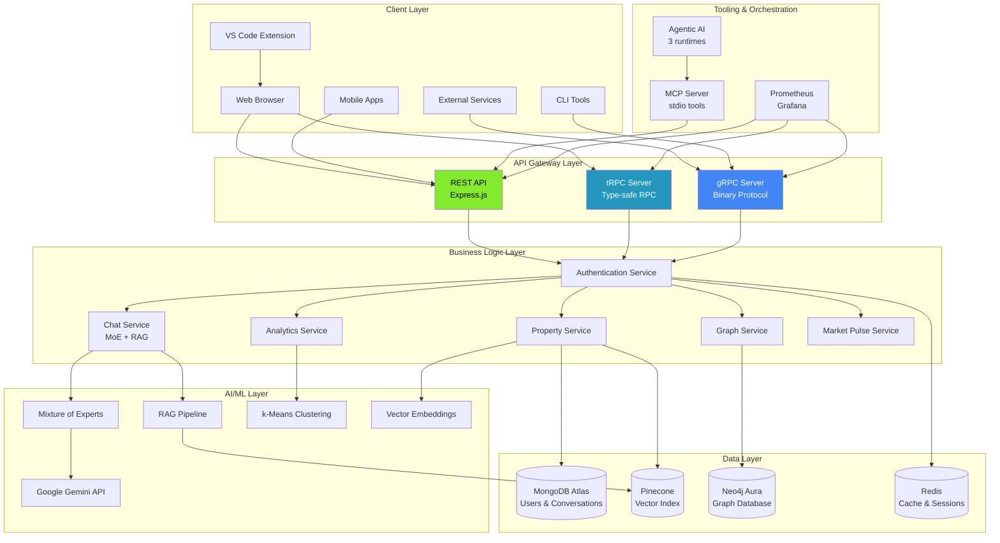
```mermaid
flowchart TB
  subgraph "Client Layer"
    Web[Web Browser]
    Mobile[Mobile Apps]
    VSCode[VS Code Extension]
    CLI[CLI Tools]
    Services[External Services]
  end

  subgraph "API Gateway Layer"
    REST[REST API<br/>Express.js]
    TRPC[tRPC Server<br/>Type-safe RPC]
    GRPC[gRPC Server<br/>Binary Protocol]
  end

  subgraph "Business Logic Layer"
    Auth[Authentication Service]
    Chat[Chat Service<br/>MoE + RAG]
    Property[Property Service]
    Analytics[Analytics Service]
    Graph[Graph Service]
    Market[Market Pulse Service]
  end

  subgraph "AI/ML Layer"
    Gemini[Google Gemini API]
    MoE[Mixture of Experts]
    RAG[RAG Pipeline]
    Clustering[k-Means Clustering]
    Embeddings[Vector Embeddings]
  end

  subgraph "Data Layer"
    MongoDB[(MongoDB Atlas<br/>Users & Conversations)]
    Pinecone[(Pinecone<br/>Vector Index)]
    Neo4j[(Neo4j Aura<br/>Graph Database)]
    Redis[(Redis<br/>Cache & Sessions)]
  end

  subgraph "Tooling & Orchestration"
    MCP[MCP Server<br/>stdio tools]
    Agentic[Agentic AI<br/>3 runtimes]
    Monitoring[Prometheus<br/>Grafana]
  end

  Web --> REST
  Web --> TRPC
  Mobile --> REST
  Services --> GRPC
  CLI --> GRPC
  VSCode --> Web

  REST --> Auth
  TRPC --> Auth
  GRPC --> Auth

  Auth --> Chat
  Auth --> Property
  Auth --> Analytics
  Auth --> Graph
  Auth --> Market

  Chat --> MoE
  Chat --> RAG
  Property --> Embeddings
  Analytics --> Clustering

  MoE --> Gemini
  RAG --> Pinecone
  Property --> MongoDB
  Property --> Pinecone
  Graph --> Neo4j
  Auth --> Redis

  Agentic --> MCP
  MCP --> REST

  Monitoring --> REST
  Monitoring --> TRPC
  Monitoring --> GRPC

  style REST fill:#85EA2D,color:#000
  style TRPC fill:#2596BE,color:#fff
  style GRPC fill:#4285F4,color:#fff
```

## Repository Structure

```
EstateWise-Chapel-Hill-Chatbot/
├── backend/                   # Express + TypeScript API server
│   ├── src/
│   │   ├── controllers/       # Request handlers
│   │   ├── models/            # MongoDB schemas
│   │   ├── routes/            # API routes
│   │   ├── services/          # Business logic
│   │   ├── middleware/        # Auth, logging, errors
│   │   ├── trpc/              # tRPC implementation
│   │   │   ├── routers/       # tRPC routers
│   │   │   └── trpc.ts        # Context & procedures
│   │   └── server.ts          # Main entry point
├── frontend/                  # Next.js + React application
│   ├── app/                   # Next.js 13+ app directory
│   ├── components/            # React components
│   ├── lib/                   # Utilities & API clients
│   └── public/                # Static assets
├── grpc/                      # gRPC service implementation
│   ├── proto/                 # Protocol buffer definitions
│   │   └── market_pulse.proto
│   ├── src/
│   │   ├── server.ts          # gRPC server
│   │   └── services/          # Service implementations
├── mcp/                       # Model Context Protocol server
│   ├── shared/                # Shared infra (auth, logging, errors)
│   ├── servers/               # Domain MCP servers (property, market, finance, graph, commute, system)
│   ├── client/                # Unified MCP client with connection pooling
│   ├── config/                # Server configs, tool registries, access control
│   ├── src/
│   │   ├── server.ts          # MCP stdio server
│   │   └── tools/             # Tool implementations
├── agentic-ai/                # Multi-agent orchestration
│   ├── src/
│   │   ├── agents/            # Agent implementations
│   │   ├── orchestration/     # Supervisor, agent registry, intent router, tool-use loop
│   │   ├── prompts/           # XML prompt templates, schemas, grounding rules
│   │   ├── context/           # Token budget manager, hybrid RAG, cache strategies
│   │   ├── observability/     # OpenTelemetry traces, metrics, cost tracking, health checks
│   │   ├── orchestrator/      # Default runtime
│   │   ├── lang/              # LangGraph runtime
│   │   └── index.ts           # CLI entry
│   └── crewai/                # Python CrewAI runtime
├── context-engineering/          # Context engineering subsystem
│   ├── src/
│   │   ├── graph/                # Knowledge graph engine
│   │   ├── knowledge-base/       # Document store & retrieval
│   │   ├── context/              # Context window & providers
│   │   ├── ingestion/            # Data ingestion parsers
│   │   ├── monitoring/           # Metrics collection
│   │   ├── mcp/                  # MCP tool definitions
│   │   ├── api/                  # Express REST router
│   │   ├── ui/public/            # D3 visualization dashboard
│   │   ├── factory.ts            # System wiring factory
│   │   └── serve.ts              # Standalone server
├── extension/                 # VS Code extension
├── terraform/                 # Infrastructure as Code
├── aws/                       # AWS deployment configs
├── azure/                     # Azure deployment configs
├── gcp/                       # GCP deployment configs
├── kubernetes/                # K8s manifests
├── hashicorp/                 # Consul/Nomad configs
├── .beads/                    # Bead-based context threading and session snapshots
└── .agent-sessions/           # Persistent agent session state and checkpoints
```

## API Protocols

EstateWise implements three complementary API protocols to serve different use cases:

### REST API (Primary)
- **Protocol**: JSON over HTTP/1.1
- **Use Cases**: Public API, mobile apps, third-party integrations
- **Documentation**: OpenAPI/Swagger at `/api-docs`
- **Authentication**: JWT tokens in Authorization header
- **Key Graph Endpoints**:
  - `GET /api/graph/similar/:zpid`
  - `GET /api/graph/explain?from=<zpid>&to=<zpid>`
  - `GET /api/graph/neighborhood/:name`
  - `GET /api/graph/overview?limit=250` (sampled global graph payload for UI visualization)

### tRPC (TypeScript-first)
- **Protocol**: JSON over HTTP with type inference
- **Use Cases**: Web frontend, internal TypeScript services
- **Benefits**: End-to-end type safety, auto-completion, no code generation
- **Endpoint**: `/trpc/*`

### gRPC (High-performance)
- **Protocol**: Protocol Buffers over HTTP/2
- **Use Cases**: Service-to-service, streaming, cross-language clients
- **Port**: 50051
- **Services**: MarketPulseService with unary and streaming RPCs

## Core Services Architecture

EstateWise backend is composed of modular **microservices**, each responsible for a specific domain. Below are the key services and their internal architectures.

### Authentication Service

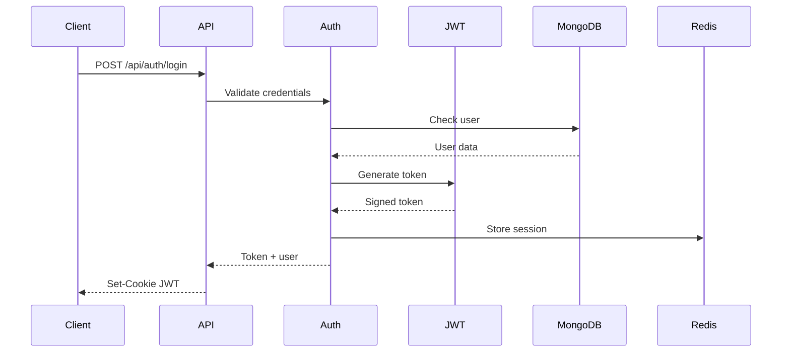
```mermaid
sequenceDiagram
  participant Client
  participant API
  participant Auth
  participant JWT
  participant MongoDB
  participant Redis

  Client->>API: POST /api/auth/login
  API->>Auth: Validate credentials
  Auth->>MongoDB: Check user
  MongoDB-->>Auth: User data
  Auth->>JWT: Generate token
  JWT-->>Auth: Signed token
  Auth->>Redis: Store session
  Auth-->>API: Token + user
  API-->>Client: Set-Cookie JWT
```

### Chat Service (AI Pipeline)

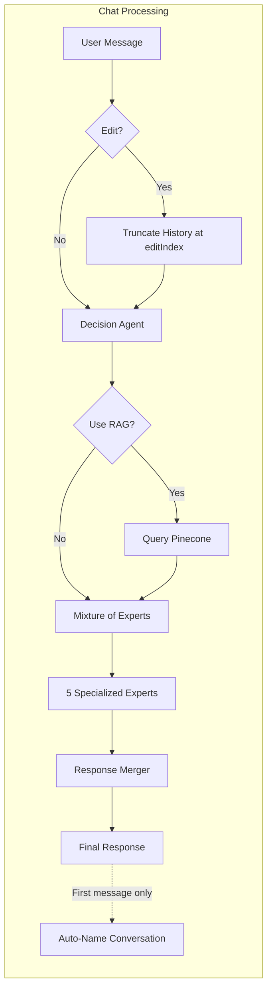
```mermaid
flowchart LR
  subgraph "Chat Processing"
    Input[User Message]
    EditCheck{Edit?}
    Truncate[Truncate History at editIndex]
    Decision[Decision Agent]
    RAG{Use RAG?}
    Pinecone[Query Pinecone]
    MoE[Mixture of Experts]
    Experts[5 Specialized Experts]
    Merger[Response Merger]
    Output[Final Response]
    AutoName[Auto-Name Conversation]
  end

  Input --> EditCheck
  EditCheck -->|Yes| Truncate
  EditCheck -->|No| Decision
  Truncate --> Decision
  Decision --> RAG
  RAG -->|Yes| Pinecone
  RAG -->|No| MoE
  Pinecone --> MoE
  MoE --> Experts
  Experts --> Merger
  Merger --> Output
  Output -.->|First message only| AutoName
```

Expert models include:
- **Data Analyst**: Statistical analysis, trends
- **Lifestyle Concierge**: Neighborhood, amenities
- **Financial Advisor**: Mortgage, investment analysis
- **Neighborhood Expert**: Local insights, schools
- **Cluster Analyst**: Property grouping, similarities

**Auto-Generated Titles**: For authenticated users, the first message in a new conversation automatically triggers AI-powered title generation (3-6 words) via Gemini API, replacing "New Conversation" within seconds.

#### Message Editing & Conversation Branching

Users can edit any previously sent message to branch the conversation from that point. The system uses implicit linear branching via history truncation rather than maintaining an explicit tree data structure.

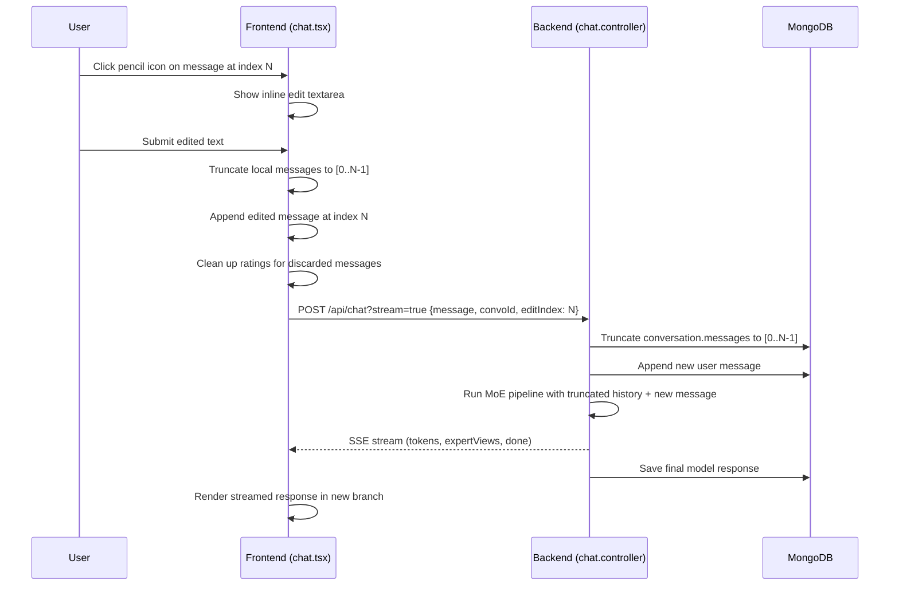
```mermaid
sequenceDiagram
    participant U as User
    participant FE as Frontend (chat.tsx)
    participant BE as Backend (chat.controller)
    participant DB as MongoDB

    U->>FE: Click pencil icon on message at index N
    FE->>FE: Show inline edit textarea
    U->>FE: Submit edited text
    FE->>FE: Truncate local messages to [0..N-1]
    FE->>FE: Append edited message at index N
    FE->>FE: Clean up ratings for discarded messages
    FE->>BE: POST /api/chat?stream=true {message, convoId, editIndex: N}
    BE->>DB: Truncate conversation.messages to [0..N-1]
    BE->>DB: Append new user message
    BE->>BE: Run MoE pipeline with truncated history + new message
    BE-->>FE: SSE stream (tokens, expertViews, done)
    BE->>DB: Save final model response
    FE->>FE: Render streamed response in new branch
```

**How it works:**
- The `editIndex` body parameter tells the backend to slice `conversation.messages` at that index, discarding all subsequent messages.
- The edited user message is appended, and the MoE pipeline generates a fresh response using the truncated history as context.
- For guest users, the truncated history is sent directly in the request payload (no server-side persistence).
- The original conversation path beyond the edit point is replaced — this is a destructive branch operation.

### Property Service

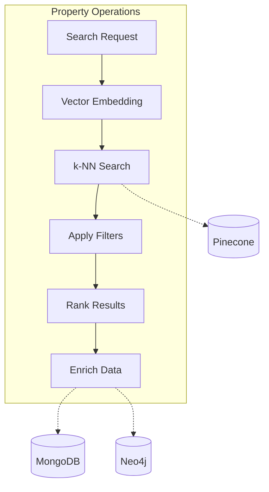
```mermaid
flowchart TD
  subgraph "Property Operations"
    Search[Search Request]
    Vector[Vector Embedding]
    KNN[k-NN Search]
    Filter[Apply Filters]
    Rank[Rank Results]
    Enrich[Enrich Data]
  end

  Search --> Vector
  Vector --> KNN
  KNN --> Filter
  Filter --> Rank
  Rank --> Enrich

  KNN -.-> Pinecone[(Pinecone)]
  Enrich -.-> MongoDB[(MongoDB)]
  Enrich -.-> Neo4j[(Neo4j)]
```

### Graph Service (Neo4j)

- Supports explainability and graph-native UI workflows:
  - Similar-property reasoning and path explanations.
  - Neighborhood aggregate summaries with sampled listings.
  - Sampled global overview payload (`/api/graph/overview`) for browser-safe visualization of large graphs.

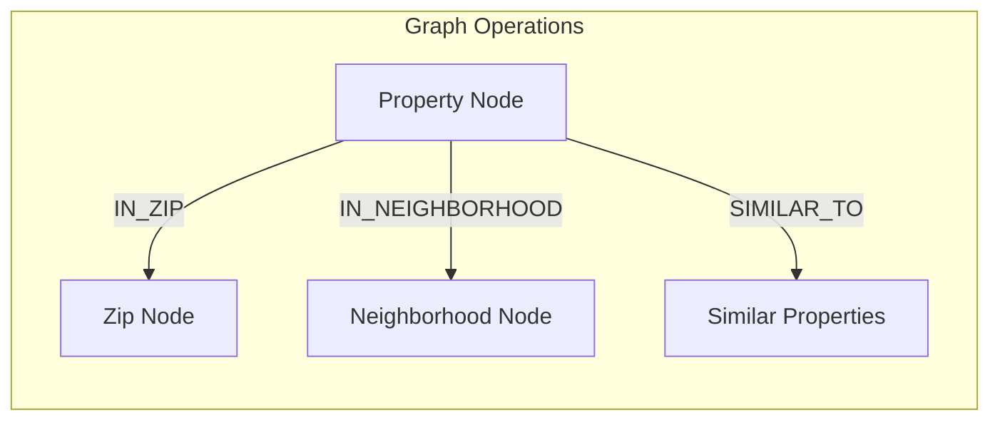
```mermaid
graph LR
  subgraph "Graph Operations"
    Property[Property Node]
    Zip[Zip Node]
    Hood[Neighborhood Node]
    Similar[Similar Properties]
  end

  Property -->|IN_ZIP| Zip
  Property -->|IN_NEIGHBORHOOD| Hood
  Property -->|SIMILAR_TO| Similar

  class Property,Similar property
  class Zip,Hood location
```

## Data Flow Architecture

### Real-time Data Pipeline

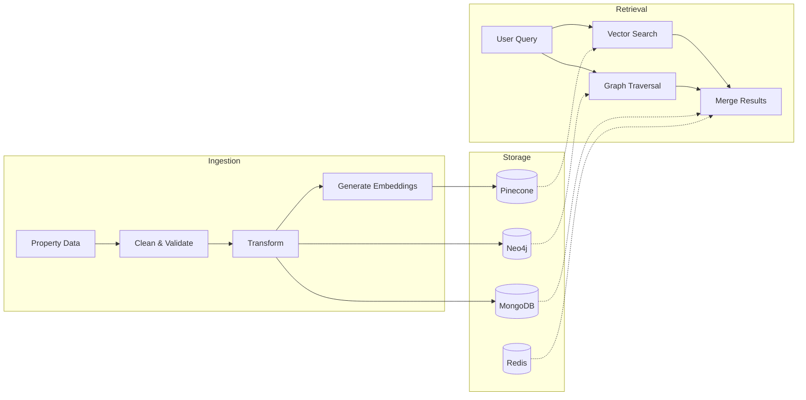
```mermaid
flowchart LR
  subgraph "Ingestion"
    Source[Property Data]
    Clean[Clean & Validate]
    Transform[Transform]
    Embed[Generate Embeddings]
  end

  subgraph "Storage"
    Primary[(MongoDB)]
    Vector[(Pinecone)]
    Graph[(Neo4j)]
    Cache[(Redis)]
  end

  subgraph "Retrieval"
    Query[User Query]
    VectorSearch[Vector Search]
    GraphTraversal[Graph Traversal]
    Merge[Merge Results]
  end

  Source --> Clean
  Clean --> Transform
  Transform --> Embed

  Transform --> Primary
  Embed --> Vector
  Transform --> Graph

  Query --> VectorSearch
  Query --> GraphTraversal
  VectorSearch --> Merge
  GraphTraversal --> Merge

  Vector -.-> VectorSearch
  Graph -.-> GraphTraversal
  Primary -.-> Merge
  Cache -.-> Merge
```

### RAG Pipeline

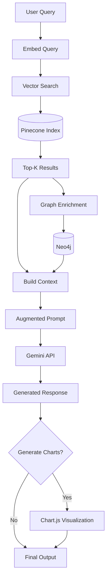
```mermaid
flowchart TD
  Query[User Query] --> Embed[Embed Query]
  Embed --> Search[Vector Search]
  Search --> Pinecone[(Pinecone Index)]
  Pinecone --> TopK[Top-K Results]
  TopK --> Context[Build Context]
  TopK --> Graph[Graph Enrichment]
  Graph --> Neo4j[(Neo4j)]
  Neo4j --> Context
  Context --> Prompt[Augmented Prompt]
  Prompt --> LLM[Gemini API]
  LLM --> Response[Generated Response]
  Response --> Charts{Generate Charts?}
  Charts -->|Yes| Viz[Chart.js Visualization]
  Charts -->|No| Final[Final Output]
  Viz --> Final
```

### Hybrid RAG (Vector + Graph)

EstateWise runs a hybrid retrieval pipeline that blends semantic vector search with graph traversal so responses include both similar listings and explainable relationships.

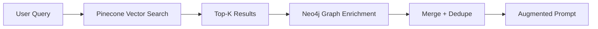
```mermaid
flowchart LR
  Q[User Query] --> V[Pinecone Vector Search]
  V --> K[Top-K Results]
  K --> G[Neo4j Graph Enrichment]
  G --> M[Merge + Dedupe]
  M --> LLM[Augmented Prompt]
```

- Vector search (Pinecone) captures semantic intent from free-form prompts.
- Graph enrichment (Neo4j) adds structure like shared neighborhoods, ZIP codes, and similarity links.
- The merged context improves recall and enables natural-language explanations for why a property is recommended.

For detailed flows, query examples, and evaluation notes, see [RAG_SYSTEM.md](RAG_SYSTEM.md).

## AI/ML Architecture

### Mixture of Experts (MoE)

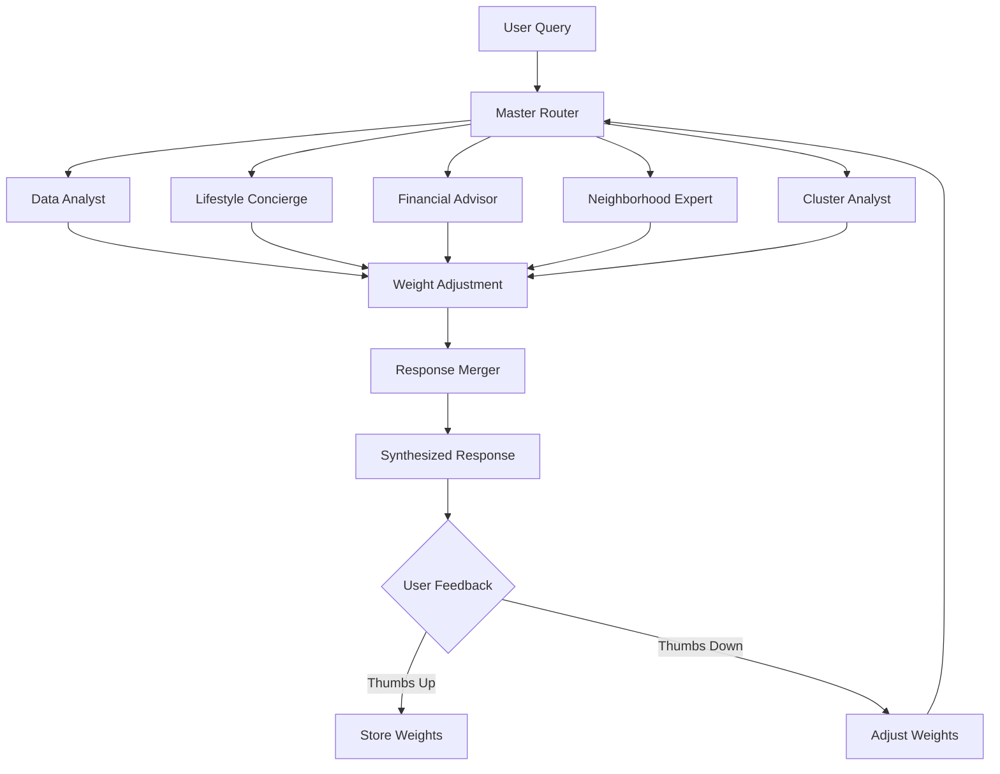
```mermaid
flowchart TB
  Query[User Query] --> Router[Master Router]
  Router --> Expert1[Data Analyst]
  Router --> Expert2[Lifestyle Concierge]
  Router --> Expert3[Financial Advisor]
  Router --> Expert4[Neighborhood Expert]
  Router --> Expert5[Cluster Analyst]

  Expert1 --> Weights[Weight Adjustment]
  Expert2 --> Weights
  Expert3 --> Weights
  Expert4 --> Weights
  Expert5 --> Weights

  Weights --> Merger[Response Merger]
  Merger --> Output[Synthesized Response]

  Output --> Feedback{User Feedback}
  Feedback -->|Thumbs Up| Store[Store Weights]
  Feedback -->|Thumbs Down| Adjust[Adjust Weights]
  Adjust --> Router
```

### Chain-of-Thought (CoT) Processing

Each expert uses CoT to break down complex queries:

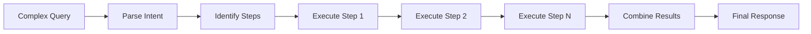
```mermaid
flowchart LR
  Query[Complex Query] --> Parse[Parse Intent]
  Parse --> Steps[Identify Steps]
  Steps --> Execute[Execute Step 1]
  Execute --> Next[Execute Step 2]
  Next --> More[Execute Step N]
  More --> Combine[Combine Results]
  Combine --> Response[Final Response]
```

## Model Context Protocol (MCP) Architecture

The MCP server exposes tools via stdio to any MCP-compatible client:

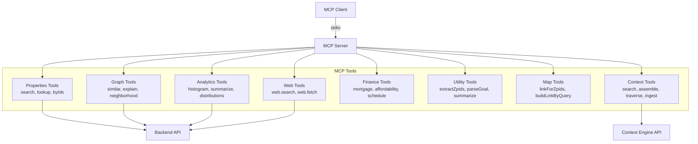
```mermaid
flowchart TB
  subgraph "MCP Tools"
    Props[Properties Tools<br/>search, lookup, byIds]
    Graph[Graph Tools<br/>similar, explain, neighborhood]
    Analytics[Analytics Tools<br/>histogram, summarize, distributions]
    Web[Web Tools<br/>web.search, web.fetch]
    Finance[Finance Tools<br/>mortgage, affordability, schedule]
    Utils[Utility Tools<br/>extractZpids, parseGoal, summarize]
    Map[Map Tools<br/>linkForZpids, buildLinkByQuery]
    Context[Context Tools<br/>search, assemble, traverse, ingest]
  end

  Client[MCP Client] -->|stdio| Server[MCP Server]
  Server --> Props
  Server --> Graph
  Server --> Analytics
  Server --> Web
  Server --> Finance
  Server --> Utils
  Server --> Map
  Server --> Context

  Props --> API[Backend API]
  Graph --> API
  Analytics --> API
  Web --> API
  Context --> CEng[Context Engine API]
```

The MCP layer now includes internet research tools (`web.search`, `web.fetch`) so agentic runtimes can gather up-to-date external context when required.

The MCP server also exposes 7 **context engineering tools** (`context.search`, `context.graphOverview`, `context.findRelated`, `context.assembleContext`, `context.ingestDocument`, `context.getMetrics`, `context.nodeDetail`) that connect agents to the knowledge graph and knowledge base for structured domain context.

## Agentic AI Architecture

EstateWise agentic execution is delivered through one package (`agentic-ai/`) with three runtime modes and three client surfaces (CLI, HTTP, A2A).

### Multi-Runtime + Multi-Surface

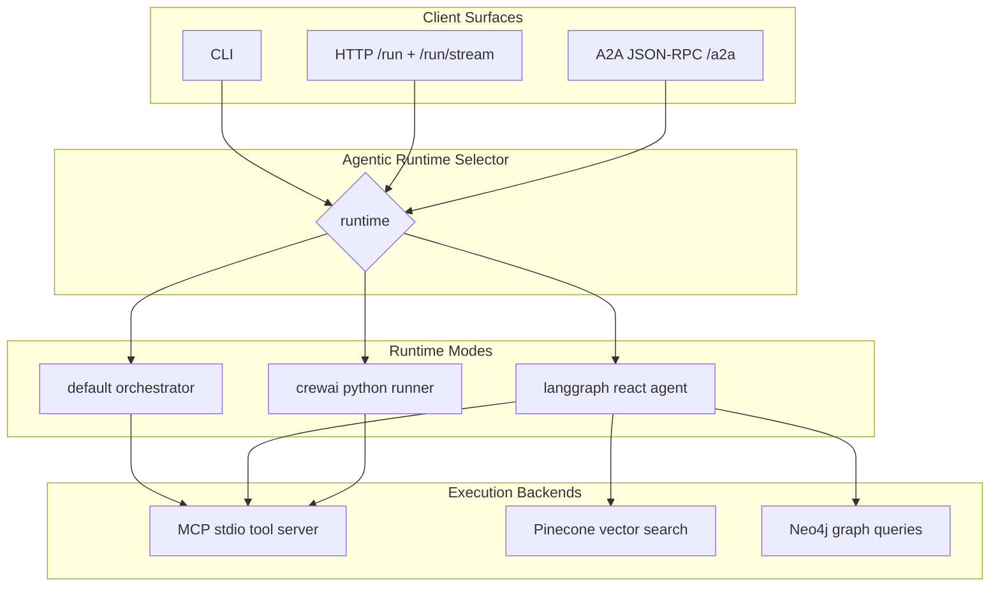
```mermaid
flowchart TB
  subgraph "Client Surfaces"
    CLI[CLI]
    HTTP[HTTP /run + /run/stream]
    A2A[A2A JSON-RPC /a2a]
  end

  subgraph "Agentic Runtime Selector"
    Selector{runtime}
  end

  subgraph "Runtime Modes"
    ORCH[default orchestrator]
    LG[langgraph react agent]
    CREW[crewai python runner]
  end

  subgraph "Execution Backends"
    MCP[MCP stdio tool server]
    Pinecone[Pinecone vector search]
    Neo4j[Neo4j graph queries]
  end

  CLI --> Selector
  HTTP --> Selector
  A2A --> Selector

  Selector --> ORCH
  Selector --> LG
  Selector --> CREW

  ORCH --> MCP
  LG --> MCP
  LG --> Pinecone
  LG --> Neo4j
  CREW --> MCP
```

### Runtime Contracts

| Runtime | Primary execution model | Typical use |
|---------|--------------------------|-------------|
| `default` | round-based planner/coordinator + specialists | deterministic multi-step analysis |
| `langgraph` | tool-calling ReAct agent with checkpointer | adaptive research with deeper tool autonomy |
| `crewai` | Python crew pipeline via Node bridge | CrewAI-native task orchestration |

### HTTP + A2A Contract Surface

- `POST /run` accepts `goal`, `runtime`, `rounds`, `threadId`, and optional `requestId`.
- `GET /run/stream` supports SSE streaming with `runtime`, `rounds`, `threadId`, and optional `requestId`.
- `GET /config` returns runtime support, MCP required-tool mode, and LangSmith tracing status.
- `POST /a2a` supports JSON-RPC methods: `agent.getCard`, `tasks.create/get/list/wait/cancel` (with optional `requestId` on task creation).
- `GET /a2a/tasks/{taskId}/events` streams task lifecycle events via SSE.

### Traceability and Observability

- LangGraph responses include normalized `toolExecutions` with status, duration, and output/error.
- Cost tracking aggregates token/cost usage per run for LangGraph and CrewAI responses.
- Optional LangSmith tracing enriches runs with runtime/surface/component/request metadata and thread correlation.
- HTTP `requestId` (or `x-request-id`) is propagated to LangGraph trace metadata for cross-system correlation.

### Orchestration Engine Architecture

The orchestration engine implements a supervisor pattern where a central coordinator classifies user intent, selects domain agents, manages tool-use budgets, and aggregates results.

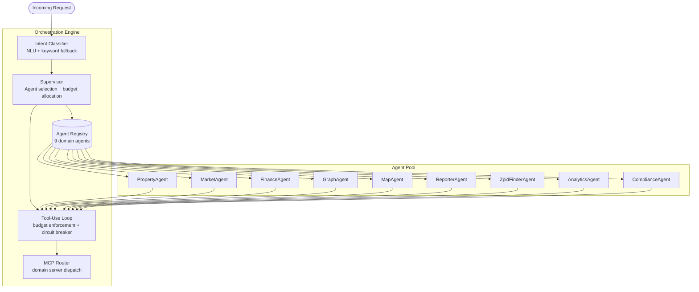
```mermaid
flowchart TB
  Request([Incoming Request]) --> IntentClassifier

  subgraph "Orchestration Engine"
    IntentClassifier[Intent Classifier<br/>NLU + keyword fallback]
    IntentClassifier --> Supervisor[Supervisor<br/>Agent selection + budget allocation]
    Supervisor --> AgentRegistry[(Agent Registry<br/>9 domain agents)]
    Supervisor --> ToolLoop[Tool-Use Loop<br/>budget enforcement + circuit breaker]
    ToolLoop --> MCPRouter[MCP Router<br/>domain server dispatch]
  end

  subgraph "Agent Pool"
    PA[PropertyAgent]
    MA[MarketAgent]
    FA[FinanceAgent]
    GA[GraphAgent]
    MAP[MapAgent]
    RA[ReporterAgent]
    ZF[ZpidFinderAgent]
    AA[AnalyticsAgent]
    CA[ComplianceAgent]
  end

  AgentRegistry --> PA & MA & FA & GA & MAP & RA & ZF & AA & CA
  PA & MA & FA & GA & MAP & RA & ZF & AA & CA --> ToolLoop
```

#### Agent Registry

| Agent | Domain | MCP Tools Scope | Max Tool Calls | Token Budget |
|-------|--------|-----------------|----------------|--------------|
| PropertyAgent | Property search and lookup | `properties.*` | 10 | 4 096 |
| MarketAgent | Market trends and inventory | `market.*`, `analytics.*` | 8 | 4 096 |
| FinanceAgent | Mortgage, ROI, affordability | `finance.*` | 6 | 2 048 |
| GraphAgent | Similarity and relationships | `graph.*` | 6 | 2 048 |
| MapAgent | Maps and commute analysis | `map.*`, `commute.*` | 4 | 2 048 |
| ReporterAgent | Summary and presentation | `system.*` | 2 | 8 192 |
| ZpidFinderAgent | ZPID resolution | `properties.lookup` | 4 | 1 024 |
| AnalyticsAgent | Statistical analysis | `analytics.*` | 6 | 4 096 |
| ComplianceAgent | Output validation and filtering | _(none -- reads only)_ | 0 | 1 024 |

#### Tool-Use Loop

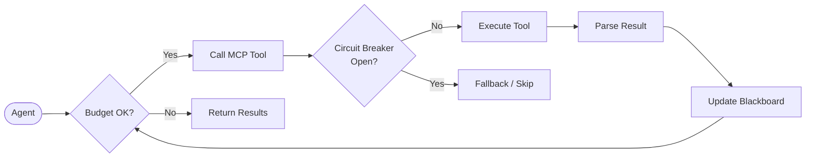
```mermaid
flowchart LR
  Agent([Agent]) --> Check{Budget OK?}
  Check -->|Yes| Call[Call MCP Tool]
  Call --> CB{Circuit Breaker<br/>Open?}
  CB -->|No| Execute[Execute Tool]
  CB -->|Yes| Fallback[Fallback / Skip]
  Execute --> Parse[Parse Result]
  Parse --> Update[Update Blackboard]
  Update --> Check
  Check -->|No| Return[Return Results]
```

#### Error Recovery Strategies

| Strategy | Trigger | Action |
|----------|---------|--------|
| Retry with backoff | Transient HTTP error (5xx) | Exponential backoff up to 3 retries |
| Fallback agent | Primary agent timeout | Route to backup agent with reduced scope |
| Partial result | Some tools fail in fan-out | Return successful results with warnings |
| Circuit breaker | 3+ consecutive tool failures | Open circuit, skip tool for cooldown period |
| Budget overflow | Token/call limit exceeded | Truncate context, summarize, and return |
| Schema violation | Agent output fails Zod validation | Re-prompt agent with error details (1 retry) |
| Dead letter | All retries exhausted | Log to dead-letter queue for offline inspection |
| Graceful degradation | MCP server unreachable | Return cached result or informative error |
| Session recovery | Checkpoint found in `.agent-sessions/` | Resume from last committed state |
| Bead replay | Audit or debugging request | Replay reasoning chain from `.beads/` snapshots |

#### Intent Classification

The supervisor classifies incoming requests into intent categories using a two-pass approach: fast keyword matching for common patterns, followed by LLM-based NLU for ambiguous queries. Classification results determine which agents are activated and in what order.

### MCP Domain Servers Architecture

The MCP layer is decomposed into 6 domain-specific servers sharing a common infrastructure layer for authentication, logging, error handling, and connection pooling.

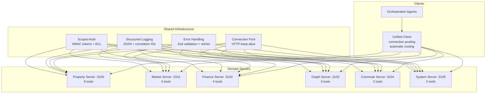
```mermaid
flowchart TB
  subgraph "Shared Infrastructure"
    Auth[Scoped Auth<br/>HMAC tokens + ACL]
    Log[Structured Logging<br/>JSON + correlation IDs]
    Err[Error Handling<br/>Zod validation + retries]
    Pool[Connection Pool<br/>HTTP keep-alive]
  end

  subgraph "Domain Servers"
    PS[Property Server :3100<br/>8 tools]
    MS[Market Server :3101<br/>5 tools]
    FS[Finance Server :3102<br/>4 tools]
    GS[Graph Server :3103<br/>3 tools]
    CS[Commute Server :3104<br/>2 tools]
    SS[System Server :3105<br/>2 tools]
  end

  subgraph "Clients"
    UC[Unified Client<br/>connection pooling<br/>automatic routing]
    Agents[Orchestration Agents]
  end

  Auth & Log & Err & Pool --> PS & MS & FS & GS & CS & SS
  Agents --> UC --> PS & MS & FS & GS & CS & SS
```

Each domain server exposes tools scoped to its domain and enforces access control via scoped HMAC tokens. The unified client handles automatic routing based on tool name prefixes (e.g., `properties.*` routes to the Property Server).

### Prompt Engineering Architecture

The prompt engineering system uses structured XML templates with 6-layer caching to minimize redundant token usage while maintaining high response quality.

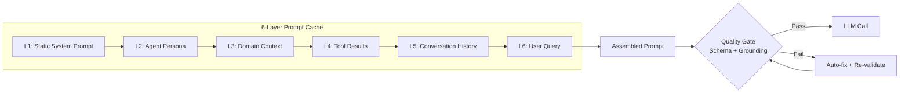
```mermaid
flowchart LR
  subgraph "6-Layer Prompt Cache"
    L1[L1: Static System Prompt]
    L2[L2: Agent Persona]
    L3[L3: Domain Context]
    L4[L4: Tool Results]
    L5[L5: Conversation History]
    L6[L6: User Query]
  end

  L1 --> L2 --> L3 --> L4 --> L5 --> L6
  L6 --> Assembled[Assembled Prompt]
  Assembled --> Validate{Quality Gate<br/>Schema + Grounding}
  Validate -->|Pass| LLM[LLM Call]
  Validate -->|Fail| Fix[Auto-fix + Re-validate]
  Fix --> Validate
```

- **XML structure**: Each prompt template uses `<system>`, `<context>`, `<tools>`, `<constraints>`, and `<output-format>` sections
- **4 schema types**: System prompts, agent prompts, tool-call prompts, and output-formatting prompts, all Zod-validated
- **10 grounding rules** enforce factual accuracy: agents must cite tool outputs, cannot fabricate data, must acknowledge uncertainty, and must include source attribution
- **Quality gates** validate output structure (JSON schema compliance, required field presence, citation coverage) before returning to the orchestrator

### Context Management Architecture

The context management system handles token budget allocation, retrieval-augmented generation, and multi-level caching to maximize the information density within each LLM context window.

#### Token Budget Allocation

The token budget manager dynamically allocates the context window across competing sections based on query type and available information:

- System prompt: 10-15% (fixed ceiling)
- RAG results: 25-40% (scaled by relevance scores)
- Tool outputs: 20-30% (priority-ordered by agent plan)
- Conversation history: 10-20% (sliding window with summarization)
- User query + output buffer: 10-15% (reserved minimum)

#### Hybrid RAG Pipeline

The RAG pipeline combines vector similarity from Pinecone with graph traversal from Neo4j, deduplicates and re-ranks results, then allocates them within the token budget.

#### Context Strategies

| Strategy | Description | Best For |
|----------|-------------|----------|
| `full` | Include all available context up to budget | Simple queries with focused scope |
| `summary` | Summarize long context sections before inclusion | Multi-document queries |
| `sliding-window` | Keep recent N turns plus key historical context | Multi-turn conversations |
| `priority-ranked` | Rank context chunks by relevance and trim lowest | Token-constrained scenarios |
| `hybrid` | Combine summary + priority ranking dynamically | Complex analytical queries |

#### Multi-Level Cache

| Level | Storage | TTL | Hit Rate Target | Use Case |
|-------|---------|-----|-----------------|----------|
| L1 | In-memory LRU | 5 min | >80% | Hot tool results and frequent queries |
| L2 | Redis | 1 hour | >60% | Cross-request sharing and session state |
| L3 | Disk (`.beads/`) | 24 hours | >40% | Session replay and audit trails |

### Beads Architecture & Flywheel Methodology

The Flywheel methodology is the development coordination layer that powers multi-agent work across the EstateWise monorepo. It decomposes work into **beads** — self-contained task units with full context — tracked as a dependency DAG in `.beads/.status.json`.

#### Bead Data Model

```json
{
  "schema": { "version": "2.0.0", "flywheel": true },
  "beads": {
    "ORCH-001": {
      "title": "Define agent registry schema and bootstrap",
      "domain": "orchestration",
      "status": "done",
      "assignedAgent": "claude-opus",
      "priority": "p0",
      "dependsOn": [],
      "description": "Full context for the task...",
      "rationale": "Why this bead exists...",
      "verification": "cd agentic-ai && npm run build && npm run test",
      "artifact": "agentic-ai/src/orchestration/agent-registry.ts",
      "testObligations": ["Agent CRUD", "Circuit breaker transitions"],
      "acceptanceCriteria": ["9 default agents registered", "CB opens after 3 failures"]
    }
  }
}
```

Each bead is fully self-describing: an agent can claim and execute any bead without external briefing. The schema (v2.0) includes `rationale`, `testObligations`, and `acceptanceCriteria` fields that were absent in v1.

#### Domain Taxonomy

| Domain | Code | Scope | Example Beads |
|--------|------|-------|---------------|
| Orchestration | `ORCH` | Supervisor, agent registry, routing, error recovery | ORCH-001 through ORCH-008 |
| Configuration | `CCFG` | Claude Code config, skills, DCG, agent pipeline | CCFG-001 through CCFG-006 |
| Prompts | `PRMT` | System prompts, grounding rules, schemas, caching | PRMT-001 through PRMT-008 |
| MCP | `MCP` | Tool servers, auth, rate limiting, domain scaffolds | MCP-001 through MCP-007 |
| Context | `CTX` | Context engineering, knowledge graph, RAG pipeline | CTX-001+ |
| Cross-cutting | `CROSS` | Integration tests, contract alignment, E2E flows | CROSS-001+ |
| Testing | `TEST` | Test infrastructure, coverage gates, CI integration | TEST-001+ |

#### Bead State Machine

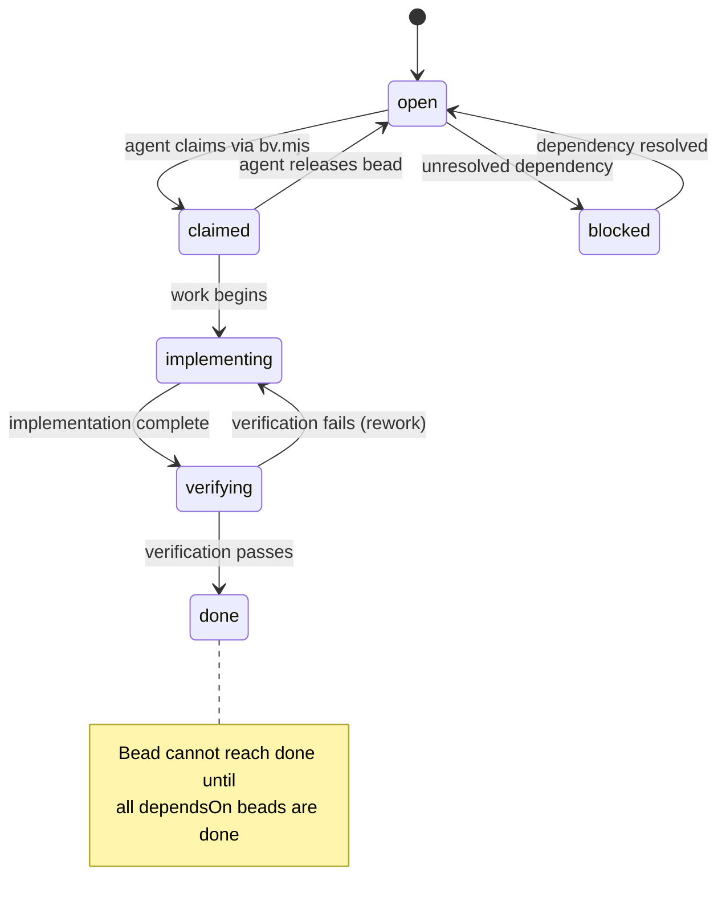
```mermaid
stateDiagram-v2
    [*] --> open
    open --> claimed: agent claims via bv.mjs
    claimed --> implementing: work begins
    implementing --> verifying: implementation complete
    verifying --> done: verification passes
    verifying --> implementing: verification fails (rework)
    open --> blocked: unresolved dependency
    blocked --> open: dependency resolved
    claimed --> open: agent releases bead

    note right of done
      Bead cannot reach done until
      all dependsOn beads are done
    end note
```

#### Graph-Theory Triage (bv.mjs)

The `bv.mjs` tool treats `.beads/.status.json` as a directed graph and applies six algorithms to rank beads by structural importance:

| Algorithm | Purpose | Key Parameter |
|-----------|---------|---------------|
| **PageRank** | Identify beads that many others depend on | damping = 0.85, 100 iterations |
| **Betweenness Centrality** | Find bottleneck beads on the most shortest paths | All-pairs shortest paths |
| **HITS** | Separate hub beads (many outgoing deps) from authority beads (many incoming) | 100 iterations |
| **Critical Path** | Longest dependency chain — determines minimum project duration | Topological traversal |
| **Cycle Detection** | Find circular dependencies that would deadlock execution | DFS-based |
| **Execution Levels** | Group beads into parallel waves for concurrent execution | BFS wavefront |

**Robot flags** (machine-readable output for agent consumption):

```bash
node tools/bv.mjs --robot-triage      # Full graph metrics JSON
node tools/bv.mjs --robot-next        # Single optimal next bead with claim command
node tools/bv.mjs --robot-plan        # Parallel execution tracks (wave-based)
node tools/bv.mjs --robot-insights    # Critical paths, bottlenecks, cycle warnings
node tools/bv.mjs --robot-priority    # Priority-weighted ordering
node tools/bv.mjs claim <bead-id>     # Atomically claim a bead
node tools/bv.mjs complete <bead-id>  # Mark bead done
```

#### Agent Coordination Layer

Multi-agent swarms coordinate through three mechanisms:

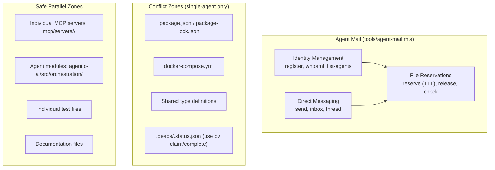
```mermaid
flowchart TD
    subgraph "Agent Mail (tools/agent-mail.mjs)"
        Identity["Identity Management<br/>register, whoami, list-agents"]
        Messaging["Direct Messaging<br/>send, inbox, thread"]
        Reservations["File Reservations<br/>reserve (TTL), release, check"]
    end

    subgraph "Conflict Zones (single-agent only)"
        CZ1["package.json / package-lock.json"]
        CZ2["docker-compose.yml"]
        CZ3["Shared type definitions"]
        CZ4[".beads/.status.json (use bv claim/complete)"]
    end

    subgraph "Safe Parallel Zones"
        SZ1["Individual MCP servers: mcp/servers/<name>/"]
        SZ2["Agent modules: agentic-ai/src/orchestration/"]
        SZ3["Individual test files"]
        SZ4["Documentation files"]
    end

    Identity --> Reservations
    Messaging --> Reservations
```

- **Advisory file locks**: Agents call `agent-mail.mjs reserve <glob> --ttl 3600` before editing. Reservations are advisory (not enforced by filesystem) but checked by well-behaved agents.
- **Crash survival**: All state persists in `.beads/agent-mail/` (agents.json, reservations.json, messages/, threads/). If an agent crashes, any other agent reads the state and resumes.
- **Fungibility**: Every agent is a generalist. No role specialization. If one agent goes down, another picks up its bead via `bv.mjs --robot-next`.

#### Session Memory & Learning

The session memory system (`tools/session-memory.mjs`) closes the flywheel loop by converting session experience into reusable operational knowledge:

| Layer | Storage | Content | Lifecycle |
|-------|---------|---------|-----------|
| **Episodic** | `.beads/session-memory/episodic/` (JSONL) | Raw events: task-start, task-complete, task-fail, decision, discovery, workaround, error, review, handoff | Append-only, immutable |
| **Working** | `.beads/session-memory/working/` (JSON) | Structured session summaries with outcomes and key decisions | Updated per session |
| **Procedural** | `.beads/session-memory/procedural/rules.json` | Distilled rules with confidence scores (candidate → established → proven) | Continuously refined |

Confidence scoring: initial 0.50, +0.10 per helpful confirmation, −0.40 per harmful feedback (4× multiplier), 90-day half-life decay, clamped to [0.01, 0.99].

#### Destructive Command Guard (DCG)

The DCG (`tools/dcg.mjs`) mechanically blocks dangerous operations before they execute. Eleven patterns are blocked including `git reset --hard`, `git clean -fd`, `git push --force`, and `rm -rf /`. Each blocked pattern suggests a safe alternative. Integration: `dcg.mjs --install` adds a git pre-commit hook; `dcg.mjs --check-staged` scans staged files for secrets.

#### Flywheel Invariants

The methodology enforces 9 invariants that every agent must follow:

1. **Plan-first**: Global reasoning belongs in plan space, not scattered across code
2. **Comprehensive plans**: The markdown plan must be comprehensive before coding starts
3. **Self-contained beads**: Plan-to-beads is a distinct translation problem — beads carry all context
4. **Beads as substrate**: Every change maps to a bead; nothing happens outside the bead graph
5. **Convergence over drafts**: Polish beads 4–6 times minimum; first drafts are never final
6. **Fungible agents**: No specialist bottlenecks; any agent can work on any bead
7. **Crash-proof coordination**: AGENTS.md + Agent Mail + beads + bv survive process death
8. **Feedback loop**: Session history feeds back into infrastructure via session-memory
9. **Review is core**: Testing, review, and hardening are part of the method, not afterthoughts

#### Integration with Orchestration & Context

The beads system integrates with three runtime layers:

| Layer | Integration Point | Mechanism |
|-------|-------------------|-----------|
| **Orchestration Engine** | Error recovery | `Bead replay` strategy replays reasoning chains from `.beads/` snapshots for debugging |
| **Context Management** | L3 disk cache | `.beads/` serves as the 24-hour persistent cache layer for session replay and audit |
| **Observability** | Audit trails | Bead state transitions emit structured events consumed by the tracing pipeline |
| **Agent Sessions** | Checkpoint sync | `.agent-sessions/` checkpoints reference active bead IDs for resume-after-crash |

### Observability Architecture

The observability stack provides end-to-end visibility across the orchestration engine, MCP servers, and downstream services using OpenTelemetry-based distributed tracing.

#### Telemetry Pipeline

Traces and metrics flow from instrumented components through an OpenTelemetry collector to storage and visualization backends. Every orchestration step, tool call, and LLM invocation emits a span with structured attributes.

#### Core Metrics

| Metric | Type | Description |
|--------|------|-------------|
| `orchestration.request.latency` | Histogram | End-to-end request duration |
| `orchestration.tool.call.duration` | Histogram | Per-tool call latency |
| `orchestration.token.usage` | Counter | Token consumption per model/agent |
| `orchestration.cache.hit.rate` | Gauge | Cache hit percentage by level |
| `orchestration.error.rate` | Counter | Errors by type and agent |
| `orchestration.agent.utilization` | Gauge | Agent busy/idle ratio |
| `orchestration.cost.per.request` | Histogram | Dollar cost per completed request |
| `orchestration.queue.depth` | Gauge | Pending tasks in orchestration queue |

#### Health Checks

Health check endpoints are exposed for each component: orchestration engine (`/health`), individual MCP domain servers (`/health`), Redis cache (`/health/cache`), and downstream API connectivity (`/health/deps`). Kubernetes liveness and readiness probes are configured to use these endpoints.

## Context Engineering Architecture

The context engineering subsystem (`context-engineering/`) provides AI agents with structured domain knowledge through five interconnected pillars.

<p align="center">
  
</p>

### Context Engineering System Overview

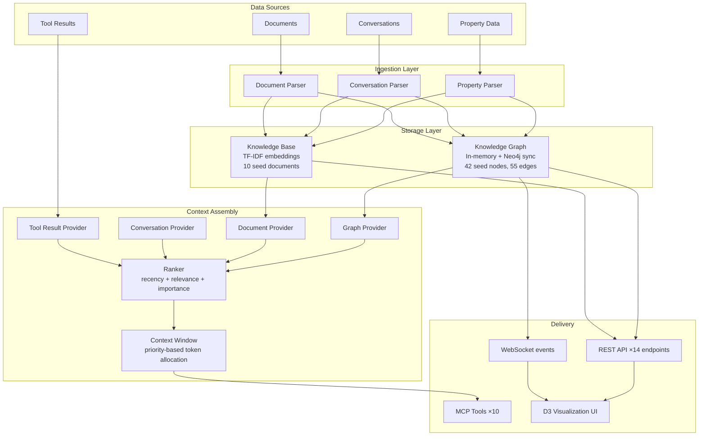
```mermaid
flowchart TB
  subgraph "Data Sources"
    PROP[Property Data]
    CONV[Conversations]
    DOCS[Documents]
    TOOLS[Tool Results]
  end

  subgraph "Ingestion Layer"
    PP[Property Parser]
    CP[Conversation Parser]
    DP[Document Parser]
  end

  subgraph "Storage Layer"
    KG[Knowledge Graph<br/>In-memory + Neo4j sync<br/>42 seed nodes, 55 edges]
    KB[Knowledge Base<br/>TF-IDF embeddings<br/>10 seed documents]
  end

  subgraph "Context Assembly"
    GP[Graph Provider]
    DOP[Document Provider]
    COP[Conversation Provider]
    TRP[Tool Result Provider]
    RANK[Ranker<br/>recency + relevance + importance]
    WIN[Context Window<br/>priority-based token allocation]
  end

  subgraph "Delivery"
    MCP_T[MCP Tools ×10]
    REST[REST API ×14 endpoints]
    WS_T[WebSocket events]
    D3[D3 Visualization UI]
  end

  PROP --> PP --> KG & KB
  CONV --> CP --> KG & KB
  DOCS --> DP --> KG & KB
  TOOLS --> TRP

  KG --> GP
  KB --> DOP

  GP & DOP & COP & TRP --> RANK --> WIN

  WIN --> MCP_T
  KG & KB --> REST --> D3
  KG --> WS_T --> D3
```

### Knowledge Graph Engine

The knowledge graph is an event-driven, in-memory graph with typed nodes and edges, optional Neo4j persistence, and comprehensive traversal algorithms.

```mermaid
graph TD
  subgraph "12 Node Types"
    Property
    Concept
    Entity
    Topic
    Document
    Conversation
    Agent
    Tool
    Workflow
    Neighborhood
    ZipCode
    MarketSegment
  end

  subgraph "Key Relationships"
    Property -- SIMILAR_TO --> Property
    Property -- IN_NEIGHBORHOOD --> Neighborhood
    Property -- IN_ZIP --> ZipCode
    Agent -- USES --> Tool
    Agent -- HAS_CAPABILITY --> Concept
    Tool -- PRODUCES --> Concept
    Concept -- RELATED_TO --> Topic
    Workflow -- DEPENDS_ON --> Tool
    Document -- MENTIONS --> Entity
  end
```

**Graph Algorithms:**

| Algorithm | Purpose | Complexity |
|-----------|---------|------------|
| BFS | Breadth-first traversal | O(V + E) |
| DFS | Depth-first traversal | O(V + E) |
| Dijkstra | Shortest weighted path | O((V + E) log V) |
| All Paths | Enumerate paths up to depth | O(V!) worst case |
| PageRank | Node importance scoring | O(iterations x E) |
| Community Detection | Label propagation clustering | O(iterations x E) |
| Connected Components | Component discovery | O(V + E) |
| Betweenness Centrality | Bridge node identification | O(V x E) |

**Query Builder:**
The fluent query builder supports filter operators (`$gt`, `$lt`, `$gte`, `$lte`, `$eq`, `$ne`, `$contains`, `$in`), dot-path property access, traversal expansion, ordering, and pagination.

### Knowledge Base & Retrieval

| Strategy | Method | Use Case |
|----------|--------|----------|
| Semantic | Cosine similarity on TF-IDF embeddings | Conceptual matches |
| Keyword | Token frequency scoring | Exact term matches |
| Hybrid | Weighted blend (65% semantic, 35% keyword) | Best general-purpose |

The knowledge base auto-chunks documents (~500 tokens with 50-token overlap), generates 128-dimensional TF-IDF embeddings without external APIs, and supports pluggable external embedding functions (e.g., OpenAI).

### Context Assembly Pipeline

```mermaid
sequenceDiagram
  participant Agent as AI Agent
  participant Engine as Context Engine
  participant GP as Graph Provider
  participant DP as Document Provider
  participant CP as Conversation Provider
  participant TP as Tool Result Provider
  participant Ranker
  participant Window as Token Window

  Agent->>Engine: assembleContext(query, agentRole)
  par Parallel Provider Calls
    Engine->>GP: getContext(request)
    Engine->>DP: getContext(request)
    Engine->>CP: getContext(request)
    Engine->>TP: getContext(request)
  end
  GP-->>Engine: graph items
  DP-->>Engine: document items
  CP-->>Engine: conversation items
  TP-->>Engine: tool result items
  Engine->>Ranker: rank(allItems, query, "combined")
  Ranker-->>Engine: scored & sorted items
  Engine->>Window: allocate(rankedItems)
  Window-->>Engine: fitted items within budget
  Engine-->>Agent: AssembledContext
```

**Per-Agent Token Budgets:**

| Agent Role | Max Tokens | Rationale |
|------------|------------|-----------|
| GraphAnalyst | 6,000 | Focused graph queries |
| PropertyAnalyst | 10,000 | Detailed property context |
| FinanceAnalyst | 8,000 | Financial calculations |
| Orchestrator/Coordinator | 12,000 | Broad overview needed |
| Default | 8,000 | Balanced general use |

### Ingestion Pipeline

```mermaid
flowchart LR
  subgraph "Sources"
    S1[Property JSON]
    S2[Conversation Array]
    S3[Raw Document]
  end

  subgraph "Parsers"
    P1[PropertyParser<br/>→ Property, Neighborhood,<br/>ZipCode nodes + edges]
    P2[ConversationParser<br/>→ Conversation nodes<br/>+ mention edges]
    P3[DocumentParser<br/>→ Document, Concept<br/>nodes + edges]
  end

  subgraph "Targets"
    KG[Knowledge Graph]
    KB[Knowledge Base]
  end

  S1 --> P1
  S2 --> P2
  S3 --> P3
  P1 --> KG & KB
  P2 --> KG & KB
  P3 --> KG & KB
```

### Context MCP Tool Integration

| Tool | Description |
|------|-------------|
| `context.search` | Hybrid search across knowledge base |
| `context.assembleForAgent` | Full context window assembly for an agent |
| `context.graphTraverse` | BFS traversal from a starting node |
| `context.graphQuery` | Filter and query graph nodes |
| `context.ingest` | Ingest new data into the knowledge system |
| `context.getStats` | System metrics and statistics |
| `context.getGraphOverview` | Full graph data for visualization |
| `context.findRelated` | Find nodes related to a concept |
| `context.getNodeDetail` | Detailed node information with neighbors |
| `context.getTimeline` | Recent activity timeline |

### D3 Visualization Layer

The context engineering system includes a standalone D3.js visualization dashboard served on port 4200:

- **Force-directed graph** with D3 v7 simulation, 12 color-coded node types, importance-based sizing
- **Interactive controls**: zoom/pan (0.1x-5x), drag, click-to-select, double-click to center
- **Node detail panel** with properties, tags, and clickable neighbor chips
- **Knowledge base search** with scored result cards
- **Real-time metrics** including context assemblies, cache hit rate, ingestion counts
- **WebSocket** integration for live graph mutation events

### Agent Integration

```mermaid
flowchart TB
  subgraph "Agentic AI Orchestrator"
    PLAN[PlannerAgent]
    COORD[CoordinatorAgent]
    CTX[ContextEngineerAgent<br/>NEW]
    ZPID[ZpidFinderAgent]
    PROP[PropertyAnalystAgent]
    GRAPH_A[GraphAnalystAgent]
    FIN[FinanceAnalystAgent]
    REP[ReporterAgent]
  end

  subgraph "Context Engineering"
    CE[Context Engine]
    KG_A[Knowledge Graph]
    KB_A[Knowledge Base]
  end

  subgraph "Blackboard"
    BB[contextData.latest<br/>contextData.related<br/>contextData.graphOverview]
  end

  CTX -->|context.assembleContext| CE
  CTX -->|context.search| KB_A
  CTX -->|context.graphOverview| KG_A
  CE --> BB
  BB --> ZPID & PROP & GRAPH_A & FIN & REP
```

The `ContextEngineerAgent` runs early in the orchestrator loop (after Planner and Coordinator) to:
1. Analyze the current goal and conversation history
2. Assemble relevant context from the knowledge graph and knowledge base
3. Populate `blackboard.contextData` for downstream specialist agents
4. Skip re-assembly when context is already populated

## Frontend Architecture

### Component Hierarchy

```mermaid
graph TD
  App[App Root]
  App --> Layout[Layout]
  Layout --> Nav[Navigation]
  Layout --> Router[Router]

  Router --> Landing[Landing Page]
  Router --> Chat[Chat Page]
  Router --> Insights[Insights Page]
  Router --> Map[Map Page]
  Router --> Viz[Visualizations]
  Router --> Market[Market Insights]

  Chat --> ChatUI[Chat Interface]
  ChatUI --> Messages[Message List]
  ChatUI --> Input[Input Form]
  ChatUI --> Expert[Expert Views]

  Insights --> Tools[Graph Tools]
  Insights --> Calc[Calculators]
  Insights --> ZPID[ZPID Finder]
  Insights --> GlobalGraph[Global Graph View]

  Map --> Leaflet[Leaflet Map]
  Map --> Markers[Property Markers]
  Map --> Controls[Map Controls]
  Map --> ResultsPanel[Results Panel<br/>Snapshot + Top Matches]
  ResultsPanel --> FocusMap[Focus Marker Actions]
```

### State Management

```mermaid
flowchart LR
  subgraph "Client State"
    Local[Local Storage]
    Session[Session Storage]
    React[React State]
    Query[React Query Cache]
  end

  subgraph "Server State"
    API[API Responses]
    SSR[SSR Props]
    Stream[Streaming Updates]
  end

  API --> Query
  Query --> React
  React --> Local
  SSR --> React
  Stream --> React
```

## Infrastructure & Deployment

> [!NOTE]
> **Production-Ready Infrastructure**: EstateWise features enterprise-grade DevOps with advanced deployment strategies, comprehensive monitoring, and multi-cloud support. See [DEVOPS.md](DEVOPS.md) for complete operational documentation.

### Multi-Cloud Architecture

```mermaid
flowchart TB
  subgraph "Source Control"
    GitHub[GitHub Repository]
  end

  subgraph "CI/CD Pipeline"
    Actions[GitHub Actions]
    Travis[Travis CI]
    Jenkins[Jenkins<br/>Primary CI/CD]

    subgraph "Jenkins Stages"
      Security[Security Scanning<br/>5 layers]
      Coverage[Code Coverage]
      Build[Docker Build]
      BGDeploy[Blue-Green Deploy]
      Canary[Canary Deploy]
    end
  end

  subgraph "Container Registry"
    GHCR[GitHub Container Registry]
    ECR[AWS ECR]
    ACR[Azure ACR]
    GAR[Google Artifact Registry]
    OCIR[OCI Container Registry]
  end

  subgraph "Compute Platforms"
    subgraph "AWS"
      ECS[ECS Fargate]
      ALB[Application Load Balancer]
    end

    subgraph "Azure"
      ACA[Container Apps]
      AGW[App Gateway]
    end

    subgraph "GCP"
      CloudRun[Cloud Run]
      GLB[Global Load Balancer]
    end

    subgraph "OCI"
      OCICompute[Compute Instance]
      OCILB[OCI Load Balancer]
    end

    subgraph "Kubernetes"
      K8s[K8s Cluster<br/>EKS/AKS/GKE]
      HPA[Horizontal Pod<br/>Autoscaler]
      PDB[Pod Disruption<br/>Budget]
    end

    subgraph "Edge"
      Vercel[Vercel Platform]
    end
  end

  subgraph "Service Mesh"
    Consul[Consul Mesh]
    Nomad[Nomad Jobs]
  end

  GitHub --> Jenkins
  Jenkins --> Security
  Security --> Coverage
  Coverage --> Build
  Build --> BGDeploy
  Build --> Canary

  Jenkins --> GHCR
  Jenkins --> ECR
  Jenkins --> ACR
  Jenkins --> GAR
  Jenkins --> OCIR

  GHCR --> ECS
  ECR --> ECS
  ACR --> ACA
  GAR --> CloudRun
  OCIR --> OCICompute
  GHCR --> K8s

  BGDeploy --> K8s
  Canary --> K8s

  K8s --> HPA
  K8s --> PDB
  K8s --> Consul
  K8s --> Nomad

  Jenkins --> Vercel

  style Jenkins fill:#D24939,color:#fff
  style BGDeploy fill:#00D084,color:#000
  style Canary fill:#FF6B6B,color:#fff
```

### GitOps Control Plane Architecture

EstateWise uses a dual-controller GitOps architecture with explicit scope boundaries:

- **Argo CD** reconciles core platform applications and Argo-native controllers.
- **Flux CD** reconciles Flagger controller lifecycle and isolated canary workloads.
- **Canonical GitOps repository**:
  - `https://github.com/hoangsonww/EstateWise-Chapel-Hill-Chatbot.git`

```mermaid
flowchart TB
  Repo[GitHub Repo<br/>EstateWise-Chapel-Hill-Chatbot]

  subgraph ArgoCD["Argo CD (argocd namespace)"]
    Root[estatewise-platform-root]
    CoreApp[estatewise-core app]
    RolloutsCtlApp[argo-rollouts controller app]
    RolloutsGovApp[argo-rollouts governance app]
    WorkflowsCtlApp[argo-workflows controller app]
    WorkflowDefsApp[workflow definitions app]
  end

  subgraph Flux["Flux CD (flux-system namespace)"]
    FluxSrc[GitRepository source]
    FluxControllers[estatewise-flux-controllers]
    FluxFlagger[estatewise-flux-flagger]
    FlaggerHelm[flagger HelmRelease]
  end

  subgraph Namespaces["Managed Runtime Namespaces"]
    EstatewiseNs[estatewise]
    RolloutsNs[argo-rollouts]
    WorkflowsNs[argo-workflows]
    DeliveryNs[estatewise-delivery]
    FlaggerNs[flagger-system]
  end

  Repo --> Root
  Root --> CoreApp --> EstatewiseNs
  Root --> RolloutsCtlApp --> RolloutsNs
  Root --> RolloutsGovApp --> RolloutsNs
  Root --> WorkflowsCtlApp --> WorkflowsNs
  Root --> WorkflowDefsApp --> WorkflowsNs

  Repo --> FluxSrc --> FluxControllers --> FlaggerHelm --> FlaggerNs
  FluxSrc --> FluxFlagger --> DeliveryNs
```

### Controller Ownership Boundaries

The control plane is intentionally split to prevent reconciliation contention:

- **Argo CD ownership**
  - `kubernetes/overlays/prod-gitops`
  - `kubernetes/progressive-delivery/argo-rollouts/platform`
  - `kubernetes/workflows/argo-workflows`
- **Flux ownership**
  - `kubernetes/gitops/flux/controllers`
  - `kubernetes/progressive-delivery/flagger`

This model avoids drift loops between Argo CD and Flux and keeps production vs sandbox delivery concerns separated.

### Progressive Delivery Control Loops

EstateWise runs two complementary progressive delivery loops:

1. **Argo Rollouts** for core `estatewise-backend` and `estatewise-frontend` in `estatewise`.
2. **Flagger** for isolated canary validation in `estatewise-delivery`.

```mermaid
flowchart LR
  subgraph Core["Core Production (estatewise)"]
    BR[Rollout: estatewise-backend]
    FR[Rollout: estatewise-frontend]
    BAT[AnalysisTemplates: backend]
    FAT[AnalysisTemplates: frontend]
    BHPA[HPA -> backend rollout]
    FHPA[HPA -> frontend rollout]
  end

  subgraph Sandbox["Canary Sandbox (estatewise-delivery)"]
    FC[Flagger Canary: estatewise-frontend-preview]
    FD[Deployment: estatewise-frontend-preview]
    FM[MetricTemplate]
    FL[flagger-loadtester]
  end

  BR --> BAT
  FR --> FAT
  BHPA --> BR
  FHPA --> FR

  FC --> FD
  FC --> FM
  FC --> FL
```

### Operational Workflow Orchestration

Argo Workflows provides operational gates and scheduled validation:

- `WorkflowTemplate`: `estatewise-progressive-delivery-pipeline`
- `WorkflowTemplate`: `estatewise-ops-toolkit`
- `CronWorkflow`: `estatewise-nightly-smoke`

```mermaid
sequenceDiagram
  participant Cron as CronWorkflow
  participant Wf as WorkflowTemplate
  participant R as Rollouts API
  participant S as estatewise services

  Cron->>Wf: Start nightly smoke run
  Wf->>S: Execute pre-deploy smoke checks
  Wf->>R: Wait for backend Healthy
  Wf->>R: Wait for frontend Healthy
  Wf->>S: Execute post-deploy smoke checks
  Wf-->>Cron: Report success/failure
```

### Advanced Deployment Strategies

EstateWise supports three zero-downtime deployment strategies:

```mermaid
flowchart LR
  subgraph "Blue-Green Deployment"
    direction TB
    Blue[Blue Environment<br/>v1.0.0 - Active]
    Green[Green Environment<br/>v1.1.0 - Standby]
    Switch[Instant Traffic<br/>Switch]

    Blue --> Switch
    Green --> Switch
  end

  subgraph "Canary Deployment"
    direction TB
    Stable[Stable: 90%<br/>v1.0.0]
    Canary1[Canary: 10%<br/>v1.1.0]
    Canary2[Canary: 25%]
    Canary3[Canary: 50%]
    Final[Promoted: 100%]

    Stable --> Canary1
    Canary1 --> Canary2
    Canary2 --> Canary3
    Canary3 --> Final
  end

  subgraph "Rolling Update"
    direction TB
    Pod1[Pod 1: v1.0.0]
    Pod2[Pod 2: v1.0.0]
    Pod3[Pod 1: v1.1.0]
    Pod4[Pod 2: v1.1.0]

    Pod1 --> Pod3
    Pod2 --> Pod4
  end

  style Blue fill:#4A90E2,color:#fff
  style Green fill:#7ED321,color:#000
  style Canary1 fill:#FF6B6B,color:#fff
  style Canary2 fill:#FF6B6B,color:#fff
  style Canary3 fill:#FF6B6B,color:#fff
```

**Deployment Strategy Comparison:**

| Strategy | Rollback Speed | Resource Usage | Risk Level | Best For |
|----------|---------------|----------------|------------|----------|
| **Blue-Green** | Instant (< 1s) | 2x during switch | Low | Major releases |
| **Canary** | Gradual | 1.1-1.5x | Very Low | New features |
| **Rolling** | Re-deploy | 1x | Moderate | Regular updates |

### Deployment Control UI

The `deployment-control/` directory contains a full-featured dashboard for managing deployments across all supported targets and strategies.

- **Web UI** – Vue 3 + Nuxt 3 frontend with Pinia state management.
- **API Server** – Express + TypeScript backend handling deployment requests and job tracking.
- **Features**:
  - Real-time deployment status and logs
  - Blue-Green and Canary deployment workflows
  - Cluster snapshot and health metrics
  - User notifications and alerts
  - TypeScript type safety and accessibility support
  - Hot Module Replacement for rapid development
  - Extensible architecture for future enhancements

To get started, see [deployment-control/README.md](deployment-control/README.md).

<p align="center">
  
</p>

### Infrastructure as Code

```mermaid
graph LR
  subgraph "IaC Tools"
    TF[Terraform]
    CF[CloudFormation]
    Bicep[Azure Bicep]
    DM[Deployment Manager]
    Helm[Helm Charts]
    Kustomize[Kustomize]
  end

  subgraph "Production Resources"
    VPC[Networks & VPC]
    IAM[RBAC & IAM]
    Compute[Compute Resources]
    Storage[Storage & Backups]
    DNS[DNS & CDN]
    Secrets[Secrets Management]
    Monitor[Monitoring Stack]
    Security[Security Policies]
  end

  TF --> VPC
  TF --> IAM
  CF --> Compute
  Bicep --> Storage
  DM --> DNS
  Helm --> Secrets
  Kustomize --> Monitor
  Kustomize --> Security
```

Helm charts live in `helm/estatewise/` and mirror the Kubernetes base manifests with values tuned for CI/CD pipelines and cloud-specific annotations (EKS/AKS/GKE/OCI). Kustomize overlays remain available in `kubernetes/` for environment-specific patching.

### Production Kubernetes Architecture

```mermaid
flowchart TB
  subgraph "Ingress Layer"
    Ingress[NGINX Ingress<br/>TLS Termination]
  end

  subgraph "Application Layer"
    subgraph "Backend Deployment"
      BBlue[Backend Blue<br/>2 replicas]
      BGreen[Backend Green<br/>2 replicas]
      BCanary[Backend Canary<br/>1 replica]
    end

    subgraph "Frontend Deployment"
      FBlue[Frontend Blue<br/>2 replicas]
      FGreen[Frontend Green<br/>2 replicas]
      FCanary[Frontend Canary<br/>1 replica]
    end
  end

  subgraph "Platform Services"
    HPA[Horizontal Pod<br/>Autoscaler]
    PDB[Pod Disruption<br/>Budget]
    NetPol[Network<br/>Policies]
    RBAC[RBAC]
  end

  subgraph "Monitoring Stack"
    Prometheus[Prometheus<br/>Metrics]
    Grafana[Grafana<br/>Dashboards]
    AlertMgr[AlertManager<br/>16 rules]
  end

  subgraph "Operations"
    Backup[MongoDB Backup<br/>CronJob]
    Migration[DB Migration<br/>Job]
    Chaos[Chaos Tests]
  end

  Ingress --> BBlue
  Ingress --> BGreen
  Ingress --> BCanary
  Ingress --> FBlue
  Ingress --> FGreen
  Ingress --> FCanary

  HPA --> BBlue
  HPA --> FBlue
  PDB --> BBlue
  PDB --> FBlue
  NetPol --> BBlue
  NetPol --> FBlue
  RBAC --> BBlue

  Prometheus --> BBlue
  Prometheus --> FBlue
  Grafana --> Prometheus
  AlertMgr --> Prometheus

  style HPA fill:#326CE5,color:#fff
  style PDB fill:#326CE5,color:#fff
  style Prometheus fill:#E6512D,color:#fff
  style Grafana fill:#F46800,color:#fff
```

## Security Architecture

### Defense in Depth

```mermaid
flowchart TB
  subgraph "Network Layer"
    WAF[Web Application Firewall]
    DDoS[DDoS Protection]
    TLS[TLS 1.3]
  end

  subgraph "Application Layer"
    CORS[CORS Policy]
    CSP[Content Security Policy]
    RateLimit[Rate Limiting]
    InputVal[Input Validation]
  end

  subgraph "Authentication Layer"
    JWT[JWT Tokens]
    MFA[Multi-Factor Auth]
    OAuth[OAuth 2.0]
    Sessions[Session Management]
  end

  subgraph "Data Layer"
    Encryption[Encryption at Rest]
    Transit[Encryption in Transit]
    Backup[Backup & Recovery]
    Audit[Audit Logging]
  end

  WAF --> CORS
  DDoS --> RateLimit
  TLS --> InputVal

  CORS --> JWT
  RateLimit --> MFA
  InputVal --> OAuth

  JWT --> Encryption
  Sessions --> Transit
  OAuth --> Backup
  MFA --> Audit
```

### Secret Management

```mermaid
flowchart LR
  subgraph "Development"
    ENV[.env files]
    Git[.gitignore]
  end

  subgraph "CI/CD"
    GHSecrets[GitHub Secrets]
    EnvVars[Environment Variables]
  end

  subgraph "Production"
    Vault[HashiCorp Vault]
    AWS_SM[AWS Secrets Manager]
    Azure_KV[Azure Key Vault]
    GCP_SM[GCP Secret Manager]
  end

  ENV --> GHSecrets
  GHSecrets --> Vault
  GHSecrets --> AWS_SM
  GHSecrets --> Azure_KV
  GHSecrets --> GCP_SM
```

### Code Quality & Security Scanning

EstateWise enforces continuous code quality via **SonarQube** and multi-layer vulnerability scanning via **Snyk** across the entire CI/CD pipeline.

```mermaid
flowchart TB
  subgraph "Static Analysis"
    SQ[SonarQube Scanner]
    QG[Quality Gate<br/>Bugs · Smells · Debt · Coverage]
  end

  subgraph "Snyk Security Layers"
    SCA[SCA<br/>Dependency Vulns]
    SAST[Code SAST<br/>Source Analysis]
    IMG[Container Scan<br/>Image CVEs]
    IAC[IaC Scan<br/>Terraform · K8s · Helm]
  end

  Code[Source Code] --> SQ --> QG
  Code --> SCA
  Code --> SAST
  Images[Docker Images] --> IMG
  Infra[IaC Files] --> IAC

  QG -->|Pass| CI[CI Pipeline Continues]
  SCA -->|No High/Critical| CI
  SAST -->|No High/Critical| CI
  IMG -->|No High/Critical| CI
  IAC -->|No High/Critical| CI
```

**SonarQube** is configured as a multi-module project (`sonar-project.properties`) scanning all 7 services with per-module source/test/exclusion paths. A local SonarQube 10 Community server is available via `docker compose -f docker/compose.sonarqube.yml up -d`.

**Snyk** provides four scanning dimensions:

| Layer | Target | Trigger |
|-------|--------|---------|
| SCA | `package.json` dependency trees | Every CI build |
| Code SAST | TypeScript/JavaScript source | Every CI build |
| Container | Built Docker images (OS + app layers) | Post-build stage |
| IaC | Terraform, Kubernetes, Helm, Docker Compose | Every CI build |

Per-service policies in `.snyk.d/` allow granular ignore/patch rules. Both tools gate Jenkins and CodeBuild pipelines — builds fail on quality gate violations or critical vulnerabilities.

## Monitoring & Observability

EstateWise operates a dual observability stack: **Prometheus + Grafana** for Kubernetes infrastructure metrics and **Datadog** for full-stack APM, centralized logs, monitors, SLOs, dashboards, and synthetic checks.

### Metrics Collection

```mermaid
flowchart LR
  subgraph "Application Metrics"
    Express[Express Middleware]
    Custom[Custom Metrics]
    Business[Business KPIs]
  end

  subgraph "System Metrics"
    CPU[CPU Usage]
    Memory[Memory Usage]
    Disk[Disk I/O]
    Network[Network I/O]
  end

  subgraph "Collectors"
    Prometheus[Prometheus]
    CloudWatch[CloudWatch]
    Datadog[Datadog Agent]
  end

  subgraph "Visualization & Alerting"
    Grafana[Grafana]
    DDDash[Datadog Dashboard]
    DDMonitors[Datadog Monitors]
    Alerts[Alert Manager]
  end

  Express --> Prometheus
  Custom --> Prometheus
  Business --> Prometheus

  Express --> Datadog
  Custom --> Datadog

  CPU --> CloudWatch
  Memory --> CloudWatch
  Disk --> Datadog
  Network --> Datadog

  Prometheus --> Grafana
  CloudWatch --> Grafana
  Datadog --> DDDash
  Datadog --> DDMonitors
  DDMonitors --> Alerts
```

### Datadog Observability Stack

Datadog provides end-to-end production observability across all EstateWise services. The integration spans Terraform (AWS ECS), Helm (Kubernetes), Docker Compose, and deployment-control.

```mermaid
flowchart TB
  subgraph App["Application Layer"]
    BE["Backend<br/>estatewise-backend"]
    FE["Frontend<br/>estatewise-frontend"]
    GRPC["gRPC<br/>estatewise-grpc"]
    MCP["MCP Server<br/>estatewise-mcp"]
    AI["Agentic AI<br/>estatewise-agentic-ai"]
    DC["Deployment Control<br/>DogStatsD Metrics"]
  end

  subgraph Agent["Datadog Agent Layer"]
    direction LR
    NodeAgent["Node Agent<br/>(DaemonSet)"]
    ClusterAgent["Cluster Agent<br/>(Deployment)"]
  end

  subgraph Intake["Datadog Cloud"]
    APM["APM Service Map"]
    LogMgmt["Log Management"]
    Monitors["17 Monitors<br/>Error Rate / Latency / Crash Loop<br/>Memory / CPU / ALB / Deploy"]
    SLOs["SLOs<br/>99.9% Availability<br/>95% Latency < 500ms"]
    Dashboard["Production Dashboard<br/>Infra / App / ALB / Logs / DB"]
    Synthetics["Synthetic Checks<br/>3 AWS Regions"]
  end

  BE & FE & GRPC & MCP & AI -->|"APM traces (TCP/8126)"| NodeAgent
  BE & FE & GRPC & MCP & AI -->|"logs (stdout)"| NodeAgent
  DC -->|"DogStatsD (UDP/8125)"| NodeAgent
  NodeAgent -->|metadata| ClusterAgent
  ClusterAgent -->|HPA external metrics| App
  NodeAgent -->|"HTTPS/443"| Intake
```

**Deployment Targets:**

| Target | Config Location | Resources Managed |
|--------|----------------|-------------------|
| Terraform | `terraform/datadog.tf` | ECS/ALB monitors, dashboard, SLOs, synthetic checks, downtime schedules |
| Helm | `helm/estatewise/templates/datadog-*.yaml` | Agent DaemonSet, Cluster Agent, monitors ConfigMap, NetworkPolicies |
| Kubernetes | `kubernetes/monitoring/datadog-*.yaml` | Standalone agent + monitor manifests (non-Helm) |
| Docker Compose | `docker/compose.prod.yml` | `datadog-agent` service, DD env on all app services |
| Deployment Control | `deployment-control/src/datadog.ts` | Deploy events + DogStatsD custom metrics |

**Custom DogStatsD Metrics (Deployment Control):**

| Metric | Type | Description |
|--------|------|-------------|
| `estatewise.deploy.started` | Counter | Deployment initiated |
| `estatewise.deploy.finished` | Counter | Deployment completed |
| `estatewise.deploy.success` | Counter | Successful deployments |
| `estatewise.deploy.failure` | Counter | Failed deployments |
| `estatewise.deploy.duration_seconds` | Histogram | Deploy wall-clock time |

For full setup, architecture diagrams, and operational runbooks, see 📘 [docs/datadog-integration.md](docs/datadog-integration.md).

### Distributed Tracing

```mermaid
sequenceDiagram
  participant Client
  participant API
  participant Auth
  participant Property
  participant Pinecone
  participant MongoDB

  Client->>API: Request [trace-id: abc123]
  API->>Auth: Validate [parent: abc123]
  Auth->>MongoDB: Query User [parent: abc123]
  MongoDB-->>Auth: User Data
  Auth-->>API: Authorized
  API->>Property: Search [parent: abc123]
  Property->>Pinecone: Vector Query [parent: abc123]
  Pinecone-->>Property: Results
  Property-->>API: Properties
  API-->>Client: Response [trace-id: abc123]
```

## Performance Optimization

### Caching Strategy

```mermaid
flowchart TB
  subgraph "Cache Layers"
    Browser[Browser Cache]
    CDN[CDN Cache]
    Redis[Redis Cache]
    App[Application Cache]
    DB[Database Cache]
  end

  subgraph "Cache Policies"
    TTL[TTL Settings]
    Invalidation[Cache Invalidation]
    Warming[Cache Warming]
  end

  Browser --> CDN
  CDN --> Redis
  Redis --> App
  App --> DB

  TTL --> Browser
  TTL --> CDN
  TTL --> Redis

  Invalidation --> Redis
  Invalidation --> App

  Warming --> Redis
  Warming --> DB
```

### Load Balancing

```mermaid
flowchart LR
  subgraph "Load Distribution"
    Client[Clients]
    LB[Load Balancer]

    subgraph "Backend Instances"
      API1[API Server 1]
      API2[API Server 2]
      API3[API Server 3]
    end

    subgraph "gRPC Services"
      GRPC1[gRPC Server 1]
      GRPC2[gRPC Server 2]
    end
  end

  Client --> LB
  LB -->|Round Robin| API1
  LB -->|Health Check| API2
  LB -->|Least Connections| API3

  API1 --> GRPC1
  API2 --> GRPC2
  API3 --> GRPC1
```

## Testing Strategy

### Test Pyramid

```mermaid
graph TD
  subgraph "Test Types"
    E2E[E2E Tests<br/>Cypress, Selenium]
    Integration[Integration Tests<br/>API, Database]
    Unit[Unit Tests<br/>Jest, Vitest]
    Static[Static Analysis<br/>ESLint, TypeScript]
  end

  subgraph "Coverage"
    UI[UI: 70%]
    API[API: 85%]
    Business[Business Logic: 90%]
    Utils[Utilities: 95%]
  end

  E2E --> UI
  Integration --> API
  Unit --> Business
  Static --> Utils
```

### CI/CD Pipeline

```mermaid
flowchart LR
  subgraph "Pipeline Stages"
    Trigger[Git Push]
    Lint[Lint & Format]
    Types[Type Check]
    Test[Run Tests]
    Build[Build Images]
    Scan[Security Scan]
    Deploy[Deploy]
    Verify[Smoke Tests]
  end

  Trigger --> Lint
  Lint --> Types
  Types --> Test
  Test --> Build
  Build --> Scan
  Scan --> Deploy
  Deploy --> Verify
```

## Data Models

### Core Entities

```mermaid
erDiagram
  USER ||--o{ CONVERSATION : "owns"
  USER ||--o{ SAVED_PROPERTY : "saves"
  CONVERSATION ||--o{ MESSAGE : "contains"
  MESSAGE ||--o{ RATING : "has"
  PROPERTY ||--o{ LISTING : "has"
  PROPERTY }o--|| ZIP : "in"
  PROPERTY }o--|| NEIGHBORHOOD : "in"
  PROPERTY ||--o{ PROPERTY : "similar_to"

  USER {
    string id PK
    string email UK
    string password_hash
    string name
    datetime created_at
    datetime updated_at
  }

  CONVERSATION {
    string id PK
    string user_id FK
    string title
    datetime created_at
    datetime updated_at
  }

  MESSAGE {
    string id PK
    string conversation_id FK
    string role
    string content
    json metadata
    datetime created_at
  }

  PROPERTY {
    string zpid PK
    float price
    int bedrooms
    int bathrooms
    float living_area
    int year_built
    string address
    float latitude
    float longitude
    json features
  }

  ZIP {
    string code PK
    string city
    string state
    json demographics
  }

  NEIGHBORHOOD {
    string id PK
    string name
    json stats
    json amenities
  }
```

### Graph Schema (Neo4j)

```cypher
// Node types
(:Property {zpid, address, city, state, zipcode, price, bedrooms, bathrooms})
(:Zip {code})
(:Neighborhood {name})

// Relationships
(:Property)-[:IN_ZIP]->(:Zip)
(:Property)-[:IN_NEIGHBORHOOD]->(:Neighborhood)
(:Property)-[:SIMILAR_TO {score}]->(:Property)
```

## Environment Configuration

### Environment Variables Matrix

| Service | Required Variables | Optional Variables |
|---------|-------------------|-------------------|
| **Backend** | `MONGO_URI`<br>`JWT_SECRET`<br>`PINECONE_API_KEY`<br>`PINECONE_INDEX`<br>`GOOGLE_AI_API_KEY` | `NEO4J_URI`<br>`NEO4J_USERNAME`<br>`NEO4J_PASSWORD`<br>`REDIS_URL`<br>`SENTRY_DSN` |
| **Frontend** | `NEXT_PUBLIC_API_BASE_URL` | `NEXT_PUBLIC_GOOGLE_ANALYTICS`<br>`NEXT_PUBLIC_SENTRY_DSN` |
| **gRPC** | `GRPC_SERVER_PORT`<br>`GRPC_SERVER_HOST` | `GRPC_USE_TLS`<br>`GRPC_CERT_PATH`<br>`GRPC_KEY_PATH` |
| **MCP** | `API_BASE_URL` | `FRONTEND_BASE_URL`<br>`LOG_LEVEL` |
| **Agentic** | `GOOGLE_AI_API_KEY` or `OPENAI_API_KEY` | `AGENT_RUNTIME`<br>`THREAD_ID`<br>`LANGSMITH_ENABLED`<br>`LANGSMITH_API_KEY`<br>`LANGSMITH_PROJECT`<br>`LANGSMITH_ENDPOINT`<br>`LANGSMITH_RUN_TAGS`<br>`LANGSMITH_STRICT` |

## Performance Targets & SLOs

### Service Level Objectives

| Metric | Target | Critical Threshold |
|--------|--------|-------------------|
| **API Latency (P50)** | < 200ms | < 500ms |
| **API Latency (P95)** | < 800ms | < 2000ms |
| **API Latency (P99)** | < 1500ms | < 5000ms |
| **Availability** | 99.9% | 99.5% |
| **Error Rate** | < 0.1% | < 1% |
| **Chat Response Time** | < 3s | < 10s |
| **Map Load Time** | < 2s | < 5s |
| **Graph Query Time** | < 1.5s | < 3s |
| **Vector Search Time** | < 500ms | < 1500ms |

### Scalability Targets

- **Concurrent Users**: 10,000+
- **Requests per Second**: 1,000+
- **Database Connections**: 100 pooled
- **Message Queue Throughput**: 10,000 msg/s
- **Vector Index Size**: 1M+ embeddings
- **Graph Nodes**: 100K+ properties

## Disaster Recovery

### Backup Strategy

```mermaid
flowchart TB
  subgraph "Backup Types"
    Continuous[Continuous Replication]
    Daily[Daily Snapshots]
    Weekly[Weekly Archives]
    Monthly[Monthly Archives]
  end

  subgraph "Storage Locations"
    Primary[Primary Region]
    Secondary[Secondary Region]
    Cold[Cold Storage]
  end

  subgraph "Recovery"
    RTO[RTO: 4 hours]
    RPO[RPO: 1 hour]
    Test[Monthly DR Tests]
  end

  Continuous --> Primary
  Daily --> Primary
  Weekly --> Secondary
  Monthly --> Cold

  Primary --> RTO
  Secondary --> RPO
  Cold --> Test
```

### Failover Process

1. **Detection**: Health checks detect primary failure
2. **Validation**: Confirm failure isn't transient
3. **DNS Update**: Update DNS to point to secondary
4. **Cache Warm**: Warm caches in secondary region
5. **Verification**: Run smoke tests
6. **Communication**: Notify stakeholders

## Development Workflow

### Git Flow

```mermaid
gitGraph
  commit id: "main"
  branch develop
  checkout develop
  commit id: "feature-start"
  branch feature/new-feature
  checkout feature/new-feature
  commit id: "feature-work"
  commit id: "feature-done"
  checkout develop
  merge feature/new-feature
  branch release/v1.0
  checkout release/v1.0
  commit id: "release-prep"
  checkout main
  merge release/v1.0 tag: "v1.0.0"
  checkout develop
  merge main
```

### Code Review Process

1. **Branch Creation**: Feature branch from develop
2. **Development**: Implement feature with tests
3. **Pre-commit**: Lint, format, type-check
4. **Pull Request**: Open PR with description
5. **CI Checks**: Automated tests and scans
6. **Review**: Code review by 1+ developers
7. **Approval**: Required approvals obtained
8. **Merge**: Squash and merge to develop

## Future Roadmap

### Planned Enhancements

- **GraphQL API**: Add GraphQL endpoint for flexible queries
- **WebSocket Support**: Real-time property updates
- **Mobile Apps**: Native iOS and Android applications
- **AI Improvements**:
  - Fine-tuned property valuation models
  - Computer vision for property images
  - Natural language property search
- **Blockchain Integration**: Property ownership verification
- **AR/VR Features**: Virtual property tours
- **International Expansion**: Multi-region support

### Technical Debt

- Migrate from Express to Fastify for better performance
- Implement event sourcing for audit trail
- Extend LangSmith tracing with OpenTelemetry export bridge
- Improve test coverage to 90%+
- Optimize bundle sizes
- Implement progressive web app (PWA) features

## Appendix

### Glossary

- **RAG**: Retrieval-Augmented Generation
- **MoE**: Mixture of Experts
- **CoT**: Chain-of-Thought
- **MCP**: Model Context Protocol
- **A2A**: Agent-to-Agent Communication Protocol
- **ZPID**: Zillow Property ID
- **kNN**: k-Nearest Neighbors
- **TTL**: Time To Live
- **RTO**: Recovery Time Objective
- **RPO**: Recovery Point Objective
- **SLO**: Service Level Objective
- **Context Engineering**: The discipline of designing systems that supply AI agents with the right information at the right time via knowledge graphs, retrieval pipelines, and token-aware context assembly

### References

- [EstateWise API Documentation](https://estatewise-backend.vercel.app/api-docs)
- [Frontend Repository](https://github.com/hoangsonww/EstateWise-Chapel-Hill-Chatbot)
- [Technical Documentation](TECH_DOCS.md)
- [Deployment Guide](DEPLOYMENTS.md)
- [gRPC & tRPC Documentation](GRPC_TRPC.md)
- [RAG Architecture Overview](RAG_SYSTEM.md)
- [Context Engineering Documentation](context-engineering/README.md)

---

*This architecture document is maintained alongside the codebase. Last updated: March 18, 2026*
