# EstateWise Deployment Reference

EstateWise ships with five production-grade deployment tracks so you can choose the cloud that best fits your stack:

1. **AWS** – ECS on Fargate behind an ALB with CodePipeline / CodeBuild CI/CD.
2. **Azure** – Azure Container Apps + Key Vault, driven by Bicep modules and Azure DevOps.
3. **Google Cloud** – Cloud Run with Cloud Build, Artifact Registry, and VPC Access.
4. **Oracle Cloud (OCI)** – Terraform-based VCN, compute, optional load balancer, OCIR images, and Docker Compose runtime.
5. **HashiCorp Platform** – Terraform-orchestrated Kubernetes (EKS/AKS/GKE or self-managed) with Consul service mesh and Nomad batch runners.

In addition, the monorepo already supports **Vercel** deployments for the frontend (and optional backend edge functions) for teams that prefer Vercel’s serverless workflow.

> [!TIP]
> Mixed deployments are fully supported: for example run the backend on AWS while exposing the frontend on Vercel, or use the HashiCorp stack for internal tooling while shipping the public experience via Cloud Run.

It also supports advanced deployment strategies like **Blue-Green** and **Canary** deployments for zero-downtime releases and safe progressive delivery.

The Kubernetes production path now includes an enterprise GitOps control plane with:

- **Argo CD** for app-of-apps orchestration and core platform reconciliation.
- **Argo Rollouts** for core backend/frontend progressive delivery.
- **Flux CD + Flagger** for isolated canary experimentation in a dedicated delivery namespace.
- **Argo Workflows** for rollout gating, scheduled smoke tests, and operational automation.

> [!IMPORTANT]
> **NEW**: GitLab CI/CD is now also supported out of the box via `.gitlab-ci.yml`, mirroring the Jenkins flow and wiring directly into the Kubernetes blue/green and canary scripts through `gitlab/deploy.sh`.

For more information on EstateWise DevOps, CI/CD pipelines, monitoring, and troubleshooting, see 📘 [DEVOPS.md](DEVOPS.md).

---

## Table of Contents

- [EstateWise Deployment Reference](#estatewise-deployment-reference)
  - [Table of Contents](#table-of-contents)
  - [High-Level Architecture](#high-level-architecture)
  - [Advanced Deployment Strategies](#advanced-deployment-strategies)
    - [Available Strategies](#available-strategies)
    - [Blue-Green Deployments](#blue-green-deployments)
    - [Canary Deployments](#canary-deployments)
    - [Documentation](#documentation)
  - [Kubernetes GitOps Control Plane (Recommended)](#kubernetes-gitops-control-plane-recommended)
    - [Controller Ownership Model](#controller-ownership-model)
    - [Bootstrap and Validation Flow](#bootstrap-and-validation-flow)
  - [Progressive Delivery Runtime](#progressive-delivery-runtime)
  - [Argo Workflows Operations Runtime](#argo-workflows-operations-runtime)
  - [Deployment Control UI](#deployment-control-ui)
  - [AWS Deployment](#aws-deployment)
  - [Azure Deployment](#azure-deployment)
  - [Google Cloud Deployment](#google-cloud-deployment)
  - [Oracle Cloud Deployment](#oracle-cloud-deployment)
  - [HashiCorp + Kubernetes Stack](#hashicorp--kubernetes-stack)
  - [Agentic AI Orchestrator](#agentic-ai-orchestrator)
  - [MCP Server](#mcp-server)
  - [Vercel Frontend/Backend](#vercel-frontendbackend)
  - [CI/CD Integration](#cicd-integration)
    - [Jenkins](#jenkins)
      - [Multi-Cloud Deployment Toggles](#multi-cloud-deployment-toggles)
      - [Advanced Deployment Strategy Toggles](#advanced-deployment-strategy-toggles)
    - [GitHub Actions](#github-actions)
    - [GitLab CI](#gitlab-ci)
    - [Azure DevOps (Optional)](#azure-devops-optional)
  - [Choosing the Right Path](#choosing-the-right-path)
  - [Reference Commands](#reference-commands)

---

## High-Level Architecture

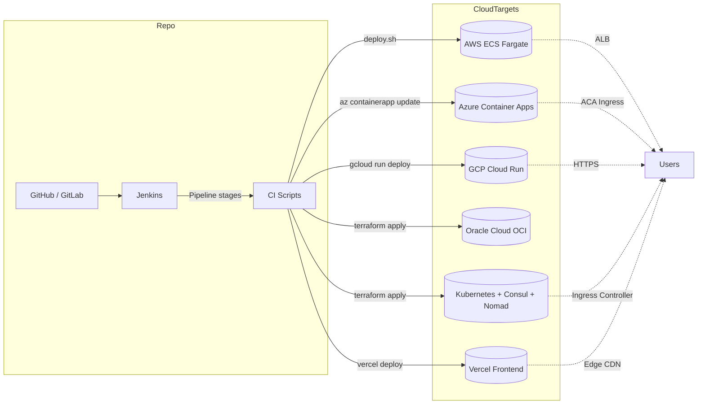

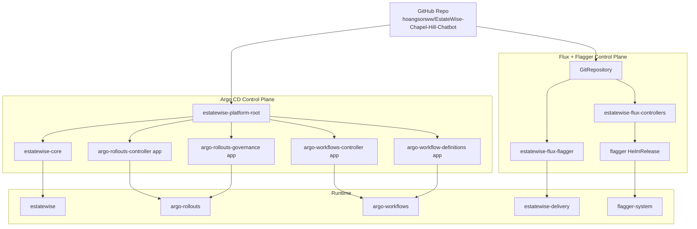

Each target shares the same containers and environment variables – only the infrastructure wrapper changes.

---

## Advanced Deployment Strategies

EstateWise now supports enterprise-grade deployment strategies for zero-downtime deployments and safe progressive delivery.

### Available Strategies

| Strategy | Use Case | Risk Level | Rollback Speed |
|----------|----------|------------|----------------|
| **Blue-Green** | Major releases, complete environment swap | Low | Instant |
| **Canary** | Progressive rollout with real user testing | Very Low | Gradual |
| **Rolling Update** | Standard updates, patches | Moderate | Re-deploy |

### Blue-Green Deployments

Blue-Green deployment maintains two identical production environments. Deploy to the inactive environment, test thoroughly, then instantly switch traffic.

**Quick Start:**

```bash
# Via Jenkins - set environment variables:
DEPLOY_BLUE_GREEN=1
BLUE_GREEN_SERVICE=backend
AUTO_SWITCH_BLUE_GREEN=false

# Manual execution:
./kubernetes/scripts/blue-green-deploy.sh backend \
  ghcr.io/your-org/estatewise-app-backend:v1.2.3
```

**Key Features:**
- ✅ Instant rollback capability
- ✅ Full environment testing before traffic switch
- ✅ Zero-downtime deployments
- ⚠️ Requires 2x resources during transition

### Canary Deployments

Canary deployment gradually shifts traffic from stable to new version, starting with a small percentage of users and progressively increasing.

**Quick Start:**

```bash
# Via Jenkins - set environment variables:
DEPLOY_CANARY=1
CANARY_SERVICE=backend
CANARY_STAGES=10,25,50,75,100
CANARY_STAGE_DURATION=120

# Manual execution:
./kubernetes/scripts/canary-deploy.sh backend \
  ghcr.io/your-org/estatewise-app-backend:v1.2.3
```

**Canary Stages:**
1. **10%** - Initial canary with 1 replica (Very Low Risk)
2. **25%** - Expanded testing (Low Risk)
3. **50%** - Half traffic to new version (Moderate Risk)
4. **75%** - Majority traffic (Moderate-High Risk)
5. **100%** - Full rollout (Promoted to Stable)

**Key Features:**
- ✅ Real production testing with minimal user impact
- ✅ Automated health checks and metrics validation
- ✅ Progressive rollout with manual approval gates
- ✅ Automatic rollback on health check failures

### Documentation

For comprehensive guides on deployment strategies, CI/CD pipelines, monitoring, and troubleshooting, see:

📘 **[DEVOPS.md](DEVOPS.md)** - Complete DevOps and deployment strategy guide

---

## Kubernetes GitOps Control Plane (Recommended)

For production Kubernetes deployments, the recommended path is the GitOps control plane under `kubernetes/gitops/`.

- Argo CD manifests: `kubernetes/gitops/argocd/`
- Flux manifests: `kubernetes/gitops/flux/`
- Core production overlay: `kubernetes/overlays/prod-gitops/`
- Canonical repo URL:
  - `https://github.com/hoangsonww/EstateWise-Chapel-Hill-Chatbot.git`

### Controller Ownership Model

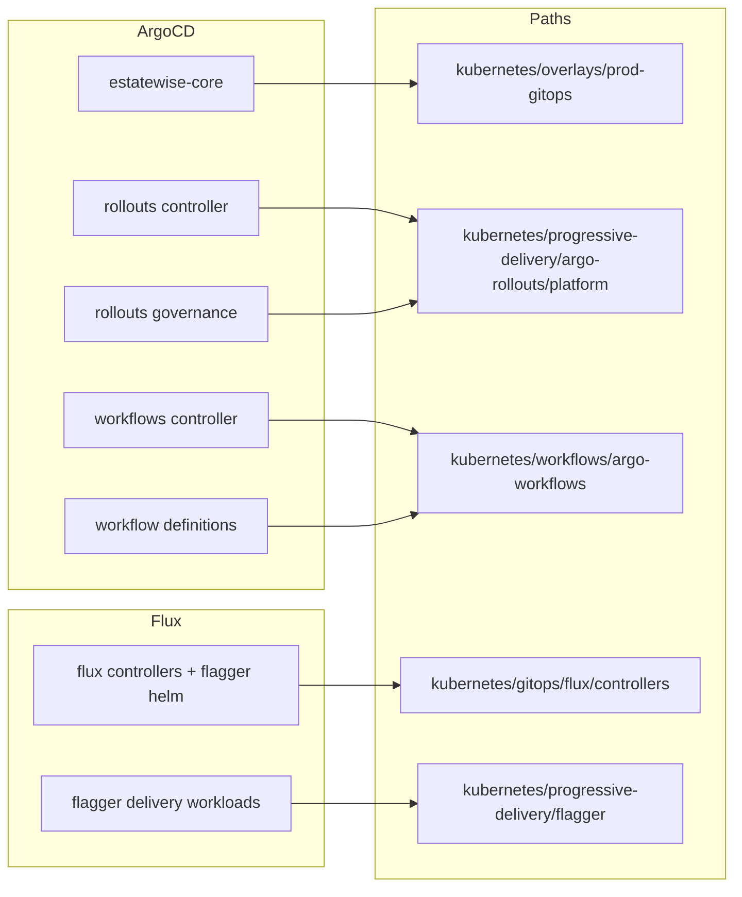

Argo CD and Flux must not reconcile the same resources. The repository layout already enforces this split.

### Bootstrap and Validation Flow

```bash
# 1) Install/apply control planes
bash kubernetes/gitops/bootstrap.sh

# 2) Validate rendering + source URL policy
bash kubernetes/gitops/preflight.sh
```

`preflight.sh` validates:

- all key Kustomize entrypoints render cleanly,
- repo/source URL policy is respected,
- control-plane manifests remain internally consistent before sync.

---

## Progressive Delivery Runtime

EstateWise uses two progressive-delivery runtimes in production:

1. **Argo Rollouts** for core workloads in `estatewise`.
2. **Flagger** for preview canary analysis in `estatewise-delivery`.

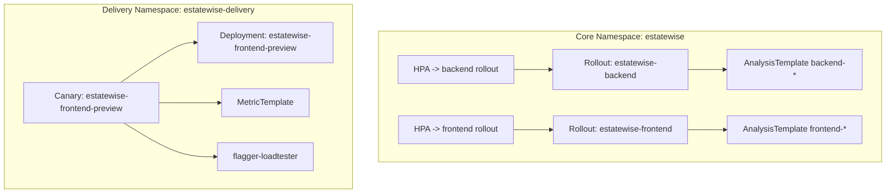

This architecture supports production-safe experimentation without interfering with core backend/frontend rollouts.

---

## Argo Workflows Operations Runtime

Argo Workflows in `argo-workflows` provides reusable operational automation:

- `WorkflowTemplate`: `estatewise-progressive-delivery-pipeline`
- `WorkflowTemplate`: `estatewise-ops-toolkit`
- `CronWorkflow`: `estatewise-nightly-smoke`

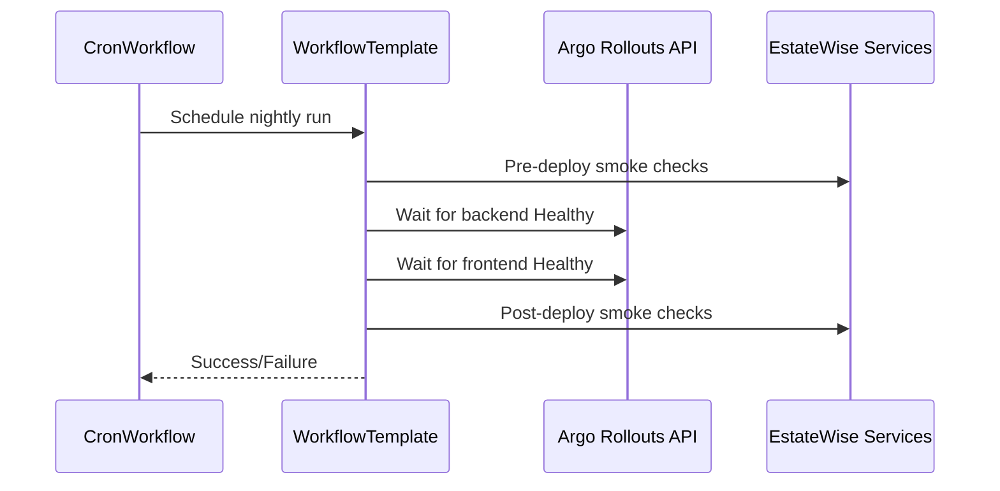

Namespace governance (Pod Security labels, quotas, limit ranges) is codified for `argo-workflows`, `argo-rollouts`, `flagger-system`, and `estatewise-delivery`.

---

## Deployment Control UI

The `deployment-control/` directory contains a full-featured dashboard for managing deployments across all supported targets and strategies.

- **Web UI** – Vue 3 + Nuxt 3 frontend with Pinia state management.
- **API Server** – Express + TypeScript backend handling deployment requests and job tracking.
- **Features**:
  - Real-time deployment status and logs
  - Blue-Green and Canary deployment workflows
  - Cluster snapshot and health metrics
  - User notifications and alerts
  - TypeScript type safety and accessibility support
  - Hot Module Replacement for rapid development
  - Extensible architecture for future enhancements

To get started, see [deployment-control/README.md](deployment-control/README.md).

<p align="center">
  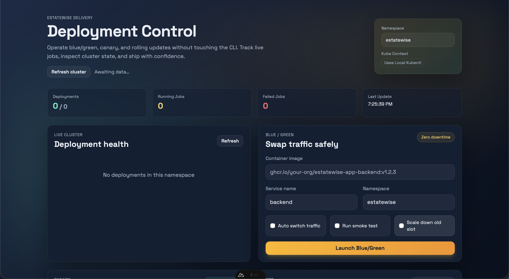
</p>

---

## AWS Deployment

Path: [`aws/`](aws/README.md)

**Stack highlights**
- `cloudformation/vpc.yaml`: opinionated VPC (public/private subnets, NAT, optional flow logs).
- `cloudformation/ecs-service.yaml`: Fargate service with Secrets Manager wiring, CloudWatch logs, autoscaling.
- `codepipeline.yaml`: secure S3 artifact store, CodeBuild image pipeline, ECS blue/green deploy.
- `deploy.sh`: end-to-end helper that also provisions DocumentDB.

**Quick start**
```bash
cd aws
make deploy-vpc
dgn=$(aws cloudformation describe-stacks --stack-name estatewise-vpc --query 'Stacks[0].Outputs')
make deploy-iam
make deploy-alb VpcId=<vpc-id> PublicSubnetIds=<subnet-a,subnet-b>
make deploy-ecs-cluster
make deploy-ecs-service \
  CLUSTER_NAME=estatewise-ecs-cluster \
  EXECUTION_ROLE_ARN=<role-arn> \
  CONTAINER_IMAGE=<account>.dkr.ecr.us-east-1.amazonaws.com/estatewise-backend:latest \
  SUBNET_IDS=<private-a,private-b> \
  SECURITY_GROUP_IDS=<sg-id> \
  TARGET_GROUP_ARN=<tg-arn> \
  MONGO_SECRET_ARN=<secret-arn> \
  JWT_SECRET_ARN=<secret-arn> \
  GOOGLE_SECRET_ARN=<secret-arn> \
  PINECONE_SECRET_ARN=<secret-arn>
```

**Mermaid – AWS flow**
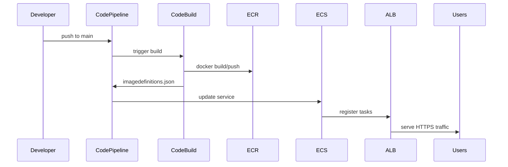

---

## Azure Deployment

Path: [`azure/`](azure/README.md)

**Stack highlights**
- Modular Bicep: network, Log Analytics/App Insights, data tier (ACR + Cosmos + Storage), Key Vault, Container Apps environment.
- `azure/deploy.sh`: orchestrates Bicep deployment, builds/pushes to ACR, updates Container App revision.
- Azure DevOps pipeline (`azure/azure-pipelines.yml`) for automated builds.

**Quick start**
```bash
az login
./azure/deploy.sh \
  --resource-group estatewise-rg \
  --location eastus \
  --env estatewise \
  --image-tag $(git rev-parse --short HEAD) \
  --jwt-secret <jwt> \
  --google-ai-api-key <gemini> \
  --pinecone-api-key <pinecone>
```

**Mermaid – Azure flow**
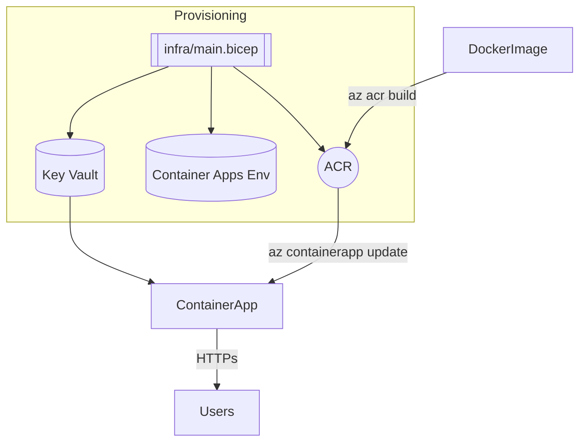

---

## Google Cloud Deployment

Path: [`gcp/`](gcp/README.md)

**Stack highlights**
- Deployment Manager configs for VPC + NAT + Serverless VPC connector, Cloud Run service, service account roles, storage bucket.
- `cloudbuild.yaml` pipeline: npm ci + tests → docker build/push → Cloud Run deploy using secrets.
- `gcp/deploy.sh`: optional helper to run Deployment Manager + Cloud Build from a workstation or CI node.

**Quick start**
```bash
./gcp/deploy.sh \
  --project <PROJECT_ID> \
  --region us-east1 \
  --service-account estatewise-run@<PROJECT_ID>.iam.gserviceaccount.com
```

**Mermaid – GCP flow**
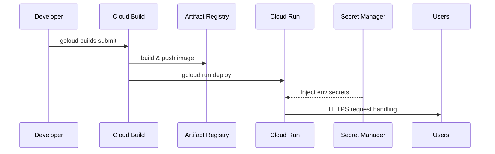

---

## Oracle Cloud Deployment

Path: [`oracle-cloud/`](oracle-cloud/README.md)

**Stack highlights**
- Terraform creates VCN, public/private subnets, NAT/IGW, NSGs, compute instance, and optional OCI Load Balancer.
- Docker Compose runs backend and optional agentic-ai services from OCIR images.
- Designed for production use with flex shapes and load balancer support.

**Quick start**
```bash
cp oracle-cloud/terraform/terraform.tfvars.example oracle-cloud/terraform/terraform.tfvars
cd oracle-cloud/terraform
terraform init
terraform apply
```

**Mermaid – OCI flow**
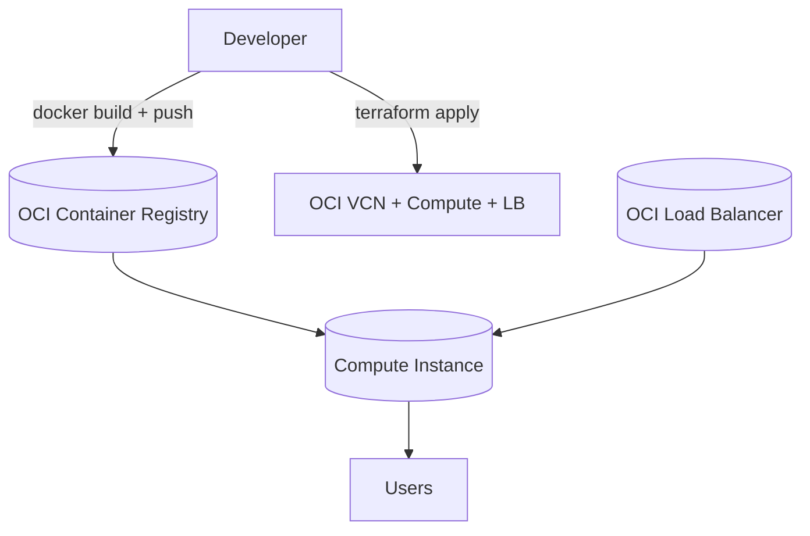

---

## HashiCorp + Kubernetes Stack

Path: [`hashicorp/`](hashicorp/README.md) and [`kubernetes/`](kubernetes/README.md)

**Stack highlights**
- Terraform modules that install Consul and Nomad via Helm charts on any Kubernetes cluster (EKS, AKS, GKE, or self-managed).
- Consul provides service discovery / mesh; Nomad runs scheduled jobs (market ingest, analytics pipelines).
- Kubernetes manifests under `kubernetes/` deploy backend + frontend workloads with optional Consul sidecars.
- Recommended runtime entrypoint is the GitOps overlay:
  - `kubernetes/overlays/prod-gitops`
- `hashicorp/deploy.sh` automates `terraform init/plan/apply`, wiring kubeconfig + Helm providers.

**Quick start**
```bash
cd hashicorp
./deploy.sh \
  --kubeconfig ~/.kube/config \
  --context estatewise-eks \
  --do-apply

# GitOps-oriented validation + apply path
bash ../kubernetes/gitops/preflight.sh
kubectl apply -k ../kubernetes/overlays/prod-gitops
```

**Mermaid – HashiCorp flow**
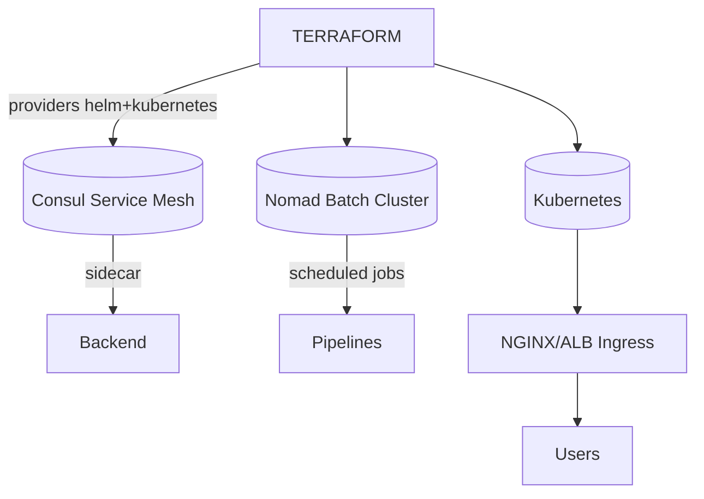

---

## Agentic AI Orchestrator

- **Container Image** – See `agentic-ai/Dockerfile`; build with `docker build -f agentic-ai/Dockerfile .` (or `podman build`) and push to your registry.
- **Docker Compose** – `agentic-ai/docker-compose.yaml` starts the orchestrator with all dependencies (LLM/Pinecone/Neo4j) supplied via `.env`.
- **Podman** – `agentic-ai/podman-compose.yaml` for running the orchestrator under Podman (identical service config, no deprecated `version` key). Requires Podman 4.1+.
- **Kubernetes** – Apply `agentic-ai/k8s/` manifests (ConfigMap, Secret, Deployment) to run the CLI in a cluster with tty/stdin enabled.
- **Cloud providers** – Fargate template (`agentic-ai/aws/ecs-service.yaml`), Azure Container Apps Bicep (`agentic-ai/azure/containerapp.bicep`), and Cloud Run config (`agentic-ai/gcp/cloudrun.yaml`).

Full instructions live in [agentic-ai/DEPLOYMENT.md](agentic-ai/DEPLOYMENT.md).

---

## MCP Server

- **Container Image** – `mcp/Dockerfile` packages the MCP stdio server for sidecar usage; build with `docker build` or `podman build` and push to `ghcr.io/your-org/estatewise-mcp`.
- **Docker Compose** – `mcp/docker-compose.yaml` runs the server with caches tuned via env vars.
- **Podman** – `mcp/podman-compose.yaml` for running the MCP server under Podman (identical service config, no deprecated `version` key). Requires Podman 4.1+.
- **Kubernetes Sidecar** – `mcp/k8s/sidecar-example.yaml` demonstrates pairing the MCP container with the Agentic AI deployment in the same pod.
- **Cloud providers** – Fargate template (`mcp/aws/ecs-service.yaml`), Azure Container Apps Bicep (`mcp/azure/containerapp.bicep`), and Cloud Run config (`mcp/gcp/cloudrun.yaml`).

Refer to [mcp/DEPLOYMENT.md](mcp/DEPLOYMENT.md) for operational guidance.

---

## Vercel Frontend/Backend

The frontend (`frontend/`) ships with a `vercel.json` and can be deployed directly via `vercel deploy` or the Jenkins stage. The backend can run as an Edge Function or proxy to the primary API.

- Configure project once (`vercel link`).
- Set required env vars (`vercel env add ...`).
- Jenkins stage `Vercel Deploy` prints the production URL and commit metadata.

---

## CI/CD Integration

### Jenkins

`jenkins/workflow.Jenkinsfile` now supports multi-target deployments and advanced deployment strategies via environment toggles:

#### Multi-Cloud Deployment Toggles

| Env Var | Effect |
|---------|--------|
| `DEPLOY_AWS=1` | Runs `aws/deploy.sh` with provided parameter bundle. |
| `DEPLOY_AZURE=1` | Invokes `azure/deploy.sh`. |
| `DEPLOY_GCP=1` | Executes `gcp/deploy.sh`. |
| `DEPLOY_HASHICORP=1` | Runs Terraform (`hashicorp/deploy.sh`). |
| `DEPLOY_K8S_MANIFESTS=1` | Applies manifests under `kubernetes/`. |

#### Advanced Deployment Strategy Toggles

| Env Var | Default | Effect |
|---------|---------|--------|
| `DEPLOY_BLUE_GREEN=1` | `0` | Execute Blue-Green deployment strategy. |
| `DEPLOY_CANARY=1` | `0` | Execute Canary deployment strategy. |
| `BLUE_GREEN_SERVICE` | `backend` | Service to deploy (backend/frontend). |
| `CANARY_SERVICE` | `backend` | Service to deploy (backend/frontend). |
| `CANARY_STAGES` | `10,25,50,75,100` | Traffic percentage stages for canary. |
| `CANARY_STAGE_DURATION` | `120` | Seconds between canary stages. |
| `AUTO_SWITCH_BLUE_GREEN` | `false` | Auto-switch traffic without approval. |
| `AUTO_PROMOTE_CANARY` | `false` | Auto-promote canary without approval. |
| `SCALE_DOWN_OLD_DEPLOYMENT` | `false` | Scale down old deployment after switch. |
| `K8S_NAMESPACE` | `estatewise` | Kubernetes namespace for deployments. |

**Example: Production Blue-Green Deployment**

```groovy
pipeline {
  environment {
    DEPLOY_BLUE_GREEN = '1'
    BLUE_GREEN_SERVICE = 'backend'
    AUTO_SWITCH_BLUE_GREEN = 'false'      // require manual approval
    SCALE_DOWN_OLD_DEPLOYMENT = 'true'
    K8S_NAMESPACE = 'estatewise-prod'
  }
}
```

**Example: Staging Canary Deployment**

```groovy
pipeline {
  environment {
    DEPLOY_CANARY = '1'
    CANARY_SERVICE = 'backend'
    CANARY_STAGES = '20,50,100'
    AUTO_PROMOTE_CANARY = 'true'          // automatic progression
    K8S_NAMESPACE = 'estatewise-staging'
  }
}
```

Secrets / parameters are passed as Base64 payloads (`*_B64`) to avoid accidental logging. Example configuration is documented in `jenkins/README.md` and comprehensive deployment guides in `DEVOPS.md`.

### GitHub Actions

GitHub Actions workflows live in `.github/workflows/` and provide CI/CD automation for this repo (tests, builds, scans, artifacts, image publishing, and deployment). Use it for GitHub-native automation or to trigger cloud-native pipelines:

- **Primary workflow**: `workflow.yml` (full CI/CD pipeline)
- **Legacy**: `ci.yml` (deprecated)
- **Cloud-native handoff**: reuse `aws/codepipeline.yaml`, `azure/azure-pipelines.yml`, or `gcp/cloudbuild.yaml`

See 📘 [DEVOPS.md](DEVOPS.md) for the full workflow breakdown and deployment stages.

### GitLab CI

GitLab CI is supported out of the box via `.gitlab-ci.yml` with helper scripts under `gitlab/`, mirroring Jenkins stages and wiring directly into the Kubernetes blue/green and canary scripts through `gitlab/deploy.sh`.

- **Stages**: lint → test → build → security (npm audit) → deploy (manual by default)
- **Key vars**: `DEPLOY_STRATEGY`, `IMAGE_TAG`, `SERVICE_NAME`, `NAMESPACE`
- **Kube auth**: Prefer GitLab’s Kubernetes agent or protected CI variables for `KUBECONFIG`

See 📘 [DEVOPS.md](DEVOPS.md) for recommended defaults and variable details.

### Azure DevOps (Optional)

If you standardize on Azure DevOps, use the included pipeline for Container Apps and Key Vault integration:

- **Pipeline**: `azure/azure-pipelines.yml`
- **Deploy**: `azure/deploy.sh`

See 📘 [DEVOPS.md](DEVOPS.md) for multi-cloud CI/CD guidance and deployment strategies.

---

## Choosing the Right Path

| Requirement | Recommended Target |
|-------------|--------------------|
| Fully managed container runtime, minimal ops | GCP Cloud Run or Azure Container Apps |
| Deep AWS ecosystem integration | AWS ECS Fargate stack |
| Hybrid cloud / service mesh / batch jobs | HashiCorp Terraform + Consul + Nomad |
| Static-first UI with edge caching | Vercel |
| Need Kubernetes primitives (HPA, custom CRDs) | HashiCorp + Kubernetes stack |

---

## Reference Commands

```bash
# Validate CloudFormation
make -C aws validate

# Terraform plan for HashiCorp stack
cd hashicorp/terraform
terraform init
terraform plan -var='kubeconfig_path=~/.kube/config' -var='context=estatewise'

# Azure DevOps pipeline run
az pipelines run --name estatewise-container-apps --variables IMAGE_TAG=$(git rev-parse --short HEAD)

# Trigger Cloud Build manually
gcloud builds submit --config gcp/cloudbuild.yaml --substitutions=_REGION=us-east1

# Build Agentic AI container image (Docker or Podman)
docker build -f agentic-ai/Dockerfile -t ghcr.io/your-org/estatewise-agentic:latest .
# podman build -f agentic-ai/Dockerfile -t ghcr.io/your-org/estatewise-agentic:latest .

# Build MCP server image (Docker or Podman)
docker build -t ghcr.io/your-org/estatewise-mcp:latest mcp/
# podman build -t ghcr.io/your-org/estatewise-mcp:latest mcp/

# Bootstrap GitOps control plane
bash kubernetes/gitops/bootstrap.sh

# Preflight validation
bash kubernetes/gitops/preflight.sh

# Apply Kubernetes GitOps-ready overlay (if running imperative mode)
kubectl apply -k kubernetes/overlays/prod-gitops
```

For deeper dives, follow the platform-specific READMEs inside each directory.

- [AWS Deployment](aws/README.md)
- [Azure Deployment](azure/README.md)
- [Google Cloud Deployment](gcp/README.md)
- [HashiCorp + Kubernetes Stack](hashicorp/README.md) and [Kubernetes Manifests](kubernetes/README.md)
- [Agentic AI Orchestrator](agentic-ai/README.md)
- [DEVOPS Guide](DEVOPS.md)
- [MCP Server](mcp/README.md)
- [Jenkins CI/CD](jenkins/README.md)
