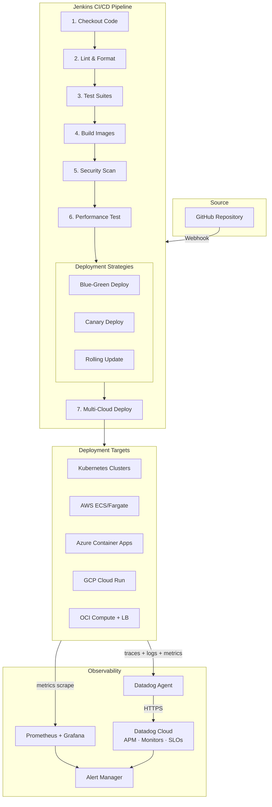
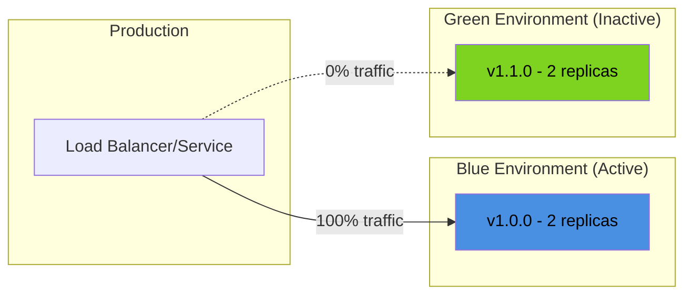
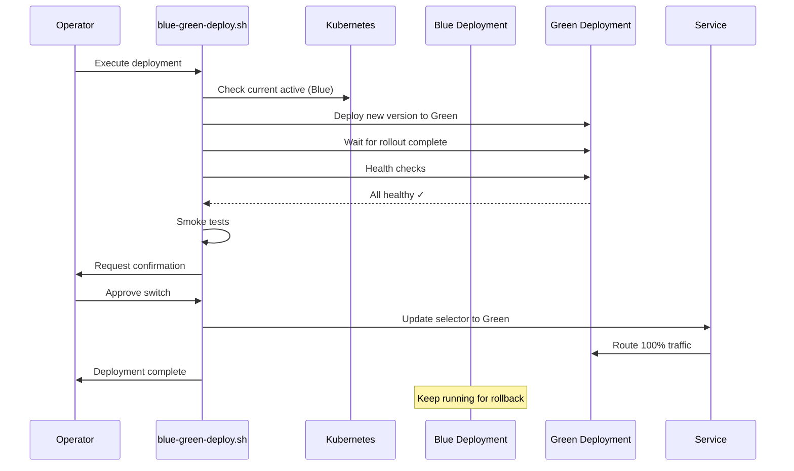
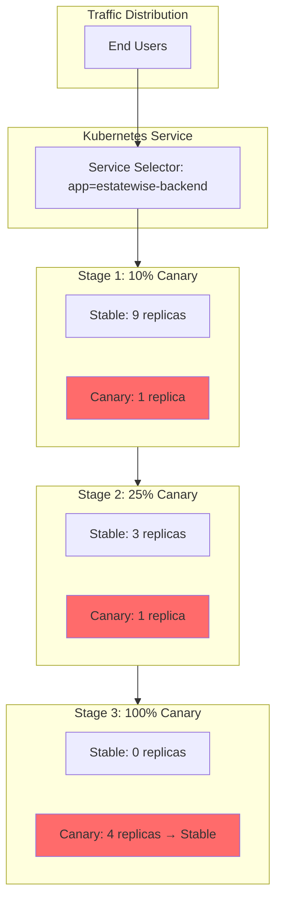
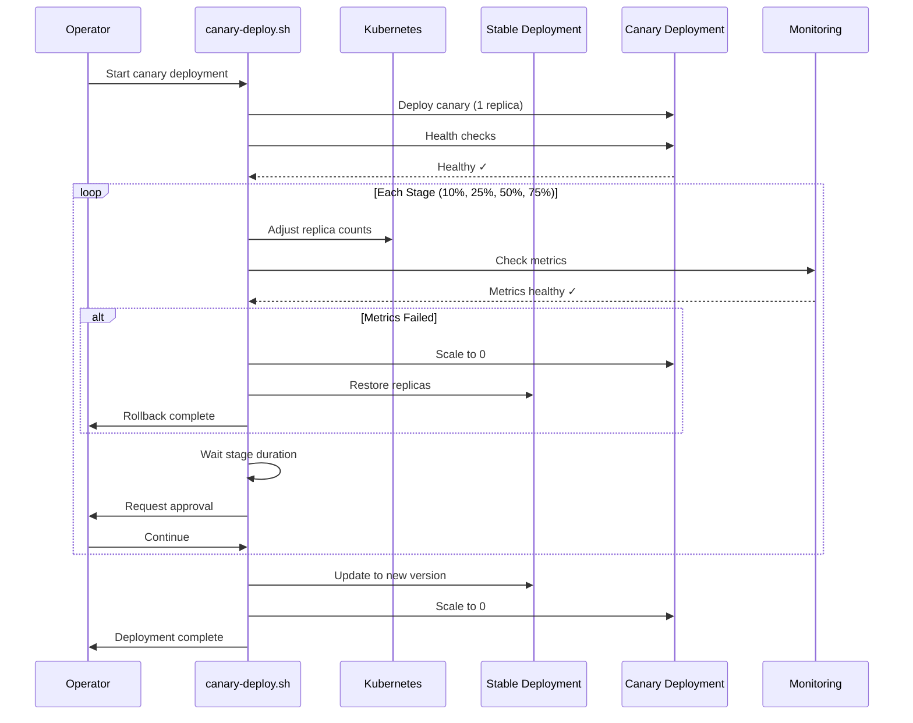
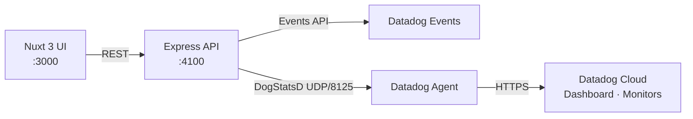
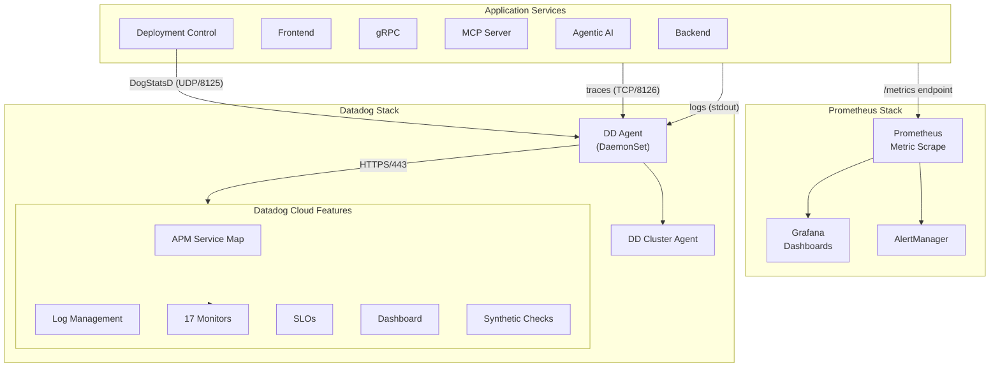
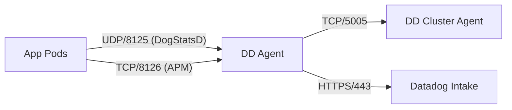

# EstateWise DevOps Guide

<p align="center">
  
  
  
  
  
  
  
  
  
  
  
  
  
  
  
  
  
  
  
  
  
  
</p>

This guide provides comprehensive documentation for EstateWise's DevOps practices, deployment strategies, CI/CD pipelines, and operational procedures.

---

## Table of Contents

- [Overview](#overview)
- [CI/CD Architecture](#cicd-architecture)
- [Jenkins (Primary CI/CD)](#jenkins-primary-cicd)
- [GitHub Actions (Workflows)](#github-actions-workflows)
- [GitLab CI/CD (self-managed or SaaS)](#gitlab-cicd-self-managed-or-saas)
- [Deployment Strategies](#deployment-strategies)
  - [Blue-Green Deployments](#blue-green-deployments)
  - [Canary Deployments](#canary-deployments)
  - [Rolling Updates](#rolling-updates)
- [Jenkins Pipeline Configuration](#jenkins-pipeline-configuration)
- [Kubernetes Operations](#kubernetes-operations)
- [Deployment Control UI](#deployment-control-ui)
- [Monitoring and Observability](#monitoring-and-observability)
  - [Prometheus Metrics](#metrics-collection)
  - [Datadog Observability](#datadog-observability)
  - [Logging Strategy](#logging-strategy)
  - [Health Checks](#health-checks)
- [Disaster Recovery](#disaster-recovery)
- [Security Best Practices](#security-best-practices)
  - [SonarQube — Code Quality & Security](#sonarqube--code-quality--security)
  - [Snyk — Dependency, Code, Container & IaC Scanning](#snyk--dependency-code-container--iac-scanning)
  - [Container Security](#container-security)
  - [Secrets Management](#secrets-management)
  - [Network Security](#network-security)
  - [Access Control](#access-control)
- [Troubleshooting](#troubleshooting)
- [Additional Resources](#additional-resources)
- [Support and Contribution](#support-and-contribution)

---

## Overview

EstateWise employs enterprise-grade DevOps practices with multiple deployment strategies to ensure zero-downtime deployments, rapid rollbacks, and safe progressive delivery of new features.

### Key Features

- **Multi-Strategy Deployments**: Blue-Green, Canary, and Rolling Updates
- **Zero-Downtime Deployments**: Traffic switching without service interruption
- **Automated Rollbacks**: Health checks and metrics-based automatic rollbacks
- **Multi-Cloud Support**: AWS, Azure, GCP, OCI, and Kubernetes deployments
- **Container-First**: Docker/Podman-based builds with vulnerability scanning
- **Infrastructure as Code**: Terraform, CloudFormation, Bicep support
- **Dual Observability Stack**: Prometheus + Grafana for infrastructure metrics; Datadog for APM, centralized logs, monitors, SLOs, synthetic checks, and deploy tracking

It also supports Jenkins, GitHub Actions, and GitLab CI/CD for flexible pipeline management, with Jenkins being the primary orchestrator for production deployments. Prometheus and Grafana provide Kubernetes-level metric scraping, while Datadog supplies full-stack APM tracing, centralized log management, 17 production monitors, SLO tracking, and synthetic health checks across all deployment targets.

---

## CI/CD Architecture



### Pipeline Stages

The Jenkins pipeline consists of the following stages:

| Stage | Purpose | Duration | Failure Action |
|-------|---------|----------|----------------|
| **Checkout** | Clone repository and setup environment | 10-30s | Abort pipeline |
| **Lint & Format** | Code quality checks (ESLint, Prettier) | 30-60s | Abort pipeline |
| **Test Suites** | Unit and integration tests | 2-5min | Abort pipeline |
| **Build Images** | Docker image builds for backend/frontend | 3-8min | Abort pipeline |
| **Security Scan** | Trivy vulnerability scanning | 1-2min | Warning only |
| **Performance Test** | Artillery benchmark tests | 1-2min | Warning only |
| **Deployment** | Progressive deployment with selected strategy | 5-15min | Automatic rollback |

The pipeline is fully configurable via environment variables to enable/disable deployment strategies and target clouds.

---

## Jenkins (Primary CI/CD)

Jenkins is the primary CI/CD engine for production deployments and multi-cloud rollouts. It orchestrates the full pipeline and deployment strategies described in this guide.

- **Pipeline definition**: `Jenkinsfile`
- **Docs**: `jenkins/README.md`
- **Stages**: checkout → lint/format → tests → image builds → security scan → perf checks → deploy
- **Deploy strategies**: Blue-Green, Canary, Rolling (via `kubernetes/scripts/blue-green-deploy.sh` and `kubernetes/scripts/canary-deploy.sh`)
- **Targets**: Kubernetes plus optional AWS/Azure/GCP/OCI rollouts
- **Key toggles**:
  - Strategy: `DEPLOY_BLUE_GREEN`, `DEPLOY_CANARY`, `BLUE_GREEN_SERVICE`, `CANARY_SERVICE`
  - Canary flow: `CANARY_STAGES`, `CANARY_STAGE_DURATION`, `AUTO_PROMOTE_CANARY`
  - Blue/Green flow: `AUTO_SWITCH_BLUE_GREEN`, `SCALE_DOWN_OLD_DEPLOYMENT`
  - Cloud targets: `DEPLOY_AWS`, `DEPLOY_AZURE`, `DEPLOY_GCP`, `DEPLOY_OCI`, `DEPLOY_K8S_MANIFESTS`
- **Recommended use**: production releases, staged rollouts, and multi-cloud promotion
- **Deep config**: See [Jenkins Pipeline Configuration](#jenkins-pipeline-configuration)

---

## GitHub Actions (Workflows)

GitHub Actions provides CI/CD automation alongside Jenkins and GitLab. The active workflows live in `.github/workflows/` and should be the source of truth for GitHub-native automation.

- **Primary pipeline**: `workflow.yml` (full CI/CD pipeline covering linting, tests, builds, scans, artifacts, container publishing, and deploy steps).
- **Legacy pipeline**: `ci.yml` (deprecated; kept for backward compatibility — prefer `workflow.yml`).
- **Repo analytics**: `analyze-repo.yml` (scheduled lines-of-code reporting for this repository).
- **Multi-repo analytics**: `analyze-code.yml` (scheduled LOC across owned repos; requires `GH_PAT` secret).

If you wish to update CI behavior, edit the relevant workflow in `.github/workflows/` and keep it aligned with Jenkins/GitLab stages.

<p align="center">
  
</p>

---

## GitLab CI/CD (self-managed or SaaS)

GitLab pipelines mirror the Jenkins flow with first-class support for blue/green, canary, and rolling rollouts.

- **Pipeline file**: `.gitlab-ci.yml`
- **Deploy helper**: `gitlab/deploy.sh` (wraps the existing Kubernetes scripts)
- **Stages**: lint → test → build → security (npm audit) → deploy (manual by default)
- **Defaults**: Node 20 runner image, project-local `.npm` cache, `NEXT_TELEMETRY_DISABLED=1`
- **Artifacts**: build outputs and test results can be exported for downstream deploy jobs
- **Key variables**:
  - `DEPLOY_STRATEGY`: `blue-green`, `canary`, or `rolling`
  - `IMAGE_TAG`: container image to deploy
  - `SERVICE_NAME`: target workload (default `backend`)
  - `NAMESPACE`: Kubernetes namespace (default `estatewise`)
  - Optional toggles: `AUTO_SWITCH`, `SMOKE_TEST`, `SCALE_DOWN_OLD`, `CANARY_STAGES`, `STAGE_DURATION`, `AUTO_PROMOTE`, `ENABLE_METRICS`, `CANARY_REPLICAS_START`, `STABLE_REPLICAS`
- **Kube auth**: Prefer GitLab’s Kubernetes agent or protected CI variables for `KUBECONFIG`. No Dockerfile changes are required.
- **Recommended use**: GitLab-hosted repos or teams standardizing on GitLab CI/CD with the same deployment scripts.

> Tip: Protect deploy jobs to `main` and require approvals; pair with the `deployment-control/` dashboard for visibility.

---

## Deployment Strategies

EstateWise supports three primary deployment strategies, each suited for different scenarios.

### Comparison Matrix

| Feature | Blue-Green | Canary | Rolling Update |
|---------|-----------|---------|----------------|
| **Zero-Downtime** | ✅ Yes | ✅ Yes | ✅ Yes |
| **Instant Rollback** | ✅ Immediate | ⚠️ Gradual | ⚠️ Re-deploy |
| **Resource Usage** | 2x during switch | 1.1-1.5x | 1x |
| **Testing in Production** | Limited | ✅ Extensive | Moderate |
| **Complexity** | Low | High | Low |
| **Risk Level** | Low | Very Low | Moderate |
| **Best For** | Major releases | New features | Patches, bug fixes |

---

## Blue-Green Deployments

Blue-Green deployment maintains two identical production environments (Blue and Green). At any time, only one is live and serving production traffic.

### Architecture



### Deployment Flow



### Usage

#### Via Jenkins Pipeline

Set environment variables in your Jenkins job:

```groovy
DEPLOY_BLUE_GREEN=1
BLUE_GREEN_SERVICE=backend              # or 'frontend'
K8S_NAMESPACE=estatewise
AUTO_SWITCH_BLUE_GREEN=false            # require manual approval
SCALE_DOWN_OLD_DEPLOYMENT=false         # keep old deployment for rollback
```

#### Manual Execution

```bash
# Set environment
export NAMESPACE=estatewise
export AUTO_SWITCH=false        # manual approval
export SCALE_DOWN_OLD=false     # keep old deployment running
export SMOKE_TEST=true          # run smoke tests

# Execute deployment
./kubernetes/scripts/blue-green-deploy.sh backend \
  ghcr.io/your-org/estatewise-app-backend:v1.2.3
```

### Rollback Procedure

Blue-Green rollback is instantaneous - simply switch the service selector back:

```bash
# Check current active slot
kubectl get service estatewise-backend -n estatewise \
  -o jsonpath='{.spec.selector.version}'

# Instant rollback to previous slot
kubectl patch service estatewise-backend -n estatewise \
  -p '{"spec":{"selector":{"version":"blue"}}}'

# Verify traffic switch
kubectl get endpoints estatewise-backend -n estatewise
```

### Best Practices

1. **Always test Green before switching**: Run comprehensive smoke tests on the Green environment
2. **Keep Blue running**: Don't scale down the old deployment immediately after switch
3. **Monitor after switch**: Watch metrics for at least 15-30 minutes post-deployment
4. **Database migrations**: Run migrations before deployment or ensure backward compatibility
5. **Cost consideration**: Blue-Green requires 2x resources during the transition

### Configuration Files

- **Blue Deployment**: `kubernetes/base/backend-deployment-blue.yaml`
- **Green Deployment**: `kubernetes/base/backend-deployment-green.yaml`
- **Deployment Script**: `kubernetes/scripts/blue-green-deploy.sh`

---

## Canary Deployments

Canary deployment gradually shifts traffic from the stable version to the new version, allowing real-world testing with minimal risk.

### Architecture



### Deployment Flow



### Canary Stages

| Stage | Stable Replicas | Canary Replicas | Traffic % | Risk Level | Duration |
|-------|----------------|-----------------|-----------|------------|----------|
| **Initial** | 2 | 1 | ~10% | Very Low | 2min |
| **Stage 1** | 3 | 1 | ~25% | Low | 2min |
| **Stage 2** | 2 | 2 | ~50% | Moderate | 2min |
| **Stage 3** | 1 | 3 | ~75% | Moderate-High | 2min |
| **Final** | 0 → 2 (new) | 4 → 0 | 100% | Stable | - |

### Usage

#### Via Jenkins Pipeline

```groovy
DEPLOY_CANARY=1
CANARY_SERVICE=backend
K8S_NAMESPACE=estatewise
CANARY_STAGES=10,25,50,75,100           # percentage stages
CANARY_STAGE_DURATION=120               # seconds between stages
AUTO_PROMOTE_CANARY=false               # require manual approval
```

#### Manual Execution

```bash
# Set environment
export NAMESPACE=estatewise
export CANARY_STAGES=10,25,50,75,100
export STAGE_DURATION=120
export AUTO_PROMOTE=false
export ENABLE_METRICS=true              # check Prometheus metrics

# Execute canary deployment
./kubernetes/scripts/canary-deploy.sh backend \
  ghcr.io/your-org/estatewise-app-backend:v1.2.3
```

### Health Checks and Metrics

The canary script performs automated health checks at each stage:

1. **Pod Health**
   - All canary pods are Ready
   - Restart count < 3
   - No CrashLoopBackOff

2. **Application Health**
   - `/health` endpoint returns 200 OK
   - Response time < 500ms

3. **Metrics (Optional)**
   - Error rate < 1%
   - p95 latency within 10% of stable
   - Success rate > 99%

### Automatic Rollback Conditions

The canary deployment automatically rolls back if:

- Canary pods fail readiness checks
- Pod restart count exceeds threshold
- Error rate exceeds 1%
- Manual abort by operator

### Best Practices

1. **Start small**: Use conservative initial percentage (5-10%)
2. **Monitor actively**: Watch dashboards during each stage
3. **Automate metrics**: Integrate with Prometheus for automated decision-making
4. **Feature flags**: Combine with feature flags for additional control
5. **Off-peak hours**: Schedule canary deployments during low-traffic periods

### Configuration Files

- **Canary Deployment**: `kubernetes/base/backend-deployment-canary.yaml`
- **Deployment Script**: `kubernetes/scripts/canary-deploy.sh`

---

## Rolling Updates

Rolling updates are Kubernetes' default strategy, gradually replacing pods with new versions.

### Configuration

Rolling updates are configured in the standard deployment manifests:

```yaml
spec:
  replicas: 2
  strategy:
    type: RollingUpdate
    rollingUpdate:
      maxSurge: 1        # 1 extra pod during update
      maxUnavailable: 0  # No pods unavailable (zero-downtime)
```

### Usage

```bash
# Update image
kubectl set image deployment/estatewise-backend \
  backend=ghcr.io/your-org/estatewise-app-backend:v1.2.3 \
  -n estatewise

# Watch rollout
kubectl rollout status deployment/estatewise-backend -n estatewise

# Rollback if needed
kubectl rollout undo deployment/estatewise-backend -n estatewise
```

---

## Jenkins Pipeline Configuration

### Environment Variables Reference

#### Basic Configuration

| Variable | Default | Description |
|----------|---------|-------------|
| `NODE_VERSION` | `18` | Node.js version for builds |
| `REGISTRY` | `ghcr.io/your-org` | Container registry |
| `K8S_NAMESPACE` | `estatewise` | Kubernetes namespace |

#### Multi-Cloud Deployment Toggles

| Variable | Default | Description |
|----------|---------|-------------|
| `DEPLOY_AWS` | `0` | Deploy to AWS ECS Fargate |
| `DEPLOY_AZURE` | `0` | Deploy to Azure Container Apps |
| `DEPLOY_GCP` | `0` | Deploy to GCP Cloud Run |
| `DEPLOY_OCI` | `0` | Deploy to Oracle Cloud Infrastructure (OCI) |
| `DEPLOY_HASHICORP` | `0` | Deploy via Terraform to Kubernetes |
| `DEPLOY_K8S_MANIFESTS` | `0` | Apply Kubernetes manifests directly |

#### Advanced Deployment Strategies

| Variable | Default | Description |
|----------|---------|-------------|
| `DEPLOY_BLUE_GREEN` | `0` | Enable Blue-Green deployment |
| `DEPLOY_CANARY` | `0` | Enable Canary deployment |
| `BLUE_GREEN_SERVICE` | `backend` | Service for Blue-Green (backend/frontend) |
| `CANARY_SERVICE` | `backend` | Service for Canary (backend/frontend) |
| `CANARY_STAGES` | `10,25,50,75,100` | Canary traffic percentages |
| `CANARY_STAGE_DURATION` | `120` | Seconds between canary stages |
| `AUTO_PROMOTE_CANARY` | `false` | Auto-promote without manual approval |
| `AUTO_SWITCH_BLUE_GREEN` | `false` | Auto-switch without manual approval |
| `SCALE_DOWN_OLD_DEPLOYMENT` | `false` | Scale down old deployment after switch |

### Example Jenkins Job Configurations

#### Production Blue-Green Deployment

```groovy
pipeline {
  environment {
    DEPLOY_BLUE_GREEN = '1'
    BLUE_GREEN_SERVICE = 'backend'
    AUTO_SWITCH_BLUE_GREEN = 'false'      // require approval
    SCALE_DOWN_OLD_DEPLOYMENT = 'true'    // cleanup after switch
    K8S_NAMESPACE = 'estatewise-prod'
  }
}
```

#### Staging Canary Deployment

```groovy
pipeline {
  environment {
    DEPLOY_CANARY = '1'
    CANARY_SERVICE = 'backend'
    CANARY_STAGES = '20,50,100'           // fewer stages for staging
    CANARY_STAGE_DURATION = '60'          // faster progression
    AUTO_PROMOTE_CANARY = 'true'          // no manual approval
    K8S_NAMESPACE = 'estatewise-staging'
  }
}
```

#### Multi-Cloud Production Deployment

```groovy
pipeline {
  environment {
    DEPLOY_AWS = '1'
    DEPLOY_GCP = '1'
    DEPLOY_K8S_MANIFESTS = '1'
    AWS_DEPLOY_ARGS = '--region us-east-1 --cluster prod-ecs'
    GCP_DEPLOY_ARGS = '--project estatewise-prod --region us-central1'
    K8S_APPLY_PATH = 'kubernetes/overlays/prod'
  }
}
```

---

## Kubernetes Operations

### Namespace Setup

```bash
# Create namespace
kubectl create namespace estatewise

# Create secrets
kubectl create secret generic estatewise-secrets \
  --from-literal=mongoUri="mongodb://..." \
  --from-literal=jwtSecret="your-jwt-secret" \
  --from-literal=googleAiApiKey="your-api-key" \
  --from-literal=pineconeApiKey="your-api-key" \
  --from-literal=pineconeIndex="your-index" \
  -n estatewise

# Create configmap
kubectl create configmap estatewise-shared-config \
  --from-literal=NODE_ENV=production \
  --from-literal=PORT=3001 \
  -n estatewise
```

### Deployment Commands

```bash
# Apply base manifests
kubectl apply -k kubernetes/base -n estatewise

# Apply production overlay
kubectl apply -k kubernetes/overlays/prod -n estatewise

# Apply GitOps-ready production overlay (Argo Rollouts based)
kubectl apply -k kubernetes/overlays/prod-gitops

# Check deployment status
kubectl get deployments -n estatewise
kubectl get rollouts.argoproj.io -n estatewise
kubectl get pods -n estatewise
kubectl get services -n estatewise

# View logs
kubectl logs -f deployment/estatewise-backend -n estatewise
kubectl logs -f deployment/estatewise-backend -n estatewise --previous

# Port forward for testing
kubectl port-forward svc/estatewise-backend 3001:3001 -n estatewise
```

### Scaling Operations

```bash
# Manual scaling
kubectl scale deployment/estatewise-backend --replicas=5 -n estatewise
kubectl scale rollout/estatewise-backend --replicas=5 -n estatewise

# Autoscaling (HPA)
kubectl autoscale deployment estatewise-backend \
  --cpu-percent=70 \
  --min=2 \
  --max=10 \
  -n estatewise

# Check autoscaler status
kubectl get hpa -n estatewise
```

### GitOps and Progressive Delivery Stack

EstateWise supports a production topology where:

- **Argo CD** manages core applications and Argo-native controllers.
- **Argo Rollouts** handles backend/frontend progressive delivery in `estatewise`.
- **Flux CD** manages Flagger controller and isolated canary workloads.
- **Flagger** performs canary analysis in `estatewise-delivery`.
- **Argo Workflows** runs delivery gates and scheduled operational workflows.

Bootstrap references:

```bash
# Argo CD app-of-apps bootstrap
kubectl apply -k kubernetes/gitops/argocd

# Flux source + kustomization bootstrap
kubectl apply -k kubernetes/gitops/flux

# Preflight policy/render checks
bash kubernetes/gitops/preflight.sh
```

GitOps manifests are pinned to this repo URL:

- `https://github.com/hoangsonww/EstateWise-Chapel-Hill-Chatbot.git`

Production hardening included in this stack:

- Argo CD `ignoreDifferences` for Rollout replica counts (prevents HPA/GitOps drift loops).
- Flagger isolated to `estatewise-delivery` namespace under Flux ownership.
- Namespace pod-security labels and quotas/limitranges for delivery/workflow namespaces.
- Argo Workflow TTL and pod GC controls for operational hygiene.

Use `kubernetes/gitops/README.md` as the source of truth for ownership boundaries and verification commands.

---

## Deployment Control UI

The `deployment-control/` directory contains a full-featured dashboard for managing deployments across all supported targets and strategies.

- **Web UI** – Vue 3 + Nuxt 3 frontend with Pinia state management.
- **API Server** – Express + TypeScript backend handling deployment requests and job tracking.
- **Datadog Integration** – Every deploy emits Datadog Events (start/finish) and DogStatsD custom metrics for deploy counters and duration histograms.
- **Features**:
  - Real-time deployment status and logs
  - Blue-Green and Canary deployment workflows
  - Cluster snapshot and health metrics
  - User notifications and alerts
  - Datadog deploy event + DogStatsD metric emission
  - TypeScript type safety and accessibility support
  - Hot Module Replacement for rapid development
  - Extensible architecture for future enhancements



To get started, see [deployment-control/README.md](deployment-control/README.md).

<p align="center">
  
</p>

---

## Monitoring and Observability

EstateWise operates a **dual observability stack**: Prometheus + Grafana for Kubernetes infrastructure scraping and **Datadog** for full-stack APM, centralized log management, production monitors, SLOs, dashboards, and synthetic health checks.



### Metrics Collection

EstateWise deployments expose Prometheus metrics via pod annotations:

```yaml
annotations:
  prometheus.io/scrape: "true"
  prometheus.io/port: "3001"
  prometheus.io/path: "/metrics"
```

#### Key Prometheus Metrics

| Metric | Type | Alert Threshold | Description |
|--------|------|-----------------|-------------|
| `http_request_duration_seconds` | Histogram | p95 > 1s | Request latency |
| `http_requests_total` | Counter | Rate decreasing | Request throughput |
| `http_request_errors_total` | Counter | Rate > 1% | Error rate |
| `process_resident_memory_bytes` | Gauge | > 1GB | Memory usage |
| `nodejs_heap_size_used_bytes` | Gauge | > 800MB | Heap usage |
| `up` | Gauge | 0 | Service availability |

### Datadog Observability

Datadog provides end-to-end production observability with APM distributed tracing, centralized log management, monitors, SLOs, dashboards, and synthetic checks. The integration is managed via **Terraform** (AWS ECS), **Helm** (Kubernetes), **Docker Compose**, and **deployment-control**.

#### Unified Service Tagging

Every service injects Datadog's [Unified Service Tagging](https://docs.datadoghq.com/getting_started/tagging/unified_service_tagging/) environment variables for correlated observability:

```yaml
env:
  - name: DD_SERVICE
    value: "estatewise-backend"    # per-service identity
  - name: DD_ENV
    valueFrom:
      fieldRef:
        fieldPath: metadata.labels['tags.datadoghq.com/env']
  - name: DD_VERSION
    value: "1.0.0"                 # tracks deployed version
  - name: DD_AGENT_HOST
    valueFrom:
      fieldRef:
        fieldPath: status.hostIP
  - name: DD_LOGS_INJECTION
    value: "true"                  # correlate logs ↔ traces
```

#### Datadog Monitors

17 production monitors are managed in Terraform (`terraform/datadog.tf`) and Helm (`helm/estatewise/templates/datadog-monitors.yaml`):

| Monitor | Type | Condition | Severity |
|---------|------|-----------|----------|
| Backend Error Rate | Metric | > 5% over 5 min | Critical |
| Backend Latency P95 | Metric | > 2s over 5 min | Warning |
| Backend Latency P99 | Metric | > 5s over 5 min | Critical |
| Frontend Error Rate | Metric | > 5% over 5 min | Critical |
| Pod Crash Loops | Metric | > 0 restarts in 10 min | Critical |
| High Memory Usage | Metric | > 85% for 10 min | Warning |
| High CPU Usage | Metric | > 80% for 10 min | Warning |
| ALB 5xx Errors | Metric | > 10/min for 5 min | Critical |
| ALB Unhealthy Hosts | Metric | > 0 for 5 min | Critical |
| ECS Task Failures | Metric | > 0 in 10 min | Warning |
| Deploy Frequency | Metric | > 10 deploys in 1 hr | Warning |
| Deploy Duration | Metric | > 30 min per deploy | Warning |
| MongoDB Connection | Metric | > 80% pool used | Warning |
| MongoDB Query Latency | Metric | P95 > 500ms | Warning |
| Disk Usage | Metric | > 85% | Warning |
| Network Errors | Metric | > 100/min | Warning |
| Synthetic Health | Synthetic | Failure from any region | Critical |

#### SLOs

| SLO | Target | Window | Metric |
|-----|--------|--------|--------|
| API Availability | 99.9% | 30 days | `1 - (5xx / total)` |
| API Latency | 95% requests < 500ms | 30 days | `P(latency < 500ms)` |

#### Custom DogStatsD Metrics (Deployment Control)

| Metric | Type | Tags | Description |
|--------|------|------|-------------|
| `estatewise.deploy.started` | Counter | service, env, version | Deployment initiated |
| `estatewise.deploy.finished` | Counter | service, env, version | Deployment completed |
| `estatewise.deploy.success` | Counter | service, env, version | Successful deployments |
| `estatewise.deploy.failure` | Counter | service, env, version, reason | Failed deployments |
| `estatewise.deploy.duration_seconds` | Histogram | service, env, version | Deploy wall-clock time |

#### Enabling Datadog

```bash
# Docker Compose (local/staging) — add DD agent alongside app services
export DD_API_KEY="your-key"
docker compose -f docker/compose.prod.yml --profile monitoring up -d

# Helm (Kubernetes) — enable agent DaemonSet + monitors + network policies
helm upgrade --install estatewise ./helm/estatewise \
  --set datadog.enabled=true \
  --set datadog.monitors.enabled=true

# Terraform (AWS ECS) — provisions monitors, dashboard, SLOs, synthetics
terraform apply -var='enable_datadog=true' \
  -var='datadog_api_key=YOUR_KEY' \
  -var='datadog_app_key=YOUR_APP_KEY'
```

#### Network Policies

Helm-managed NetworkPolicies (`helm/estatewise/templates/datadog-networkpolicy.yaml`) restrict agent communication:



For full architecture details, operational runbooks, and troubleshooting, see 📘 [docs/datadog-integration.md](docs/datadog-integration.md).

### Logging Strategy

```bash
# View deployment logs (kubectl)
kubectl logs -l app=estatewise-backend -n estatewise --tail=100

# Follow logs
kubectl logs -f deployment/estatewise-backend -n estatewise

# Logs from specific deployment slot
kubectl logs -l app=estatewise-backend,version=blue -n estatewise
kubectl logs -l app=estatewise-backend,version=canary -n estatewise

# Export logs for analysis
kubectl logs deployment/estatewise-backend -n estatewise \
  --since=1h > backend-logs.txt

# Datadog log search (via CLI, requires datadog-ci)
datadog-ci logs search "service:estatewise-backend status:error" --from 1h
```

### Health Checks

All deployments include comprehensive health checks:

```yaml
readinessProbe:
  httpGet:
    path: /health
    port: 3001
  initialDelaySeconds: 10
  periodSeconds: 5
  failureThreshold: 3

livenessProbe:
  httpGet:
    path: /health
    port: 3001
  initialDelaySeconds: 30
  periodSeconds: 10
  failureThreshold: 3
```

Datadog synthetic checks additionally verify `/health` from **3 AWS regions** (us-east-1, eu-west-1, ap-southeast-1) every 60 seconds, alerting on consecutive failures.

---

## Disaster Recovery

### Backup Strategy

1. **Database Backups**
   - Automated daily backups of MongoDB
   - 30-day retention policy
   - Point-in-time recovery available

2. **Configuration Backups**
   - Git repository serves as source of truth
   - Kubernetes secrets backed up encrypted
   - Terraform state stored in remote backend

3. **Container Images**
   - All images tagged with commit SHA
   - Retention: 90 days for production images
   - Can redeploy any previous version instantly

### Recovery Procedures

#### Rollback to Previous Version

```bash
# Check deployment history
kubectl rollout history deployment/estatewise-backend -n estatewise

# Rollback to previous version
kubectl rollout undo deployment/estatewise-backend -n estatewise

# Rollback to specific revision
kubectl rollout undo deployment/estatewise-backend \
  --to-revision=5 \
  -n estatewise
```

#### Database Recovery

```bash
# Restore from MongoDB backup
mongorestore --uri="mongodb://..." --archive=backup.archive

# Point-in-time recovery (AWS DocumentDB)
aws docdb restore-db-cluster-to-point-in-time \
  --source-db-cluster-identifier estatewise-prod \
  --db-cluster-identifier estatewise-prod-restored \
  --restore-to-time 2024-01-15T10:00:00Z
```

#### Complete Cluster Recovery

```bash
# 1. Provision new cluster (Terraform)
cd hashicorp/terraform
terraform apply

# 2. Restore secrets
kubectl apply -f backups/secrets-encrypted.yaml

# 3. Deploy application
kubectl apply -k kubernetes/overlays/prod

# 4. Restore database
./scripts/restore-database.sh

# 5. Verify
kubectl get pods -n estatewise
curl https://api.estatewise.com/health
```

---

## Security Best Practices

EstateWise employs a **defense-in-depth** security strategy combining static analysis (SonarQube), dependency/container/IaC scanning (Snyk), image vulnerability scanning (Trivy), and runtime network policies.

```mermaid
flowchart LR
  subgraph SAST["Static Analysis"]
    Sonar["SonarQube<br/>Code Quality + Security Hotspots"]
    SnykCode["Snyk Code<br/>SAST"]
    Semgrep["Semgrep<br/>Pattern Matching"]
  end

  subgraph SCA["Supply Chain"]
    SnykOSS["Snyk Open Source<br/>Dependency SCA"]
    NpmAudit["npm audit"]
  end

  subgraph Container["Container Security"]
    Trivy["Trivy<br/>Image CVEs"]
    SnykContainer["Snyk Container<br/>Image + Base OS"]
  end

  subgraph IaC["Infrastructure as Code"]
    SnykIaC["Snyk IaC<br/>Terraform · K8s · Docker"]
  end

  subgraph Runtime["Runtime"]
    NetPol["Network Policies"]
    RBAC["K8s RBAC"]
    Secrets["Secret Managers"]
  end

  SAST --> SCA --> Container --> IaC --> Runtime
```



### SonarQube — Code Quality & Security

SonarQube provides continuous code quality inspection with security hotspot detection, code smell identification, and quality gate enforcement.

**Configuration:** `sonar-project.properties` defines a multi-module monorepo layout with 7 modules (backend, frontend, gRPC, MCP, agentic-ai, deployment-control, context-engineering).

**Quality gate enforces:**
- New code coverage ≥ 80%
- Duplicated lines on new code < 3%
- Maintainability / Reliability / Security rating: A
- Zero new blocker or critical issues

```bash
# Local SonarQube server
make sonar-up                  # start SonarQube + Postgres on :9000
make sonar-status              # check health

# Run analysis
export SONAR_TOKEN=your-token
make sonar                     # scan all modules, wait for quality gate

# Or with SonarCloud
SONAR_HOST_URL=https://sonarcloud.io make sonar
```

### Snyk — Dependency, Code, Container & IaC Scanning

Snyk provides comprehensive security scanning across the entire software supply chain:

| Scan Type | What It Checks | Command |
|-----------|---------------|---------|
| **Open Source (SCA)** | npm dependency vulnerabilities across all services | `make snyk` |
| **Code (SAST)** | Source code security issues (injection, XSS, etc.) | `make snyk` |
| **Container** | Docker image OS + app layer vulnerabilities | `make snyk-container` |
| **IaC** | Terraform, Kubernetes, Helm, Docker Compose misconfigs | `make snyk-iac` |
| **Monitor** | Upload dependency snapshot to Snyk dashboard for alerts | `make snyk-monitor` |

```bash
# Authenticate
snyk auth

# Run all Snyk scans
export SNYK_TOKEN=your-token
make snyk                      # SCA + SAST across all services
make snyk-container            # scan all Docker images
make snyk-iac                  # scan Terraform, K8s, Helm, Docker configs
make snyk-monitor              # upload snapshots for continuous monitoring

# Full security suite (Snyk + SonarQube + Trivy)
make security
```

**Policy file:** `.snyk` at the repo root defines ignore/patch rules. Per-service overrides live in `.snyk.d/`.

### Container Security

1. **Image Scanning** — Triple-layer: Trivy (CVE DB), Snyk Container (OS + app), SonarQube (code quality)
   - Scans run on every build in Jenkins and CodeBuild
   - Block deployment if critical vulnerabilities found
   - Regular rescanning of existing images via `snyk container monitor`

2. **Base Images**
   - Use official Node.js Alpine images
   - Minimal attack surface
   - Regular updates to latest patches

3. **Non-Root Containers**
   ```dockerfile
   USER node
   ```

### Secrets Management

1. **Never commit secrets** to Git
2. **Use Kubernetes Secrets** for sensitive data
3. **Encrypt secrets at rest** (encryption provider)
4. **Rotate secrets regularly** (90-day cycle)
5. **Use external secret managers** (AWS Secrets Manager, Azure Key Vault)
6. **CI tokens** stored in Jenkins credentials (`sonar-token`, `snyk-token`) and AWS Parameter Store

### Network Security

1. **Network Policies**: Restrict pod-to-pod communication (including Datadog agent traffic)
2. **TLS Everywhere**: Enforce HTTPS for all external traffic
3. **Service Mesh**: Use Consul for mTLS between services
4. **Ingress Security**: WAF, rate limiting, DDoS protection

### Access Control

1. **RBAC**: Least-privilege access to Kubernetes
2. **Service Accounts**: Dedicated service accounts per deployment
3. **Audit Logging**: Enable Kubernetes audit logs
4. **MFA**: Require MFA for production access

---

## Troubleshooting

### Common Issues

#### Deployment Stuck in Pending

```bash
# Check pod events
kubectl describe pod <pod-name> -n estatewise

# Common causes:
# - Insufficient resources
# - Image pull errors
# - Node selector mismatch

# Solutions:
kubectl get nodes                        # Check node capacity
kubectl scale deployment --replicas=1    # Reduce replica count
kubectl get events -n estatewise         # Check cluster events
```

#### Canary Deployment Failed

```bash
# Check canary pod status
kubectl get pods -l version=canary -n estatewise

# View canary logs
kubectl logs -l version=canary -n estatewise

# Check service endpoints
kubectl get endpoints estatewise-backend -n estatewise

# Manual rollback
kubectl scale deployment/estatewise-backend-canary --replicas=0 -n estatewise
kubectl scale deployment/estatewise-backend --replicas=2 -n estatewise
```

#### Blue-Green Traffic Not Switching

```bash
# Check current service selector
kubectl get service estatewise-backend -n estatewise -o yaml | grep version

# Verify deployments are ready
kubectl get deployments -l app=estatewise-backend -n estatewise

# Check endpoints
kubectl get endpoints estatewise-backend -n estatewise

# Manual switch
kubectl patch service estatewise-backend -n estatewise \
  -p '{"spec":{"selector":{"version":"green"}}}'
```

#### High Memory Usage

```bash
# Check memory usage
kubectl top pods -n estatewise

# Increase memory limits
kubectl set resources deployment/estatewise-backend \
  --limits=memory=2Gi \
  -n estatewise

# Check for memory leaks
kubectl logs deployment/estatewise-backend -n estatewise | grep -i "memory\|heap"
```

### Debug Commands

```bash
# Interactive shell in pod
kubectl exec -it deployment/estatewise-backend -n estatewise -- /bin/sh

# Copy files from pod
kubectl cp estatewise/pod-name:/path/to/file ./local-file

# Check resource usage
kubectl top nodes
kubectl top pods -n estatewise

# Network debugging
kubectl run debug --image=nicolaka/netshoot -it --rm -n estatewise
```

---

## Additional Resources

- [Kubernetes Documentation](https://kubernetes.io/docs/)
- [Jenkins Pipeline Syntax](https://www.jenkins.io/doc/book/pipeline/syntax/)
- [Docker Best Practices](https://docs.docker.com/develop/dev-best-practices/)
- [Prometheus Monitoring](https://prometheus.io/docs/introduction/overview/)
- [Datadog APM](https://docs.datadoghq.com/tracing/)
- [Datadog Monitors](https://docs.datadoghq.com/monitors/)
- [Datadog Unified Service Tagging](https://docs.datadoghq.com/getting_started/tagging/unified_service_tagging/)
- [SonarQube Documentation](https://docs.sonarqube.org/latest/)
- [Snyk Documentation](https://docs.snyk.io/)
- [Snyk CLI Reference](https://docs.snyk.io/snyk-cli)
- [EstateWise Datadog Integration Guide](docs/datadog-integration.md)

---

## Support and Contribution

For issues, questions, or contributions:

- **Issues**: Open an issue in the GitHub repository
- **Documentation**: See `README.md` and `DEPLOYMENTS.md`
- **CI/CD**: See `jenkins/README.md`

---
