# Site Reliability Engineering (SRE) Guide

> [!TIP]
> **EstateWise** -- A real estate AI platform monorepo with full-spectrum SRE practices: SLOs, error budgets, multi-window burn-rate alerting, progressive delivery, multi-region failover, and deep agentic AI observability.

This document is the single-pane reference for every reliability, observability, and operational concern in the EstateWise platform. It is intended for on-call engineers, SRE practitioners, platform leads, and anyone deploying or operating EstateWise services.

---

## Table of Contents

1. [SRE Philosophy](#1-sre-philosophy)
2. [Service Catalog](#2-service-catalog)
3. [Service Level Objectives (SLOs)](#3-service-level-objectives-slos)
4. [Error Budgets](#4-error-budgets)
5. [Monitoring Stack](#5-monitoring-stack)
6. [Alerting](#6-alerting)
7. [Burn-Rate Alerting](#7-burn-rate-alerting)
8. [Deployment Strategies](#8-deployment-strategies)
9. [Progressive Delivery](#9-progressive-delivery)
10. [Multi-Region](#10-multi-region)
11. [Health Checks & Probes](#11-health-checks--probes)
12. [Autoscaling](#12-autoscaling)
13. [SRE Dashboard](#13-sre-dashboard)
14. [DORA Metrics](#14-dora-metrics)
15. [Incident Response](#15-incident-response)
16. [Agentic AI Observability](#16-agentic-ai-observability)
17. [Resource Budgets](#17-resource-budgets)
18. [Toil Reduction](#18-toil-reduction)
19. [References](#19-references)

---

## 1. SRE Philosophy

EstateWise adopts Google's Site Reliability Engineering discipline with three foundational pillars:

### Error Budgets as a Contract

Every service has a quantified reliability target (SLO). The gap between 100% and the SLO is the **error budget** -- a finite allowance of unreliability that funds velocity. When the budget is healthy, teams ship fast. When it depletes, the focus shifts to reliability work and deployment freezes take effect.

### Toil Reduction Through Automation

Manual, repetitive operational work is systematically identified and automated. Weekly SLO reports are generated by CronJob. Deployments flow through GitOps pipelines with automated canary analysis. The `deployment-control` service provides a UI for deployment orchestration, removing the need for ad-hoc `kubectl` commands.

### Progressive Rollouts to Protect SLOs

Every production change flows through a graduated rollout strategy -- blue/green switches, canary analysis with automatic rollback, or rolling updates -- ensuring that SLOs are never breached by a single bad deploy.

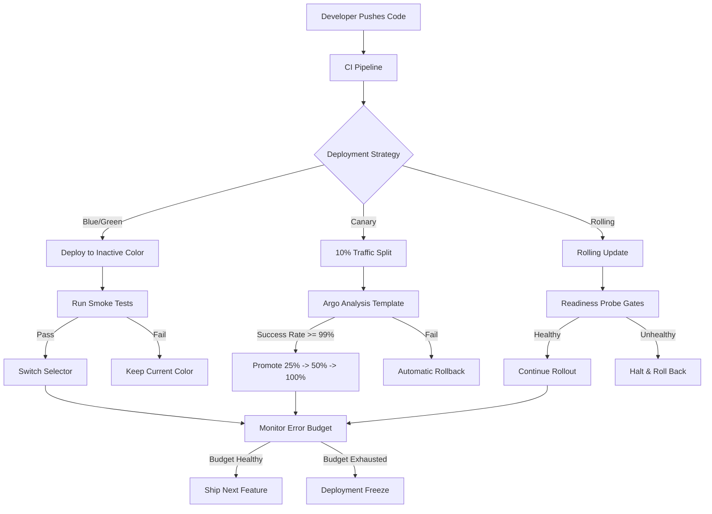

---

## 2. Service Catalog

| Service | Port | Language / Framework | Health Endpoint | Metrics Endpoint | Criticality | Notes |
|---|---|---|---|---|---|---|
| **Backend** | `3001` | Express + TypeScript | `GET /health` | `GET /metrics` (Prometheus) | **Tier 1 -- Critical** | Core REST API, auth, chat, properties, forums, commute, graph, Swagger |
| **Frontend** | `3000` | Next.js (Pages Router) | `GET /` | N/A (RUM via Datadog) | **Tier 1 -- Critical** | Web UI for chat, map, insights, market pulse |
| **MCP Server** | `8787` (stdio) | Node.js + TypeScript | TCP socket probe | Internal counters | **Tier 2 -- High** | 60+ tools, scoped HMAC auth, domain servers |
| **Agentic AI** | `4318` | Node.js + TypeScript | `GET /health` | Custom Prometheus counters | **Tier 2 -- High** | Multi-agent runtime: LangGraph, CrewAI, orchestrator, supervisor |
| **gRPC** | `50051` | Node.js + Protobuf | TCP socket probe | N/A | **Tier 2 -- High** | Market pulse streaming service |
| **Deployment Control API** | `4100` | Node.js | `GET /health` | Internal | **Tier 3 -- Standard** | Deployment orchestration API |
| **Deployment Control UI** | `3000` | Nuxt.js | `GET /` | N/A | **Tier 3 -- Standard** | Deployment management dashboard |
| **SRE Dashboard** | `4200` | Vanilla JS + Chart.js | Static file serve | N/A | **Tier 4 -- Informational** | Real-time observability dashboard |

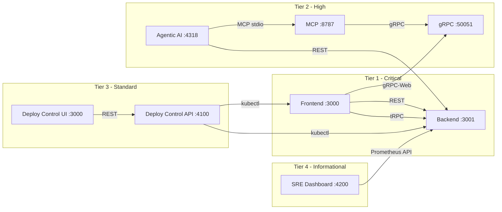

---

## 3. Service Level Objectives (SLOs)

> **Canonical source:** [`docs/SLO.md`](docs/SLO.md)

### SLO Summary Table

| SLO | SLI | Target | Window | Category |
|---|---|---|---|---|
| API Availability | `1 - (5xx responses / total responses)` | **99.9%** | 30 days | Availability |
| API Latency P95 | 95th percentile response time | **< 500 ms** | 30 days | Latency |
| API Latency P99 | 99th percentile response time | **< 1000 ms** | 30 days | Latency |
| Frontend Availability | Successful page loads / total loads | **99.9%** | 30 days | Availability |
| Database Availability | Successful queries / total queries | **99.95%** | 30 days | Availability |
| Error Rate | 5xx + 4xx (server) / total requests | **< 0.1%** | 30 days | Quality |
| Chat Response Time | Time from user message to first token | **< 3 s** target, **< 10 s** critical | 30 days | Latency |
| Map Load Time | Time to interactive map render | **< 2 s** target, **< 5 s** critical | 30 days | Latency |
| Graph Query Time | Neo4j query round-trip | **< 1.5 s** target, **< 3 s** critical | 30 days | Latency |
| Vector Search Time | Embedding similarity search | **< 500 ms** target, **< 1500 ms** critical | 30 days | Latency |

### Error Budget Derived from SLOs

- **API Availability 99.9%** over 30 days = **43,200 seconds** total window = **43.2 seconds** allowed downtime? No -- 30 days = 2,592,000 seconds, 0.1% = **2,592 seconds = 43.2 minutes** of allowed downtime.

### SLI-to-SLO-to-Error-Budget Flow

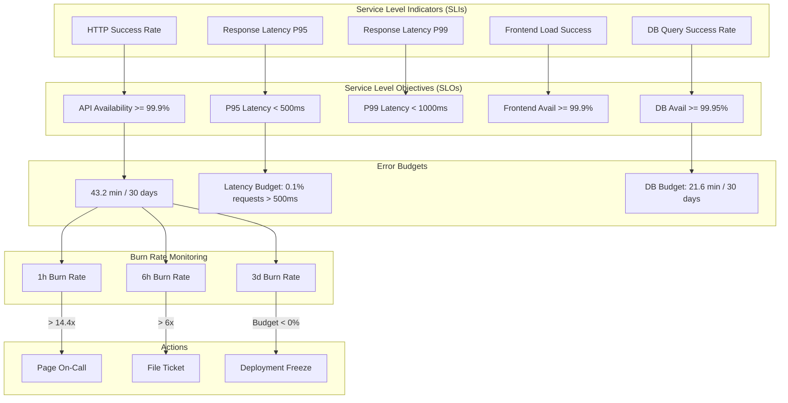

---

## 4. Error Budgets

### How Error Budgets Work

An error budget is the inverse of an SLO: it quantifies the amount of unreliability a service can tolerate before violating its objective.

| SLO Target | 30-Day Window (seconds) | Allowed Failure (seconds) | Allowed Failure (minutes) |
|---|---|---|---|
| 99.9% | 2,592,000 | 2,592 | **43.2** |
| 99.95% | 2,592,000 | 1,296 | **21.6** |
| 99.99% | 2,592,000 | 259.2 | **4.32** |

### EstateWise API Error Budget

- **SLO:** 99.9% availability
- **Window:** 30 days
- **Total minutes in window:** 43,200
- **Error budget:** 43,200 x 0.001 = **43.2 minutes**

### Burn Rate

Burn rate measures how quickly the error budget is being consumed relative to the steady-state rate.

- **Burn Rate 1.0** = consuming budget exactly at the sustainable rate (will exhaust at end of window)
- **Burn Rate 14.4** = consuming budget 14.4x faster than sustainable (will exhaust in ~50 hours)
- **Burn Rate 6.0** = consuming budget 6x faster (will exhaust in ~5 days)

### Budget Exhaustion Policy

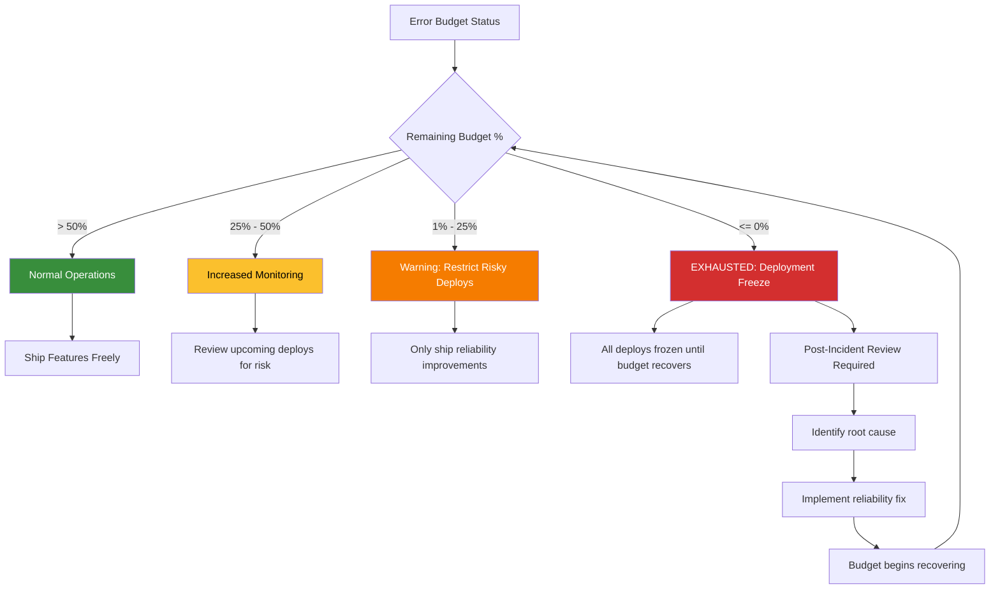

---

## 5. Monitoring Stack

### Architecture Overview

EstateWise employs a defense-in-depth monitoring strategy with five complementary systems:

| System | Role | Retention | Deployment |
|---|---|---|---|
| **Prometheus** | Metrics collection, SLI recording rules, alerting | 15 days (local), long-term via remote write | Kubernetes StatefulSet |
| **Datadog** | APM, logs, 17 monitors, SLOs, synthetic checks, CI visibility | 15 days (metrics), 30 days (logs) | DaemonSet agent |
| **Grafana** | Dashboard visualization | N/A (reads from Prometheus) | Kubernetes Deployment |
| **Jaeger** | Distributed tracing | 7 days | Kubernetes Deployment |
| **Loki** | Log aggregation and querying | 14 days | Kubernetes Deployment |

### Scrape Targets

| Target | Endpoint | Interval | Labels |
|---|---|---|---|
| Backend API | `:3001/metrics` | 15s | `job=estatewise-backend` |
| Node Exporter | `:9100/metrics` | 15s | `job=node-exporter` |
| MongoDB Exporter | `:9216/metrics` | 30s | `job=mongodb-exporter` |
| Redis Exporter | `:9121/metrics` | 30s | `job=redis-exporter` |

### Monitoring Architecture Diagram

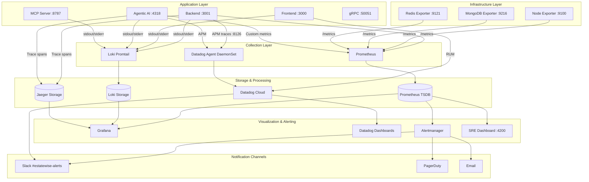

### Datadog Integration

Datadog provides the commercial observability layer with:

- **17 Monitors** covering API health, latency, error rates, infrastructure metrics, and synthetic checks
- **SLOs** mirroring Prometheus-based SLOs for cross-validation
- **Synthetic Checks** for end-to-end user journey testing
- **CI Visibility** for pipeline performance and deployment tracking
- **Deployment Events** via `datadog-ci deployment mark` for change correlation
- **Terraform-Managed Dashboard** for infrastructure-as-code dashboard provisioning

### Grafana Dashboard Panels

The canonical Grafana dashboard (`kubernetes/monitoring/grafana-dashboard.json`) includes six panels:

| Panel | Query Type | Description |
|---|---|---|
| Request Rate | `rate(http_requests_total[5m])` | Requests per second by status code |
| Error Rate | `rate(http_requests_total{status=~"5.."}[5m])` | 5xx error rate |
| P95 Latency | `histogram_quantile(0.95, rate(http_request_duration[5m]))` | 95th percentile response time |
| Pod Count | `kube_deployment_status_replicas` | Running replicas per deployment |
| CPU Usage | `container_cpu_usage_seconds_total` | CPU consumption per pod |
| Memory Usage | `container_memory_working_set_bytes` | Memory consumption per pod |

---

## 6. Alerting

### Alert Rules by Category

#### Availability Alerts

| Alert | Condition | Severity | Action |
|---|---|---|---|
| `HighErrorRate` | 5xx rate > 1% for 5 minutes | Critical | Page on-call, escalate after 15 min |
| `ServiceDown` | Health check fails for 2 minutes | Critical | Page on-call immediately |
| `DatabaseConnectionExhaustion` | Active connections > 90% pool | Critical | Page on-call, scale pool |
| `FrontendAvailabilityDegraded` | Page load success < 99.5% for 10 min | Warning | File ticket |

#### Latency Alerts

| Alert | Condition | Severity | Action |
|---|---|---|---|
| `SLOLatencyBurnRateCritical` | P95 > 500ms in both 1h and 6h windows | Critical | Page on-call |
| `HighP99Latency` | P99 > 1000ms for 10 minutes | Warning | File ticket |
| `ChatResponseSlow` | Chat P95 > 3s for 5 minutes | Warning | Investigate LLM provider latency |
| `MapLoadSlow` | Map load P95 > 2s for 5 minutes | Warning | Check tile server + CDN |

#### Infrastructure Alerts

| Alert | Condition | Severity | Action |
|---|---|---|---|
| `PodCrashLooping` | Restart count > 3 in 10 minutes | Critical | Page on-call |
| `HighCPU` | CPU > 90% for 10 minutes | Warning | Check HPA, consider manual scale |
| `HighMemory` | Memory > 90% for 10 minutes | Warning | Check for memory leaks |
| `DiskPressure` | Disk > 85% | Warning | Expand PVC or clean up |
| `HPAMaxedOut` | Current replicas = max replicas for 30 min | Warning | Review HPA limits |

#### SLO Burn-Rate Alerts

| Alert | Condition | Severity | Action |
|---|---|---|---|
| `SLOBurnRateCritical` | 1h > 14.4x AND 6h > 6x | Critical | Page on-call |
| `SLOBurnRateWarning` | 6h > 6x AND 3d > 3x | Warning | File ticket |
| `SLOBurnRateTrend` | 3d > 1x | Info | Review in next standup |
| `SLOErrorBudgetLow` | Remaining < 25% | Warning | Restrict risky deploys |
| `SLOErrorBudgetExhausted` | Remaining <= 0% | Critical | Deployment freeze |

### Alert Routing & Escalation

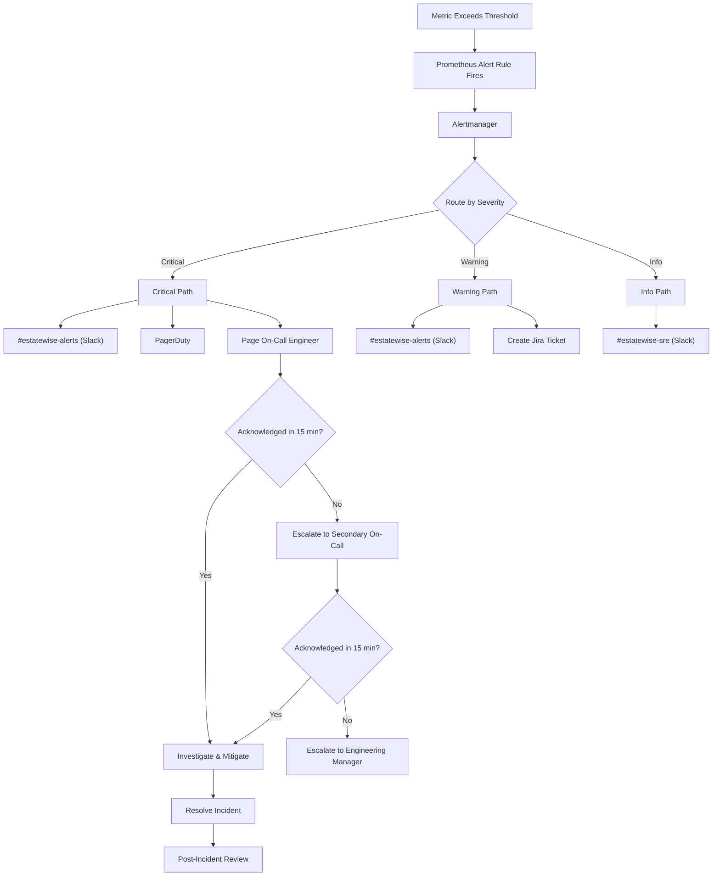

---

## 7. Burn-Rate Alerting

### Multi-Window Burn-Rate Strategy

EstateWise implements the Google SRE multi-window burn-rate alerting pattern. This approach uses multiple observation windows to balance **detection speed** against **alert precision**:

- **Short windows** (1 hour) detect rapid consumption -- immediate threats
- **Medium windows** (6 hours) confirm the trend is sustained -- reduces noise
- **Long windows** (3 days) detect slow erosion -- catches chronic degradation

### Prometheus Recording Rules

```yaml
# 1-hour burn rate
- record: sli:burn_rate:1h
  expr: |
    1 - (
      sum(rate(http_requests_total{status!~"5.."}[1h]))
      /
      sum(rate(http_requests_total[1h]))
    )
    /
    (1 - 0.999)

# 6-hour burn rate
- record: sli:burn_rate:6h
  expr: |
    1 - (
      sum(rate(http_requests_total{status!~"5.."}[6h]))
      /
      sum(rate(http_requests_total[6h]))
    )
    /
    (1 - 0.999)

# 3-day burn rate
- record: sli:burn_rate:3d
  expr: |
    1 - (
      sum(rate(http_requests_total{status!~"5.."}[3d]))
      /
      sum(rate(http_requests_total[3d]))
    )
    /
    (1 - 0.999)

# Remaining error budget ratio
- record: sli:error_budget:remaining_ratio
  expr: |
    1 - (
      sum(increase(http_requests_total{status=~"5.."}[30d]))
      /
      (sum(increase(http_requests_total[30d])) * (1 - 0.999))
    )
```

### Alert Thresholds

| Alert | Short Window | Long Window | Severity | Time to Exhaust Budget | Use Case |
|---|---|---|---|---|---|
| `SLOBurnRateCritical` | 1h > **14.4x** | 6h > **6x** | Critical (page) | ~2 hours | Major outage, rapid error spike |
| `SLOBurnRateWarning` | 6h > **6x** | 3d > **3x** | Warning (ticket) | ~5 days | Sustained degradation |
| `SLOBurnRateTrend` | -- | 3d > **1x** | Info | ~30 days | Slow drift toward SLO breach |
| `SLOErrorBudgetLow` | -- | Remaining < **25%** | Warning | N/A | Budget running low |
| `SLOErrorBudgetExhausted` | -- | Remaining <= **0%** | Critical | N/A | Budget fully consumed |
| `SLOLatencyBurnRateCritical` | P95 > 500ms (1h) | P95 > 500ms (6h) | Critical | N/A | Latency SLO breach |

### Worked Example

**Scenario:** A bad deploy causes 50% of requests to return 500 errors for 20 minutes.

1. **Steady-state error rate:** 0.05% (well within 0.1% SLO)
2. **During incident:** 50% error rate
3. **1h burn rate calculation:**
   - Error rate in 1h window ~ 50% (for the 20 min affected portion, weighted)
   - Burn rate = (observed failure rate) / (allowed failure rate) = 0.50 / 0.001 = **500x**
4. **Alert fires:** `SLOBurnRateCritical` fires immediately (500x >> 14.4x threshold)
5. **Budget consumed:** 20 minutes at 50% error rate on a 1000 req/min service = 10,000 failed requests
   - If total 30-day requests = 43,200,000, budget = 43,200 failures
   - Consumed = 10,000 / 43,200 = **23.1% of monthly error budget** in 20 minutes

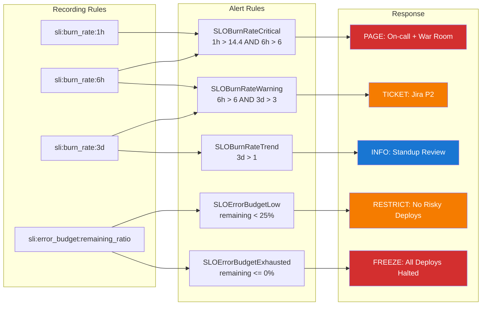

---

## 8. Deployment Strategies

EstateWise supports three deployment strategies, each chosen based on the criticality and risk profile of the change.

### Strategy Selection Matrix

| Strategy | Services | Risk Level | Rollback Time | SLO Impact |
|---|---|---|---|---|
| **Blue/Green** | Backend, Frontend | Medium-High | Seconds (selector switch) | Near-zero (instant fallback) |
| **Canary (Argo)** | Backend, Agentic AI | High | Seconds (automatic) | Minimal (limited blast radius) |
| **Canary (Flagger)** | Frontend preview | Medium | Automatic | Minimal |
| **Rolling Update** | MCP, gRPC, Infra | Low | Minutes | Brief availability dip possible |

### Blue/Green Deployment

Blue/Green maintains two identical production environments. At any time, one is live (receiving traffic) and one is idle (staging the next release).

**Configuration:**
- Two Deployment manifests: `color: blue` and `color: green`
- Each has **2 replicas**
- Service selector toggles between `color: blue` and `color: green`
- Traffic switch is instantaneous via `kubectl patch`

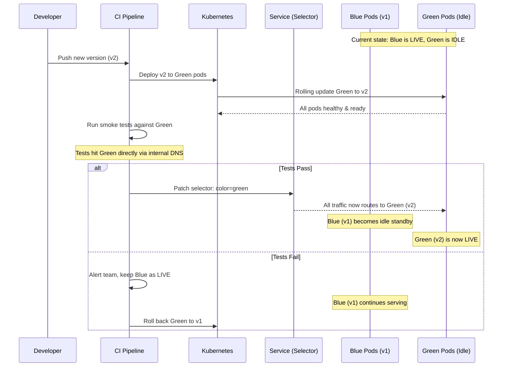

### Canary Deployment (Argo Rollouts)

Canary progressively shifts traffic to the new version while running automated analysis at each step.

**Progression:** `10%` --> `25%` --> `50%` --> `100%`

**Analysis Template Thresholds:**
- Success rate >= **99%** (measured via Prometheus)
- P95 latency <= **800ms** (measured via Prometheus)

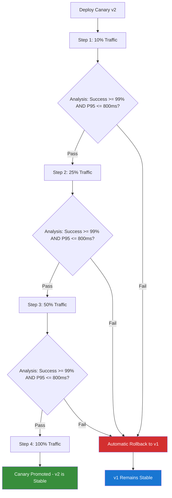

### Flagger Canary (Frontend Preview)

Flagger manages a more conservative canary for the frontend:

- **Max traffic weight:** 50%
- **Step weight:** 10% increments
- Automatically rolls back if frontend availability degrades

### Rolling Updates

Used for lower-risk services (MCP, gRPC, infrastructure components):

- `maxSurge: 25%`, `maxUnavailable: 25%`
- Kubernetes waits for readiness probes before routing traffic
- PodDisruptionBudget ensures minimum availability during updates

---

## 9. Progressive Delivery

### Argo Rollouts Configuration

Progressive delivery in EstateWise is powered by Argo Rollouts, which extends Kubernetes Deployments with advanced deployment strategies and automated analysis.

```yaml
# Simplified Argo Rollout spec for Backend
apiVersion: argoproj.io/v1alpha1
kind: Rollout
metadata:
  name: estatewise-backend
spec:
  replicas: 4
  strategy:
    canary:
      steps:
        - setWeight: 10
        - analysis:
            templates:
              - templateName: success-rate
              - templateName: latency-check
        - setWeight: 25
        - analysis:
            templates:
              - templateName: success-rate
              - templateName: latency-check
        - setWeight: 50
        - analysis:
            templates:
              - templateName: success-rate
              - templateName: latency-check
        - setWeight: 100
      canaryService: estatewise-backend-canary
      stableService: estatewise-backend-stable
      trafficRouting:
        istio:
          virtualService:
            name: estatewise-backend-vsvc
```

### Analysis Templates

```yaml
# Success Rate Analysis
apiVersion: argoproj.io/v1alpha1
kind: AnalysisTemplate
metadata:
  name: success-rate
spec:
  metrics:
    - name: success-rate
      interval: 60s
      count: 5
      successCondition: result[0] >= 0.99
      provider:
        prometheus:
          address: http://prometheus:9090
          query: |
            sum(rate(http_requests_total{status!~"5..",app="estatewise-backend",
              rollouts_pod_template_hash="{{args.canary-hash}}"}[5m]))
            /
            sum(rate(http_requests_total{app="estatewise-backend",
              rollouts_pod_template_hash="{{args.canary-hash}}"}[5m]))

# Latency Analysis
apiVersion: argoproj.io/v1alpha1
kind: AnalysisTemplate
metadata:
  name: latency-check
spec:
  metrics:
    - name: p95-latency
      interval: 60s
      count: 5
      successCondition: result[0] <= 0.8
      provider:
        prometheus:
          address: http://prometheus:9090
          query: |
            histogram_quantile(0.95,
              sum(rate(http_request_duration_seconds_bucket{app="estatewise-backend",
                rollouts_pod_template_hash="{{args.canary-hash}}"}[5m]))
              by (le))
```

### Automatic Rollback Flow

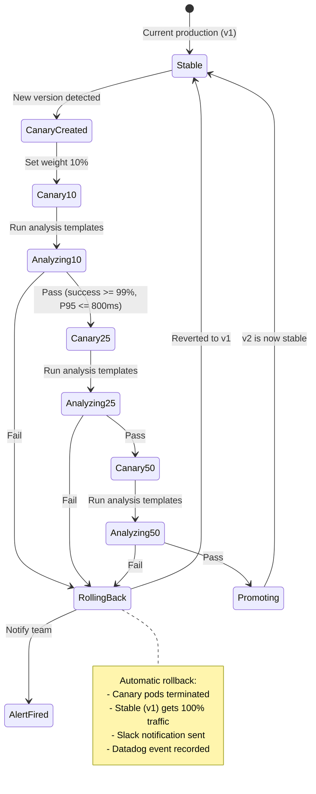

---

## 10. Multi-Region

### Traffic Distribution

EstateWise operates across four AWS regions with weighted DNS routing:

| Region | Code | Traffic Weight | Role |
|---|---|---|---|
| US East (Virginia) | `us-east-1` | **40%** | Primary, write master |
| US West (Oregon) | `us-west-2` | **30%** | Secondary |
| EU West (Ireland) | `eu-west-1` | **20%** | EU compliance + low latency |
| Asia Pacific (Singapore) | `ap-southeast-1` | **10%** | APAC low latency |

### Failover Configuration

| Parameter | Value |
|---|---|
| Health check interval | **30 seconds** |
| Failures before unhealthy | **3 consecutive** |
| Successes before healthy | **2 consecutive** |
| Time to detect failure | ~90 seconds (3 x 30s) |
| Time to confirm recovery | ~60 seconds (2 x 30s) |

### Data Replication

- **MongoDB:** Active-passive replication with **5-second lag target**
- Primary writes in `us-east-1`, replicated to all other regions
- Read preference: `nearest` for read-heavy workloads, `primary` for consistency-critical reads

### Service Mesh

- **Istio** consistent hash load balancing for session affinity
- Outlier detection ejects unhealthy endpoints after consecutive failures
- mTLS between all services within and across regions

### Multi-Region Architecture

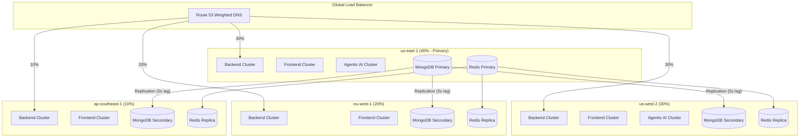

### Failover Sequence

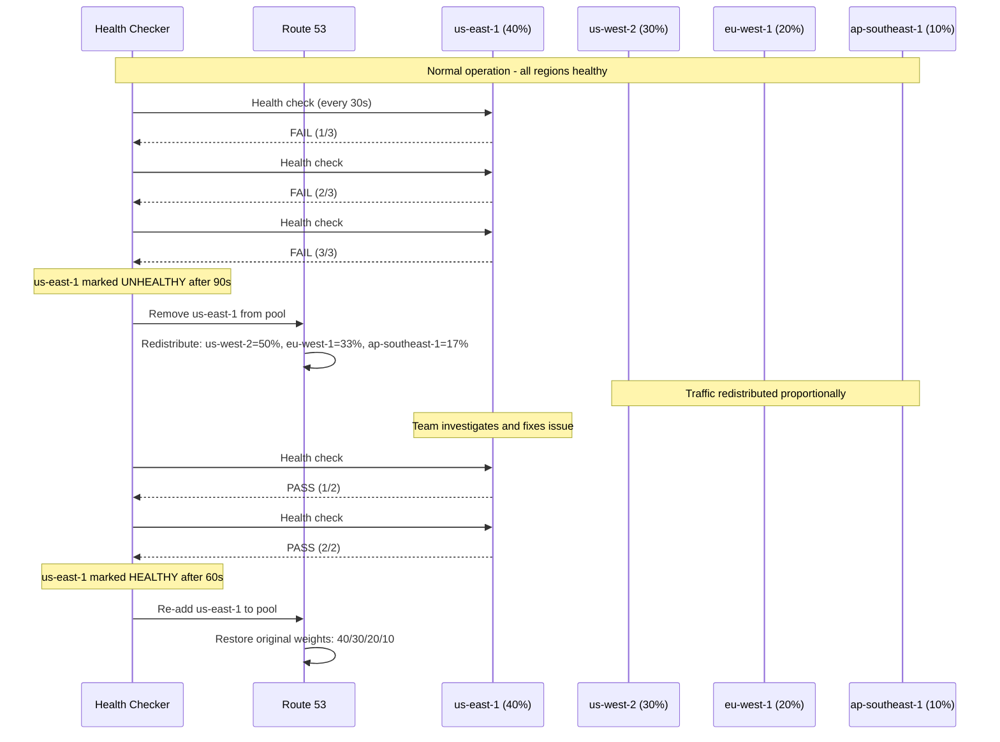

---

## 11. Health Checks & Probes

### Kubernetes Probe Configuration

| Service | Probe Type | Mechanism | Initial Delay | Period | Timeout | Failure Threshold |
|---|---|---|---|---|---|---|
| **Backend** (readiness) | Readiness | `httpGet /health` | 10s | 15s | 5s | 3 |
| **Backend** (liveness) | Liveness | `httpGet /health` | 30s | 30s | 5s | 3 |
| **Frontend** (readiness) | Readiness | `httpGet /` | 15s | 20s | 5s | 3 |
| **Frontend** (liveness) | Liveness | `httpGet /` | 30s | 30s | 5s | 3 |
| **gRPC** (readiness) | Readiness | `tcpSocket :50051` | 10s | 15s | 5s | 3 |
| **gRPC** (liveness) | Liveness | `tcpSocket :50051` | 30s | 30s | 5s | 3 |
| **MCP** (readiness) | Readiness | `tcpSocket :8787` | 10s | 15s | 5s | 3 |
| **MCP** (liveness) | Liveness | `tcpSocket :8787` | 20s | 30s | 5s | 3 |
| **Agentic AI** (readiness) | Readiness | `httpGet /health` | 15s | 15s | 5s | 3 |
| **Agentic AI** (liveness) | Liveness | `httpGet /health` | 30s | 30s | 5s | 3 |

### Probe Decision Flow

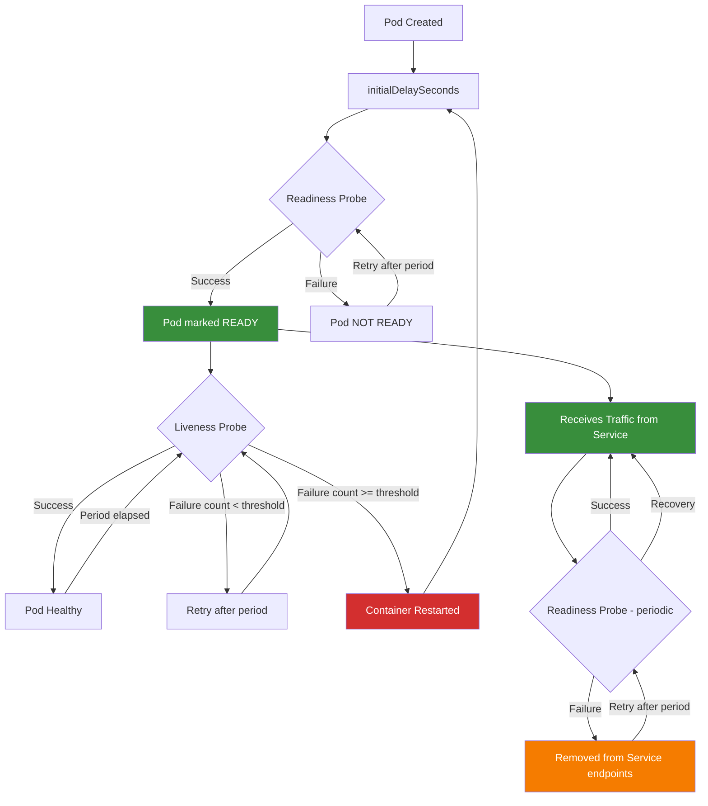

---

## 12. Autoscaling

### Horizontal Pod Autoscaler (HPA) Configuration

| Service | Min Replicas | Max Replicas | CPU Target | Memory Target | Scale-Up Stabilization | Scale-Down Stabilization |
|---|---|---|---|---|---|---|
| **Backend** | 2 | 10 | 70% | 80% | 0s (immediate) | 300s (5 min) |
| **Frontend** | 2 | 8 | 75% | 85% | 0s | 300s |
| **gRPC** | 2 | 12 | 70% | 80% | 0s | 300s |
| **Agentic AI** | 2 | 5 | 70% | 80% | 0s | 300s |

### PodDisruptionBudget (PDB)

All services have PDB configured with `minAvailable: 1` to ensure at least one pod remains running during voluntary disruptions (node drains, cluster upgrades, rolling updates).

| Service | `minAvailable` | Effect |
|---|---|---|
| Backend | 1 | At least 1 backend pod always running |
| Frontend | 1 | At least 1 frontend pod always running |
| gRPC | 1 | At least 1 gRPC pod always running |
| MCP | 1 | At least 1 MCP pod always running |
| Agentic AI | 1 | At least 1 agentic pod always running |

### Scaling Behavior Diagram

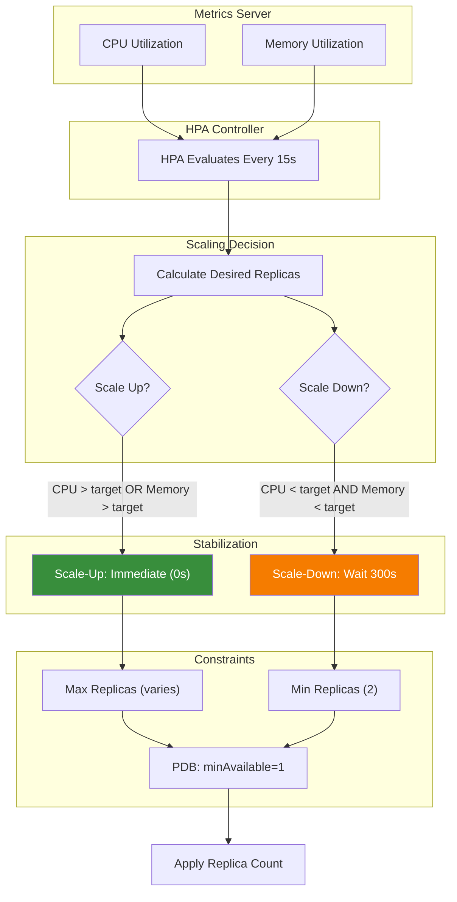

---

## 13. SRE Dashboard

<p align="center">
  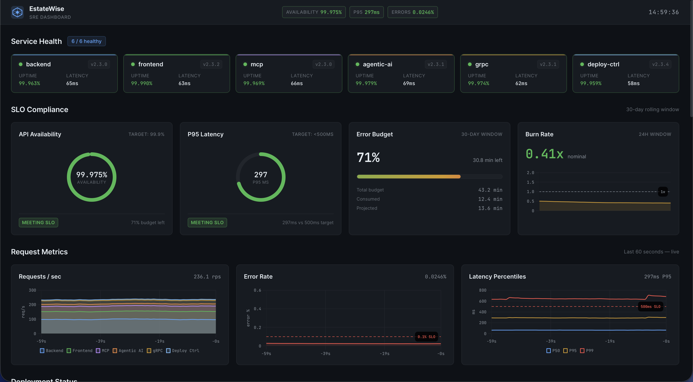
</p>

### Overview

The SRE dashboard is a standalone web application located in the `sre-dashboard/` directory. It provides real-time visibility into service health, SLO compliance, request metrics, deployment status, infrastructure performance, multi-region distribution, agentic AI observability, DORA metrics, and live alerts.

Since this is open-source, we also provide a mock data engine that simulates realistic metrics and SLO attainment for development and demonstration purposes. In production, the dashboard connects to real data sources like Prometheus, Datadog, and deployment-control APIs.

| Property | Value |
|---|---|
| **Location** | `sre-dashboard/` |
| **Port** | `4200` |
| **Charting Library** | Chart.js 4 |
| **Theme** | Dark |
| **Refresh Rate** | 1 second |
| **Data Source (default)** | Mock data engine with seeded PRNG |
| **Data Source (production)** | Prometheus, Datadog, deployment-control APIs |

> [!NOTE]
> In our real production environment, the dashboard is deployed as a Kubernetes Deployment with a Service and Ingress, secured with TLS and basic auth. It runs in the `sre-dashboard` namespace and is only accessible to SREs via VPN, and displays live data from our monitoring and deployment systems. For security and simplicity, we do not expose it publicly.

### Dashboard Sections

| Section | Displays | Visualization |
|---|---|---|
| **Service Health** | Up/down status for all services | Status indicators |
| **SLO Compliance** | Current SLO attainment per objective | Gauges, error budget bars, burn rate trend |
| **Request Metrics** | Request rate, error rate, latency | Line charts (Chart.js) |
| **Deployment Status** | Blue/green active color, canary progress | Status cards |
| **Infrastructure** | CPU, memory, pod count, HPA status | Area charts, gauges |
| **Multi-Region** | Per-region traffic weight and health | Region map |
| **Agentic AI Observability** | Token usage, agent errors, tool calls, cost | Counters, line charts |
| **DORA Metrics** | Deploy frequency, lead time, MTTR, CFR | Scorecards |
| **Alerts Feed** | Live alert stream | Scrolling feed |

### Running the Dashboard

```bash
# Development mode (mock data)
cd sre-dashboard && npx serve . -l 4200

# Or with Python
cd sre-dashboard && python3 -m http.server 4200
```

### Wiring Live Data

Set environment variables to connect to real data sources:

```bash
PROMETHEUS_URL=http://prometheus:9090      # Prometheus query API
DATADOG_API_KEY=<key>                       # Datadog API key
DATADOG_APP_KEY=<key>                       # Datadog application key
DEPLOYMENT_CONTROL_URL=http://localhost:4100 # Deployment control API
```

### Mock Data Engine

The mock data engine provides realistic synthetic data with:

- **Seeded PRNG** for reproducible data across sessions
- **EMA (Exponential Moving Average) smoothing** to simulate realistic metric trends
- **Gaussian noise** for natural variation
- **Diurnal patterns** simulating day/night traffic cycles

> See [`sre-dashboard/README.md`](sre-dashboard/README.md) for full documentation.

---

## 14. DORA Metrics

EstateWise tracks all four DORA (DevOps Research and Assessment) metrics, targeting **Elite** performance across the board.

### Metric Definitions and Targets

| Metric | Definition | Elite Target | EstateWise Target | Measurement |
|---|---|---|---|---|
| **Deployment Frequency** | How often code is deployed to production | On-demand (multiple/day) | **>= 1 per day** | CI/CD pipeline deploys tracked via Datadog CI |
| **Lead Time for Changes** | Time from commit to production | Less than one hour | **<= 24 hours** | Git commit timestamp to deployment event delta |
| **Mean Time to Recovery (MTTR)** | Time from incident detection to resolution | Less than one hour | **<= 60 minutes** | Incident management system timestamps |
| **Change Failure Rate (CFR)** | Percentage of deploys causing incidents | 0-15% | **<= 5%** | Failed canary analyses / total deploys |

### DORA Classification

```
Performance Tiers:
  Elite    -----> EstateWise targets ALL FOUR metrics at this tier
  High     ----->
  Medium   ----->
  Low      ----->
```

### How DORA Metrics Are Collected

1. **Deployment Frequency:** Every deployment triggers a `datadog-ci deployment mark` event. The SRE dashboard aggregates these into daily/weekly counts.
2. **Lead Time:** Calculated from the Git commit SHA timestamp to the Argo Rollout promotion timestamp.
3. **MTTR:** Measured from the first alert fire (Alertmanager or Datadog) to the incident resolution marker in the incident tracking system.
4. **Change Failure Rate:** Canary rollbacks and post-deploy incidents are tracked as failures. The ratio is computed against total successful deployments.

---

## 15. Incident Response

### Runbook Inventory

Runbooks are defined in `kubernetes/monitoring/incident-response.yaml` and cover the following scenarios:

| Runbook | Trigger | Priority | First Responder Action |
|---|---|---|---|
| **High Error Rate** | 5xx rate > 1% for 5 min | P1 | Check recent deploys, review logs in Loki, rollback if canary |
| **Pod Crash Loops** | Restart count > 3 in 10 min | P1 | Check pod events, review OOM kills, check resource limits |
| **DB Connection Exhaustion** | Active connections > 90% pool | P1 | Scale connection pool, check for connection leaks, restart idle connections |
| **High Latency** | P95 > 500ms sustained | P2 | Check downstream dependencies, review query plans, check cache hit rates |

### Weekly SLO Report

A Kubernetes CronJob runs every **Monday at 9:00 AM** and posts a comprehensive SLO report to the `@slack-estatewise-alerts` channel. The report includes:

- Current attainment for each SLO
- Error budget consumed and remaining
- Burn rate trends (1h, 6h, 3d)
- Week-over-week comparison
- Action items if any SLO is at risk

### Incident Response Sequence

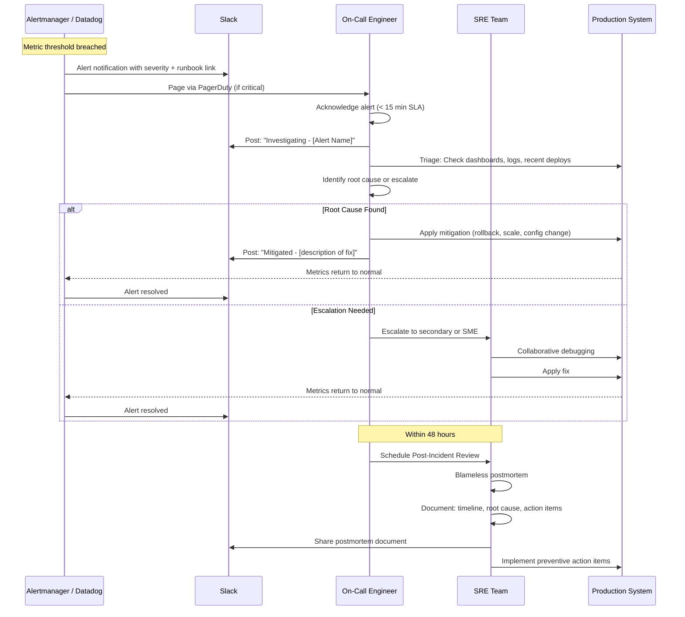

### Post-Incident Review Process

1. **Timeline Construction** -- Document every event from first signal to resolution.
2. **Root Cause Analysis** -- Identify the underlying cause, not just the proximate trigger.
3. **Impact Assessment** -- Quantify error budget consumed, users affected, revenue impact.
4. **Action Items** -- Generate concrete, assigned, time-bound action items to prevent recurrence.
5. **Blameless Culture** -- Focus on systemic improvements, not individual fault.

### Escalation Matrix

| Time Since Alert | Action |
|---|---|
| 0 minutes | Alert fires, routed to on-call |
| 15 minutes | If unacknowledged, escalate to secondary on-call |
| 30 minutes | If unresolved, escalate to engineering manager |
| 60 minutes | If unresolved, war room with all relevant SMEs |
| 4 hours | Executive notification if user-facing impact persists |

---

## 16. Agentic AI Observability

The Agentic AI runtime requires specialized observability beyond standard HTTP metrics due to its unique operational characteristics: LLM API calls, multi-agent orchestration, token consumption, and cost tracking.

### Custom Metrics

#### Counters

| Metric | Labels | Description |
|---|---|---|
| `tokens_consumed_total` | `agent`, `model`, `direction` (input/output) | Total tokens consumed across all LLM calls |
| `agent_errors_total` | `agent`, `error_type` | Total agent execution errors |
| `tool_calls_total` | `agent`, `tool`, `status` (success/failure) | Total MCP tool invocations |
| `cost_usd_total` | `agent`, `model` | Cumulative cost in USD |

#### Histograms

| Metric | Labels | Buckets | Description |
|---|---|---|---|
| `agent_request_duration_seconds` | `agent`, `task_type` | 0.5, 1, 2, 5, 10, 30, 60, 120 | End-to-end agent task duration |

#### Gauges

| Metric | Labels | Description |
|---|---|---|
| `cache_hit_ratio` | `cache_type` | Ratio of cache hits to total lookups |
| `schema_validation_pass_rate` | `agent` | Rate of successful schema validations |
| `grounding_violation_rate` | `agent` | Rate of grounding rule violations (fabricated data) |
| `daily_budget_utilization` | `agent` | Fraction of daily token/cost budget consumed |

### In-Process Distributed Tracer

The Agentic AI runtime includes a custom in-process tracer that generates structured span trees for every agent execution:

```json
{
  "traceId": "abc123",
  "spans": [
    {
      "spanId": "span-1",
      "parentSpanId": null,
      "operation": "supervisor.dispatch",
      "duration_ms": 4520,
      "events": ["agent_selected: property-analyst"],
      "attributes": { "task": "analyze property 12345" }
    },
    {
      "spanId": "span-2",
      "parentSpanId": "span-1",
      "operation": "agent.property-analyst.execute",
      "duration_ms": 4200,
      "events": ["tool_call: property-search", "tool_call: market-data"],
      "attributes": { "tokens_in": 1200, "tokens_out": 850 }
    }
  ]
}
```

### Circuit Breakers

MCP tool calls are protected by circuit breakers that prevent cascading failures:

- **Threshold:** 3 consecutive failures
- **Behavior:** Circuit opens, subsequent calls to that tool are skipped during cooldown
- **Cooldown:** Configurable per tool (default: 60 seconds)
- **Recovery:** After cooldown, circuit enters half-open state; first success closes the circuit

### Per-Agent Tool Budgets

The orchestration engine enforces resource budgets per agent to prevent runaway costs:

| Budget Type | Enforcement | On Exceed |
|---|---|---|
| Max tool calls per task | Counter per agent execution | Remaining tool calls truncated, partial result returned |
| Token ceiling per task | Sum of input + output tokens | Agent execution halted, partial result returned |
| Execution timeout | Wall-clock timer | Agent killed, timeout error returned |

### Agentic AI Observability Architecture

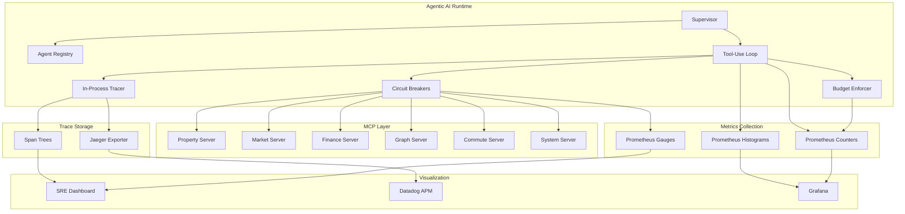

---

## 17. Resource Budgets

### Kubernetes Resource Limits

| Service | CPU Request | CPU Limit | Memory Request | Memory Limit |
|---|---|---|---|---|
| **Backend** | 250m | 500m | 512 Mi | 1 Gi |
| **Frontend** | 150m | 300m | 256 Mi | 512 Mi |
| **gRPC** | 200m | 400m | 256 Mi | 512 Mi |
| **MCP** | 100m | 250m | 128 Mi | 256 Mi |
| **Agentic AI** | 250m | 1000m | 512 Mi | 2 Gi |
| **Datadog Agent** | 200m | 500m | 256 Mi | 512 Mi |
| **Total (per node, all services)** | **1150m** | **2950m** | **1920 Mi** | **4800 Mi** |

### Resource Rationale

| Service | CPU Rationale | Memory Rationale |
|---|---|---|
| **Backend** | Moderate CPU for request handling, serialization | 1 Gi limit for large response payloads, connection pools |
| **Frontend** | Low CPU for SSR | 512 Mi for Next.js SSR page cache |
| **gRPC** | Moderate CPU for protobuf serialization | 512 Mi for streaming buffers |
| **MCP** | Low CPU, stdio-based | 256 Mi, lightweight tool execution |
| **Agentic AI** | High CPU limit (1000m) for LLM orchestration | 2 Gi for context windows, embedding caches, span trees |
| **Datadog Agent** | Moderate for metric collection and forwarding | 512 Mi for metric buffering |

### Resource Allocation Diagram

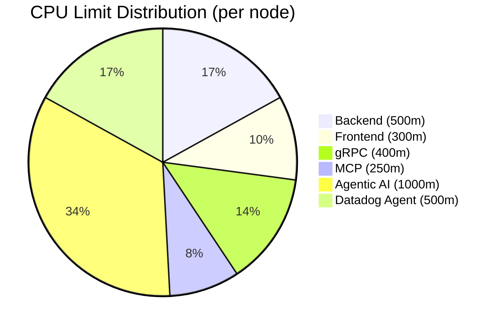

---

## 18. Toil Reduction

EstateWise systematically identifies and eliminates operational toil through automation.

### Automated Processes

| Toil Category | Before (Manual) | After (Automated) | Mechanism |
|---|---|---|---|
| **SLO Reporting** | Manually query Prometheus, compile spreadsheet, post to Slack | Fully automated weekly report | Kubernetes CronJob (Mondays 9 AM) |
| **Deployment** | SSH into servers, pull code, restart | GitOps pipeline with progressive delivery | Argo Rollouts + analysis templates |
| **Canary Validation** | Manually check dashboards during deploy | Automated analysis with auto-rollback | Argo AnalysisTemplate + Prometheus queries |
| **Scaling** | Manual `kubectl scale` commands | Automatic horizontal scaling | HPA with CPU/memory targets |
| **Certificate Rotation** | Manual renewal and deployment | Automatic renewal | cert-manager + Let's Encrypt |
| **Incident Detection** | Watching dashboards | Multi-window burn-rate alerts | Prometheus recording rules + Alertmanager |
| **Dashboard Provisioning** | Manual Grafana JSON editing | Infrastructure-as-code | Terraform-managed Datadog dashboards |
| **Deployment Orchestration** | kubectl commands per service | Self-service UI | deployment-control API + Nuxt UI |
| **Log Correlation** | Manual grepping across pods | Centralized log aggregation | Loki + Grafana |
| **Trace Analysis** | printf debugging | Distributed tracing | Jaeger + Datadog APM |

### Toil Budget

The team targets less than **30% of engineering time** spent on toil. Any operational task performed more than twice is a candidate for automation.

### GitOps Workflow

All infrastructure and deployment configuration is version-controlled:

```
kubernetes/
  monitoring/
    prometheus-config.yaml       # Prometheus scrape config + recording rules + alerts
    grafana-dashboard.json       # Grafana dashboard definition
    incident-response.yaml       # Runbook definitions
  deployments/
    blue-green/                  # Blue/Green deployment manifests
    canary/                      # Argo Rollout + AnalysisTemplate manifests
helm/
  estatewise/                    # Helm chart for all services
terraform/
  datadog/                       # Datadog dashboard + monitors as code
```

Changes to monitoring, alerting, and deployment configuration follow the same PR review process as application code.

---

## 19. References

| Document | Path | Description |
|---|---|---|
| **SLO Definitions** | [`docs/SLO.md`](docs/SLO.md) | Canonical SLO definitions and targets |
| **Architecture** | [`ARCHITECTURE.md`](ARCHITECTURE.md) | System architecture overview |
| **DevOps** | [`DEVOPS.md`](DEVOPS.md) | CI/CD pipelines, build processes |
| **Deployments** | [`DEPLOYMENTS.md`](DEPLOYMENTS.md) | Deployment procedures and environments |
| **gRPC/tRPC** | [`GRPC_TRPC.md`](GRPC_TRPC.md) | Protocol documentation |
| **RAG System** | [`RAG_SYSTEM.md`](RAG_SYSTEM.md) | Retrieval-Augmented Generation architecture |
| **SRE Dashboard** | [`sre-dashboard/README.md`](sre-dashboard/README.md) | Dashboard setup and usage guide |
| **Prometheus Config** | [`kubernetes/monitoring/prometheus-config.yaml`](kubernetes/monitoring/prometheus-config.yaml) | Scrape targets, recording rules, alerts |
| **Grafana Dashboard** | [`kubernetes/monitoring/grafana-dashboard.json`](kubernetes/monitoring/grafana-dashboard.json) | Dashboard panel definitions |
| **Incident Runbooks** | [`kubernetes/monitoring/incident-response.yaml`](kubernetes/monitoring/incident-response.yaml) | Incident response playbooks |
| **Helm Chart** | [`helm/estatewise/`](helm/estatewise/) | Kubernetes resource definitions |
| **Terraform** | [`terraform/`](terraform/) | Infrastructure-as-code for cloud resources |

---

> **Maintained by:** EstateWise SRE Team  
> **Last updated:** 2026-04-09  
> **Review cadence:** Monthly or after significant architecture changes
