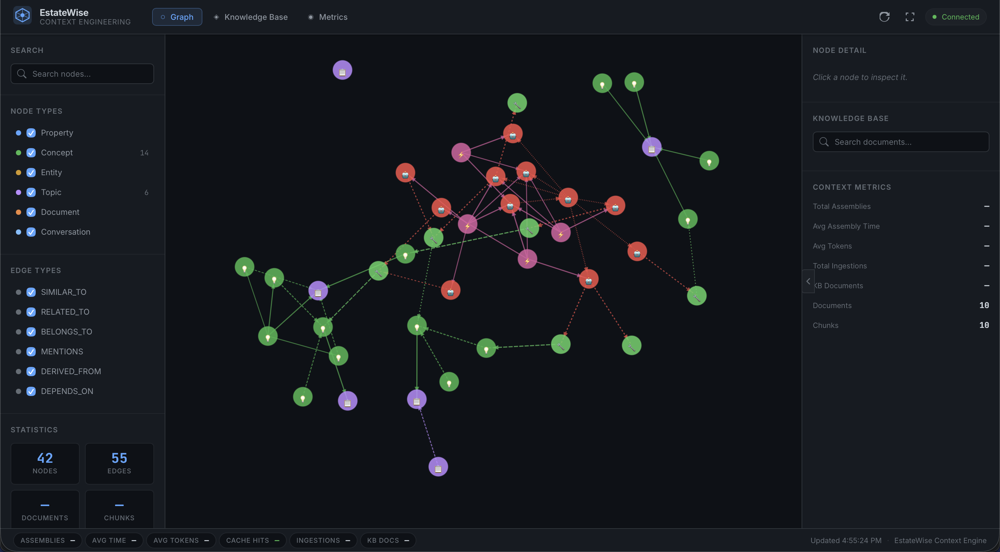
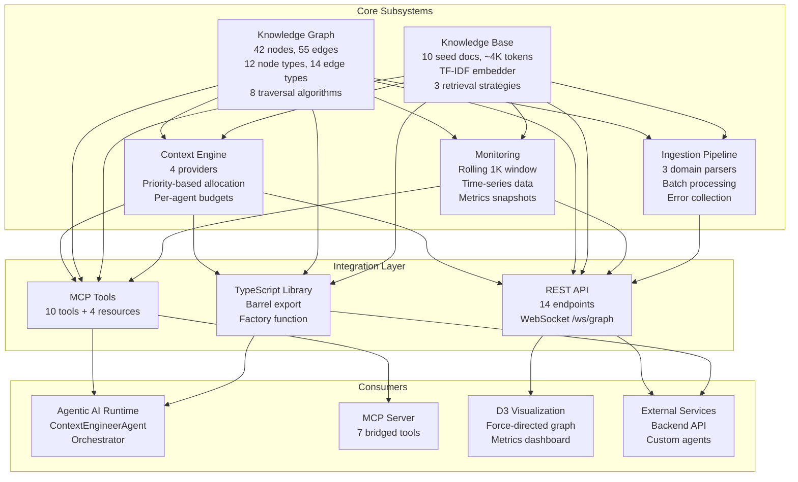
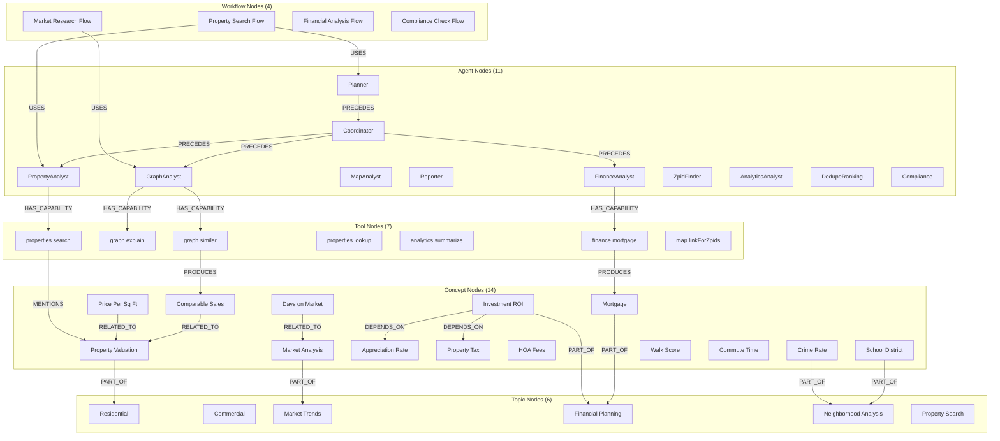
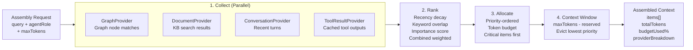
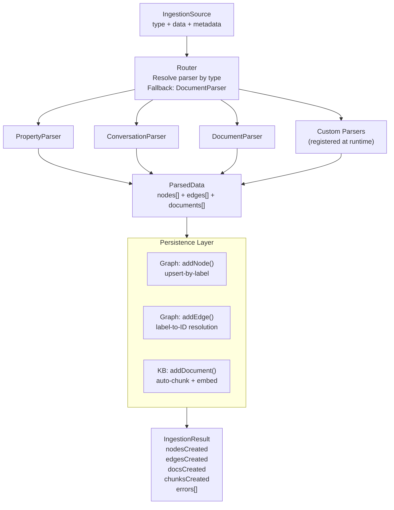
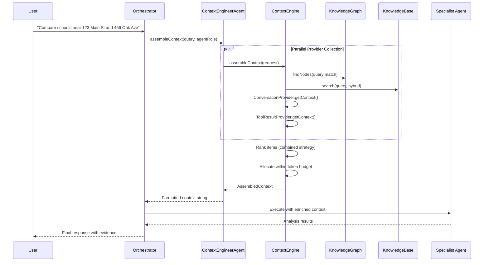

# Context Engineering for EstateWise

Enterprise-grade context engineering subsystem for the EstateWise AI real estate chatbot monorepo. It provides a knowledge graph with traversal algorithms, a retrieval-augmented knowledge base, a token-budgeted context window manager, a multi-parser ingestion pipeline, real-time monitoring, MCP tool integration, a REST API, and an interactive D3.js visualization dashboard -- all wired together through a single factory function.

<p align="left">
  
  
  
  
  
  
  
  
  
</p>

<p align="center">
  
</p>

## Table of Contents

- [Architecture Overview](#architecture-overview)
- [Quick Start](#quick-start)
- [Directory Structure](#directory-structure)
- [Knowledge Graph](#knowledge-graph)
  - [Node and Edge Types](#node-and-edge-types)
  - [Graph Schema](#graph-schema)
  - [Traversal Algorithms](#traversal-algorithms)
  - [Fluent Query Builder](#fluent-query-builder)
  - [Neo4j Bidirectional Sync](#neo4j-bidirectional-sync)
- [Knowledge Base](#knowledge-base)
  - [Retrieval Strategies](#retrieval-strategies)
  - [Usage Example](#knowledge-base-usage)
- [Context Engine](#context-engine)
  - [Assembly Pipeline](#assembly-pipeline)
  - [Priority Tiers](#priority-tiers)
  - [Per-Agent Token Budgets](#per-agent-token-budgets)
  - [Usage Example](#context-engine-usage)
- [Ingestion Pipeline](#ingestion-pipeline)
  - [Ingestion Flow](#ingestion-flow)
- [D3 Visualization UI](#d3-visualization-ui)
- [Monitoring](#monitoring)
- [MCP Integration](#mcp-integration)
  - [Tools](#mcp-tools)
  - [Resources](#mcp-resources)
- [REST API](#rest-api)
- [Configuration and Environment Variables](#configuration-and-environment-variables)
- [Seed Data](#seed-data)
- [Integration Guide](#integration-guide)
  - [Agent Integration Flow](#agent-integration-flow)
- [License](#license)

---

## Architecture Overview

The context-engineering system is built around five core pillars that feed into three integration surfaces: MCP tools for AI agents, a REST API for the visualization UI and external consumers, and direct TypeScript imports for monorepo packages.



---

## Quick Start

```bash
# From the monorepo root
cd context-engineering

# Install dependencies
npm install

# Start the dev server (port 4200)
npm run dev

# Build for production
npm run build

# Run production server
npm start

# Verify seed data
npm run seed
```

The dev server starts an Express HTTP server, mounts the REST API at `/api/context`, serves the D3 visualization UI at the root path, and opens a WebSocket at `/ws/graph` for real-time graph event streaming.

| Script | Command | Description |
|---|---|---|
| `dev` | `tsx src/serve.ts` | Start development server with hot reload |
| `dev:ui` | `tsx src/serve.ts --ui-only` | Start server in UI-only mode |
| `build` | `tsc -p tsconfig.json` | Compile TypeScript to `dist/` |
| `start` | `node dist/serve.js` | Run production build |
| `test` | `vitest run` | Run test suite |
| `test:watch` | `vitest` | Run tests in watch mode |
| `lint` | `prettier --check "src/**/*.ts"` | Check formatting |
| `format` | `prettier --write "src/**/*.ts"` | Auto-format source files |
| `seed` | `tsx src/scripts/seed.ts` | Verify seed data integrity |
| `graph:export` | `tsx src/scripts/export-graph.ts` | Export graph to JSON |

From the monorepo root, these shortcuts are also available:

```bash
npm run context          # Start context-engineering dev server
npm run context:build    # Build context-engineering
npm run context:seed     # Verify seed data
```

---

## Directory Structure

```
context-engineering/
  package.json
  tsconfig.json
  src/
    index.ts                           # Barrel export (public API)
    factory.ts                         # createContextSystem() wires everything
    serve.ts                           # Standalone Express + WebSocket server
    graph/
      types.ts                         # NodeType, EdgeType, GraphEvent enums + interfaces
      KnowledgeGraph.ts                # Core graph class (EventEmitter3, adjacency lists)
      traversal.ts                     # BFS, DFS, Dijkstra, PageRank, community detection, etc.
      query.ts                         # Fluent QueryBuilder with $gt/$lt/$contains/$in filters
      neo4j-sync.ts                    # Neo4j bidirectional sync manager
      index.ts                         # Graph barrel export
    knowledge-base/
      types.ts                         # KBDocument, KBChunk, SearchOptions, SearchResult
      KnowledgeBase.ts                 # Document store, auto-chunking, search
      Embedder.ts                      # Built-in TF-IDF embedder (128-dim vectors)
      Retriever.ts                     # Semantic, keyword, and hybrid retrieval
      index.ts                         # KB barrel export
    context/
      types.ts                         # ContextItem, ContextPriority, ContextProvider
      ContextEngine.ts                 # Multi-provider context assembly orchestrator
      ContextWindow.ts                 # Token budget manager with priority allocation
      ranking/
        Ranker.ts                      # Combined ranking engine
        strategies.ts                  # Recency, relevance, importance, combined strategies
      providers/
        GraphProvider.ts               # Pulls context from KnowledgeGraph
        DocumentProvider.ts            # Pulls context from KnowledgeBase
        ConversationProvider.ts        # Injects conversation history
        ToolResultProvider.ts          # Caches and serves recent tool outputs
        index.ts                       # Providers barrel export
      index.ts                         # Context barrel export
    ingestion/
      types.ts                         # IngestionSource, IngestionResult, ParsedData
      Ingester.ts                      # Multi-source ingestion orchestrator
      parsers/
        PropertyParser.ts              # Parses property listing payloads
        ConversationParser.ts          # Parses multi-turn conversation transcripts
        DocumentParser.ts              # Parses generic text documents
        index.ts                       # Parsers barrel export
      index.ts                         # Ingestion barrel export
    monitoring/
      types.ts                         # ContextMetricsSnapshot, MetricsEvent
      ContextMetrics.ts                # Rolling-window metrics collector
      index.ts                         # Monitoring barrel export
    mcp/
      tools.ts                         # 10 MCP tool definitions with Zod schemas
      resources.ts                     # 4 MCP resource definitions
    api/
      router.ts                        # Express router factory (14 endpoints)
      handlers.ts                      # Route handler implementations
    scripts/
      seed.ts                          # Seed verification script
    ui/
      public/
        index.html                     # Dashboard HTML shell
        css/
          styles.css                   # Dark-themed styles (#0d1117 bg)
        js/
          app.js                       # Main application controller
          graph-viz.js                 # D3 force-directed graph visualization
          metrics.js                   # Metrics chart rendering
```

---

## Knowledge Graph

The `KnowledgeGraph` class is an in-memory, event-driven graph engine built on EventEmitter3 with dual adjacency lists (outgoing and incoming) for efficient traversal in any direction. Every mutation emits a typed `GraphEvent`, enabling downstream consumers such as Neo4j sync, cache invalidation, and the WebSocket UI to react in real time.

The graph is **never empty**: the constructor automatically seeds 42 domain nodes and 55 edges covering real-estate concepts, AI agent roles, MCP tools, and orchestration workflows.

### Node and Edge Types

**12 Node Types**

| Node Type | Description | Seed Count |
|---|---|---|
| `Property` | Individual real estate listings | 0 (ingested at runtime) |
| `Concept` | Real-estate domain concepts (valuation, mortgage, ROI, etc.) | 14 |
| `Entity` | Named entities (people, organizations) | 0 |
| `Topic` | Broad subject areas (residential, commercial, trends) | 6 |
| `Document` | Knowledge base documents referenced in the graph | 0 |
| `Conversation` | Conversation session nodes | 0 |
| `Agent` | AI agent roles in the agentic runtime | 11 |
| `Tool` | MCP tools available to agents | 7 |
| `Workflow` | Multi-step agent orchestration flows | 4 |
| `Neighborhood` | Geographic neighbourhood boundaries | 0 |
| `ZipCode` | ZIP code areas | 0 |
| `MarketSegment` | Market classification segments | 0 |

**14 Edge Types**

| Edge Type | Semantics | Example |
|---|---|---|
| `SIMILAR_TO` | Semantic similarity between nodes | Property A similar to Property B |
| `RELATED_TO` | General topical relationship | Comparable Sales related to Property Valuation |
| `BELONGS_TO` | Membership / containment | Property belongs to Neighbourhood |
| `MENTIONS` | A tool or document references a concept | properties.search mentions Property Valuation |
| `DERIVED_FROM` | One artifact was produced from another | Analysis derived from raw data |
| `DEPENDS_ON` | Dependency relationship | Investment ROI depends on Property Tax |
| `LINKS_TO` | Hyperlink or reference connection | Document links to external resource |
| `PART_OF` | Hierarchical part-whole relationship | Market Analysis part of Market Trends topic |
| `USES` | Workflow or agent uses a resource | Property Search Flow uses Planner agent |
| `PRODUCES` | A tool or agent generates an output | finance.mortgage produces Mortgage data |
| `IN_NEIGHBORHOOD` | Property located in neighbourhood | Property in Downtown Raleigh |
| `IN_ZIP` | Property located in ZIP code | Property in 27601 |
| `HAS_CAPABILITY` | Agent can invoke a tool | GraphAnalyst has capability graph.similar |
| `PRECEDES` | Temporal ordering in workflow | Planner precedes Coordinator |

### Graph Schema



### Traversal Algorithms

The graph module ships with eight traversal algorithms that operate on the `KnowledgeGraph` instance without mutating it:

| Algorithm | Function | Description |
|---|---|---|
| Breadth-First Search | `bfs(graph, startId, options)` | Level-order traversal respecting depth, edge type, and node type filters |
| Depth-First Search | `dfs(graph, startId, options)` | Stack-based traversal with configurable max depth |
| Shortest Path | `shortestPath(graph, startId, endId, options)` | Dijkstra's algorithm using edge weights as costs |
| All Paths | `allPaths(graph, startId, endId, options)` | Enumerate all simple paths between two nodes |
| PageRank | `pageRank(graph, options)` | Iterative PageRank with configurable damping factor |
| Community Detection | `communityDetection(graph)` | Label propagation community clustering |
| Connected Components | `connectedComponents(graph)` | Identify weakly connected subgraphs |
| Betweenness Centrality | `betweennessCentrality(graph)` | Measure node importance by path mediation |

All algorithms accept `TraversalOptions` for fine-grained control:

```typescript
interface TraversalOptions {
  maxDepth?: number;          // Maximum hops from start node
  edgeTypes?: EdgeType[];     // Restrict to specific edge types
  nodeTypes?: NodeType[];     // Restrict to specific node types
  minWeight?: number;         // Skip edges below this weight
  maxNodes?: number;          // Stop after visiting N nodes
  direction?: "outgoing" | "incoming" | "both";
}
```

**Example: Traversal and graph operations**

```typescript
import {
  KnowledgeGraph,
  bfs,
  shortestPath,
  pageRank,
  NodeType,
  EdgeType,
} from "@estatewise/context-engineering";

const graph = new KnowledgeGraph(); // Auto-seeded with domain data

// Add a custom node
graph.addNode({
  id: "prop:123-main-st",
  type: NodeType.Property,
  label: "123 Main Street, Raleigh NC",
  properties: { price: 450000, bedrooms: 3, sqft: 1800 },
  metadata: { source: "mls", importance: 0.85, tags: ["residential"] },
});

// Add an edge connecting the property to a concept
graph.addEdge({
  source: "prop:123-main-st",
  target: "concept:property-valuation",
  type: EdgeType.MENTIONS,
  weight: 0.9,
  properties: {},
});

// BFS from the property, max 2 hops, only MENTIONS and RELATED_TO edges
const visited = bfs(graph, "prop:123-main-st", {
  maxDepth: 2,
  edgeTypes: [EdgeType.MENTIONS, EdgeType.RELATED_TO],
});
console.log("Reachable nodes:", visited);

// Shortest path between two concepts
const path = shortestPath(
  graph,
  "concept:mortgage",
  "concept:property-valuation",
);
console.log("Path:", path);

// Compute PageRank for all nodes
const rankings = pageRank(graph, { dampingFactor: 0.85, iterations: 20 });
console.log("Top 5:", rankings.slice(0, 5));
```

### Fluent Query Builder

The `query()` function provides a chainable, MongoDB-inspired query interface over the graph:

```typescript
import { query, NodeType, EdgeType } from "@estatewise/context-engineering";

// Find high-importance Concept nodes, traverse RELATED_TO edges 2 hops,
// sort by importance descending, return top 10
const result = query(graph)
  .match(NodeType.Concept)
  .where({ "metadata.importance": { $gte: 0.8 } })
  .traverse(EdgeType.RELATED_TO, { maxDepth: 2 })
  .orderBy("metadata.importance", "desc")
  .limit(10)
  .execute();

console.log(`Found ${result.nodes.length} nodes, ${result.edges.length} edges`);
console.log(`Scanned ${result.metadata.nodesScanned} nodes in ${result.metadata.executionTimeMs}ms`);
```

**Supported filter operators:**

| Operator | Description | Example |
|---|---|---|
| `$gt` | Greater than (numeric) | `{ "properties.price": { $gt: 500000 } }` |
| `$lt` | Less than (numeric) | `{ "properties.price": { $lt: 300000 } }` |
| `$gte` | Greater than or equal | `{ "metadata.importance": { $gte: 0.8 } }` |
| `$lte` | Less than or equal | `{ "metadata.version": { $lte: 3 } }` |
| `$eq` | Strict equality | `{ "type": { $eq: "Property" } }` |
| `$ne` | Not equal | `{ "metadata.source": { $ne: "seed" } }` |
| `$contains` | Substring match | `{ "label": { $contains: "Raleigh" } }` |
| `$in` | Value in array | `{ "type": { $in: ["Concept", "Topic"] } }` |

Terminal methods: `.execute()` returns a full `QueryResult` (nodes, edges, metadata), `.count()` returns the result count, and `.ids()` returns node IDs only.

### Neo4j Bidirectional Sync

Neo4j sync is opt-in and configured through the factory function. When enabled, the `Neo4jSyncManager` listens to graph events and replicates mutations to the Neo4j database. On startup, it can also pull existing Neo4j data into the in-memory graph.

```typescript
const system = createContextSystem({
  neo4j: {
    enabled: true,
    uri: "bolt://localhost:7687",
    username: "neo4j",
    password: "your-password",
  },
});
```

When Neo4j is unavailable or the connection fails, the system gracefully degrades to in-memory-only operation and logs a warning. No external dependencies are required for the core graph engine to function.

---

## Knowledge Base

The `KnowledgeBase` class manages an in-memory document store with automatic chunking and embedding. Documents are split into overlapping chunks of approximately 500 tokens (with 50-token overlap), each receiving a 128-dimensional TF-IDF embedding vector. The built-in embedder requires no external API calls, though pluggable external embedders (e.g., OpenAI `text-embedding-3-small`) are supported through the `EmbedFunction` interface.

The knowledge base auto-seeds itself with 10 domain reference documents covering platform overview, property search, market analysis, financial tools, graph system, agent capabilities, MCP tool reference, neighbourhood analysis, commute analysis, and compliance regulations.

### Retrieval Strategies

| Strategy | Method | Description |
|---|---|---|
| `semantic` | Cosine similarity | Compares the query embedding against all chunk embeddings. Best for conceptual similarity searches where exact keyword matches are not expected. |
| `keyword` | TF-IDF scoring | Token-level frequency matching between the query and chunk content. Best for precise term lookups and known-entity searches. |
| `hybrid` | Weighted blend | Combines semantic (65%) and keyword (35%) scores. Default strategy. Best for general-purpose retrieval that balances precision and recall. |
| `graph_enhanced` | Hybrid + graph boost | Hybrid retrieval enhanced with knowledge-graph traversal signals. Uses graph connectivity to boost chunks related to highly connected nodes. |

All strategies support optional filters (`SearchFilter[]`), recency boosting, and access-frequency boosting. Results include the matched chunk, its parent document, a normalised relevance score, the strategy used, and optional highlighted text snippets.

### Knowledge Base Usage

```typescript
import { KnowledgeBase } from "@estatewise/context-engineering";

const kb = new KnowledgeBase();
await kb.initialize(); // Seeds 10 domain documents on first call

// Add a custom document
const doc = await kb.addDocument({
  title: "Downtown Raleigh Market Report Q1 2026",
  content: "The downtown Raleigh housing market saw a 5.2% year-over-year...",
  source: "market-report:q1-2026",
  sourceType: "document",
  metadata: { author: "MarketAnalyst", tags: ["raleigh", "market", "q1-2026"], accessCount: 0 },
});
console.log(`Added document with ${doc.chunks.length} chunks`);

// Search with hybrid strategy
const results = await kb.search("3-bedroom homes near good schools", {
  strategy: "hybrid",
  limit: 5,
  threshold: 0.3,
  boostRecent: true,
});

for (const r of results) {
  console.log(`[${r.score.toFixed(3)}] ${r.document.title}: ${r.chunk.content.slice(0, 100)}...`);
}
```

---

## Context Engine

The `ContextEngine` orchestrates multi-provider context assembly for EstateWise AI agents. It collects context items from all registered providers, ranks them using a combined strategy (recency, relevance, importance), and packs them into a token-budgeted window ready for direct injection into an agent system prompt.

### Assembly Pipeline



### Priority Tiers

Context items are assigned a priority tier that determines their allocation order and eviction behaviour within the token budget:

| Priority | Level | Description | Eviction |
|---|---|---|---|
| `Critical` | 4 | Safety rules, system prompts | Never evicted |
| `High` | 3 | Directly relevant graph/KB results for the current query | Evicted last |
| `Medium` | 2 | Related context, recent conversation turns | Standard eviction |
| `Low` | 1 | Background knowledge, older conversation history | Early eviction |
| `Background` | 0 | Lowest priority supplementary context | Evicted first |

Three allocation strategies are available: `priority` (fills tiers top-down), `proportional` (allocates proportional slices to each tier), and `adaptive` (uses priority as a baseline but shifts tokens toward high-relevance items).

### Per-Agent Token Budgets

Each agent role receives a tuned token window that reflects its operational needs:

| Agent Role | Max Tokens | Reserved Tokens | Available Budget |
|---|---|---|---|
| `GraphAnalyst` | 6,000 | 1,500 | 4,500 |
| `PropertyAnalyst` | 10,000 | 2,500 | 7,500 |
| `MarketAnalyst` | 8,000 | 2,000 | 6,000 |
| `NeighbourhoodExpert` | 7,000 | 1,800 | 5,200 |
| `ComplianceChecker` | 6,000 | 1,500 | 4,500 |
| `Orchestrator` | 12,000 | 3,000 | 9,000 |
| Default (unrecognised) | 8,000 | 2,000 | 6,000 |

### Context Engine Usage

```typescript
import { createContextSystem } from "@estatewise/context-engineering";

const system = createContextSystem({
  contextWindow: { maxTokens: 16000, reservedTokens: 2000 },
});
await system.initialize();

// Simple assembly (used by MCP tools and API)
const simple = await system.engine.assemble({
  query: "Compare property values in downtown Raleigh vs North Hills",
  agentRole: "MarketAnalyst",
  maxTokens: 8000,
});
console.log(`Assembled ${simple.items.length} items, ${simple.tokenCount} tokens`);

// Full assembly with conversation history (used by the ContextProvider ecosystem)
const full = await system.engine.assembleContext({
  query: "What schools are near 123 Main Street?",
  conversationHistory: [
    { role: "user", content: "Show me homes in 27601", timestamp: new Date().toISOString() },
    { role: "assistant", content: "I found 15 properties...", timestamp: new Date().toISOString() },
  ],
  maxTokens: 10000,
});
console.log(`Budget used: ${full.budgetUsed.toFixed(1)}%`);
console.log("Provider breakdown:", full.providerBreakdown);

// Agent-specific assembly with role-tuned token budgets
const agentCtx = await system.engine.getContextForAgent(
  "PropertyAnalyst",
  "Deep analysis of ZPID 12345678",
);
const promptText = system.engine.formatForPrompt(agentCtx);
```

---

## Ingestion Pipeline

The `Ingester` class routes incoming data sources to registered domain parsers, persists the resulting nodes and edges to the `KnowledgeGraph`, and stores documents in the `KnowledgeBase`. All errors are collected rather than thrown so that a single bad record cannot abort a batch.

Three built-in parsers handle the most common source types:

| Parser | Source Type | Creates |
|---|---|---|
| `PropertyParser` | `property` | Property nodes, neighbourhood/ZIP edges, property documents |
| `ConversationParser` | `conversation` | Conversation nodes, MENTIONS edges, conversation documents |
| `DocumentParser` | `document` | Document nodes, RELATED_TO edges, KB documents |

Additional parsers can be registered via `ingester.registerParser()` to handle domain-specific shapes such as `tool_result`, `agent_output`, and `neo4j` exports.

### Ingestion Flow



**Usage Example:**

```typescript
import { createContextSystem } from "@estatewise/context-engineering";

const system = createContextSystem();
await system.initialize();

// Ingest a single property
const result = await system.ingester.ingest({
  type: "property",
  data: {
    address: "456 Oak Avenue, Durham, NC 27701",
    price: 375000,
    bedrooms: 4,
    bathrooms: 2.5,
    sqft: 2200,
    yearBuilt: 2018,
  },
});
console.log(`Created ${result.nodesCreated} nodes, ${result.edgesCreated} edges`);

// Batch ingest multiple sources
const batchResult = await system.ingester.ingestBatch([
  { type: "property", data: { /* ... */ } },
  { type: "conversation", data: { /* ... */ } },
  { type: "document", data: { title: "Market Report", content: "..." } },
]);
console.log(`Batch: ${batchResult.documentsCreated} docs, ${batchResult.errors.length} errors`);
```

---

## D3 Visualization UI

The context-engineering package includes a standalone D3.js visualization dashboard served at the root path of the Express server. The UI uses a dark theme inspired by GitHub's dark mode (`#0d1117` background, `#161b22` panel backgrounds).

Features of the visualization dashboard:

- **Force-directed graph**: Interactive D3 force simulation rendering all graph nodes and edges with zoom, pan, and drag. Each of the 12 node types is rendered with a distinct colour.
- **Node detail panel**: Clicking a node opens a detail panel showing all properties, metadata, incident edges, and degree metrics.
- **Knowledge base search**: A search input queries the KB via the REST API and displays ranked results with relevance scores and highlighted excerpts.
- **Metrics charts**: Real-time charts showing context assembly duration, ingestion throughput, cache hit rate, and token usage over time.
- **Real-time metrics footer**: A persistent footer bar showing live graph node count, edge count, KB document count, and total tokens.
- **WebSocket updates**: The UI connects to `/ws/graph` and receives real-time `node:added`, `node:updated`, `node:removed`, `edge:added`, and `edge:removed` events, updating the visualization without page reload.

Access the dashboard at `http://localhost:4200/` after starting the server.

If you host the dashboard UI from a different origin, API calls default to `/api/context` on the current origin and automatically fall back to `http://localhost:4200/api/context` when that origin returns an HTML 404 page. You can explicitly override the API base with either `?apiBase=<url>` in the dashboard URL or by setting `window.ESTATEWISE_CONTEXT_API_BASE` before `js/app.js` loads.

---

## Monitoring

The `ContextMetrics` class provides a rolling-window metrics collector that records time-stamped events (last 1,000) and exposes aggregated snapshots, per-metric time-series, and JSON serialisation for the REST API and D3 dashboard.

Tracked event types: `context_assembly`, `ingestion`, `search`, `traversal`, `cache_hit`, `cache_miss`.

Supported time-series metrics: `context_assembly`, `ingestion`, `search`, `traversal`, `cache_hit_rate`, `token_count`, `item_count`.

```typescript
const snapshot = system.metrics.getSnapshot();
// snapshot.graph     -> { nodeCount, edgeCount, nodesByType, avgDegree, density }
// snapshot.knowledgeBase -> { documentCount, chunkCount, totalTokens, sourceBreakdown }
// snapshot.context   -> { totalAssemblies, avgAssemblyTimeMs, avgTokensUsed, cacheHitRate }
// snapshot.ingestion -> { totalIngested, totalErrors, avgIngestionTimeMs, sourceBreakdown }

const timeSeries = system.metrics.getTimeSeries("context_assembly", 3600000); // Last hour
```

---

## MCP Integration

The context-engineering system exposes 10 MCP tools and 4 MCP resources that can be registered with any MCP server following the EstateWise tool definition pattern. All tool inputs are validated with Zod schemas and all outputs use the standard MCP content envelope (`{ content: [{ type: "text", text: JSON.stringify(result) }] }`).

### MCP Tools

| Tool | Description |
|---|---|
| `context.search` | Search the knowledge base and graph for context relevant to a query. Returns ranked documents and matching graph nodes. |
| `context.assembleForAgent` | Assemble a complete, token-budgeted context window for an agent given its role and current query. |
| `context.graphTraverse` | Traverse the knowledge graph from a start node via BFS, following edges up to a given depth. |
| `context.graphQuery` | Query graph nodes with optional type and property filters. Returns matching nodes with degree counts. |
| `context.ingest` | Ingest a new document or data payload into the knowledge system. Creates graph nodes and KB entries. |
| `context.getStats` | Get current system statistics: graph topology, KB size, and token counts. |
| `context.getGraphOverview` | Get the full graph (nodes + edges) formatted for D3/Vis.js visualization. |
| `context.findRelated` | Find graph nodes related to a concept or keyword, then expand to their neighbours. |
| `context.getNodeDetail` | Get detailed information about a specific node including properties, metadata, and neighbours. |
| `context.getTimeline` | Get a timeline of recently created graph nodes and KB documents, ordered newest first. |

### MCP Resources

| URI | Name | Description |
|---|---|---|
| `context://graph/stats` | Graph Statistics | Current graph topology statistics: node/edge counts, type distributions, average degree, density. |
| `context://kb/stats` | Knowledge Base Statistics | Document count, chunk count, total token estimate, and source breakdown. |
| `context://metrics/snapshot` | Metrics Snapshot | Full point-in-time snapshot of all subsystem metrics. |
| `context://graph/nodes/{type}` | Graph Nodes by Type | All graph nodes of a given `NodeType`. Pass the type as the last URI segment. |

---

## REST API

The Express router exposes 14 endpoints under the `/api/context` base path. A WebSocket endpoint at `/ws/graph` streams real-time graph mutation events to connected clients.

### Endpoints

| Method | Path | Description |
|---|---|---|
| `GET` | `/graph` | Full graph payload (nodes + edges) for D3 force simulation. `?limit=1000` |
| `GET` | `/graph/nodes` | All nodes with optional type filter. `?type=Property&limit=500` |
| `GET` | `/graph/nodes/:id` | Single node by ID with incident edges and neighbours. `?neighbors=true` |
| `GET` | `/graph/edges` | All edges with optional type filter. `?type=SIMILAR_TO&limit=2000` |
| `GET` | `/graph/stats` | Aggregate topology statistics for the graph. |
| `GET` | `/graph/search` | Full-text search across node labels and properties. `?q=mortgage&limit=20` |
| `GET` | `/kb/search` | Multi-strategy knowledge-base search. `?q=raleigh&limit=10&strategy=hybrid` |
| `GET` | `/kb/documents` | List all documents with optional source-type filter. `?sourceType=property&limit=100` |
| `GET` | `/kb/stats` | Knowledge-base aggregate statistics. |
| `GET` | `/metrics` | Full metrics snapshot across all subsystems. |
| `GET` | `/metrics/timeseries` | Time-series data for a specific metric. `?metric=context_assembly&window=3600000` |
| `POST` | `/ingest` | Ingest a new document. Body: `{ type, title, content, tags? }` |
| `POST` | `/assemble` | Assemble a token-budgeted context window. Body: `{ query, agentRole?, maxTokens? }` |
| `GET` | `/health` | Lightweight liveness check returning graph and KB stats. |

### WebSocket

Connect to `ws://localhost:4200/ws/graph` to receive real-time graph events:

- On connect: receives a full `graph:snapshot` message with all nodes and edges.
- On mutation: receives `node:added`, `node:updated`, `node:removed`, `edge:added`, or `edge:removed` messages.

Message format:
```json
{
  "type": "node:added",
  "payload": { "id": "...", "type": "Property", "label": "..." },
  "timestamp": "2026-03-18T12:00:00.000Z"
}
```

---

## Configuration and Environment Variables

| Variable | Default | Description |
|---|---|---|
| `CONTEXT_PORT` | `4200` | HTTP server port for the standalone server |
| `NEO4J_URI` | -- | Neo4j Bolt URI (e.g. `bolt://localhost:7687`). Enables graph sync when set. |
| `NEO4J_USERNAME` | -- | Neo4j authentication username |
| `NEO4J_PASSWORD` | -- | Neo4j authentication password |

### Programmatic Configuration

```typescript
import { createContextSystem } from "@estatewise/context-engineering";

const system = createContextSystem({
  // Token window settings
  contextWindow: {
    maxTokens: 16000,      // Total token budget (default: 8000)
    reservedTokens: 2000,  // Tokens reserved for system prompt + response headroom (default: 1000)
  },
  // Neo4j sync (opt-in)
  neo4j: {
    enabled: true,
    uri: "bolt://localhost:7687",
    username: "neo4j",
    password: "password",
  },
  // API port for standalone server
  apiPort: 4200,
});

await system.initialize();
```

The `createContextSystem()` factory returns a `ContextSystem` handle with access to all subsystem instances:

| Property | Type | Description |
|---|---|---|
| `graph` | `KnowledgeGraph` | In-memory knowledge graph, seeded with domain data |
| `kb` | `KnowledgeBase` | In-memory knowledge base, seeded with 10 reference documents |
| `engine` | `ContextEngine` | Context assembly engine wired to graph and KB |
| `ingester` | `Ingester` | Ingestion orchestrator with 3 built-in parsers |
| `metrics` | `ContextMetrics` | Metrics collector backed by live graph and KB |
| `tools` | `ContextToolDef[]` | 10 MCP tool definitions ready for registration |
| `resources` | `ContextResourceDef[]` | 4 MCP resource definitions ready for registration |
| `router` | `Router` | Express Router (mount at `/api/context`) |
| `initialize()` | `Promise<void>` | Seeds the KB; must be called before first search |

---

## Seed Data

The context-engineering system ships with pre-loaded domain knowledge so it is never empty:

### Knowledge Graph Seed (42 nodes, 55 edges)

| Category | Count | Examples |
|---|---|---|
| Concept nodes | 14 | Property Valuation, Market Analysis, Mortgage, Investment ROI, Comparable Sales, Price Per Sq Ft, Days on Market, Appreciation Rate, Property Tax, HOA Fees, School District, Crime Rate, Walk Score, Commute Time |
| Topic nodes | 6 | Residential Real Estate, Commercial Real Estate, Market Trends, Financial Planning, Neighborhood Analysis, Property Search |
| Agent nodes | 11 | Planner, Coordinator, GraphAnalyst, PropertyAnalyst, MapAnalyst, Reporter, FinanceAnalyst, ZpidFinder, AnalyticsAnalyst, DedupeRanking, Compliance |
| Tool nodes | 7 | graph.similar, graph.explain, properties.search, properties.lookup, analytics.summarizeSearch, finance.mortgage, map.linkForZpids |
| Workflow nodes | 4 | Property Search Flow, Market Research Flow, Financial Analysis Flow, Compliance Check Flow |

Edge relationships encode concept hierarchies (`PART_OF`, `RELATED_TO`, `DEPENDS_ON`), agent orchestration order (`PRECEDES`), agent-to-tool capabilities (`HAS_CAPABILITY`), workflow-to-agent assignments (`USES`), and tool-to-concept outputs (`PRODUCES`, `MENTIONS`).

### Knowledge Base Seed (10 documents, ~4,000 tokens)

| Document | Source Type | Coverage |
|---|---|---|
| EstateWise Platform Overview | system | Architecture, capabilities, agent roles, integration points |
| Property Search Guide | system | Search modalities, structured filters, ZPID lookup, ranking |
| Market Analysis Methodology | system | Data sources, metrics, CMA, forecasting, gRPC streaming |
| Financial Analysis Tools | system | Mortgage, affordability, ROI, rent-vs-buy, portfolio analytics |
| Graph and Knowledge System | system | Neo4j schema, node/edge types, Cypher queries, PageRank |
| Agent Capabilities Reference | system | Orchestrator, GraphAnalyst, PropertyAnalyst, MarketAnalyst, etc. |
| MCP Tool Reference | system | 60+ tools across 8 categories |
| Neighbourhood Analysis Guide | system | Livability Index, 12 dimensions, school data, crime, demographics |
| Commute Analysis | system | 4 transport modes, commute scoring, isochrone search, dual-income |
| Compliance and Regulations | system | Fair Housing, data privacy, RESPA/TILA, ComplianceChecker agent |

---

## Integration Guide

The context-engineering package integrates with two other monorepo packages: the MCP server and the Agentic AI runtime.

### MCP Server Integration

The MCP server (`mcp/src/tools/context.ts`) bridges 7 context-engineering tools into the main MCP tool registry so that all AI agents have access to context search, assembly, graph traversal, and ingestion without direct imports:

```typescript
// In mcp/src/tools/context.ts
import { createContextSystem } from "@estatewise/context-engineering";

const ctxSystem = createContextSystem();
await ctxSystem.initialize();

// Register tools with the MCP server
for (const tool of ctxSystem.tools) {
  server.registerTool(tool.name, tool.schema, tool.handler);
}
```

### Agentic AI Integration

The Agentic AI runtime (`agentic-ai/`) includes a `ContextEngineerAgent` that the orchestrator can delegate to when a query requires deep context assembly, graph analysis, or knowledge-base search. The agent uses the `ContextEngine` to assemble role-appropriate context before other specialist agents begin work.

### Agent Integration Flow



### Direct Library Usage

Any TypeScript package in the monorepo can import directly from the barrel export:

```typescript
import {
  createContextSystem,
  KnowledgeGraph,
  KnowledgeBase,
  ContextEngine,
  Ingester,
  ContextMetrics,
  createContextTools,
  createContextResources,
  NodeType,
  EdgeType,
  ContextPriority,
  ContextSource,
  query,
  bfs,
  shortestPath,
  pageRank,
} from "@estatewise/context-engineering";
```

---

## License

MIT. See the root [LICENSE](../LICENSE) file for full terms.
