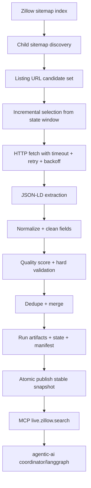
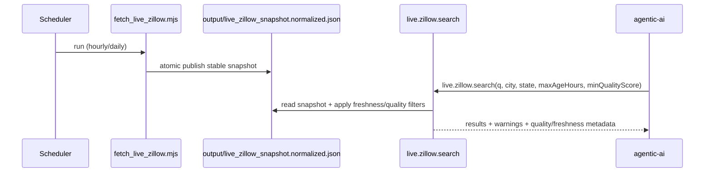

# Zillow Live Ingestion Pipeline (`data/live-zillow`)

This module runs the **production ingestion path** for fresh Zillow listing metadata and publishes a normalized snapshot consumed by MCP and Agentic AI.

The pipeline is designed to be scheduler-friendly (cron/Jenkins/GitHub Actions), resilient to partial crawl failures, and safe for downstream consumers through quality gating and atomic artifact publishing.

---

## Architecture



---

## Pipeline Guarantees

1. **Bounded crawl budget** (`maxSitemaps`, `maxListingUrlsPerSitemap`, `maxListings`).
2. **Retry-safe network layer** (request timeout, retry count, linear backoff).
3. **Incremental refresh** using persisted URL state (`refreshHours` window).
4. **Field normalization + cleaning** (URL canonicalization, ZIP/state normalization, numeric bounds).
5. **Quality scoring** per listing (`qualityScore`) with minimum threshold gate (`minQualityScore`).
6. **Hard validation** rejects structurally unsafe records (missing URL/city/state, pathological price/sqft).
7. **Deterministic dedupe/merge** by `zpid` (fallback canonical URL).
8. **Atomic writes** for state, manifest, run artifacts, and stable snapshot publish.
9. **Publish gating** via `minPublishListings` + optional hard fail policy.

---

## Files

```text
data/live-zillow/
  fetch_live_zillow.mjs
  README.md
  output/
    .gitkeep
    live_zillow_snapshot.normalized.json         # stable consumer snapshot
    live_zillow_snapshot.json                    # stable raw run output
    live_zillow_state.json                       # incremental crawl state
    live_zillow_manifest.json                    # run ledger (rolling)
    runs/
      live_zillow_snapshot.<runId>.raw.json
      live_zillow_snapshot.<runId>.normalized.json
    snapshots/
      live_zillow_snapshot.<runId>.normalized.json
```

---

## Run

From repo root:

```bash
node data/live-zillow/fetch_live_zillow.mjs
```

Example with tighter crawl envelope:

```bash
node data/live-zillow/fetch_live_zillow.mjs \
  --maxSitemaps=4 \
  --maxListingUrlsPerSitemap=60 \
  --maxListings=40 \
  --concurrency=3 \
  --timeoutMs=12000 \
  --retries=2 \
  --requestDelayMs=300 \
  --minQualityScore=0.55
```

Example full refresh (ignore incremental window):

```bash
node data/live-zillow/fetch_live_zillow.mjs --fullRefresh=true
```

Example with explicit sitemap seeds:

```bash
node data/live-zillow/fetch_live_zillow.mjs \
  --sitemapUrls=https://www.zillow.com/xml/indexes/us/hdp/for-sale-by-agent.xml.gz,https://www.zillow.com/xml/indexes/us/hdp/new-construction.xml.gz
```

---

## Configuration

| Setting                                       | CLI                          | Env                                | Default                             |
| --------------------------------------------- | ---------------------------- | ---------------------------------- | ----------------------------------- |
| Optional sitemap index URL                    | `--sitemap`                  | `ZILLOW_SITEMAP_INDEX_URL`         | empty                               |
| Robots URL for sitemap auto-discovery         | `--robots`                   | `ZILLOW_ROBOTS_URL`                | `https://www.zillow.com/robots.txt` |
| Explicit sitemap URL seeds (CSV)              | `--sitemapUrls`              | `ZILLOW_SITEMAP_URLS`              | empty                               |
| Output directory                              | `--outputDir`                | `ZILLOW_OUTPUT_DIR`                | `data/live-zillow/output`           |
| Max child sitemaps                            | `--maxSitemaps`              | —                                  | `8`                                 |
| Maximum sitemap files traversed (incl nested) | `--maxSitemapVisits`         | —                                  | `maxSitemaps * 4`                   |
| Max URLs per sitemap                          | `--maxListingUrlsPerSitemap` | —                                  | `120`                               |
| Max listing pages fetched                     | `--maxListings`              | —                                  | `60`                                |
| Concurrency                                   | `--concurrency`              | —                                  | `4`                                 |
| Request timeout (ms)                          | `--timeoutMs`                | —                                  | `15000`                             |
| Retry attempts                                | `--retries`                  | —                                  | `2`                                 |
| Retry backoff base (ms)                       | `--retryBackoffMs`           | —                                  | `750`                               |
| Min delay between requests (ms)               | `--requestDelayMs`           | —                                  | `250`                               |
| Incremental refresh window (hours)            | `--refreshHours`             | —                                  | `24`                                |
| Minimum quality score (0-1)                   | `--minQualityScore`          | —                                  | `0.5`                               |
| Minimum deduped listings required for publish | `--minPublishListings`       | —                                  | `1`                                 |
| Fail run when below publish minimum           | `--publishRequireMinCount`   | `ZILLOW_PUBLISH_REQUIRE_MIN_COUNT` | `false`                             |
| Force full refresh                            | `--fullRefresh`              | —                                  | `false`                             |
| User-Agent                                    | `--userAgent`                | `ZILLOW_USER_AGENT`                | `EstateWiseLiveDataBot/2.0 ...`     |
| Seed listing URLs (CSV)                       | `--seedUrls`                 | `ZILLOW_SEED_URLS`                 | empty                               |

By default, sitemap discovery is performed from `robots.txt` sitemap directives. Use `--sitemapUrls` when you want deterministic source selection.

---

## Normalized Snapshot Contract

Stable consumer artifact: `output/live_zillow_snapshot.normalized.json`

```json
{
  "version": 2,
  "runId": "20260416_120001234",
  "generatedAt": "2026-04-16T12:00:01.234Z",
  "source": "zillow-web-public",
  "metadata": {
    "schemaVersion": 2,
    "pipelineVersion": "2026.04.16",
    "stats": {
      "candidateUrlCount": 200,
      "refreshableUrlCount": 120,
      "fetchedCount": 60,
      "successCount": 41,
      "fetchErrorCount": 19,
      "acceptedCount": 34,
      "dedupedCount": 31,
      "droppedCount": 7,
      "durationMs": 14502
    },
    "quality": {
      "average": 0.79,
      "p10": 0.62,
      "p50": 0.81,
      "p90": 0.93,
      "min": 0.55,
      "max": 1,
      "minAcceptable": 0.5
    },
    "freshness": {
      "oldestFetchedAt": "2026-04-16T11:10:01.000Z",
      "newestFetchedAt": "2026-04-16T11:58:30.000Z",
      "oldestAgeHours": 0.84,
      "newestAgeHours": 0.03
    },
    "warnings": []
  },
  "listings": [
    {
      "zpid": 123456,
      "url": "https://www.zillow.com/homedetails/123456_zpid/",
      "address": "123 Main St, Chapel Hill, NC, 27514",
      "city": "Chapel Hill",
      "state": "NC",
      "zipcode": "27514",
      "price": 850000,
      "bedrooms": 4,
      "bathrooms": 3,
      "livingAreaSqft": 2800,
      "homeType": "SingleFamilyResidence",
      "status": "https://schema.org/InStock",
      "publishedAt": "2026-04-14T16:45:00.000Z",
      "fetchedAt": "2026-04-16T11:58:30.000Z",
      "source": "zillow-web-public",
      "qualityScore": 0.9,
      "qualityFlags": [],
      "firstSeenAt": "2026-04-12T10:01:00.000Z",
      "lastSeenAt": "2026-04-16T12:00:01.234Z"
    }
  ]
}
```

---

## Integration



- MCP reads this artifact through `LIVE_ZILLOW_SNAPSHOT_PATH`.
- Agentic coordinator requests live data first and uses quality filtering (`minQualityScore`).
- Reporter surfaces stale snapshot warnings to keep recommendation output transparent.

---

## Operational Runbook

1. Schedule cadence by use case (e.g., every 1-6 hours).
2. Track manifest (`live_zillow_manifest.json`) for run-level drift.
3. Alert on:
   - high `fetchErrorCount / fetchedCount`,
   - falling `dedupedCount`,
   - stale `generatedAt`,
   - repeated publish gate failures.
4. Keep conservative request pacing and respect source terms/robots policy.

---

## Compliance Notes

- This pipeline consumes publicly available listing metadata only.
- Do not ingest personal data fields beyond listing-level attributes required for product behavior.
- Always run with bounded concurrency/retry settings in production environments.
