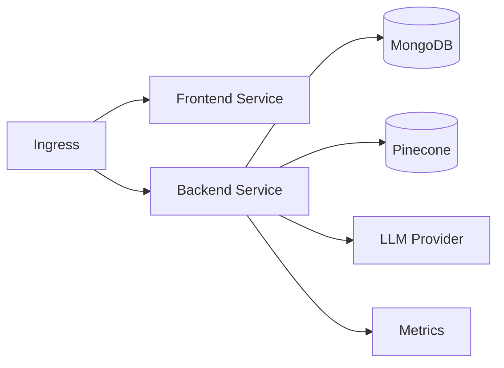

# Kubernetes Manifests

  

Kustomize-based manifests for running EstateWise on Kubernetes. These manifests are designed to work with or without HashiCorp Consul Connect. For a multi-cloud deployment overview see `DEPLOYMENTS.md`.

## Architecture



## Repository Layout

```
kubernetes/
├─ base/                       # Core workloads + ingress
├─ gitops/                     # Argo CD + Flux GitOps definitions
│  ├─ argocd/                  # AppProject + app-of-apps bootstrap
│  └─ flux/                    # Flux sources/kustomizations + Flagger controller release
├─ overlays/                   # Kustomize overlays (prod, multi-region)
├─ progressive-delivery/       # Argo Rollouts + Flagger canary resources
├─ monitoring/                 # Prometheus, Grafana, Loki, Jaeger
├─ workflows/                  # Argo Workflows templates + cron workflows
├─ jobs/                       # Batch jobs + cronjobs
├─ chaos/                      # Chaos experiments and scripts
├─ disaster-recovery/          # DR automation
├─ security/                   # Security manifests (image signing)
└─ scripts/                    # Blue/green + canary deploy helpers
```

## Enterprise Delivery Topology

EstateWise now supports a production-grade GitOps and progressive-delivery stack:

- **Argo CD** for app delivery and controller lifecycle.
- **Argo Rollouts** for backend/frontend progressive deployments.
- **Flux CD** for additional GitOps reconciliation scope.
- **Flagger** (managed by Flux) for isolated canary analysis.
- **Argo Workflows** for operational orchestration and scheduled validation.

### Controller ownership boundary

- Argo CD owns `kubernetes/overlays/prod-gitops` and Argo-native controllers/workflows.
- Flux owns Flagger controller and `kubernetes/progressive-delivery/flagger`.
- Do not configure both controllers to reconcile the same path/resource set.

See `kubernetes/gitops/README.md` for full bootstrap and verification steps.
Run `bash kubernetes/gitops/preflight.sh` before production sync to validate rendered manifests and GitOps source URL consistency.

Canonical GitOps repo URL used by control-plane manifests:

- `https://github.com/hoangsonww/EstateWise-Chapel-Hill-Chatbot.git`

## Base Manifests

```
kubernetes/base/
  backend-deployment.yaml
  backend-service.yaml
  configmap.yaml
  frontend-deployment.yaml
  frontend-service.yaml
  ingress.yaml
  kustomization.yaml
  namespace.yaml
```

Apply base (dev/staging):

```bash
kubectl apply -k kubernetes/base
```

## Overlays

Apply production overlay:

```bash
kubectl apply -k kubernetes/overlays/prod
```

Apply GitOps-ready production overlay (Argo Rollouts-based core workloads):

```bash
kubectl apply -k kubernetes/overlays/prod-gitops
```

Use overlays for:
- HPA and resource tuning
- Ingress hostnames + TLS
- Node affinity and tolerations

## Secrets

Create the required secret before applying workloads:

```yaml
apiVersion: v1
kind: Secret
metadata:
  name: estatewise-secrets
  namespace: estatewise
stringData:
  mongoUri: "mongodb+srv://..."
  googleAiApiKey: "..."
  pineconeApiKey: "..."
  pineconeIndex: "estatewise-index"
  jwtSecret: "super-secret"
```

## Consul Integration

- Deployments include Consul Connect annotations by default.
- To disable Consul, remove the annotations or set `consul.hashicorp.com/connect-inject: "false"`.

## Monitoring Stack

`kubernetes/monitoring` includes manifests for Prometheus, Grafana, Loki, Jaeger, and alerting resources. Apply selectively depending on your observability stack:

```bash
kubectl apply -f kubernetes/monitoring/prometheus-deployment.yaml
kubectl apply -f kubernetes/monitoring/grafana-deployment.yaml
```

## Jobs and CronJobs

`kubernetes/jobs` provides:
- `database-migration-job.yaml`
- `load-testing-job.yaml`
- `mongodb-backup-cronjob.yaml`

Apply jobs manually when needed:

```bash
kubectl apply -f kubernetes/jobs/load-testing-job.yaml
```

## Chaos and DR

- `kubernetes/chaos` includes sample chaos experiments and scripts.
- `kubernetes/disaster-recovery/dr-automation.yaml` provides DR automation hooks.

## Deployment Scripts

`kubernetes/scripts` contains:
- `blue-green-deploy.sh`
- `canary-deploy.sh`

These are used by the `deployment-control` dashboard and can also be run manually.

## Progressive Delivery Resources

- Argo Rollouts definitions are in `kubernetes/progressive-delivery/argo-rollouts/`.
- Flagger resources are in `kubernetes/progressive-delivery/flagger/` (Flux-managed scope).

> `kubernetes/base/progressive-delivery-config.yaml` is a legacy file and is superseded by the new `kubernetes/progressive-delivery/*` layout.

## Ingress Notes

- Base ingress is provider-agnostic. Customize annotations for your ingress controller.
- If you enable TLS, ensure secrets are created in the same namespace.

## Troubleshooting

- Pods pending: check node capacity, taints, and resource requests.
- Ingress not routing: confirm ingress class annotations.
- Metrics missing: ensure Prometheus ServiceMonitor matches labels.
