# EstateWise MCP Server

      

This package exposes EstateWise property, graph, analytics, finance, map, commute, auth, system, batch operations, market analysis, web research, monitoring, token management, and A2A bridge tools over the Model Context Protocol (MCP). It lets MCP‑compatible clients (IDEs, assistants, agents) call tools like property search, graph similarity, market analysis, web search/page retrieval, batch operations, token authentication, and remote agent-to-agent tasks via stdio.

- Location: `mcp/`
- Transport: `stdio`
- SDK: `@modelcontextprotocol/sdk`
- **Version**: 0.2.0
- **Tools**: 60+

Works with any MCP client, such as IDE plugins (e.g., Claude Desktop) or agent frameworks (e.g., Agentic AI).

## Overview

The MCP server wraps the existing EstateWise backend API and frontend map viewer to provide a comprehensive suite of 60+ tools for real estate research, market analysis, and data management. It supports property search, graph-based similarity analysis, market intelligence, batch operations, token-based authentication, performance monitoring, and more.

Key capabilities:
- **Property Discovery**: Search, lookup, and analyze properties with advanced filters
- **Graph Analysis**: Find similar properties and explain relationships using Neo4j
- **Market Intelligence**: Price trends, inventory analysis, competitive positioning, affordability metrics
- **Web Research**: Public internet search and page fetch for current external context
- **MCP Primitives**: Production-ready `tools`, `resources`, and `prompts` for richer client UX
- **Batch Operations**: Compare, enrich, and export multiple properties efficiently
- **A2A Interop**: Create, wait, list, and cancel remote Agentic AI tasks via A2A JSON-RPC
- **Token Management**: Secure access/refresh tokens with HMAC signatures
- **Monitoring**: Built-in usage tracking, health checks, and performance metrics
- **Finance Tools**: Mortgage calculators, affordability analysis, ROI projections

The server can be launched from any MCP‑compatible client, such as IDE plugins (e.g., Claude Desktop) or agent frameworks (e.g., Agentic AI).

You can feel free to use this server with your own MCP client or the provided example client (`src/client.ts`). However, you will need to deploy your own MCP server instance if you no longer want to use everything locally.

## A2A Interoperability

The MCP server now includes `a2a.*` bridge tools so MCP clients can orchestrate remote Agentic AI runtimes over A2A without leaving MCP.

- Discovery: `a2a.agentCard`
- Task lifecycle: `a2a.task.create`, `a2a.task.get`, `a2a.task.wait`, `a2a.task.cancel`, `a2a.task.list`
- Default target: `A2A_BASE_URL` (override per call using `agentUrl`)

Example flow:

```typescript
// 1) Fetch remote agent card
await mcp.callTool("a2a.agentCard", {});

// 2) Create a task and wait for completion
await mcp.callTool("a2a.task.create", {
  goal: "Find 3-bed homes in Chapel Hill and summarize risks",
  runtime: "langgraph",
  rounds: 5,
  waitForCompletion: true
});
```

## Token Management

The MCP server now includes a comprehensive token management system for securing tool access and implementing authentication workflows.

### Features

- 🔐 **HMAC-SHA256 Signed Tokens**: Secure token generation using HMAC signatures
- ⏰ **Configurable TTL**: Set custom expiration times for access and refresh tokens
- 🎯 **Scopes**: Attach scopes to tokens for fine-grained permission control
- 📦 **Metadata**: Store additional data with tokens for context
- 🔄 **Refresh Tokens**: Long-lived tokens for seamless access token renewal
- 🧹 **Auto Cleanup**: Automatic removal of expired tokens every 10 minutes
- 📊 **Statistics**: Track active and expired tokens

### Configuration

Add to your `.env` file:

```env
# Secret key for signing tokens (use a strong random value in production!)
MCP_TOKEN_SECRET=your-secret-key-change-in-production

# Access token TTL in milliseconds (default: 1 hour)
MCP_TOKEN_TTL_MS=3600000

# Refresh token TTL in milliseconds (default: 30 days)
MCP_REFRESH_TOKEN_TTL_MS=2592000000
```

### Token Workflow Example

```typescript
// 1. Generate a token for a user
const { accessToken, refreshToken } = await mcp.token.generate({
  subject: "user@example.com",
  scope: ["read:properties", "write:favorites"],
  metadata: { userId: "12345", plan: "premium" },
  includeRefreshToken: true
});

// 2. Validate the token before making requests
const validation = await mcp.token.validate({ token: accessToken });
// Returns: { valid: true, subject, scope, expiresAt, ... }

// 3. When access token expires, refresh it
const newToken = await mcp.token.refresh({
  refreshToken: refreshToken,
  scope: ["read:properties", "write:favorites"]
});

// 4. Revoke tokens when logging out
await mcp.token.revoke({ token: accessToken });
await mcp.token.revokeRefresh({ refreshToken: refreshToken });
```

### Token Structure

Tokens are base64-encoded JSON with HMAC signature:
```
<base64_payload>.<hmac_signature>
```

Payload structure:
```json
{
  "sub": "user123",
  "iat": 1704067200000,
  "exp": 1704070800000,
  "scope": ["read", "write"],
  "metadata": { "role": "admin" }
}
```

### Security Best Practices

1. **Use Strong Secrets**: Generate a cryptographically secure random string for `MCP_TOKEN_SECRET`
2. **HTTPS Only**: Always use HTTPS in production to prevent token interception
3. **Short TTL**: Keep access token TTL short (1 hour or less)
4. **Rotate Secrets**: Periodically rotate the token secret
5. **Revoke on Logout**: Always revoke both access and refresh tokens on logout
6. **Monitor Usage**: Use `mcp.token.stats` to monitor token usage patterns

### In-Memory Storage

⚠️ **Note**: Tokens are currently stored in memory. For production deployments:
- Use Redis or a database for persistent token storage
- Implement distributed token storage for multiple server instances
- Consider using JWT with public/private key pairs for stateless validation

## Quick Start

Getting started is easy. Follow the steps below to install dependencies, build the server, and run it.

### Prerequisites
- Node.js 18+ (recommended 20+)
- npm
- (Optional) `tsx` for development mode (`npm install -g tsx`)

### Install
```bash
cd mcp
npm install
```

### Development (watch mode)
```bash
npm run dev
```

Note: `npm run dev` starts the stdio MCP server and waits for a client to connect. It will look idle — that’s expected. To interact locally, use the example client which spawns the server for you:

```bash
npm run client:dev    # lists tools by spawning dist/server.js
npm run client        # lists tools (built)
npm run client:call -- properties.search '{"q":"chapel hill 3 bed"}'
# Additional MCP primitive inspection:
node dist/client.js resources
node dist/client.js resource estatewise://server/tools
node dist/client.js prompts
node dist/client.js prompt workflow.market-brief '{"market":"Austin TX"}'
```

### Build & Run
```bash
npm run build
npm start
```

### Environment
- Copy `.env.example` to `.env` and adjust as needed.
- Variables:
  - `API_BASE_URL` (default: `https://estatewise-backend.vercel.app`)
  - `FRONTEND_BASE_URL` (default: `https://estatewise.vercel.app`)
  - `A2A_BASE_URL` (default: `http://localhost:4318`) – Agentic AI A2A endpoint base for `a2a.*` tools
  - `A2A_TIMEOUT_MS` (default: `15000`) – request timeout for A2A HTTP/RPC calls
  - `A2A_POLL_MS` (default: `1000`) – polling interval fallback when waiting for remote task completion
  - `A2A_WAIT_TIMEOUT_MS` (default: `120000`) – default wait cap for `a2a.task.wait`
  - `WEB_TIMEOUT_MS` (default: `12000`) – timeout for `web.search` and `web.fetch` outbound requests
  - `MCP_CACHE_TTL_MS` (default: `30000`) – cache TTL for GET responses
  - `MCP_CACHE_MAX` (default: `200`) – max cached GET responses
  - `MCP_SERVER_NAME` / `MCP_SERVER_VERSION` – server identity metadata
  - `MCP_TOOL_TIMEOUT_MS` (default: `30000`) – per-tool timeout guardrail
  - `MCP_TOOL_MAX_ARG_BYTES` (default: `65536`) – max serialized tool argument size
  - `MCP_TOOL_MAX_CONCURRENT` (default: `32`) – max concurrent in-flight tool calls
  - `MCP_TOOL_ALLOWLIST` / `MCP_TOOL_DENYLIST` – optional CSV policy controls for tool execution
  - `MCP_DEBUG` (default: `false`) – verbose debug logs

## MCP Resources & Prompts

In addition to `tools/*`, this server now exposes discoverable `resources/*` and `prompts/*`.

- **Static resources**
  - `estatewise://server/config`
  - `estatewise://server/tools`
  - `estatewise://server/monitoring`
  - `estatewise://server/governance`
- **Template resources**
  - `estatewise://tool/{name}/schema`
  - `estatewise://tool/{name}/usage`
- **Prompts**
  - `workflow.property-underwriting`
  - `workflow.market-brief`
  - `workflow.portfolio-risk-review`

These primitives are intended for enterprise clients that need schema introspection, diagnostics context, and reusable workflow templates.

## Included Tools

**Total: 60+ tools** spanning properties, graph analysis, analytics, market intelligence, web research, batch operations, monitoring, token management, finance, utilities, authentication, A2A orchestration, and system management.

All tools validate inputs with Zod and return content blocks per MCP. For maximum compatibility, JSON payloads are returned as stringified text.

- Properties
  - `properties.search(q: string, topK?: number)`
    - Search properties via Pinecone‑backed API. Returns listings and charts.
    - Example: `{ "q": "3 bed in Chapel Hill", "topK": 5 }`
  - `properties.searchAdvanced({ city?, zipcode?, minPrice?, maxPrice?, beds?, baths?, topK? })`
    - Build a textual query from filters; returns listings and charts.
    - Example: `{ "city": "Chapel Hill", "beds": 3, "topK": 50 }`
  - `properties.lookup({ address?, city?, state?, zipcode?, beds?, baths?, limit? })`
    - Find ZPIDs by address/city/state/ZIP and optional beds/baths.
    - Example: `{ "city": "Chapel Hill", "state": "NC", "beds": 3 }`
  - `properties.byIds(ids: Array<string | number>)`
    - Fetch property metadata by ZPID(s). Example: `{ "ids": ["1234567", 2345678] }`
  - `properties.sample(topK?: number)` – Small bootstrap sample (`q=homes`, defaults to 50)

- Graph
  - `graph.similar(zpid: number, limit?: number)` – Similar properties for a ZPID
  - `graph.explain(from: number, to: number)` – Explain path between two ZPIDs
  - `graph.neighborhood(name: string, limit?: number)` – Neighborhood stats/samples
  - `graph.similarityBatch(zpids: number[], limit?: number)` – Batch similars
  - `graph.comparePairs(zpids: number[])` – Explain up to 4 adjacent pairs from a list
  - `graph.pathMatrix(zpids: number[], limitPairs?: number)` – Explain paths for adjacent pairs across a list

- Charts & Analytics
  - `charts.priceHistogram(q: string, topK?: number)` – Price distribution series
  - `analytics.summarizeSearch(q: string, topK?: number)` – Medians for price/sqft/$psf/beds/baths
  - `analytics.groupByZip(q: string, topK?: number)` – Counts and median price by ZIP
  - `analytics.distributions(q: string, topK?: number, buckets?: number)` – Quartiles and histograms for price/sqft
  - `analytics.pricePerSqft(q: string, topK?: number, buckets?: number)` – Distribution and quantiles of $/sqft

- Market Analysis
  - `market.pricetrends({ q, topK? })` – Analyze price trends and statistics for an area
  - `market.inventory({ q, topK? })` – Current inventory levels by bedrooms, type, and location
  - `market.competitiveAnalysis({ zpid, radius? })` – Compare a property to similar listings
  - `market.affordabilityIndex({ q, medianIncome?, topK? })` – Calculate affordability metrics

- Batch Operations
  - `batch.compareProperties({ zpids })` – Side-by-side comparison with rankings and metrics
  - `batch.bulkSearch({ queries })` – Execute multiple searches in parallel (max 5)
  - `batch.enrichProperties({ zpids, includeFinancials? })` – Add computed fields and estimates
  - `batch.exportProperties({ zpids, format?, fields? })` – Export data as JSON or CSV

- Monitoring
  - `monitoring.stats({ detailed? })` – Server usage statistics and metrics
  - `monitoring.toolUsage({ toolName })` – Usage stats for a specific tool
  - `monitoring.health()` – Comprehensive health check with memory and uptime
  - `monitoring.reset({ confirm })` – Reset all monitoring metrics

- MCP Token Management
  - `mcp.token.generate({ subject, scope?, metadata?, ttlMs?, includeRefreshToken? })` – Generate access tokens
  - `mcp.token.validate({ token })` – Validate token and return payload
  - `mcp.token.revoke({ token })` – Revoke an access token
  - `mcp.token.refresh({ refreshToken, scope?, metadata? })` – Get new access token from refresh token
  - `mcp.token.revokeRefresh({ refreshToken })` – Revoke a refresh token
  - `mcp.token.cleanup()` – Clean up expired tokens
  - `mcp.token.stats()` – Get token system statistics
  - `mcp.token.validateRequest({ authorizationHeader })` – Validate Bearer token from header

- A2A (Agent-to-Agent)
  - `a2a.agentCard({ agentUrl? })` – Fetch remote A2A agent metadata
  - `a2a.task.create({ goal, runtime?, rounds?, threadId?, metadata?, waitForCompletion?, timeoutMs?, pollMs?, agentUrl? })`
  - `a2a.task.get({ taskId, agentUrl?, timeoutMs? })`
  - `a2a.task.wait({ taskId, timeoutMs?, pollMs?, agentUrl? })`
  - `a2a.task.cancel({ taskId, agentUrl?, timeoutMs? })`
  - `a2a.task.list({ limit?, agentUrl?, timeoutMs? })`

- Web
  - `web.search({ q, limit? })` – Search public web results with titles, URLs, and snippets
  - `web.fetch({ url, maxChars? })` – Fetch and extract readable text from a public page

- Map
  - `map.linkForZpids(ids: Array<string | number>)` – Deep link to `/map` with zpids
  - `map.buildLinkByQuery({ q: string })` – Deep link to `/map?q=...`
  - `map.decodeLink({ url })` – Parse a map URL and return query params

- Utilities & Finance
  - `util.extractZpids({ text })` – Extract ZPIDs from free text (Zillow URLs or raw ids)
  - `util.zillowLink({ zpid })` – Build a Zillow home URL
  - `util.summarize({ text, maxLen? })` – Trim string for quick display
  - `util.parseGoal({ text })` – Parse a goal into coarse filters (city/state/zip, beds/baths, price, APR, years, ZPIDs)
  - `util.address.parse({ text })` – Parse US‑style address into line1/city/state/zip (best‑effort)
  - `util.geo.distance({ lat1, lng1, lat2, lng2 })` – Haversine distance (km, mi)
  - `util.geo.center({ points })` – Centroid for coordinates array
  - `finance.mortgage({ price, downPct?, apr?, years?, taxRatePct?, insMonthly?, hoaMonthly? })` – Monthly payment breakdown
  - `finance.affordability({ monthlyBudget? | annualIncome?, maxDtiPct?, downPct?, apr?, years?, taxRatePct?, insMonthly?, hoaMonthly? })` – Estimate max affordable price
- `finance.schedule({ price, downPct?, apr?, years?, months? })` – First N months of amortization schedule
  - `finance.capRate({ price, annualRent, vacancyPct?, expensesAnnual?, taxRatePct?, insuranceAnnual?, hoaAnnual? })` – NOI + cap rate
  - `finance.rentVsBuy({ monthlyRent, price, downPct?, apr?, years?, taxRatePct?, insMonthly?, hoaMonthly? })` – Compare monthly costs
  - `util.csvToJson({ text, delimiter?, header? })` – Parse CSV string to JSON
  - `util.jsonPick({ json, path })` – Extract a value from JSON by dot‑path
  - `util.units.convertArea({ value, from, to })` – sqft/sqm conversion
  - `util.units.convertDistance({ value, from, to })` – mi/km conversion

- Auth
  - `auth.login({ email, password })` – Login and retrieve token
  - `auth.signup({ username, email, password })` – Sign up
  - `auth.verifyEmail({ email })` – Verify email
  - `auth.resetPassword({ email, newPassword })` – Reset password

- Commute Profiles (requires token)
  - `commute.create({ token, name, destinations[], maxMinutes?, combine? })`
  - `commute.list({ token })`
  - `commute.get({ token, id })`
  - `commute.update({ token, id, ...fields })`
  - `commute.delete({ token, id })`

- System
  - `system.config()` – Safe config values
  - `system.time()` – Current server time
  - `system.health({ q?, topK? })` – Quick backend reachability check
  - `system.tools()` – List registered tools (name + description)
  - `system.cache.clear()` – Clear in‑memory HTTP GET cache

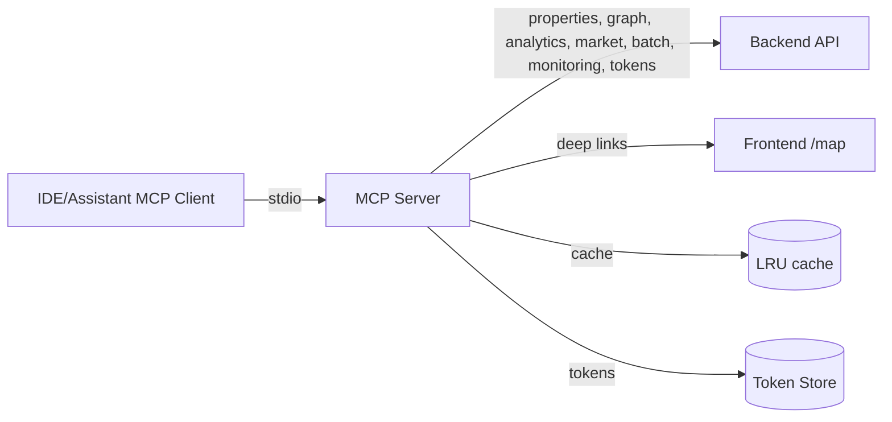

### Architecture Diagrams

The following diagrams illustrate the MCP server architecture, data flows, and key subsystems.

#### Overall System Architecture

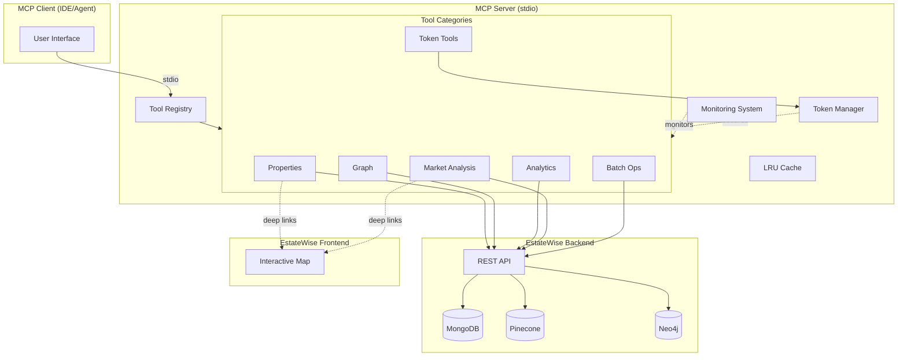

#### Token Authentication Flow

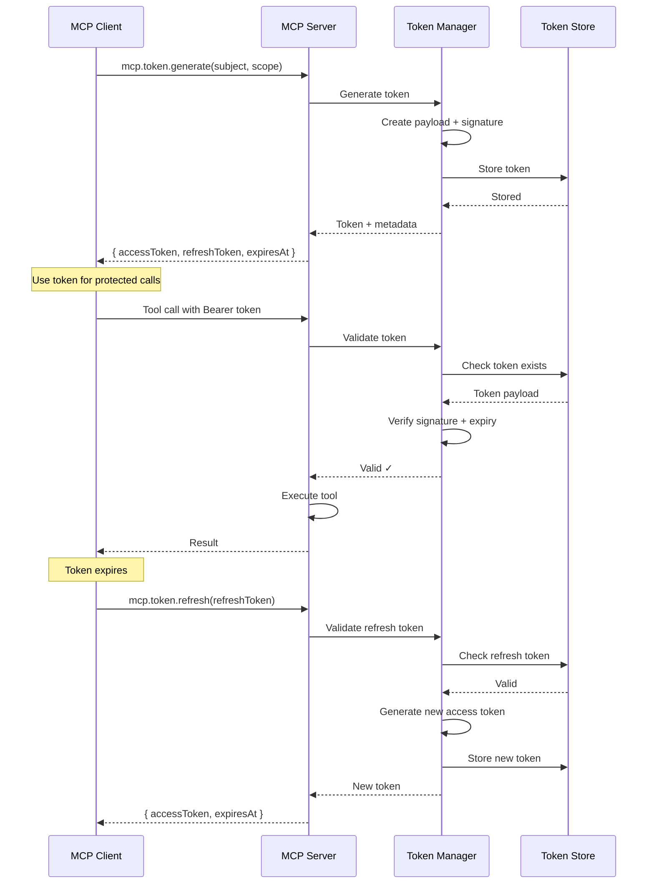

#### Batch Processing Flow

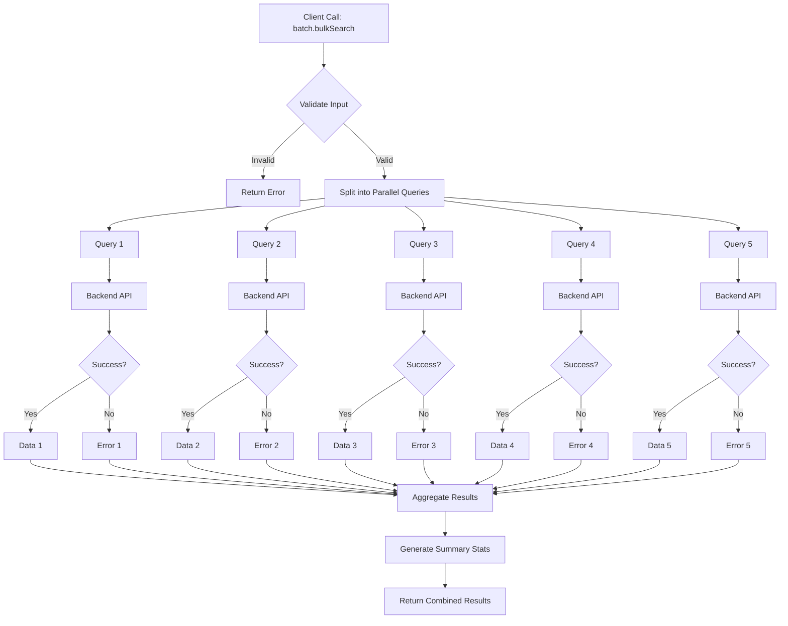

#### Monitoring System

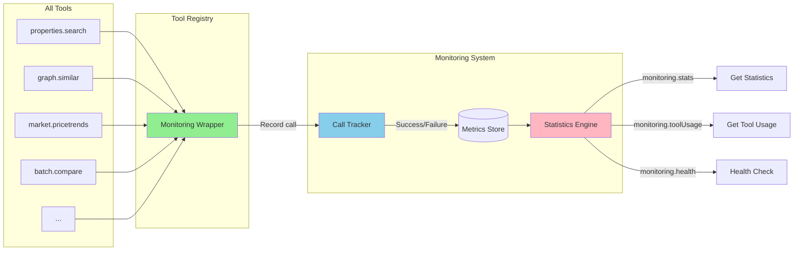

### Notes
- Graph tools depend on Neo4j being configured in the backend; otherwise the backend responds with `503`.
- Returns use `{ type: 'text', text: '...' }` content blocks; parse JSON text in the client if needed.

## Architecture

The MCP server acts as a bridge between the client (IDE or assistant) and the EstateWise backend API and frontend. It listens for tool calls over stdio, validates inputs, makes HTTP requests to the backend, and returns results as MCP content blocks.

The architecture is illustrated below.

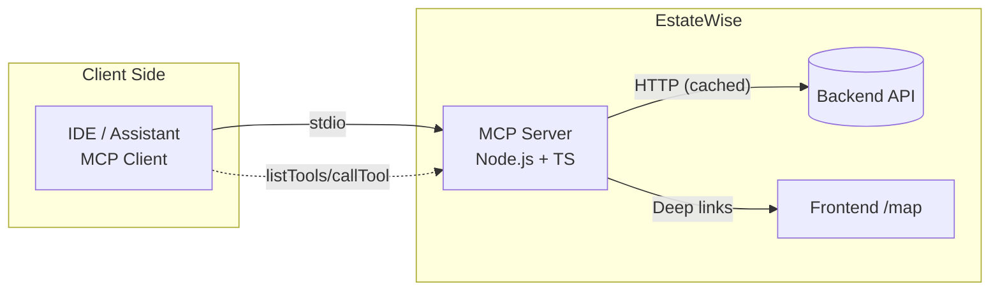

The typical flow for a client calling a tool is as follows:

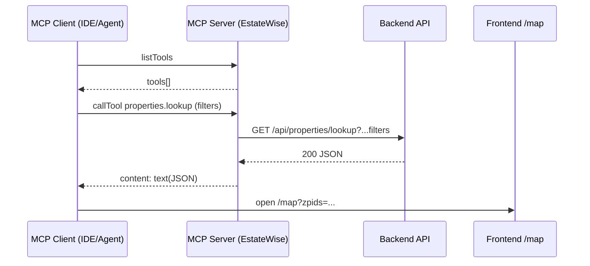

## Tool Call Lifecycle

The lifecycle of a tool call within the MCP server involves several steps, including argument validation, API request construction, fetching data, and response handling. The flow is as follows:

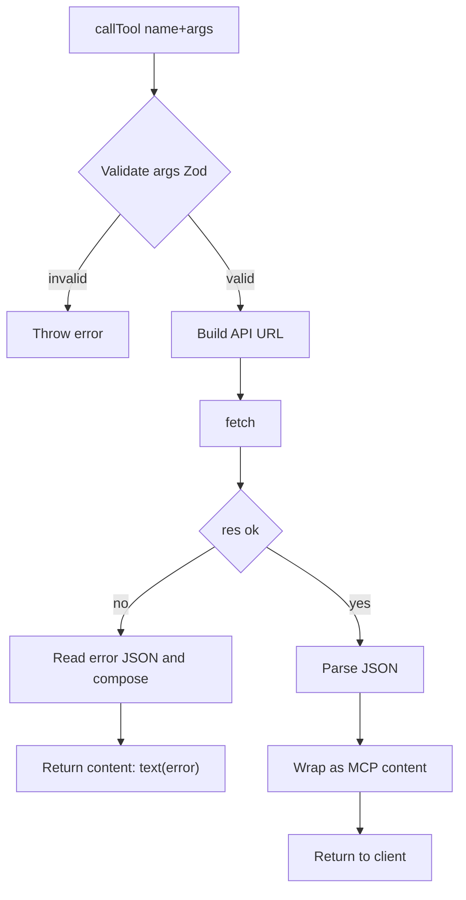

## Tool Category Map

The MCP server organizes tools into several categories: Properties, Graph, Analytics, Market, Batch, Monitoring, Tokens, Map, Utilities, Finance, Auth, Commute, and System. Each category contains related tools that clients can call.

```mermaid
classDiagram
  class MCPServer {
    +60+ tools
    +stdio transport
    +Zod validation
  }
  
  class Properties {
    +search(q, topK)
    +searchAdvanced(filters)
    +lookup(filters)
    +byIds(ids)
    +sample(topK)
  }
  
  class Graph {
    +similar(zpid, limit)
    +explain(from, to)
    +neighborhood(name, limit)
    +similarityBatch(zpids, limit)
    +comparePairs(zpids)
    +pathMatrix(zpids, limitPairs)
  }
  
  class Analytics {
    +summarizeSearch(q, topK)
    +groupByZip(q, topK)
    +distributions(q, topK, buckets)
    +pricePerSqft(q, topK, buckets)
  }
  
  class MarketAnalysis {
    +pricetrends(q, topK)
    +inventory(q, topK)
    +competitiveAnalysis(zpid)
    +affordabilityIndex(q, income)
  }
  
  class BatchOperations {
    +compareProperties(zpids)
    +bulkSearch(queries)
    +enrichProperties(zpids)
    +exportProperties(zpids, format)
  }
  
  class Monitoring {
    +stats(detailed)
    +toolUsage(toolName)
    +health()
    +reset(confirm)
  }
  
  class TokenManagement {
    +generate(subject, scope)
    +validate(token)
    +revoke(token)
    +refresh(refreshToken)
    +revokeRefresh(refreshToken)
    +cleanup()
    +stats()
    +validateRequest(header)
  }
  
  class Map {
    +linkForZpids(ids)
    +buildLinkByQuery(q)
    +decodeLink(url)
  }
  
  class Util {
    +extractZpids(text)
    +zillowLink(zpid)
    +summarize(text)
    +parseGoal(text)
    +address.parse(text)
    +geo.distance(coords)
    +geo.center(points)
  }
  
  class Finance {
    +mortgage(price, apr, years)
    +affordability(income)
    +schedule(price, months)
    +capRate(price, rent)
    +rentVsBuy(rent, price)
  }
  
  class Auth {
    +login(email, password)
    +signup(username, email, password)
    +verifyEmail(email)
    +resetPassword(email)
  }
  
  class Commute {
    +create(token, destinations)
    +list(token)
    +get(token, id)
    +update(token, id)
    +delete(token, id)
  }
  
  class System {
    +config()
    +time()
    +health()
    +tools()
    +cache.clear()
  }
  
  MCPServer --> Properties
  MCPServer --> Graph
  MCPServer --> Analytics
  MCPServer --> MarketAnalysis
  MCPServer --> BatchOperations
  MCPServer --> Monitoring
  MCPServer --> TokenManagement
  MCPServer --> Map
  MCPServer --> Util
  MCPServer --> Finance
  MCPServer --> Auth
  MCPServer --> Commute
  MCPServer --> System
```

### Tool Dependencies & Data Flow

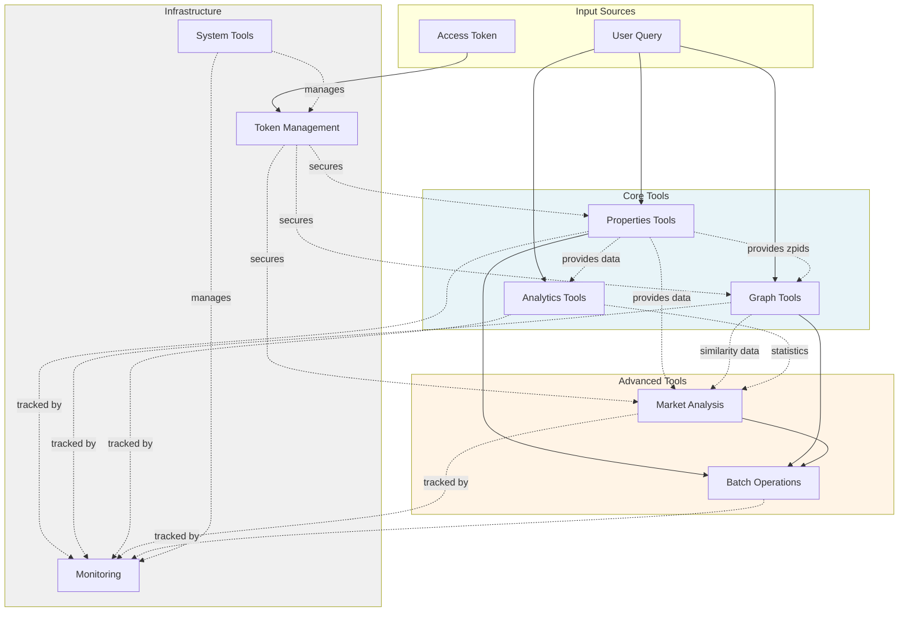

### Market Analysis Pipeline

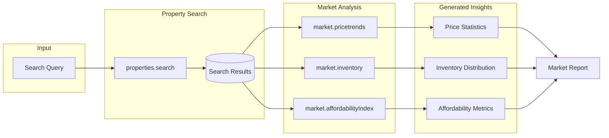

## Typical Flows

The following diagrams illustrate typical flows for calling specific tools.

### Property Lookup Flow

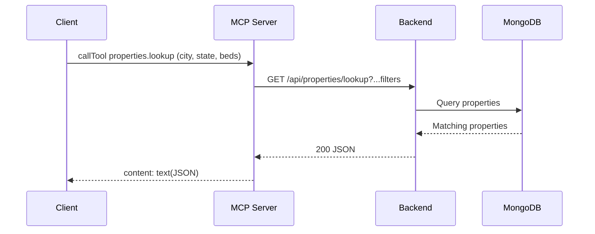

### Graph Similarity Flow

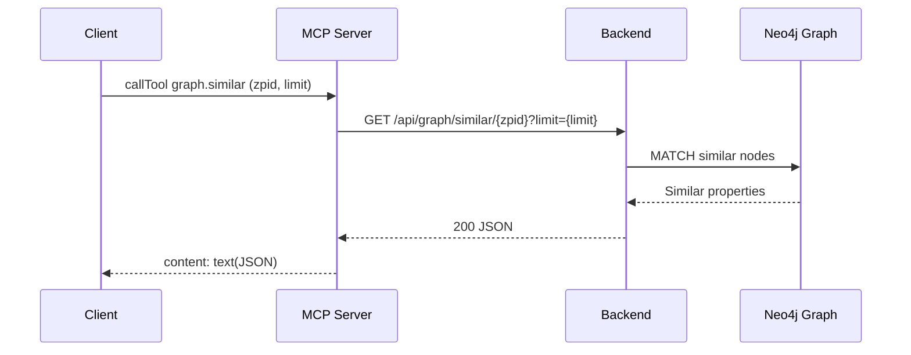

### Market Analysis Flow

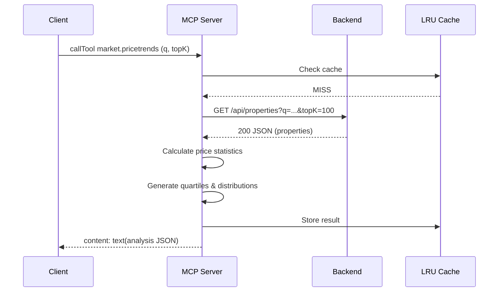

### Batch Comparison Flow

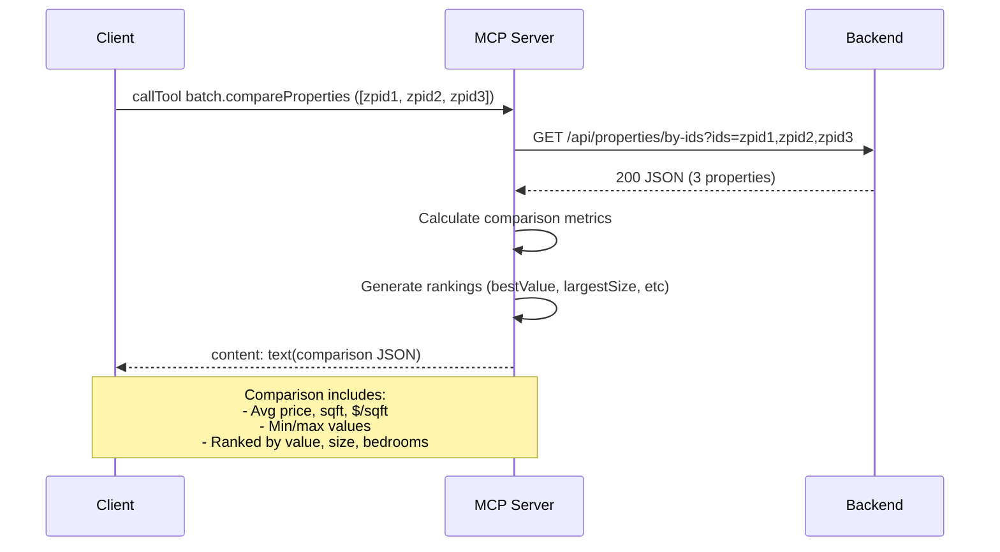

### Token-Protected Tool Call

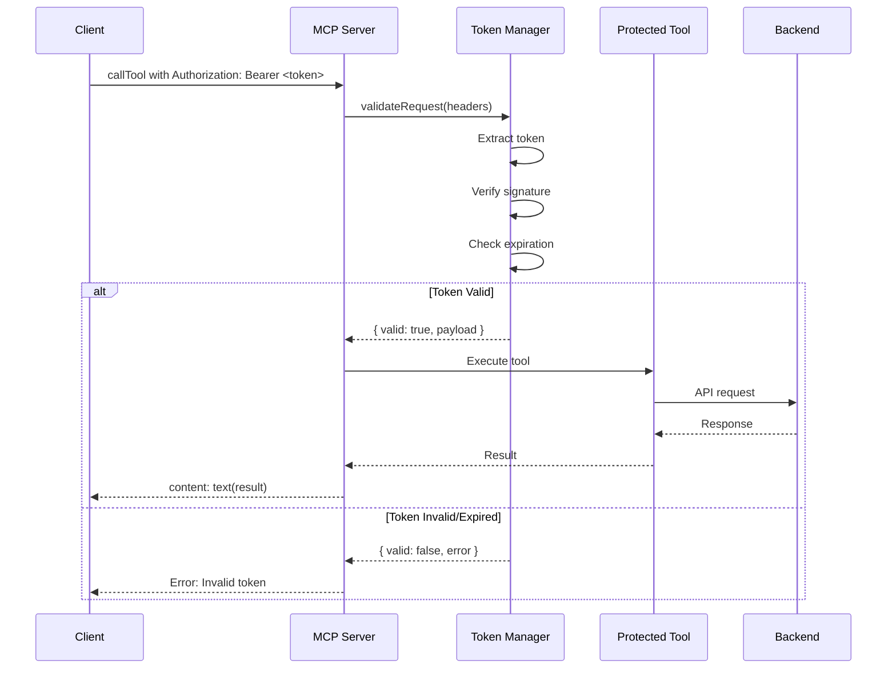

## Example Client (Node.js)

A minimal stdio client is provided to help you explore tools locally.

- Source: `src/client.ts`
- Build output: `dist/client.js`

Run (dev, auto‑spawn server)
```bash
npm run client:dev # lists tools
```

Run (built)
```bash
npm run build
npm run client        # lists tools

# Call a tool
npm run client:call -- properties.search '{"q":"3 bed in Chapel Hill","topK":3}'
npm run client:call -- graph.similar '{"zpid":1234567,"limit":5}'
npm run client:call -- charts.priceHistogram '{"q":"Chapel Hill 3 bed"}'
npm run client:call -- util.extractZpids '{"text":"... 123456_zpid ... 987654"}'
npm run client:call -- properties.lookup '{"city":"Chapel Hill","state":"NC","beds":3}'
npm run client:call -- analytics.summarizeSearch '{"q":"Chapel Hill 3 bed"}'
npm run client:call -- finance.affordability '{"annualIncome":180000,"apr":6.5,"downPct":20}'
npm run client:call -- analytics.distributions '{"q":"Chapel Hill 3 bed","buckets":12}'
npm run client:call -- finance.schedule '{"price":650000,"apr":6.25,"years":30,"months":6}'
npm run client:call -- graph.pathMatrix '{"zpids":[1234567,2345678,3456789]}'

# New tools examples
npm run client:call -- market.pricetrends '{"q":"Chapel Hill","topK":100}'
npm run client:call -- market.inventory '{"q":"Chapel Hill 3 bed","topK":150}'
npm run client:call -- market.competitiveAnalysis '{"zpid":1234567}'
npm run client:call -- market.affordabilityIndex '{"q":"Chapel Hill","medianIncome":85000}'
npm run client:call -- batch.compareProperties '{"zpids":[1234567,2345678,3456789]}'
npm run client:call -- batch.bulkSearch '{"queries":[{"q":"Chapel Hill 3 bed","topK":20},{"q":"Durham 2 bed","topK":15}]}'
npm run client:call -- batch.enrichProperties '{"zpids":[1234567,2345678],"includeFinancials":true}'
npm run client:call -- batch.exportProperties '{"zpids":[1234567,2345678,3456789],"format":"csv"}'
npm run client:call -- monitoring.stats '{"detailed":true}'
npm run client:call -- monitoring.toolUsage '{"toolName":"properties.search"}'
npm run client:call -- monitoring.health

# MCP Token examples
npm run client:call -- mcp.token.generate '{"subject":"user123","scope":["read","write"],"includeRefreshToken":true}'
npm run client:call -- mcp.token.validate '{"token":"your-token-here"}'
npm run client:call -- mcp.token.refresh '{"refreshToken":"your-refresh-token"}'
npm run client:call -- mcp.token.stats
npm run client:call -- mcp.token.validateRequest '{"authorizationHeader":"Bearer your-token-here"}'

# More examples
npm run client:call -- analytics.pricePerSqft '{"q":"Chapel Hill 3 bed","buckets":8}'
npm run client:call -- system.tools
npm run client:call -- system.cache.clear
npm run client:call -- commute.list '{"token":"<JWT>"}'
npm run client:call -- auth.login '{"email":"user@example.com","password":"secret"}'

# Parse JSON text into pretty JSON
npm run client:call:parse -- properties.search '{"q":"3 bed in Chapel Hill","topK":2}'
```

Programmatic usage (excerpt)
```ts
import { Client } from '@modelcontextprotocol/sdk/client/index.js';
import { StdioClientTransport } from '@modelcontextprotocol/sdk/client/stdio.js';

const transport = new StdioClientTransport({
  command: process.execPath,
  args: ['server.js'],
  cwd: 'dist',
});

const client = new Client({ name: 'estatewise-mcp-client', version: '0.1.0' });
await client.connect(transport);

const tools = await client.listTools();
const result = await client.callTool({
  name: 'properties.search',
  arguments: { q: '3 bed in Chapel Hill', topK: 3 },
});
```

### Launching from Popular MCP Clients

Below are example configurations for stdio‑based MCP clients. Consult your client's documentation for the correct file path and reload instructions.

**Claude Desktop (example snippet)**

  ```json
  {
    "mcpServers": {
      "estatewise": {
        "command": "node",
        "args": ["/absolute/path/to/EstateWise-Chatbot/mcp/dist/server.js"],
        "env": {
          "API_BASE_URL": "https://estatewise-backend.vercel.app",
          "FRONTEND_BASE_URL": "https://estatewise.vercel.app"
        }
      }
    }
  }
  ```

**Generic MCP launcher**

  ```json
  {
    "name": "estatewise-mcp",
    "transport": "stdio",
    "command": "node",
    "args": ["dist/server.js"],
    "cwd": "/absolute/path/to/EstateWise-Chatbot/mcp",
    "env": {
      "API_BASE_URL": "https://estatewise-backend.vercel.app",
      "FRONTEND_BASE_URL": "https://estatewise.vercel.app"
    }
  }
  ```

## Directory Layout

The project structure is as follows:

```
./mcp
├─ src/
│  ├─ core/
│  │  ├─ config.ts     # Env + base URLs
│  │  ├─ http.ts       # HTTP helpers (get/post/put/delete) with caching
│  │  ├─ cache.ts      # LRU cache implementation
│  │  ├─ logger.ts     # Debug logging utilities
│  │  └─ registry.ts   # Tool registration with automatic monitoring
│  ├─ tools/
│  │  ├─ index.ts          # registerAllTools aggregator
│  │  ├─ properties.ts     # properties.* and charts.*
│  │  ├─ analytics.ts      # analytics.*
│  │  ├─ graph.ts          # graph.*
│  │  ├─ finance.ts        # finance.*
│  │  ├─ map.ts            # map.*
│  │  ├─ util.ts           # util.*
│  │  ├─ conversations.ts  # conversations.* (token)
│  │  ├─ auth.ts           # auth.*
│  │  ├─ commute.ts        # commute.* (token)
│  │  ├─ system.ts         # system.*
│  │  ├─ monitoring.ts     # monitoring.*
│  │  ├─ batch.ts          # batch.*
│  │  └─ market.ts         # market.*
│  ├─ server.ts        # Entry: builds server and registers tools
│  └─ client.ts        # Example stdio client (spawns dist/server.js)
├─ dist/               # Build output (tsc)
├─ package.json
├─ tsconfig.json
└─ .env (local)
```

## Use Cases

### Market Research
```bash
# Analyze market trends for an area
npm run client:call -- market.pricetrends '{"q":"Chapel Hill","topK":150}'

# Check current inventory distribution
npm run client:call -- market.inventory '{"q":"Chapel Hill 3 bed","topK":200}'

# Calculate affordability for median income
npm run client:call -- market.affordabilityIndex '{"q":"Chapel Hill","medianIncome":85000}'
```

### Property Comparison
```bash
# Compare multiple properties side-by-side
npm run client:call -- batch.compareProperties '{"zpids":[12345,67890,11111]}'

# Perform competitive analysis for a listing
npm run client:call -- market.competitiveAnalysis '{"zpid":12345}'

# Enrich properties with financial estimates
npm run client:call -- batch.enrichProperties '{"zpids":[12345,67890],"includeFinancials":true}'
```

### Batch Processing
```bash
# Execute multiple searches in parallel
npm run client:call -- batch.bulkSearch '{"queries":[{"q":"Chapel Hill 3 bed"},{"q":"Durham 2 bed"}]}'

# Export properties to CSV for analysis
npm run client:call -- batch.exportProperties '{"zpids":[12345,67890,11111],"format":"csv","fields":["zpid","address","price","bedrooms","bathrooms"]}'
```

### Performance Monitoring
```bash
# Check server health and metrics
npm run client:call -- monitoring.health

# Get detailed usage statistics
npm run client:call -- monitoring.stats '{"detailed":true}'

# Track specific tool usage
npm run client:call -- monitoring.toolUsage '{"toolName":"properties.search"}'

# Reset metrics (requires confirmation)
npm run client:call -- monitoring.reset '{"confirm":true}'
```

### Token Management
```bash
# Generate a new access token
npm run client:call -- mcp.token.generate '{"subject":"user123","scope":["read","write"],"includeRefreshToken":true}'

# Validate a token
npm run client:call -- mcp.token.validate '{"token":"your-token-here.signature"}'

# Refresh an access token
npm run client:call -- mcp.token.refresh '{"refreshToken":"your-refresh-token","scope":["read","write"]}'

# Revoke a token
npm run client:call -- mcp.token.revoke '{"token":"token-to-revoke"}'

# Get token statistics
npm run client:call -- mcp.token.stats

# Validate request with Bearer token
npm run client:call -- mcp.token.validateRequest '{"authorizationHeader":"Bearer your-token.signature"}'

# Clean up expired tokens
npm run client:call -- mcp.token.cleanup
```

### Extending

- Add a new file under `src/tools/` exporting an array of tool definitions and hook it into `src/tools/index.ts`.
- Prefer small, cohesive modules; validate inputs with Zod; return content blocks as text with JSON payloads for portability.
- For cacheable GETs, use `httpGetCached()` from `core/http.ts` to leverage the in‑memory LRU.
- For uncached GETs, use `httpGet()`. For POST/PUT/DELETE, use `httpPost/httpPut/httpDelete` and attach bearer tokens via `bearer(token)` when required.

### Caching & Logging
- In‑memory LRU cache for backend GET responses is enabled by default.
- Tune via env: `MCP_CACHE_TTL_MS` (default 30s), `MCP_CACHE_MAX` (default 200).
- Clear at runtime with `system.cache.clear`.
- Enable debug logs by setting `MCP_DEBUG=true`.

## Deployment

- **Container Image** – A production-ready Dockerfile lives in this directory; see [DEPLOYMENT.md](DEPLOYMENT.md) for build instructions.
- **Docker Compose** – `docker-compose.yaml` bootstraps a managed container with stdio exposed.
- **Podman Compose** – `podman-compose.yaml` provides the same config for Podman users (Podman 4.1+).
- **Kubernetes** – Example sidecar manifest (`k8s/sidecar-example.yaml`) shows how to run MCP alongside the Agentic AI runtime in a pod.

> For a full walkthrough, refer to [DEPLOYMENT.md](DEPLOYMENT.md).

## Scripts

The following npm scripts are available:

- `npm run dev` – Start MCP server with tsx (dev)
- `npm run client:dev` – Dev client: list tools via tsx (spawns server automatically)
- `npm run build` – TypeScript build to `dist/`
- `npm start` – Run built server (`node dist/server.js`)
- `npm run client` – Built client: list tools
- `npm run client:call` – Built client: call a tool (`npm run client:call -- <tool> '<json>'`)

## Troubleshooting

Troubleshooting tips for common issues:

- Tool not listed
  - Ensure the server built successfully and you’re connecting to the built output (`dist/server.js`).
- 503 on graph tools
  - Backend Neo4j isn’t configured or ingested. See the root README for Neo4j setup and run `npm run graph:ingest` in the backend.
- Getting stale search results
  - Lower TTL (`MCP_CACHE_TTL_MS`), reduce `MCP_CACHE_MAX`, or call `system.cache.clear`.
- JSON vs text
  - Results are text blocks; parse the JSON string in your client if you need structured objects.
- Stdio issues on Windows
  - Ensure your shell quoting passes valid JSON; prefer single quotes around the JSON and escape inner quotes.

> [!IMPORTANT]
> Please make sure to have upserted properties into Pinecone in the backend by running `npm run upsert` in the `backend/` directory before using search tools and prepare necessary data. Otherwise, the server may not function as expected.

## Security

The MCP server makes outbound HTTP requests to the configured backend API. Follow these best practices:

- Do not commit secrets. Use `.env` locally; copy from `.env.example`.
- The server makes HTTP requests to the configured backend URL; validate and pin this in trusted environments.
- Run in isolated environments if exposing to untrusted clients.
- Validate and sanitize all inputs; tools use Zod for argument validation.
- Log and monitor usage for anomalies.
- Use monitoring tools to track unusual patterns or excessive requests.

## Changelog

### v0.2.0 (October 2025) - Market Intelligence & Monitoring Update

**New Tool Categories**
- ✨ **MCP Token Management** (8 tools): Generate, validate, revoke, and manage access/refresh tokens with HMAC signatures
- ✨ **Market Analysis** (4 tools): `market.pricetrends`, `market.inventory`, `market.competitiveAnalysis`, `market.affordabilityIndex`
- ✨ **Batch Operations** (4 tools): `batch.compareProperties`, `batch.bulkSearch`, `batch.enrichProperties`, `batch.exportProperties`
- ✨ **Monitoring** (4 tools): `monitoring.stats`, `monitoring.toolUsage`, `monitoring.health`, `monitoring.reset`

**Enhancements**
- 🔐 **Token-Based Authentication**: Generate and validate MCP access tokens with configurable TTL and scopes
- 🔄 **Refresh Tokens**: Long-lived refresh tokens for seamless token renewal  
- 📊 Automatic tool call tracking and metrics collection
- 💾 Enhanced caching with configurable TTL and size
- 📈 Performance monitoring with memory and uptime tracking
- 🔍 Detailed usage analytics per tool
- 📤 CSV export functionality for property data
- 🎯 Competitive analysis and market positioning
- 💰 Advanced affordability calculations
- ⚡ Parallel bulk search with error handling
- 🧹 Automatic cleanup of expired tokens

**Documentation**
- 📚 Comprehensive use case examples including token management
- 🔧 Updated directory structure with new token core module
- 📖 Enhanced troubleshooting guide
- 🎨 New architecture diagrams
- 🔐 Token security best practices

**Breaking Changes**
- ❌ None - All changes are backward compatible

### v0.1.0 (August 2025) - Initial Release

- Initial MCP server implementation
- Core property search and lookup tools
- Graph similarity and neighborhood analysis
- Analytics and charts generation
- Finance calculators and utilities
- Authentication and commute profiles
- System health and cache management

## License

This package is part of the EstateWise monorepo and inherits the repository license.
