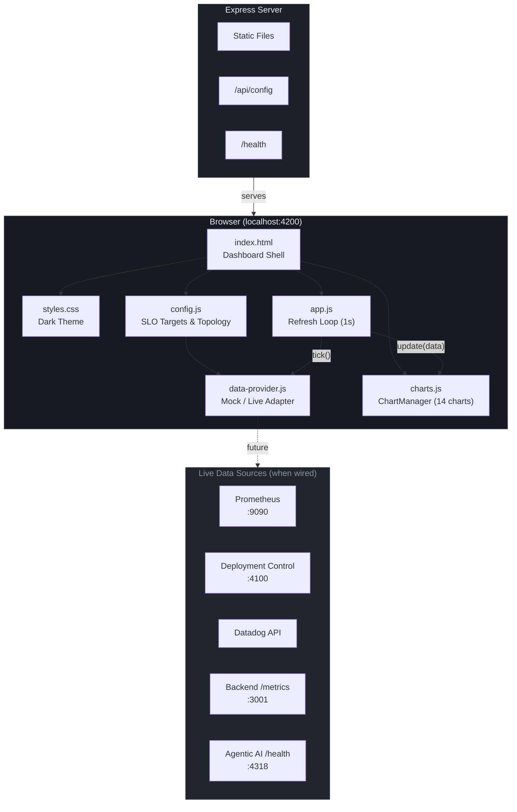
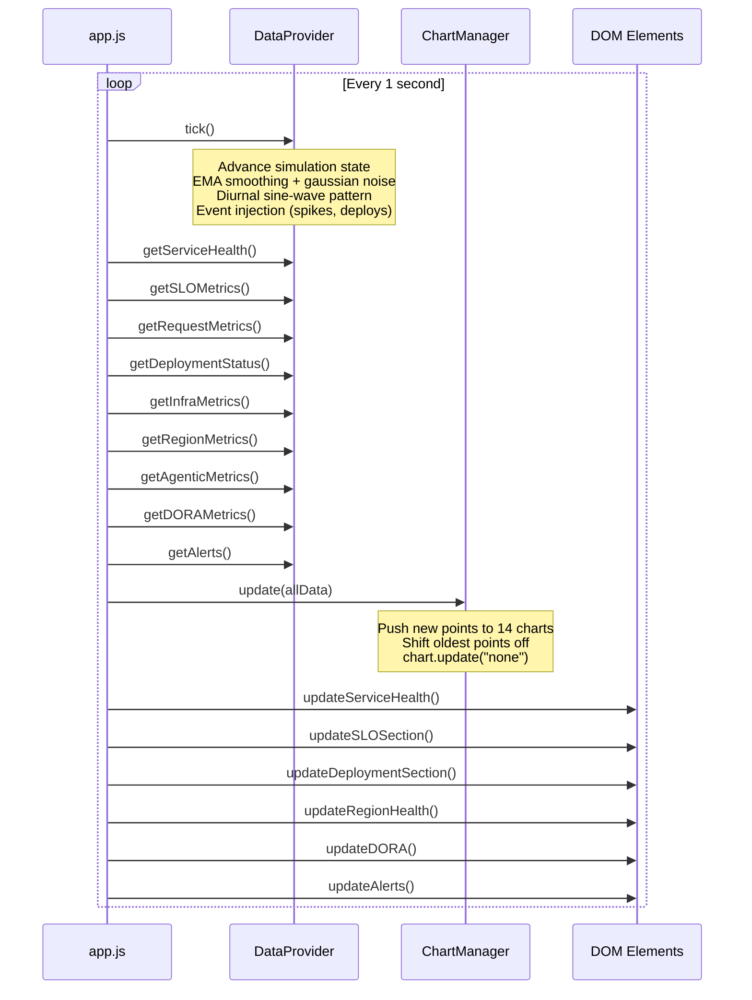
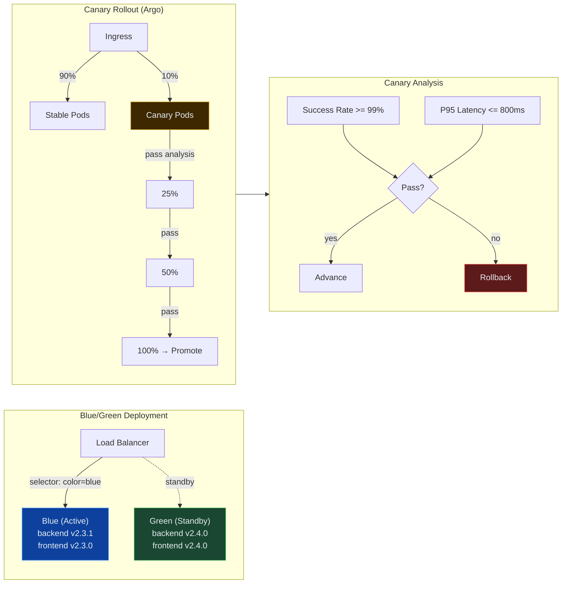
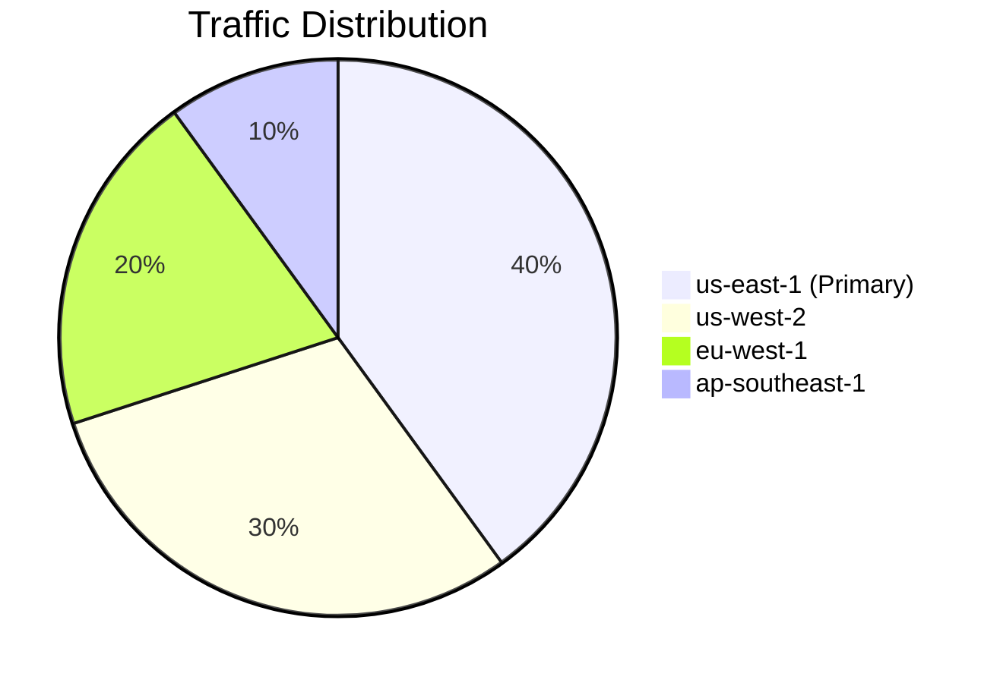
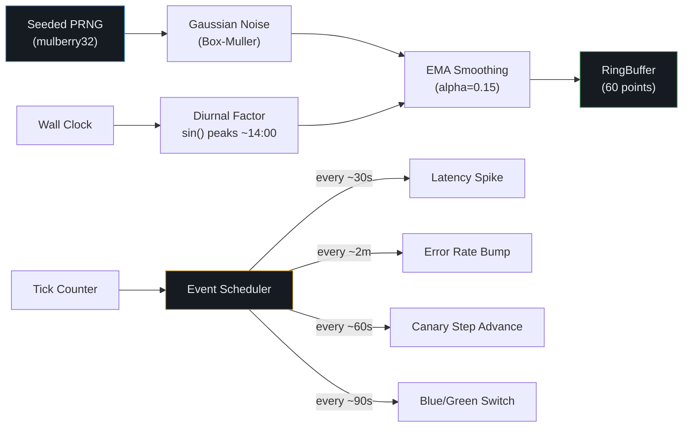

# EstateWise SRE Dashboard

Real-time Site Reliability Engineering dashboard for the EstateWise platform. Displays service health, SLO compliance, deployment status, infrastructure metrics, and DORA performance across all services and regions.

<p align="center">
  
</p>

## Quick Start

```bash
cd sre-dashboard
npm install
npm run dev
```

Open [http://localhost:4200](http://localhost:4200) in your browser. The dashboard renders simulated production data out of the box — no backend services required.

## Architecture



## Dashboard Sections

```mermaid
graph LR
    subgraph Row0["Service Health"]
        S1[backend]
        S2[frontend]
        S3[mcp]
        S4[agentic-ai]
        S5[grpc]
        S6[deploy-ctrl]
    end

    subgraph Row1["SLO Compliance"]
        G1["API Availability<br/>Gauge (99.9%)"]
        G2["P95 Latency<br/>Gauge (<500ms)"]
        G3["Error Budget<br/>Remaining %"]
        G4["Burn Rate<br/>Sparkline"]
    end

    subgraph Row2["Request Metrics"]
        C1["RPS<br/>Stacked Area"]
        C2["Error Rate<br/>Line + Threshold"]
        C3["Latency P50/P95/P99<br/>Multi-line"]
    end

    subgraph Row3["Deployment Status"]
        D1["Blue/Green<br/>Active Color"]
        D2["Canary Rollout<br/>Step Progress"]
        D3["Recent Deploys<br/>Feed"]
    end

    subgraph Row4["Infrastructure"]
        I1["CPU Usage<br/>Stacked Area"]
        I2["Memory Usage<br/>Stacked Area"]
        I3["Pod Status<br/>Grouped Bar"]
        I4["HPA Scaling<br/>Replica Lines"]
    end

    subgraph Row5["Multi-Region"]
        R1["Traffic Split<br/>Donut"]
        R2["Regional Latency<br/>Bar"]
        R3["Region Health<br/>Status Cards"]
    end

    subgraph Row6["Agentic AI"]
        A1["Token Usage<br/>Stacked Area"]
        A2["Agent Tasks<br/>Success/Fail Bar"]
        A3["Tool Latency<br/>Horizontal Bar"]
    end

    subgraph Row7["DORA & Alerts"]
        DO["DORA Metrics<br/>4 Stat Cards"]
        AL["Active Alerts<br/>Severity Feed"]
    end

    Row0 --> Row1 --> Row2 --> Row3 --> Row4 --> Row5 --> Row6 --> Row7

    style Row0 fill:#161b22,stroke:#58a6ff,color:#e6edf3
    style Row1 fill:#161b22,stroke:#3fb950,color:#e6edf3
    style Row2 fill:#161b22,stroke:#d29922,color:#e6edf3
    style Row3 fill:#161b22,stroke:#bc8cff,color:#e6edf3
    style Row4 fill:#161b22,stroke:#f0883e,color:#e6edf3
    style Row5 fill:#161b22,stroke:#79c0ff,color:#e6edf3
    style Row6 fill:#161b22,stroke:#f0883e,color:#e6edf3
    style Row7 fill:#161b22,stroke:#f85149,color:#e6edf3
```



## Data Flow



## SLO Targets

These match the canonical definitions in [`docs/SLO.md`](../docs/SLO.md):

| SLO | Target | Window | SLI |
|-----|--------|--------|-----|
| API Availability | 99.9% | 30 days | `success_requests / total_requests` |
| API Latency (P95) | < 500ms | 30 days | `histogram_quantile(0.95, ...)` |
| Error Rate | < 0.1% | 30 days | `5xx_requests / total_requests` |
| Error Budget | 43.2 min downtime | 30 days | Derived from availability SLO |

Burn rate alerts fire at:
- **Critical (page):** 1h burn > 14.4x AND 6h burn > 6x
- **Warning (ticket):** 6h burn > 6x AND 3d burn > 3x
- **Info (trend):** 3d burn > 1x sustained 30m

## Deployment Visualization



## Multi-Region Traffic



Failover config: health check every 30s, unhealthy after 3 failures, recovery after 2 successes. MongoDB replication lag target: < 5s.

## File Structure

```
sre-dashboard/
├── package.json            # Express dependency, dev/start scripts
├── server.js               # Static server + /api/config + /health
└── public/
    ├── index.html           # Dashboard shell (8 section rows)
    ├── css/
    │   └── styles.css       # Dark theme design system (CSS custom properties)
    └── js/
        ├── config.js        # Service topology, SLO targets, thresholds, HPA limits
        ├── data-provider.js 
        ├── charts.js        # ChartManager — 14 Chart.js instances
        └── app.js           # App controller — 1s refresh loop, DOM updates
```

## Tech Stack

| Layer | Choice | Why |
|-------|--------|-----|
| Charts | Chart.js 4 (CDN) | Already used in `deployment-control/ui` |
| Annotations | chartjs-plugin-annotation (CDN) | Threshold lines on charts |
| Fonts | Inter + JetBrains Mono | Matches project design language |
| Server | Express | Static serving + config API endpoint |
| Build | None | Zero build step — plain HTML/CSS/JS |

## Mock Data Engine

Since this is open-source and may be used by anyone, the dashboard generates realistic mock data by default. The `data-provider.js` simulates metrics with:



Values drift smoothly rather than jumping — EMA prevents noisy charts while gaussian noise adds realistic variance.

> [!NOTE]
> In our real production dashboard, the `DataProvider` methods will implement actual API calls to Prometheus, deployment control, Datadog, and backend metrics instead of generating mock data. The current simulation logic is designed to mirror real-world patterns and variability as closely as possible for development and testing purposes. For security reasons, we do not expose real API endpoints or credentials in this open-source repo, but the architecture allows seamless integration with live data sources when configured.

## Wiring Live Data

Every mock data path in `data-provider.js` has a comment showing the real API call:

```javascript
// LIVE MODE: fetch('http://localhost:9090/api/v1/query?query=sli:availability:ratio')
// LIVE MODE: fetch('http://localhost:4100/api/cluster/summary')
// LIVE MODE: fetch('http://localhost:3001/metrics')
```

To connect real sources, set environment variables:

```bash
PROMETHEUS_URL=http://prometheus:9090 \
DEPLOYMENT_CONTROL_URL=http://deployment-control:4100 \
DATADOG_API_URL=https://api.datadoghq.com \
BACKEND_URL=http://backend:3001 \
npm run dev
```

The `/api/config` endpoint passes these to the browser. Implement the `// LIVE MODE` fetch calls in each `DataProvider` method to replace mock values with real Prometheus queries or REST calls.

## Environment Variables

| Variable | Default | Description |
|----------|---------|-------------|
| `PORT` | `4200` | Dashboard server port |
| `PROMETHEUS_URL` | `null` | Prometheus query API base URL |
| `DEPLOYMENT_CONTROL_URL` | `http://localhost:4100` | Deployment control API |
| `DATADOG_API_URL` | `null` | Datadog API base URL |
| `BACKEND_URL` | `http://localhost:3001` | Backend service URL |
| `FRONTEND_URL` | `http://localhost:3000` | Frontend service URL |
| `MCP_URL` | `http://localhost:8787` | MCP server URL |
| `AGENTIC_AI_URL` | `http://localhost:4318` | Agentic AI runtime URL |
| `GRPC_URL` | `http://localhost:50051` | gRPC service URL |
| `REFRESH_INTERVAL` | `1000` | Dashboard refresh interval (ms) |

## DORA Metrics

The dashboard tracks the four DORA metrics with elite-tier thresholds:

| Metric | Elite Target | Measurement |
|--------|-------------|-------------|
| Deployment Frequency | >= 1/day | Deploys per day from deployment-control job history |
| Lead Time for Changes | <= 24 hours | Commit to production deploy duration |
| Mean Time to Recover | <= 60 minutes | Incident open to resolution |
| Change Failure Rate | <= 5% | Failed deploys / total deploys |

## Related Docs

- [SLO Definitions](../docs/SLO.md) — canonical SLO/SLI/error budget reference
- [Architecture](../ARCHITECTURE.md) — system-wide architecture and performance targets
- [Deployment Control](../deployment-control/README.md) — blue/green and canary API
- [Datadog Integration](../docs/datadog-integration.md) — monitoring setup
- [Prometheus Rules](../kubernetes/monitoring/prometheus-config.yaml) — recording rules and alerts
- [Helm Values](../helm/estatewise/values.yaml) — Kubernetes deployment config
